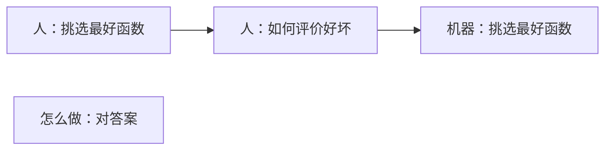
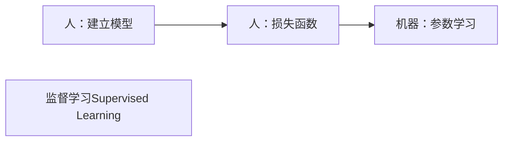

# 课前须知

## 考核方式

- [x] 一次作业(单独完成)，看情况布置， ~~可能不布置~~ ，提交代码和书面报告

- [x] 一次课程项目(组队完成)，提交代码和书面报告，并进行课堂汇报

  <table>
  <tr>
    <th>考勤</th>
    <th>作业</th>
    <th>课程项目</th>
    <th>课程汇报</th>
    <th>总分</th>
  </tr>
  <tr>
    <td>10</td>
    <td>20</td>
    <td>50</td>
    <td>20</td>
    <td>100</td>
  </tr>
</table>

 

## 课程资源

- [x] 提供高性能服务器：30W服务器两台，100W服务器一台

- [x] 提供实验室一间

- [x] 每类课程项目分配助教一对一指导

## 课程目标

- [x] 掌握机器学习的基础理论

- [x] 掌握机器学习的应用技能

- [x] 鼓励面向前沿的深入探索

## 助教联系方式和指导方向

- [ ] 徐本峰，benfeng@mail.ustc.edu.cn &nbsp; 大语言模型，ACL2023、ICLR2023、EMNLP2022、AAAD021、ACL2020
- [ ] 陈卓为，chenzw01@mail.ustc.edu.cn &nbsp; 图像生成，AAAI2024、CVPR2023、ACM &nbsp; MM2022
- [ ] 张坤，kkzhang@mail.ustc.edu.cn &nbsp; 图文对齐，CVPR2022、T-MM2022、AAAI2022
- [ ] 黄梦琪，huangmq@mail.ustc.edu.cn &nbsp; 图像生成，CVPR2024、CVPR2023(2篇)、ACM &nbsp; MM2022(最佳学生论文)
- [ ] 付哲仁，fzr@mail.ustc.edu.cn &nbsp; 图文对齐，CVLR2024、CVPR2023、T-MM2022、T-CSVT2022、AAAI2021
- [ ] 李家昂，jail@mail.ustc.edu.cn &nbsp; 知识推理，EMNLP2023、ICASSP2023
- [ ] 李佳豪，jiahao66@mail.ustc.edu.cn &nbsp; 大语言模型，EMNLP2023、EMNLP2022
- [ ] 涂科宇，tky2017ustc_dx@mail.ustc.edu.cn &nbsp; 图像生成，ACM &nbsp; MM2023
- [ ] 郭文歆，noc1064@mail.ustc.edu.cn &nbsp; 图文对齐，COLING2024
- [ ] 夏厚，overwhelmed@mail.ustc.edu.cn &nbsp; 图文对齐

# 第一章 绪论

## 基础知识

- [x] 机器学习：寻找一个合适的函数，使得输入(要求、问题、描述等)转化为想要的输出(回答、解释、答案)
  > - 图像分类
  > - 文本生成

- [x] 学习过程

> 通俗说法：

  
> 专业术语

# 第二章 回归分析

## 概述

### 回归
- [x] 对于给定的数据集： $D=\lbrace (x_1,y_1),(x_2,y_2),\dots ,(x_n,y_n)\rbrace$ ，其中 $x_i \in C=R^d,y_i \in Y=R$ ，是连续值(如果为分散值，则为分类而不是回归)
  > - 寻找 $C$ 上的映射函数： $f(x):C \rightarrow Y$
  > - 使得： $f(x_i) \approx y_i$

### 线性回归
- [x] 
## 线性回归
