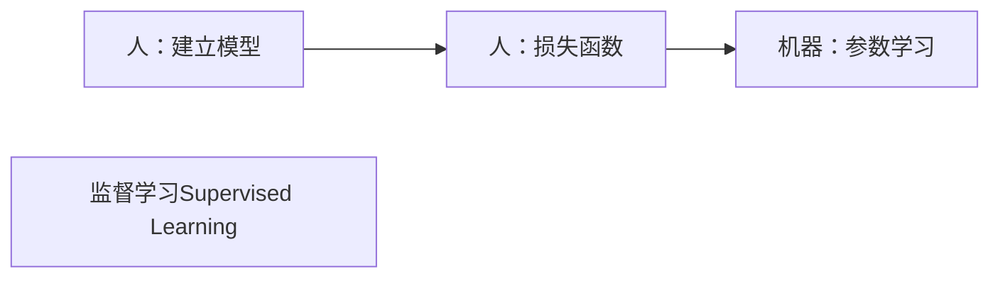

# 课前须知

## 考核方式

- [x] 一次作业(单独完成)，看情况布置， ~~可能不布置~~ ，提交代码和书面报告

- [x] 一次课程项目(组队完成)，提交代码和书面报告，并进行课堂汇报

  <table>
  <tr>
    <th>考勤</th>
    <th>作业</th>
    <th>课程项目</th>
    <th>课程汇报</th>
    <th>总分</th>
  </tr>
  <tr>
    <td>10</td>
    <td>20</td>
    <td>50</td>
    <td>20</td>
    <td>100</td>
  </tr>
</table>

 

## 课程资源

- [x] 提供高性能服务器：30W服务器两台，100W服务器一台

- [x] 提供实验室一间

- [x] 每类课程项目分配助教一对一指导

## 课程目标

- [x] 掌握机器学习的基础理论

- [x] 掌握机器学习的应用技能

- [x] 鼓励面向前沿的深入探索

## 助教联系方式和指导方向

- [ ] 徐本峰，benfeng@mail.ustc.edu.cn &nbsp; 大语言模型，ACL2023、ICLR2023、EMNLP2022、AAAD021、ACL2020
- [ ] 陈卓为，chenzw01@mail.ustc.edu.cn &nbsp; 图像生成，AAAI2024、CVPR2023、ACM &nbsp; MM2022
- [ ] 张坤，kkzhang@mail.ustc.edu.cn &nbsp; 图文对齐，CVPR2022、T-MM2022、AAAI2022
- [ ] 黄梦琪，huangmq@mail.ustc.edu.cn &nbsp; 图像生成，CVPR2024、CVPR2023(2篇)、ACM &nbsp; MM2022(最佳学生论文)
- [ ] 付哲仁，fzr@mail.ustc.edu.cn &nbsp; 图文对齐，CVLR2024、CVPR2023、T-MM2022、T-CSVT2022、AAAI2021
- [ ] 李家昂，jail@mail.ustc.edu.cn &nbsp; 知识推理，EMNLP2023、ICASSP2023
- [ ] 李佳豪，jiahao66@mail.ustc.edu.cn &nbsp; 大语言模型，EMNLP2023、EMNLP2022
- [ ] 涂科宇，tky2017ustc_dx@mail.ustc.edu.cn &nbsp; 图像生成，ACM &nbsp; MM2023
- [ ] 郭文歆，noc1064@mail.ustc.edu.cn &nbsp; 图文对齐，COLING2024
- [ ] 夏厚，overwhelmed@mail.ustc.edu.cn &nbsp; 图文对齐

# 第一章 绪论

## 基础知识

- [x] 机器学习：寻找一个合适的函数，使得输入(要求、问题、描述等)转化为想要的输出(回答、解释、答案)
  > - 图像分类
  > - 文本生成

- [x] 学习过程

> 通俗说法：

  
> 专业术语

# 第二章 回归分析

## 概述

### 回归

- [x] 对于给定的数据集： $D=\lbrace (x_1,y_1),(x_2,y_2),\dots ,(x_n,y_n)\rbrace$ ，其中 $x_i \in C=R^d,y_i \in Y=R$ ，是连续值(如果为分散值，则为分类而不是回归)
  > - 寻找 $C$ 上的映射函数： $f(x):C \rightarrow Y$
  > - 使得： $f(x_i) \approx y_i$

### 线性回归

- [x] 映射函数：线性函数 $f(x_i)=w·x_i+b$

- [x] 对样本 $x_i$ 进行线性变换

### 一元线性回归

- [x] 映射函数：线性函数 $f(x_i)=w·x_i+b$

- [x] 每个样本 $x_i$ 是一维的

### 多元线性回归

- [x] 实际应用场景中的变量大多具有多个属性
  > - 例如，想对房价进行预测，房价的影响因素有多个属性：面积，房龄，楼层等
  > - 假设房价与上述因素满足 `多元线性关系` ，需要寻找 `多元线性函数` 来预测房价： $房价=面积×w_1+房龄×w_2+楼层×w_3+b$

### 非线性回归

- [x] 线性函数无法准确拟合变量之间的关系时，使用更复杂的非线性回归方法，也就是将数据拟合为非一次方程的模式

### 性能评价

- [x] 为了使得回归模型的预测值和回归目标尽可能接近。常使用 `均方误差` 衡量性能

$$E(F;D)=\frac{1}{n} \sum\limits_{i=1}^n (f(x_i)-y_i)^2$$

## 线性回归

### 问题定义
- [x] 目标：寻找最优线性回归函数

$$f(x_i)=w_1x_{i1}+w_2x_{i2}+ \dots +w_dx_{id}+b=\omega ^Tx_i+b$$

> **注： $x_i$ 和 $\omega$ 在此处均为d维向量，即 $x_i ,\omega \in R^d$**

- [x] 如何获得最优解参数 $\omega ^{\*}$ 和 $b^{\*}$ ?
  > - 方法一：最小二乘法————将误差最小化
  > - 方法二：极大似然法————将概率最大化

### 最小二乘法

#### 一元线性回归

- [x] 一元情况，即 `样本属性是一维的` ，向量 $x_i$ 在此处为一个值，线性回归模型试图学得： $f(x)=\omega x+b$ ，使得 $f(x_i) \approx y_i$

- [x] 使用 `均方误差` 来衡量预测结果与回归目标之间的误差：

$$E(F;D)=\frac{1}{n} \sum\limits_{i=1}^n (f(x_i)-y_i)^2 = \frac{1}{n} \sum\limits_{i=1}^n (\omega x_i +b-y_i)^2$$

- [x] 最小二乘法的目标是使得 `均方误差最小化` :

$$(\omega ^{\*},b^{\*})=\underset{\substack{(\omega, b)}}{\arg\min} E(F;D)=\underset{\substack{(\omega, b)}}{\arg\min} \sum\limits _{i=1}^n (\omega x_i +b-y_i)^2$$

> **注：此处的 `arg` 就是对 $\frac{1}{n}$ 的一种简写，也就是求平均**

##### 一元线性回归如何求解最优参数
- [x] $(\omega ^{\*},b^{\*})=\underset{\substack{(\omega, b)}}{\arg\min} \sum\limits _{i=1}^n (\omega x_i +b-y_i)^2$ 怎么求解最优的 $(\omega ^{\*},b^{\*})$

> 由于 $\sum\limits _{i=1}^n (\omega x_i +b-y_i)^2$ 是关于 $\omega ,b$ 的二次函数，，所以二次极值点只有一个，所以存在唯一的全局最优解。
> > 证明：对于二元二次函数而言不难有假设 $g(x,y)=ax^2+by^2+cxy+dx+ey+f$ ，那么对于极值点 $(x_0,y_0)$ 而言有

$$\begin{cases}
g _x(x_0,y_0) = \frac{\partial g}{\partial x}| _{x=x_0,y=y_0} =0\newline
g _y(x_0,y_0) = \frac{\partial g}{\partial y}| _{x=x_0,y=y_0} =0\newline
\end{cases}$$

> > 带入 $g(x,y)=ax^2+by^2+cxy+dx+ey+f$ 到上述方程组则有方程组

$$\begin{cases}
g _x(x_0,y_0) =2ax_0 +cy_0 +d=0\newline
g _y(x_0,y_0) =2by_0 +cx_0 +e=0\newline
\end{cases}$$

> > 解得

$$\begin{cases}
x_0=\frac{ec-2bd}{4ab-c^2} \newline
y_0=\frac{2ae-cd}{4ab-c^2} \newline
\end{cases}
$$

> > 上述可以看出来只有唯一一个极值点，故存在唯一的全局最优解，因为很明显，对于回归问题中的 $a,b$ 都是非负值，一定存在唯一极小值点，故存在全局最优解

> 所以回到回归问题中，求最优的 $(\omega ^{\*},b^{\*})$ 即对 $\sum\limits _{i=1}^n (\omega x_i +b-y_i)^2$ 求偏导即可，即有

$$\begin{cases}
\frac{\partial E(\omega ,b)}{\partial \omega}=0 \newline
\frac{\partial E(\omega ,b)}{\partial b}=0 \newline
\end{cases} \rightarrow 
\begin{cases}
\sum\limits_{i=1}^n 2(\omega x_i +b-y_i)x_i = 2\left(w\sum\limits_{i=1}^n x_i^2-\sum\limits_{i=1}^n (y_i-b)x_i\right)=0 \newline
\sum\limits_{i=1}^n 2(\omega x_i +b-y_i)=2nb+2\sum\limits_{i=1}^n (\omega x_i-y_i)=2\left(nb-\sum\limits_{i=1}^n (y_i-\omega x_i)\right)=0 \newline
\end{cases} \rightarrow
\begin{cases}
\omega^{\*}=\frac{\sum\limits _{i=1}^n y _i(x _i- \overline{x})}{\sum\limits _{i=1}^n x_i^2- \frac{1}{n}\left(\sum\limits _{i=1}^n x_i \right)^2} , & \text{其中} \overline{x}=\frac{1}{n} \sum\limits _{i=1}^n x_i\newline
b^{\*}=\frac{1}{n} \sum\limits _{i=1}^n (y_i- \omega x_i)\newline
\end{cases}$$

#### 多元线性回归

- [x] 多元线性回归同样通过最小化均方误差来对 $\omega,b$ 进行估计
  > - 回归函数 $f(x_i)=w_1x_{i1}+w_2x_{i2}+ \dots +w_dx_{id}+b=\omega ^Tx_i+b$
  > - 均方误差 $E(F;D)=\frac{1}{n} \sum\limits _{i=1}^n (f(x_i)-y_i)^2=\frac{1}{n} \sum\limits _{i=1}^n (\omega ^T x_i+b-y_i)^2$
  > - 最优参数 $(\omega ^{\*},b^{\*})=\underset{\substack{(\omega, b)}}{\arg\min} E(F;D)=\underset{\substack{(\omega, b)}}{\arg\min} \sum\limits _{i=1}^n (\omega ^T x_i +b-y_i)^2$

> 与一元不同的是上述表达式中的 $x_i,\omega$ 是多维向量，而不是一个单独值

#### 多元线性回归何求解最优参数

- [x] 由于 $E(F;D)=\frac{1}{n} \sum\limits _{i=1}^n (f(x_i)-y_i)^2=\frac{1}{n} \sum\limits _{i=1}^n (\omega ^T x_i+b-y_i)^2$
> - 令： $\hat{\omega}=(\omega ^T,b)^T=(w_1,\dots , w_d,b)^T \ \ \ \ \hat{x_i}=(x_i^T,1)^T=(x_{i1},\dots ,x_{id},1)^T$ ，此处也说明 $\omega ,x_i \in R^d$
> - 有 $E(F;D)=\frac{1}{n} \sum\limits _{i=1}^n (\omega ^T x_i+b-y_i)^2=\frac{1}{n} \sum\limits _{i=1}^n (\hat{\omega} ^T \hat{x_i}-y_i)^2=\frac{1}{n} \sum\limits _{i=1}^n (y_i- \hat{\omega} ^T \hat{x_i})^2$
> - 令： $E_i=y_i- \hat{\omega} ^T \hat{x_i}$
> - 有 $E(F;D)=\frac{1}{n} \sum\limits _{i=1}^n (y_i- \hat{\omega} ^T \hat{x_i})^2=\frac{1}{n} \sum\limits _{i=1}^n E_i^2$
> - 则有

$$E(F;D)=\frac{1}{n} \sum\limits _{i=1}^n E_i^2=\frac{1}{n}(E _1,\dots ,E _n)\left(\begin{matrix}
E _1 \newline
\vdots \newline
E _n\end{matrix}\right)=\frac{1}{n}\left(\begin{matrix}
E _1 \newline
\vdots \newline
E _n\end{matrix}\right)^T\left(\begin{matrix}
E _1 \newline
\vdots \newline
E _n\end{matrix}\right)$$

> - 令 $E_i=y_i- \hat{\omega} ^T \hat{x_i}$
> - 则有

$$E(F;D)=\frac{1}{n}\left(\begin{matrix}
y_1- \hat{\omega} ^T \hat{x_1} \newline
\vdots \newline
y_n- \hat{\omega} ^T \hat{x_n}\end{matrix}\right)^T\left(\begin{matrix}
y_1- \hat{\omega} ^T \hat{x_1} \newline
\vdots \newline
y_n- \hat{\omega} ^T \hat{x_n}\end{matrix}\right)=\frac{1}{n}\left[\left(\begin{matrix}
y_1 \newline
\vdots \newline
y_n \end{matrix}\right)-\left(\begin{matrix}
\hat{\omega} ^T \hat{x_1} \newline
\vdots \newline
\hat{\omega} ^T \hat{x_n}\end{matrix}\right)\right]^T\left[\left(\begin{matrix}
y_1 \newline
\vdots \newline
y_n \end{matrix}\right)-\left(\begin{matrix}
\hat{\omega} ^T \hat{x_1} \newline
\vdots \newline
\hat{\omega} ^T \hat{x_n}\end{matrix}\right)\right]$$

> **注：此处最后一步是根据行列式性质得到的，这是因为 $\hat{\omega}^T\hat{x_i}$ 和 $y_i$ 无关可以直接拆分**

> - 由于有

$$\left(\begin{matrix}
\hat{\omega} ^T \hat{x_1} \newline
\vdots \newline
\hat{\omega} ^T \hat{x_n}\end{matrix}\right)=(\hat{\omega} ^T\hat{x_1},\dots ,\hat{\omega} ^T\hat{x_n})^T=[\hat{\omega} ^T(\hat{x_1},\dots ,\hat{x_n})]^T=(\hat{x_1},\dots ,\hat{x_n})^T \hat{\omega}=\left(\begin{matrix}
\hat{x_1}^T \newline
\vdots \newline
\hat{x_n}^T\end{matrix}\right)\hat{\omega}$$

> - 则

$$E(F;D)=\frac{1}{n}\left[\left(\begin{matrix}
y_1 \newline
\vdots \newline
y_n \end{matrix}\right)-\left(\begin{matrix}
\hat{x_1}^T \newline
\vdots \newline
\hat{x_n}^T\end{matrix}\right)\hat{\omega}\right]^T\left[\left(\begin{matrix}
y_1 \newline
\vdots \newline
y_n \end{matrix}\right)-\left(\begin{matrix}
\hat{x_1}^T \newline
\vdots \newline
\hat{x_n}^T\end{matrix}\right)\hat{\omega}\right]$$

> - 不妨令

$$X=\left(\begin{matrix}
\hat{x_1}^T \newline
\vdots \newline
\hat{x_n}^T\end{matrix}\right)=\left(\begin{matrix}
x_{11} & \cdots & x_{1d} & 1\newline
\vdots $ \ddots & \vdots $ \vdots\newline
x_{n1} & \cdots & x_{nd} & 1\end{matrix}\right),y=\left(\begin{matrix}
y_1 \newline
\vdots \newline
y_n \end{matrix}\right)=(y_1,\dots ,y_n)^T$$

> - 则有

$$E(F;D)=\frac{1}{n}(y-X\hat{\omega})^T(y-X\hat{\omega})$$

- [x] 优化目标表示为 $\hat{\omega}^{\*}=\underset{\substack{\hat{\omega}}}{\arg\min} (y-X\hat{\omega})^T(y-X\hat{\omega})$

- [x] 求解 $\hat{\omega}^{\*}$ ，需要通过矩阵求导：

$$\frac{\partial E(F;D)}{\partial \hat{\omega}}=2X^T(X\hat{\omega}-y)$$

- [x] 令上式为0可得到 $\hat{\omega}$ 最优解的闭式解，但涉及矩阵求逆，需分情况讨论

###### 求解情形一

- [x] 当 $X^TX$ 为 [满秩矩阵](https://baike.baidu.com/item/%E6%BB%A1%E7%A7%A9%E7%9F%A9%E9%98%B5) 或 [正定矩阵](https://baike.baidu.com/item/%E6%AD%A3%E5%AE%9A%E7%9F%A9%E9%98%B5)，(此处就是为了保证 $X^TX$ 存在逆矩阵)令上式为0可得
  > - **方阵的满秩，和方阵可逆，和方阵的行列式不等于零，和组成方阵的各个列向量线性无关，和齐次方程组只有零解，这些都是等价的。**

$$2X^T(X \hat{\omega} - y)=0$$

$$\hat{\omega}^{\*}=(X^TX)^{-1}X^Ty$$

> 最终得到的多元线性回归模型为：

$$f(\hat{x_i})=\hat{\omega}^{\*T}\hat{x_i}=\hat{x_i}^T\hat{\omega}^{\*}=\hat{x_i}^T (X^TX)^{-1}X^Ty$$

##### 求解情形二

- [x] 当 $X^TX$ 为满秩矩阵或正定矩阵，则 $X^TX$ 不存在逆矩阵
  > - 此时可以求出多个 $\hat{\omega}$ ，都能使均方误差最小化，如何处理？
  > - 常见做法是 `正则化(regularization)` 项，使得原式有唯一解
  > > - 正则项 $E_w=||\hat{\omega}||^2_2$
  > > - 优化目标变为: $E(f;D)=\frac{1}{n}(y-X\hat{\omega})^T(y-X\hat{\omega})+\lambda ||\hat{\omega}||^2_2$
  > > - 最优解变为: $\hat{\omega}^{\*}=(X^TX+ \lambda I)^{-1}X^Ty$
  > > - 通过调整正则项的系数，可以使得 $X^TX+ \lambda I$ 的逆存在，从而原式有唯一解

### 极大似然法
## 非线性回归
