# 课前须知

## 考核方式

- [x] 一次作业(单独完成)，看情况布置， ~~可能不布置~~ ，提交代码和书面报告。 **本学期(24春)没有，已经定了。**

- [x] 一次课程项目(组队完成，本学期5人一组)，提交代码和书面报告，并进行课堂汇报

  <table>
  <tr>
    <th>考勤</th>
    <th>作业</th>
    <th>课程项目</th>
    <th>课程汇报</th>
    <th>总分</th>
  </tr>
  <tr>
    <td>10</td>
    <td>20</td>
    <td>50</td>
    <td>20</td>
    <td>100</td>
  </tr>
</table>

 

## 课程资源

- [x] 提供高性能服务器：30W服务器两台，100W服务器一台

- [x] 提供实验室一间

- [x] 每类课程项目分配助教一对一指导

## 课程目标

- [x] 掌握机器学习的基础理论

- [x] 掌握机器学习的应用技能

- [x] 鼓励面向前沿的深入探索

## 助教联系方式和指导方向

- [ ] 徐本峰，benfeng@mail.ustc.edu.cn &nbsp; 大语言模型，ACL2023、ICLR2023、EMNLP2022、AAAD021、ACL2020
- [ ] 陈卓为，chenzw01@mail.ustc.edu.cn &nbsp; 图像生成，AAAI2024、CVPR2023、ACM &nbsp; MM2022
- [ ] 张坤，kkzhang@mail.ustc.edu.cn &nbsp; 图文对齐，CVPR2022、T-MM2022、AAAI2022
- [ ] 黄梦琪，huangmq@mail.ustc.edu.cn &nbsp; 图像生成，CVPR2024、CVPR2023(2篇)、ACM &nbsp; MM2022(最佳学生论文)
- [ ] 付哲仁，fzr@mail.ustc.edu.cn &nbsp; 图文对齐，CVLR2024、CVPR2023、T-MM2022、T-CSVT2022、AAAI2021
- [ ] 李家昂，jail@mail.ustc.edu.cn &nbsp; 知识推理，EMNLP2023、ICASSP2023
- [ ] 李佳豪，jiahao66@mail.ustc.edu.cn &nbsp; 大语言模型，EMNLP2023、EMNLP2022
- [ ] 涂科宇，tky2017ustc_dx@mail.ustc.edu.cn &nbsp; 图像生成，ACM &nbsp; MM2023
- [ ] 郭文歆，noc1064@mail.ustc.edu.cn &nbsp; 图文对齐，COLING2024
- [ ] 夏厚，overwhelmed@mail.ustc.edu.cn &nbsp; 图文对齐

# 第一章 绪论

## 基础知识

- [x] 机器学习：寻找一个合适的函数，使得输入(要求、问题、描述等)转化为想要的输出(回答、解释、答案)
  > - 图像分类
  > - 文本生成

- [x] 学习过程

> 通俗说法：

```mermaid
graph LR
A[人：挑选最好函数]-->B[人：如何评价好坏]
B-->C[机器：挑选最好函数]
D[怎么做：对答案]
```
  
> 专业术语

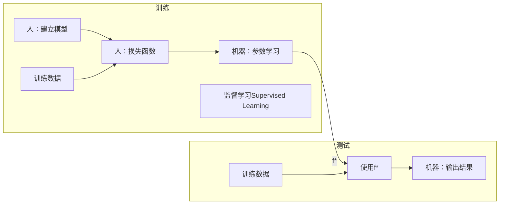
```mermaid
graph LR
subgraph 训练
A[人：建立模型]-->B[人：损失函数]
E[训练数据]-->B
B-->C[机器：参数学习]
D[监督学习Supervised Learning]
end
subgraph 测试
C-->|f*|F[使用f*]
G[训练数据]-->F
F-->H[机器：输出结果]
end
```

> - 举例：
> - 建立模型(也就是提供一些函数选择): $\lbrace f(x)=k·x|k=1,2,3,\dots ,\dots \rbrace$
> - 损失函数(判断函数是不是最优选择): $\min \sum (y-f(x))^2$
> - 参数学习： $f(x)=2x$ (已经有散点图的情况下进行模拟)

## 机器学习分类

### 监督学习

- [x] 数据：有标签信息

- [x] 主要思想：分类、回归

### 无监督学习

- [x] 若数据不包含标签信息，是否可以挖掘数据内在规律？

- [x] 数据:无标签信息

- [x] 学习目标:探索数据的内在性质与规律，挖掘数据之间的关系
  > 聚类和降维

## 数据
- [x] 数据内容：属性、标签
- [x] 数据划分：训练集、测试集

## 性能评价

- [x] 查准率、精确度(Precision)/准确率(Accuracy):所有样本中被正确预测结果的比例，用检测阳性/阴性来说明

$$查准率=\frac{真阳性数}{真阳性数+假阳性数},其中假阳性数也就是检测为阳性但是实际为阴性的样本数$$

- [x] 召回率(Recall)又叫 `查全率` ，它是 `针对原样本` 而言的，它的含义是 `在实际为正的样本中被预测为正样本的概率` ，同样用检测阳性/阴性来说明

$$查全率=\frac{真阳性数}{真阳性数+假阴性数},其中假阴性数也就是检测为阴性但是实际为阳性的样本数$$

- [x] P-R曲线：查准率-查重率构成的曲线
  > - 准确率和召回率越高越好，但是一般情况下，两者之间存在一定的反比关系
  > - 当一模型的P-R曲线“包住”另一个模型时，认为该模型较优，图中B优于C
  > - 当两个指标发生冲突时，需要一些性能度量来综合考虑查准率和查全率
  > > - mAP：平均精度，P-R曲线与坐标轴围成的面积大小，越大越好
  > > - 平衡点：P-R曲线和P=R直线的交点，“查准率=查全率”时的取值，越大越好
  > > - F1分数：查准率与查全率的调和平均，越大越好

$$\frac{1}{F1}=\frac{1}{2}·(\frac{1}{查准率}+\frac{1}{查全率})$$

  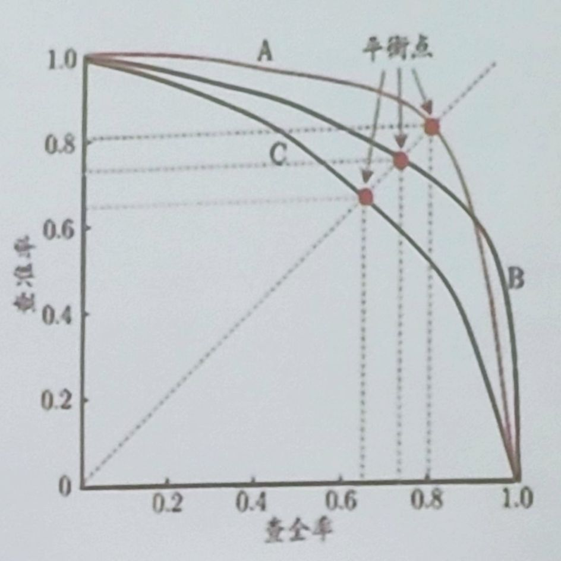
  

   P-R曲线
  

## 模型表现

- [x] 训练误差：模型在训练样本上的错误率
- [x] 泛化误差：模型在新样本（模型没有学习过的未知样本）上的错误率
- [x] 泛化能力不足的两种表现：
  > - 欠拟合：对训练样本的一般性质没有学好，在训练集和测试集上误差都很大
  > - 过拟合：过度拟合了训练样本的特性，在训练样本上误差很小、在新样本上误差很大

- [x] 例：树叶训练
  > - 过拟合模型分类结果:不是树叶(误以为树叶必须有锯齿)
  > - 欠拟合模型分类站果:→是树叶(误以为绿色的都是树叶)

# 第二章 回归分析

## 概述

### 回归

- [x] 对于给定的数据集： $D=\lbrace (x_1,y_1),(x_2,y_2),\dots ,(x_n,y_n)\rbrace$ ，其中 $x_i \in C=R^d,y_i \in Y=R$ ，是连续值(如果为分散值，则为分类而不是回归)
  > - 寻找 $C$ 上的映射函数： $f(x):C \rightarrow Y$
  > - 使得： $f(x_i) \approx y_i$

### 线性回归

- [x] 映射函数：线性函数 $f(x_i)=w·x_i+b$

- [x] 对样本 $x_i$ 进行线性变换

### 一元线性回归

- [x] 映射函数：线性函数 $f(x_i)=w·x_i+b$

- [x] 每个样本 $x_i$ 是一维的

### 多元线性回归

- [x] 实际应用场景中的变量大多具有多个属性
  > - 例如，想对房价进行预测，房价的影响因素有多个属性：面积，房龄，楼层等
  > - 假设房价与上述因素满足 `多元线性关系` ，需要寻找 `多元线性函数` 来预测房价： $房价=面积×w_1+房龄×w_2+楼层×w_3+b$

### 非线性回归

- [x] 线性函数无法准确拟合变量之间的关系时，使用更复杂的非线性回归方法，也就是将数据拟合为非一次方程的模式

### 性能评价

- [x] 为了使得回归模型的预测值和回归目标尽可能接近。常使用 `均方误差` 衡量性能

$$E(F;D)=\frac{1}{n} \sum\limits_{i=1}^n (f(x_i)-y_i)^2$$

## 线性回归

### 问题定义
- [x] 目标：寻找最优线性回归函数

$$f(x_i)=w_1x_{i1}+w_2x_{i2}+ \dots +w_dx_{id}+b=\omega ^Tx_i+b$$

> **注： $x_i$ 和 $\omega$ 在此处均为d维向量，即 $x_i ,\omega \in R^d$**

- [x] 如何获得最优解参数 $\omega ^{\*}$ 和 $b^{\*}$ ?
  > - 方法一：最小二乘法————将误差最小化
  > - 方法二：极大似然法————将概率最大化

### 最小二乘法

#### 一元线性回归

- [x] 一元情况，即 `样本属性是一维的` ，向量 $x_i$ 在此处为一个值，线性回归模型试图学得： $f(x)=\omega x+b$ ，使得 $f(x_i) \approx y_i$

- [x] 使用 `均方误差` 来衡量预测结果与回归目标之间的误差：

$$E(F;D)=\frac{1}{n} \sum\limits_{i=1}^n (f(x_i)-y_i)^2 = \frac{1}{n} \sum\limits_{i=1}^n (\omega x_i +b-y_i)^2$$

- [x] 最小二乘法的目标是使得 `均方误差最小化` :

$$(\omega ^{\*},b^{\*})=\underset{\substack{(\omega, b)}}{\arg\min} E(F;D)=\underset{\substack{(\omega, b)}}{\arg\min} \sum\limits _{i=1}^n (\omega x_i +b-y_i)^2$$

> **注：此处的 `argmin` 就是后续函数取最小值时的参数值， $\frac{1}{n}$ 由于为定值被省略了**

##### 一元线性回归如何求解最优参数
- [x] $(\omega ^{\*},b^{\*})=\underset{\substack{(\omega, b)}}{\arg\min} \sum\limits _{i=1}^n (\omega x_i +b-y_i)^2$ 怎么求解最优的 $(\omega ^{\*},b^{\*})$

> 由于 $\sum\limits _{i=1}^n (\omega x_i +b-y_i)^2$ 是关于 $\omega ,b$ 的二次函数，，所以二次极值点只有一个，所以存在唯一的全局最优解。
> > 证明：对于二元二次函数而言不难有假设 $g(x,y)=ax^2+by^2+cxy+dx+ey+f$ ，那么对于极值点 $(x_0,y_0)$ 而言有

$$\begin{cases}
g _x(x_0,y_0) = \frac{\partial g}{\partial x}| _{x=x_0,y=y_0} =0\newline
g _y(x_0,y_0) = \frac{\partial g}{\partial y}| _{x=x_0,y=y_0} =0\newline
\end{cases}$$

> > 带入 $g(x,y)=ax^2+by^2+cxy+dx+ey+f$ 到上述方程组则有方程组

$$\begin{cases}
g _x(x_0,y_0) =2ax_0 +cy_0 +d=0\newline
g _y(x_0,y_0) =2by_0 +cx_0 +e=0\newline
\end{cases}$$

> > 解得

$$\begin{cases}
x_0=\frac{ec-2bd}{4ab-c^2} \newline
y_0=\frac{2ae-cd}{4ab-c^2} \newline
\end{cases}
$$

> > 上述可以看出来只有唯一一个极值点，故存在唯一的全局最优解，因为很明显，对于回归问题中的 $a,b$ 都是非负值，一定存在唯一极小值点，故存在全局最优解

> 所以回到回归问题中，求最优的 $(\omega ^{\*},b^{\*})$ 即对 $\sum\limits _{i=1}^n (\omega x_i +b-y_i)^2$ 求偏导即可，即有

$$\begin{cases}
\frac{\partial E(\omega ,b)}{\partial \omega}=0 \newline
\frac{\partial E(\omega ,b)}{\partial b}=0 \newline
\end{cases} \rightarrow 
\begin{cases}
\sum\limits_{i=1}^n 2(\omega x_i +b-y_i)x_i = 2\left(w\sum\limits_{i=1}^n x_i^2-\sum\limits_{i=1}^n (y_i-b)x_i\right)=0 \newline
\sum\limits_{i=1}^n 2(\omega x_i +b-y_i)=2nb+2\sum\limits_{i=1}^n (\omega x_i-y_i)=2\left(nb-\sum\limits_{i=1}^n (y_i-\omega x_i)\right)=0 \newline
\end{cases} \rightarrow
\begin{cases}
\omega^{\*}=\frac{\sum\limits _{i=1}^n y _i(x _i- \overline{x})}{\sum\limits _{i=1}^n x_i^2- \frac{1}{n}\left(\sum\limits _{i=1}^n x_i \right)^2} , & \text{其中} \overline{x}=\frac{1}{n} \sum\limits _{i=1}^n x_i\newline
b^{\*}=\frac{1}{n} \sum\limits _{i=1}^n (y_i- \omega x_i)\newline
\end{cases}$$

#### 多元线性回归

- [x] 多元线性回归同样通过最小化均方误差来对 $\omega,b$ 进行估计
  > - 回归函数 $f(x_i)=w_1x_{i1}+w_2x_{i2}+ \dots +w_dx_{id}+b=\omega ^Tx_i+b$
  > - 均方误差 $E(F;D)=\frac{1}{n} \sum\limits _{i=1}^n (f(x_i)-y_i)^2=\frac{1}{n} \sum\limits _{i=1}^n (\omega ^T x_i+b-y_i)^2$
  > - 最优参数 $(\omega ^{\*},b^{\*})=\underset{\substack{(\omega, b)}}{\arg\min} E(F;D)=\underset{\substack{(\omega, b)}}{\arg\min} \sum\limits _{i=1}^n (\omega ^T x_i +b-y_i)^2$

> 与一元不同的是上述表达式中的 $x_i,\omega$ 是多维向量，而不是一个单独值

#### 多元线性回归何求解最优参数

- [x] 由于 $E(F;D)=\frac{1}{n} \sum\limits _{i=1}^n (f(x_i)-y_i)^2=\frac{1}{n} \sum\limits _{i=1}^n (\omega ^T x_i+b-y_i)^2$
> - 令： $\hat{\omega}=(\omega ^T,b)^T=(w_1,\dots , w_d,b)^T \ \ \ \ \hat{x_i}=(x_i^T,1)^T=(x_{i1},\dots ,x_{id},1)^T$ ，此处也说明 $\omega ,x_i \in R^d$
> - 有 $E(F;D)=\frac{1}{n} \sum\limits _{i=1}^n (\omega ^T x_i+b-y_i)^2=\frac{1}{n} \sum\limits _{i=1}^n (\hat{\omega} ^T \hat{x_i}-y_i)^2=\frac{1}{n} \sum\limits _{i=1}^n (y_i- \hat{\omega} ^T \hat{x_i})^2$
> - 令： $E_i=y_i- \hat{\omega} ^T \hat{x_i}$
> - 有 $E(F;D)=\frac{1}{n} \sum\limits _{i=1}^n (y_i- \hat{\omega} ^T \hat{x_i})^2=\frac{1}{n} \sum\limits _{i=1}^n E_i^2$
> - 则有

$$E(F;D)=\frac{1}{n} \sum\limits _{i=1}^n E_i^2=\frac{1}{n}(E _1,\dots ,E _n)\left(\begin{matrix}
E _1 \newline
\vdots \newline
E _n\end{matrix}\right)=\frac{1}{n}\left(\begin{matrix}
E _1 \newline
\vdots \newline
E _n\end{matrix}\right)^T\left(\begin{matrix}
E _1 \newline
\vdots \newline
E _n\end{matrix}\right)$$

> - 令 $E_i=y_i- \hat{\omega} ^T \hat{x_i}$
> - 则有

$$E(F;D)=\frac{1}{n}\left(\begin{matrix}
y_1- \hat{\omega} ^T \hat{x_1} \newline
\vdots \newline
y_n- \hat{\omega} ^T \hat{x_n}\end{matrix}\right)^T\left(\begin{matrix}
y_1- \hat{\omega} ^T \hat{x_1} \newline
\vdots \newline
y_n- \hat{\omega} ^T \hat{x_n}\end{matrix}\right)=\frac{1}{n}\left[\left(\begin{matrix}
y_1 \newline
\vdots \newline
y_n \end{matrix}\right)-\left(\begin{matrix}
\hat{\omega} ^T \hat{x_1} \newline
\vdots \newline
\hat{\omega} ^T \hat{x_n}\end{matrix}\right)\right]^T\left[\left(\begin{matrix}
y_1 \newline
\vdots \newline
y_n \end{matrix}\right)-\left(\begin{matrix}
\hat{\omega} ^T \hat{x_1} \newline
\vdots \newline
\hat{\omega} ^T \hat{x_n}\end{matrix}\right)\right]$$

> **注：此处最后一步是根据行列式性质得到的，这是因为 $\hat{\omega}^T\hat{x_i}$ 和 $y_i$ 无关可以直接拆分**

> - 由于有

$$\left(\begin{matrix}
\hat{\omega} ^T \hat{x_1} \newline
\vdots \newline
\hat{\omega} ^T \hat{x_n}\end{matrix}\right)=(\hat{\omega} ^T\hat{x_1},\dots ,\hat{\omega} ^T\hat{x_n})^T=[\hat{\omega} ^T(\hat{x_1},\dots ,\hat{x_n})]^T=(\hat{x_1},\dots ,\hat{x_n})^T \hat{\omega}=\left(\begin{matrix}
\hat{x_1}^T \newline
\vdots \newline
\hat{x_n}^T\end{matrix}\right)\hat{\omega}$$

> - 则

$$E(F;D)=\frac{1}{n}\left[\left(\begin{matrix}
y_1 \newline
\vdots \newline
y_n \end{matrix}\right)-\left(\begin{matrix}
\hat{x_1}^T \newline
\vdots \newline
\hat{x_n}^T\end{matrix}\right)\hat{\omega}\right]^T\left[\left(\begin{matrix}
y_1 \newline
\vdots \newline
y_n \end{matrix}\right)-\left(\begin{matrix}
\hat{x_1}^T \newline
\vdots \newline
\hat{x_n}^T\end{matrix}\right)\hat{\omega}\right]$$

> - 不妨令

$$X=\left(\begin{matrix}
\hat{x_1}^T \newline
\vdots \newline
\hat{x_n}^T\end{matrix}\right)=\left(\begin{matrix}
x_{11} \ \cdots \ x_{1d} \ 1\newline
\vdots \ \ddots \ \vdots \ \ \ \ \ \ \ \  \vdots\newline
x_{n1} \ \cdots \ x_{nd} \ 1\end{matrix}\right),y=\left(\begin{matrix}
y_1 \newline
\vdots \newline
y_n \end{matrix}\right)=(y_1,\dots ,y_n)^T$$

> - 则有

$$E(F;D)=\frac{1}{n}(y-X\hat{\omega})^T(y-X\hat{\omega})$$

- [x] 优化目标表示为 $\hat{\omega}^{\*}=\underset{\substack{\hat{\omega}}}{\arg\min} (y-X\hat{\omega})^T(y-X\hat{\omega})$

- [x] 求解 $\hat{\omega}^{\*}$ ，需要通过矩阵求导，[常见矩阵求导公式](https://blog.csdn.net/weixin_45816954/article/details/119817108?app_version=6.2.9&code=app_1562916241&csdn_share_tail=%7B%22type%22%3A%22blog%22%2C%22rType%22%3A%22article%22%2C%22rId%22%3A%22119817108%22%2C%22source%22%3A%222301_79807208%22%7D&uLinkId=usr1mkqgl919blen&utm_source=app)：

$$\frac{\partial E(F;D)}{\partial \hat{\omega}}=\frac{2}{n}X^T(X\hat{\omega}-y)$$

- [x] 令上式为0可得到 $\hat{\omega}$ 最优解的闭式解，但涉及矩阵求逆，需分情况讨论

###### 求解情形一

- [x] 当 $X^TX$ 为 [满秩矩阵](https://baike.baidu.com/item/%E6%BB%A1%E7%A7%A9%E7%9F%A9%E9%98%B5) 或 [正定矩阵](https://baike.baidu.com/item/%E6%AD%A3%E5%AE%9A%E7%9F%A9%E9%98%B5)，(此处就是为了保证 $X^TX$ 存在逆矩阵)令上式为0可得
  > - **方阵的满秩，和方阵可逆，和方阵的行列式不等于零，和组成方阵的各个列向量线性无关，和齐次方程组只有零解，这些都是等价的。**

$$\frac{2}{n}X^T(X \hat{\omega} - y)=0$$

$$\hat{\omega}^{\*}=(X^TX)^{-1}X^Ty$$

> 最终得到的多元线性回归模型为：

$$f(\hat{x_i})=\hat{\omega}^{\*T}\hat{x_i}=\hat{x_i}^T\hat{\omega}^{\*}=\hat{x_i}^T (X^TX)^{-1}X^Ty$$

##### 求解情形二

- [x] 当 $X^TX$ 为满秩矩阵或正定矩阵，则 $X^TX$ 不存在逆矩阵
  > - 此时可以求出多个 $\hat{\omega}$ ，都能使均方误差最小化，如何处理？
  > - 常见做法是 `正则化(regularization)` 项，使得原式有唯一解
  > > - 正则项 $E_w=||\hat{\omega}||^2_2$ ，为2-范数的平方。(向量范数有∞-范数(最大范数) $||X|| _{\infty} =\max\limits _{1 \leq i \leq n}|x_i|$ ，1-范数 $||X||_1=\sum\limits _{i=1}^n|x_i|$ ，2-范数 $||X||_2=(\sum\limits _{i=1}^n|x_i|^2)^{\frac{1}{2}}$ ，p-范数 $||X|| _p=(\sum\limits _{i=1}^n|x_i|^p)^{\frac{1}{p}}$ ,矩阵范数有行和范数 $||A|| _{\infty}=\max\limits _{1 \leq i \leq n} \sum\limits _{j=1}^n |a _{ij}|$ ,列和范数 $||A|| _1=\max\limits _{1 \leq j \leq n} \sum\limits _{i=1}^n |a _{ij}|$ ,谱范数 $||A|| _2=\sqrt{\lambda _{max}(A^TA)}$ )
  > > - 优化目标变为: $E(f;D)=\frac{1}{n}(y-X\hat{\omega})^T(y-X\hat{\omega})+\lambda ||\hat{\omega}||^2_2$
  > > - 最优解变为: $\hat{\omega}^{\*}=(X^TX+ \lambda I)^{-1}X^Ty$
  > > - 通过调整正则项的系数，可以使得 $X^TX+ \lambda I$ 的逆存在，从而原式有唯一解

### 极大似然法

- [x] 似然函数：设总体 $X$ 有概率函数 $g(x;θ)$ ，其中 $x$ 为样本， $θ$ 为参数，当固定 $x$ 时把 $g(x;θ)$ 看做 $θ$ 的函数，称为似然函数，记作 $L(x;θ)$ 或 $L(θ)$
- [x] 在简单样本的情况下，一般有 $L(x;θ)=\prod\limits_{i=1}^n g(x_i;θ)$
  > - 例：抛一枚不均匀的硬币，抛到正面( $x=0$ )的概率为 $θ$ ，抛到反面( $x=1$ )的概率为 $1-θ$ ，则 $g(x=0;θ)=θ,g(x=1;θ)=1-θ$
  > - 从总体X中抽样十个样本，即抛硬币10次，其中7次正面3次反面，则似然函数为

$$L(x_1,\dots ,x_{10};θ)=\prod\limits_{i=1}^{10} g(x_i;θ)=θ^7(1-θ)^3$$

- [x] 极大似然估计：在给定 $x$ 时，参数 $θ$ 的极大似然估计值 $\hat{θ}$ 满足,

$$L(\hat{θ})= \max\limits_{θ} L(x;θ)$$

- [x] 极大似然估计表示在参数为 $\hat{θ}$ 时，能够观察到 $x$ 的可能性最大

- [x] 通常使用对数似然函数 $l(θ)=\ln L(θ)$ 进行计算
  > - 例：抛不均匀硬币的似然函数为 $L(x_1,\dots ,x_{10};θ)=\prod\limits_{i=1}^{10} g(x_i;θ)=θ^7(1-θ)^3$
  > - 对数似然函数为 $l(θ)=7 \ln θ + 3 \ln (1-θ)$
  > - 求极大值点： $\frac{dl(θ)}{dθ}=\frac{7}{θ}-\frac{3}{1-θ}$ 解得极大似然估计 $\hat{θ}=0.7$

- [x] 线性回归函数

$$f(x_i)=\omega ^Tx_i+b$$

- [x] 假设回归值 $f(x_i)$ 与真实结果 $y_i$ 之间的误差 $\epsilon _i$ 服从均值为零的正态分布

$$y_i=\omega ^T x_i+b+\epsilon _i,i=1,\dots ,m$$

$$\epsilon _i \sim N(0,\sigma ^2),且\epsilon _i与\epsilon _j独立，\forall i≠j$$

- [x] 固定 $(x_i,y_i)_{i=1 \dots n}$ ,把 $\lbrace \epsilon _i\rbrace _{i=1 \dots n}$ 的概率分布看成 $\omega ,b$ 的函数，得到似然函数(相当于把误差 $\epsilon _i$ 用 $y_i- \omega ^Tx_i-b$ 表示出来了，然后通过每一个误差为正态分布且无关变量相当与将其概率相乘即可获得似然函数)

$$(\omega,b)=\prod\limits _{i=1}^n \frac{1}{\sqrt{2\pi \sigma ^2}}e^{-\frac{1}{2\sigma ^2}(y_i- \omega ^Tx_i-b)^2}$$

- [x] 进一步，得到对数似然函数:

$$l(\omega ,b)=\sum\limits _{i=1}^n \ln \left[\frac{1}{\sqrt{2\pi \sigma ^2}}e^{-\frac{1}{2\sigma ^2}(y_i- \omega ^Tx_i-b)^2}\right]=\sum\limits _{i=1}^n \left[-\frac{1}{2}\ln 2 \pi -\frac{1}{2}\ln \sigma ^2 - \frac{1}{2 \sigma ^2}(y_i- \omega ^Tx_i-b)^2 \right]=const. - \frac{1}{2 \sigma ^2}\sum\limits _{i=1}^n (y_i- \omega ^Tx_i-b)^2$$

- [x] 通过极大对数似然函数即可求得回归模型的参数

### 最小二乘法与极大似然法

- [x] 最小二乘法————将误差最小化： $\min\limits_{\omega ,b} \sum\limits_{i=1}^n(y_i- \omega ^Tx_i-b)^2$

- [x] 极大似然法————将概率最大化： $\max\limits_{\omega ,b} - \frac{1}{2 \sigma ^2} \sum\limits_{i=1}^n (y_i- \omega ^Tx_i-b)^2$

- [x] `在误差服从均值为零的正态分布的假设下` (该条件与欧式距离有关，暂不最了解)，从极大似然法的解中可以推导出最二乘法使用的均方误差函数，两种解法实际上等分。

## 非线性回归

- [x] 真实世界中变量之间往往呈现复杂的 `非线性关系` ，线性回归方法无法准确拟合，需要非线性回归。

### 线性基函数回归

- [x] 引入基函数对线性回归进行拓展
  > - 基函数对样本进行非线性变换： $x \rightarrow \phi(x)$
  > - 对多个基函数进行线性组合

$$f(x)=w_0+w _1\phi _1(x)+\dots +w _M\phi _M(x)=\sum\limits _{j=0}^M w _j\phi _j(x) \ \ \text{其中} \phi _0(x)=1$$

- [x] 多项式基函数

$$\phi _j(x)=x^j$$

- [x] 高斯基函数

$$\phi _j(x)=e^{-\frac{(x- \mu _j^2)}{2s^2}}$$

- [x] 仍可用最小二乘法与极大似然法求解
  > - 回归函数 $f(x)=w_0+w _1\phi _1(x)+\dots +w _M\phi _M(x)=\sum\limits _{j=0}^M w _j\phi _j(x) \ \ \text{其中} \phi _0(x)=1$
  > - 均方误差 $E(f;D)=\sum\limits _{i=1}^n (y_i-f(x_i))^2=\sum\limits _{i=1}^n (y_i-\sum\limits _{j=0}^M w _j\phi _j(x))^2$

$$(w_0^{\*},\dots ,w_M^{\*})=\underset{\substack{(w_0,\dots ,w_M)}}{\arg\min} E(f;D)$$

#### 常见基函数举例

- [x] 多项式基函数 $\phi _j(x)=x^j$

  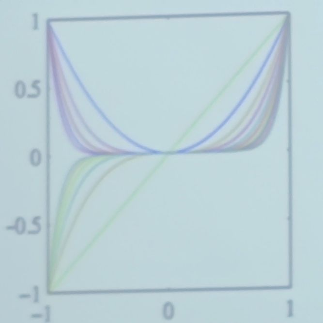
  

   多项式基函数
  

- [x] 高斯基函数 $\phi _j(x)=e^{-\frac{(x- \mu _j^2)}{2s^2}}$

  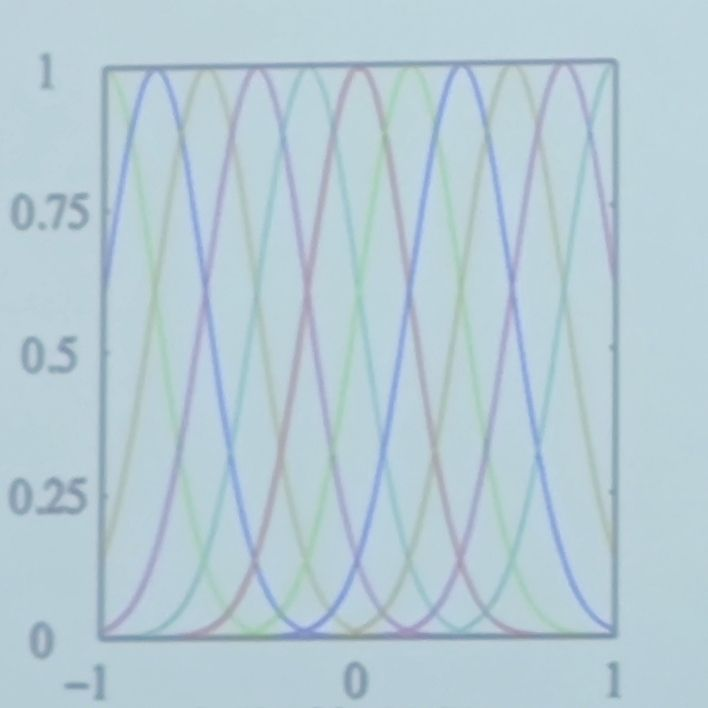
  

   高斯基函数
  

- [x] sigmoid基函数 $\phi _j(x)=\sigma \left(\frac{x- \mu _j}{s}\right),\text{其中} \sigma (a)= \frac{1}{1+e^{-a}}$ 

  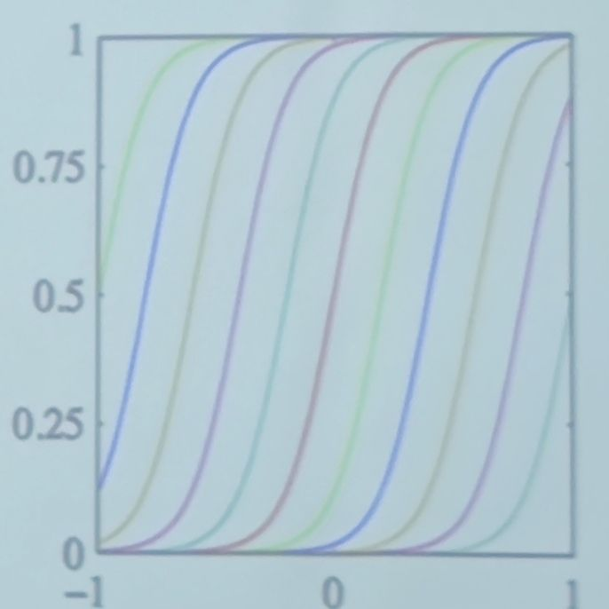
  

   sigmoid基函数
  

#### 多项式回归

- [x] 多项式回归函数等价于用多项式基拓展后的线性函数

$$f(x)=w_0+w_1x+w_2x^2+\dots +w_Mx^M=\sum\limits_{j=0}^M w_jx^j$$

- [x] 多项式阶数 $M$ 的选择，需要根据数据点来进行拟合，但是有的时候，回归曲线能够拟合所有的数据点。但是与实际曲线相过大也不好，所以 $M$ 不宜过大，也不宜过小，多项式阶数太高，可能会导致模型在训练集上 `过拟合` ，阶数太低，可能导致 `欠拟合` 。

##### 用正则化减少过拟合

- [x] 目的：使模型偏好权重较小的函数，防止模型学出过于复杂的函数(简单而言，正则项是为了不让某一项的权重过大)

- [x] 方法：在原目标函数之外添加限制参数的正则项，即 $E_D(w)+ \lambda E_w(w)$

- [x] 正则项常取参数的范数和： $\sum\limits_{j=i}^M|w_j|^q$ ，不同 $q$ 值对参数大小的限制范围不同
  > 例：取 $q=2$ ，修正的误差函数为 $||y-w^T \phi(x)||^2_2+\lambda |w|_2^2$ ，然后取合适的 $\lambda$ 对参数进行限制，不宜过大过小，按照实际要求来算。

- [x] 如何选择合适的超参数 $\lambda$ ？
  > 实验中，通过参考模型在验证集上的效果进行选择

```mermaid
graph LR
A[人工设定λ]-->B[训练集]
B-->|训练过程，学习参数w,b|C[验证集]
C-->D(验证集效果是否达标)
D-->|是|E[产生测试效果]
D-->|否|A
```

# 第三章 分类
## 概述

- [x] 与回归的区别就是，分类研究对象是离散的，但是回归是连续的

### 分类任务

- [x] 根据数据的特征信息(图像、文本、语音等)，为其自动分配合理的、预定义的类别标签

- [x] 形式化定义
  > - 给定训练集 $D=\lbrace (x_1,y_1), \dots ,(x_n，y_n)\rbrace$ ，其中 $x_i \in X$ 为待分类的样本(图像、文本、音频等)， $y_i \in Y=\lbrace 1,…,K\rbrace$ 为类别标签，$K$ 为类别数
  > - 希望寻找到合适的决策函数 $f：X→Y$ ，使得 $f(x_i)≈y_i$ 

- [x] 与回归任务的对比
  > - 数据 $D=\lbrace (x_1,y_1), \dots ,(x_n，y_n)\rbrace$
  > - 学习目标：寻找一个映射函数 $f：X→Y$ ，使得 $f(x_i)≈y_i$
  > - 回归任务中，标签 $y_i$ 的取值是 `连续` 的；分类任务中，标签 $y_i$ 的取值是 `离散` 的

## 非线性分类器

### 决策树

#### 概念

- [x] 什么是决策树？
  > - 决策树：一种对实例进行分类的树形结构
  > - 内部节点： `分割节点` ，对一个特征进行分割
  > - 叶节点： `预测节点` ，对应一个决策结果

- [X] 本质：一组 `分类规则` 的集合，根节点到叶节点的一条路径就是一个规则
  > - 输入通过分割节点进行路由，并在叶节点处得到给出的预测分类

  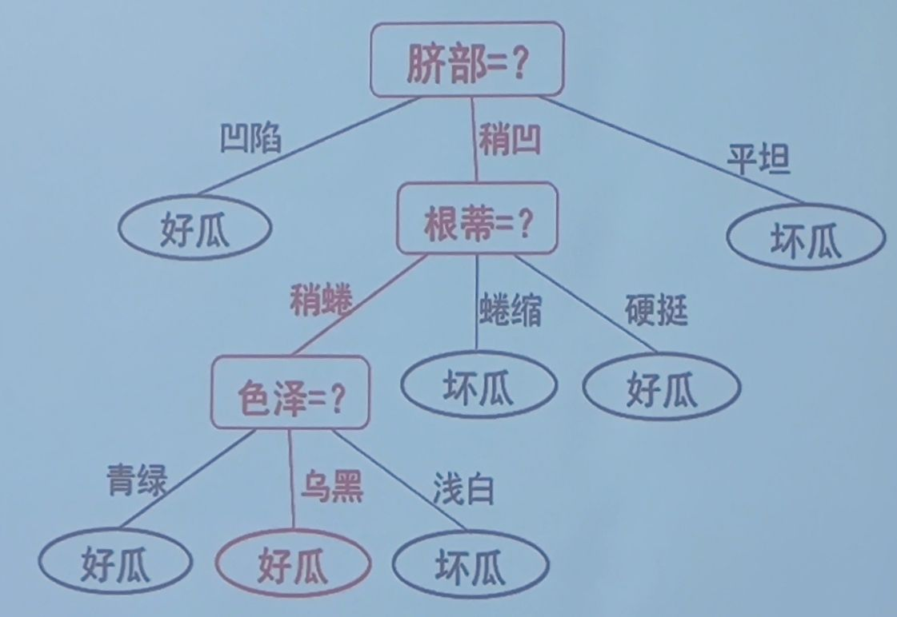
  

   决策树示例1
  

- [x] 几何解释：分割样本空间

- [x] 为什么选择使用决策树？
  > - 与神经网络相比，树形图结构简洁明了， `可解释性强`
  > - 且运算指令简单，不需要深入了解很多背景知识，易于非专业人士掌握

- [x] 从样本中归纳决策树
  > - 搜索合适的决策树
  > - 不同的特征选取方式将决定不同的决策树若考虑样本的所有特征和所有可能取值,存在指数级的候选决策树
  > - 生成的决策树应规模尽可能小

- [x] 如何生成决策树
  > - 根据贪心算法
  > - 分而治之策略
  > > - 关键问题：基于 `某种指标`进行 `特征选择`
  > > > - 选取对训练数据有足够分类能力的特征，用于划分特征空间
  > > > - 经典指标： `信息增益` 、 `增益率` 、 `基尼指数` 等

> 经典流程见下

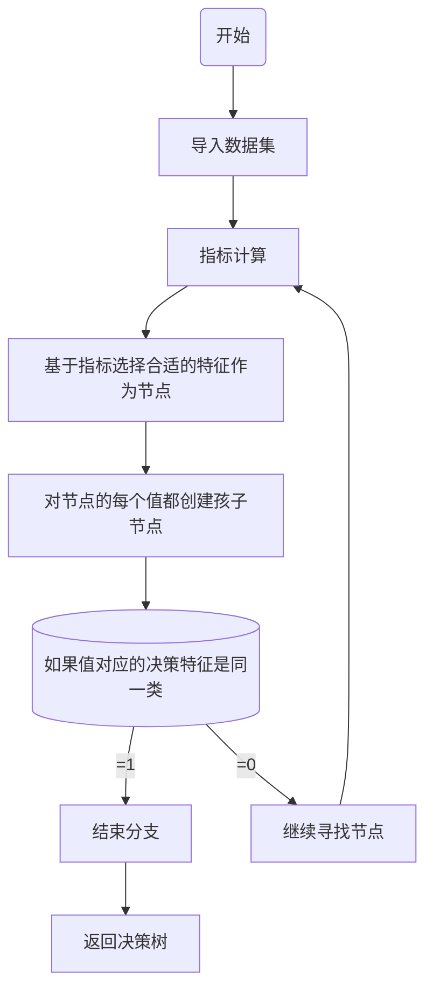
```mermaid
graph TB
A(开始)-->B[导入数据集]
B-->C[指标计算]
C-->D[基于指标选择合适的特征作为节点]
D-->E[对节点的每个值都创建孩子节点]
F[继续寻找节点]-->C
E-->G[(如果值对应的决策特征是同一类)]
G-->|=1|H[结束分支]
G-->|=0|F
H-->I[返回决策树]
```

#### 特征选择（划分选择）

##### 信息增益

- [x] 信息增益：`信息熵` 的期望减少
  > - 信息熵：数据集D 的 `不确定性` 的度量(混淆程度)

$$H(D)=\sum\limits_{k=1}^K -p_k \log _2p_k$$

> - $p_x$ 为数据集中第 $k$ 类样本占所有样本的比例， $V$ 是类别总数
> - 例：数据集 $D$ 中有10个样本，其中好瓜有5个，坏瓜有5个，随机取样，取到好瓜和坏瓜的概率各为0.5，则 $D$ 的信息熵为:

$$H(D)=-(0.5 log_2 0.5 +0.5log_2 0.5)= 1$$

> - 信息熵为统计特性参数，反映了每次试验所能获得的平均信息量， $E(D)$ 的值越小 $D$ 纯度越高

> 接着上述的例子，假设10个瓜中，有很多特征，比如 `纹理` 、 `脐部` 、 `根蒂` 等等，并且每种特征都有自己的子集，比如 `脐部` 分为 `凹陷` 、 `稍凹` 、 `平坦` 。见下表。

  <table>
  <tr>
    <th>编号</th>
    <th>色泽</th>
    <th>根蒂</th>
    <th>纹理</th>
    <th>脐部</th>
    <th>好瓜</th>
  </tr>
  <tr>
    <td>1</td>
    <td>青绿</td>
    <td>蜷缩</td>
    <td>清晰</td>
    <td>凹陷</td>
    <td>是</td>
  </tr>
  <tr>
    <td>2</td>
    <td>浅白</td>
    <td>蜷缩</td>
    <td>清晰</td>
    <td>凹陷</td>
    <td>是</td>
  </tr>
  <tr>
    <td>3</td>
    <td>青绿</td>
    <td>蜷缩</td>
    <td>清晰</td>
    <td>凹陷</td>
    <td>是</td>
  </tr>
  <tr>
    <td>4</td>
    <td>乌黑</td>
    <td>蜷缩</td>
    <td>清晰</td>
    <td>稍凹</td>
    <td>是</td>
  </tr>
  <tr>
    <td>5</td>
    <td>青绿</td>
    <td>蜷缩</td>
    <td>稍糊</td>
    <td>稍凹</td>
    <td>是</td>
  </tr>
  <tr>
    <td>6</td>
    <td>乌黑</td>
    <td>蜷缩</td>
    <td>清晰</td>
    <td>平坦</td>
    <td>否</td>
  </tr>
  <tr>
    <td>7</td>
    <td>青绿</td>
    <td>硬挺</td>
    <td>稍糊</td>
    <td>凹陷</td>
    <td>否</td>
  </tr>
  <tr>
    <td>8</td>
    <td>青绿</td>
    <td>硬挺</td>
    <td>清晰</td>
    <td>稍凹</td>
    <td>否</td>
  </tr>
  <tr>
    <td>9</td>
    <td>乌黑</td>
    <td>硬挺</td>
    <td>模糊</td>
    <td>平坦</td>
    <td>否</td>
  </tr>
  <tr>
    <td>10</td>
    <td>乌黑</td>
    <td>稍蜷</td>
    <td>模糊</td>
    <td>稍凹</td>
    <td>否</td>
  </tr>
</table>

> - 数据集D的信息熵(只看最终结果，因为最终就是为了判断是不是好瓜，所以按照是不是好瓜来计算信息熵)为

$$H(D)=-(0.5 log_2 0.5+0.5 log_2 0.5)=1$$

> - 按照特征“脐部”将数据集分为三个子集

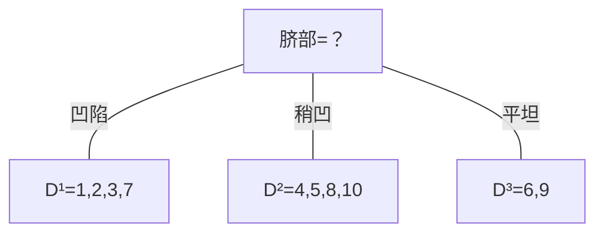
```mermaid
graph TB
A[脐部=？]---|凹陷|B[D¹=1,2,3,7]
A---|稍凹|C[D²=4,5,8,10]
A---|平坦|D[D³=6,9]
```

> - 特征“脐部”将数据集分为三个子集
> > - “凹陷”： $D^1=\lbrace 1,2,3,7\rbrace$ ，其中 $\lbrace 1,2,3\rbrace$ 为好瓜, $7$ 为坏瓜。

$$H(D^1)=-(\frac{3}{4}\log_2 \frac{3}{4}+\frac{1}{4}\log_2 \frac{1}{4})=0.811$$

> > - 同理可计算 $H(D^2)=1，H(D^3)=0$

> - `信息增益` ： $Gain(D,A)= H(D)-\sum\limits_{v=1}^V \frac{|D^v|}{|D|}H(D^v)$ 表示由于特征 $A$ 使得数据集 $D$ 进行分类的不确定性的减少程度
> - 其中 $V$ 表示特征 $A$ 共有 $V$ 个取值，将数据集划分为 $V$ 个子集，第 $v$ 个子集为 $D^v$ ，这里 $|D^v|$ 表示 $D^v$ 中元素个数， $|D|$ 表示数据集 $D$ 的元素个数
> > - 例：数据集 $D$ 的信息熵为H(D)=1，特征“脐部”将数据集分为三个子集，$H(D^1)=0.811,H(D^2)=1,H(D^3)=0$
> > - $Gain(D,脐部)=1-(\frac{4}{10}x0.811+\frac{4}{10}x1+\frac{2}{10}×0)= 0.275$
> 
> - 信息增益本质上是熵的期望减少
> - 信息增益越大，表示特征 $A$ 的划分能更大程度降低不确定性，意味着 $A$ 具有更强的分类能力
> - 经典算法： [`ID3算法`](https://baike.baidu.com/item/ID3%E7%AE%97%E6%B3%95) ，使用信息增益作为特征选择指标

> - 缺点：对可取值较多的特征有偏好
> > - 若将“编号”也视作特征，该特征具有10种取值，可产生10个分支，每个分支仅一个样本
> > - 可以计算出，特征“编号”的信息增益为1，远大于其他候选特征，但使用“编号”来划分数据集是没有意义的
> > - 为减少这种偏好带来的不利影响，可使用 `信息增益率` 作为指标进行特征选择

##### 增益率

- [x] 信息增益率：信息增益与特征信息熵的比值
  > - 信息增益率： $Gain_R(D,A)=\frac{Gain(D,A)}{H_A(D)}$ ，在信息增益基础上增加惩罚项，同样表示由于特征 $A$ 使得数据集 $D$ 进行分类的不确定性的减少程度，越大越好
  > - 其中，若特征 $A$ 将数据集划分为 $V$ 个子集，第 $v$ 个子集为 $D^v$ ，则特征信息熵 $H_A(D)=-\sum\limits_{v=1}^V \frac{|D^v|}{|D|}\log_2 \frac{|D^v|}{|D|}$，表示数据集 $D$ 关于特征 $A$ 的值的熵
  > - 特征A的取值越多( $V$ 越大)，则 $H_A(D)$ 通常会越大
  > - 在一定程度上可以避免ID3倾向于选择取值较多的特征作为节点的问题

- [x] 经典算法： [`C4.5算法`](https://baike.baidu.com/item/C4.5%E7%AE%97%E6%B3%95) ，使用信息增益率作为特征选择指标

##### 基尼指数

- [x] `基尼系数` :表示集合 $D$ 的不确定性
  > - $Gini\underline{}index(D,A) = \sum\limits_{v=1}^V \frac{|D^v|}{|D|}Gini(D^v)$ ，表示经特征 $A$ 分割成 $V$ 个子集后数据集 $D$ 的不确定性，越小越好
  > - 其中， $Gini(D)=1-\sum\limits_{k=1}^K p_k^2$ ，表示从数据集中随机抽取两个样本，其来自不同类别的概率
  > - $p_x$ 为数据集中第 $k$ 类样本占所有样本的比例

- [x] 经典算法： [`CART算法`](https://baike.baidu.com/item/%E6%95%B0%E6%8D%AE%E6%8C%96%E6%8E%98%E7%AE%97%E6%B3%95/9640405?fromModule=search-result_lemma-recommend)，使用基尼系数作为特征选择指标

#### 其他决策树生成算法

- [x] 上述算法均为基于贪婪决策的算法
  > - 其他算法：随机算法
  > > - 随机选择特征来拆分节点从而构建的决策树
  > > - 需要多棵随机决策树 `集成学习` 以保证良好的性能
  > > - 经典算法：RDT、ET、PERT、RS等

  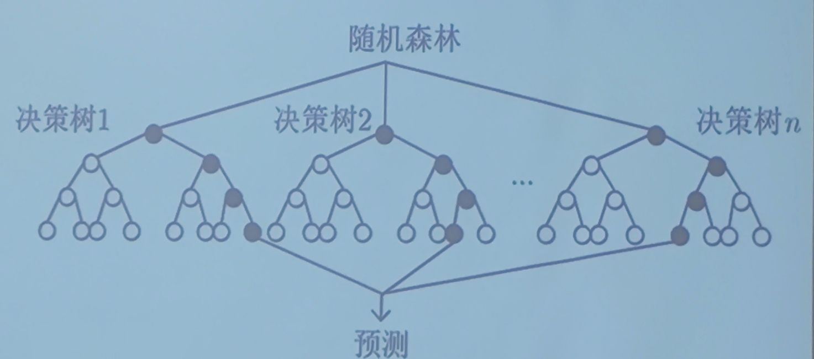
  

   随机算法生成决策树
  

#### 剪枝处理

##### 概念

- [x] `过拟合问题`

- [x] 例：ID3算法生成决策树
  > - 容易产生过拟合问题
  > > - 可能把训练集自身的一些特点当作所有数据都具有的一般性质
  > > - 如：所有脐部凹陷，色泽浅白的都是坏瓜

- [x] 解决策略： `决策树剪枝`

  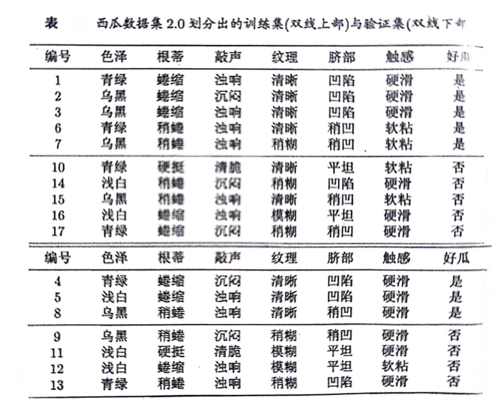
  

   训练集与验证集
  

  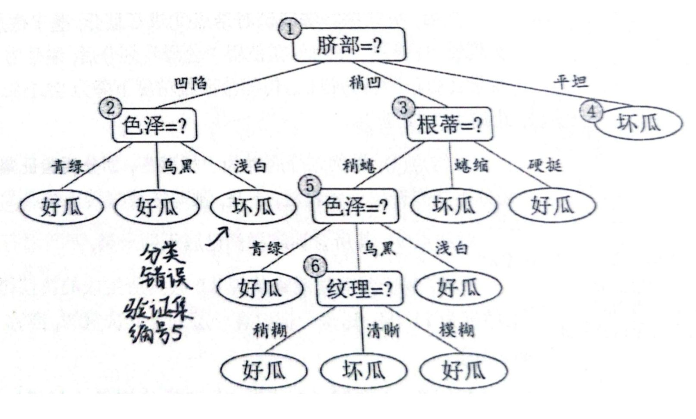
  

   剪枝前生成过拟合决策树
  

##### 预剪枝(prepruning)

- [x] 基于信息增益准则，选取属性“脐部”来对训练集进行划分，并产生3个分支，如下图所示。然而是否应该进行这个划分呢？
  > - 预剪枝要对划分前后的泛化性能进行估计

> - 例：以上面过拟合的决策树为例，在划分之前，所有样例集中在根结点，若不进行划分，该结点将被标记为叶结点，其类别标记为训练样例数最多的类别，假设将这个叶结点标记为“好瓜”(这个可以通过样本来判断，因为该节点有10个样例，有5个好瓜，5个坏瓜，两者数目相等可以选择实验中更偏向的一种结果或任选一个，数目不相等时选更多的一种)，用上表的验证集对这个单结点决策树进行评估，则编号为{4,5,8}的样例被分类正确，另外4个样例分类错误，于是，验证集精度为 $\frac{3}{7}×100$ % =42.9% .

  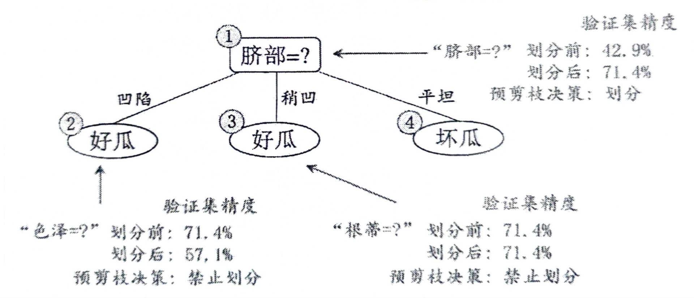
  

   预剪枝决策树
  

> - 在用属性“脐部”划分之后，上图的结点②、③、④分别包含编号为{1,2,3,14}、{6,7,15,17}、{10,16}的训练样例，因此这3个结点分别被标记为叶结点“好瓜”、“好瓜”、“坏瓜”，此时，验证集中编号为{4,5,8,11,12}的样例被分类正确，验证集精度为号 $\frac{5}{7}×100$ %=71.4%>42.9% .于是，用“脐部”进行划分得以确定.

> - 然后，决策树算法应该对结点②进行划分，基于信息增益准则将挑选出划分属性“色泽”.然而，在使用“色泽”划分后，编号为{5}的验证集样本分类结果会由正确转为错误，使得验证集精度下降为57.1%.于是，预剪枝策略将禁止结点②被划分.
> - 对结点③，最优划分属性为“根蒂”，划分后验证集精度仍为71.4%.这个划分不能提升验证集精度，于是，预剪枝策略禁止结点③被划分.
> - 对结点④，其所含训练样例已属于同一类，不再进行划分.
> - 于是，基于预剪枝策略从上表数据所生成的决策树如上图所示，其验证集精度为71.4%.这是一棵仅有一层划分的决策树，亦称“决策树桩”(decisio stump).

- [x] 对比剪枝前后的决策树可看出，预剪枝使得决策树的很多分支都没有“展开”。
  > - 优点：这不仅降低了过拟合的风险，还显著减少了决策树的训练时间开销和测试时间开销.但另一方面，有些分支的当前划分虽不能提升泛化性能、甚至可能导致泛化性能暂时下降，但在其基础上进行的后续划分却有可能导致性能显著提高；
  > - 缺点：预剪枝基于“贪心”本质禁止这些分支展开，给预剪枝决策树带来了 `欠拟合` 的风险.

##### 后剪枝(post-pruning)

- [x] 后剪枝先从训练集生成一棵 `完整决策树` ，例如基于上表数据得到如上图未剪枝的决策树.易知，该决策树的验证集精度为42.9%.(只有3个正确)
  > - 后剪枝首先考察原图中的结点⑥.若将其领衔的分支剪除，则相当于把⑥替换为叶结点.替换后的叶结点包含编号为{7,15}的训练样本，于是，该叶结点的类别标记为“好瓜”，此时决策树的验证集精度提高至57.1%.于是后剪枝策略决定剪枝，如下图所示.
  > - 然后考察结点⑤，若将其领衔的子树替换为叶结点，则替换后的叶结点包含编号为{6,7，15}的训练样例，叶结点类别标记为“好瓜”，此时决策树验证集精度仍为57.1%.于是，可以不进行剪枝.
  > - 对结点②，若将其领衔的子树替换为叶结点，则替换后的叶结点包含编号为{1,2,3,14}的训练样例，叶结点标记为“好瓜”.此时决策树的验证集精度提高至71.4%.于是，后剪枝策略决定剪枝.
  > - 对结点③和①，若将其领衔的子树替换为叶结点，则所得决策树的验证集精度分别为71.4%与42.9%，均未得到提高.于是它们被保留.
  > - 最终，基于后剪枝策略从上表数据所生成的决策树如下图所示，其验证集精度为71.4%.

- [x] 对比剪枝前后和预剪枝和后剪枝的决策树可看出，后剪枝决策树通常比预剪枝决策树保留了更多的分支，一般情形下，后剪枝决策树的 `欠拟合风险` 很小，泛化性能往往优于预剪枝决策树，但后剪枝过程是在生成完全决策树之后进行的，并且要 `自底向上` 地对树中的所有非叶结点进行逐一考察，因此其训练时间开销比未剪枝决策树和预剪枝决策树都要大得多.
  > - 优点：能够显著改善过拟合问题,提高泛化性能和对噪声的鲁棒性
  > - 缺点：需要自底向上地对所有非叶结点逐一考察，开销较大

  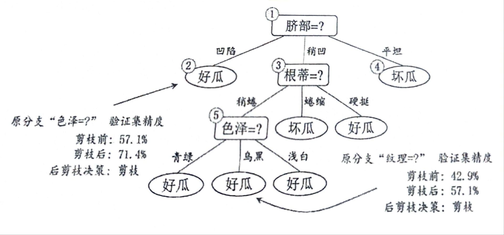
  

   后剪枝决策树
  

## 线性分类器

### 贝叶斯分类器

#### 一个例子

- [x] 依赖先验的决策
  > - 已知有20个西瓜，其中好瓜8个，坏瓜12个
  > - 对于一个新西瓜，如何判断其好坏？

<table>
  <tr>
    <th>好瓜</th>
    <th>坏瓜</th>
  </tr>
  <tr>
    <td>8</td>
    <td>12</td>
  </tr>
</table>

- [x] 增加可观测信息
  > - 若增加可观测信息：西瓜的触感(硬滑、软粘)。
  > - 已知该新西瓜的触感为硬滑，判断西瓜的好坏？

<table>
  <tr>
    <td></td>
    <td>好瓜</td>
    <td>坏瓜</td>
  </tr>
  <tr>
    <td>硬滑</td>
    <td>6</td>
    <td>3</td>
  </tr>
  <tr>
    <td>软黏</td>
    <td>2</td>
    <td>9</td>
  </tr>
  <tr>
    <td>总计</td>
    <td>8</td>
    <td>12</td>
  </tr>
</table>

$$P(A=硬滑)=\frac{6+3}{20}=0.45,P(A=硬滑|Y=好瓜)=\frac{6}{8}=0.75$$

$$P(Y=好瓜|A= 硬滑)= \frac{P(A=硬滑|Y=好瓜)P(Y=好瓜)}{P(A=硬滑)}= \frac{0.75×0.4}{0.45} = 0.667$$

$$P(Y=坏瓜|A=硬滑)=0.333$$

- [x] 增加了可观测信息后，判断新西瓜为好瓜的概率从0.4上升至0.667,为坏瓜的概率从0.6下降至0.333

$$P(Y=好瓜|A=硬滑)>P(Y=坏瓜|A=硬滑)，因此该西瓜为好瓜$$

#### 贝叶斯公式和贝叶斯决策论

- [x] 贝叶斯公式
$$P(Y|A)=\frac{P(A,Y)}{P(A)}=\frac{P(A|Y)P(Y)}{P(A)} \rightarrow P(类别|特征)=\frac{P(特征|类别)P(类别)}{P(特征)}$$

> - $P(Y|A)$ 为后验概率， $P(Y)$ 为先验概率

> - 先验概率 $P(Y)$ ：分析以往经验得到的不同类别的概率

$$P(Y=c_x)，C_x表示不同类别，如好瓜/坏瓜$$

>后验概率 $P(Y|A)$ ：基于特征计算样本属于不同类别的概率(也就是在加了限制以后)

$$P(Y=C_x|A=a)，c_x表示不同类别，a表示特征“触感”的不同取值，如硬滑/软粘$$

- [x] 贝叶斯决策论

$$P(Y|A)=\frac{P(A,Y)}{P(A)}=\frac{P(A|Y)P(Y)}{P(A)} \rightarrow P(类别|特征)=\frac{P(特征|类别)P(类别)}{P(特征)}$$

> - 这个位置一定要分清楚什么是 `特征` ，什么是 `分类` ， `分类` 理解为想要机器通过算法后输出后的结果，也就是上面的是否好瓜， `特征` 理解为帮助机器输出结果中添加的筛查条件，也就是上面的硬滑/软粘。

$$↓ \text{在已知西瓜触感为硬滑的条件下，选择后验概率最大的类别作为预测结果}$$

$$贝叶斯最优分类器:f(a)=\underset{\substack{c_k \in Y}}{\arg\min} P(c_k|a),Y=\lbrace c_1,c_2,\dots ,c_K \rbrace$$

- [x] 假设选择 $0-1$ 损失函数 $L(Y,f(A))$ ，其中 $A$ 为样本的特征， $f(A)$ 为分类函数(也就是在特征 $A$ 情况下，样本 $x$ 转化为分类的集合 $Y$ 中的一个，也就是机器所执行的分类算法), $Y=\lbrace c_1,c_2,\dots ,c_K \rbrace$ 为分类类别
  > - 下面这个函数也就是代表：如果在特征 $A$ 下，如果 $x$ 确实属于分类 $c_i$ ，且 $f(A)=c_i$ 也就是机器判断 $x$ 属于 $c_1$ ，那么 $L(c_i,f(A))=0$ ，也就是正确判断，此时没有损失，误判则为 $1$ ，表示有损失。

$$L(Y,f(A))=\begin{cases}
1 , & Y \not = f(A) \newline
0 , & Y = f(A)
\end{cases}
$$

- [x] 对每个类别 $c_k$ 分别计算损失，得到损失函数期望，也就是有损失时乘上其对应的后验概率。

$$R(f)= E_A \sum\limits_{k=1}^K [L(c_k,f(A))P(c_k|A)]$$

- [x] 为了使期望风险最小化，只需在特征 $A=a$ 下求极小化：

$$f(a) = \underset{\substack{f(a) \in Y}}{\arg\min} \sum\limits_{k=1}^K L(c_k, f(a)) P(c_k|A=a) = \underset{\substack{f(a) \in Y}}{\arg\min} \sum\limits_{k=1}^K P(f(a) \not = c_k|A=a) =  \underset{\substack{f(a) \in Y}}{\arg\min} (1-P(f(a) = c_k|A=a)) = \underset{\substack{f(a) \in Y}}{\arg\max} P(f(a) = c_k|A=a)$$

- [x] 得到后验概率最大化，即贝叶斯最优分类器

$$f(a)= \underset{\substack{c_k \in Y}}{\arg\max} P(c_k|A=a)$$

#### 贝叶斯分类器

- [x] 基于贝叶斯决策的分类器： $$f(a)= \underset{\substack{c_k \in Y}}{\arg\max} P(c_k|A=a)$$

- [x] 变量和参数(这个位置就是强调分类器的输入和输出，输入为 $x$ ，也就是数据集，输出为 $y$ ，也就是属于的分类类别)
  > - 数据集 $D=\lbrace (x_1,y_1),\dots ,(x_N，y_N)\rbrace$
  > - 其中 $x_n \in X$ 为待分类的样本，具有特征 $a_i$ ，由 $d$ 种特征组成 $a_i=(a_{i_1},\dots,a_{i_d})$
  > - $y_n \in Y=\lbrace c_1,c_2,\dots ,c_K \rbrace$ 为类别， $K$ 为类别数

- [x] 核心是估计后验概率

$$P(c_k|a_i)=\frac{P(c_k)P(a_i|c_k)}{P(a_i)}$$

- [x] 如何估计条件概率分布 $P(a_i|c_k)$ ?
  > - 对于 $a_i=(a_{i_1},\dots,a_{i_d})$ ，共有 $d$ 种特征，每种特征 $a_{i_j}$ 的可取值为 $N_j$ 个， $Y$ 可取值有 $K$ 个，那么条件概率分布个数为 $K \prod\limits_{j=1}^d N_j$ ;
  > - 以下面数据集为例，色泽有3种(青绿、乌黑、浅白),根蒂有3种(蜷缩、稍蜷、硬挺)，则特征取值组合有 $3×3=9$ 个，分类类别只有好瓜/坏瓜2种，所以条件概率分布个数为 $9×2=18$ 个。

  <table>
  <thead>
    <tr>
      <th>编号</th>
      <th>色泽</th>
      <th>根蒂</th>
      <th>好瓜</th>
    </tr>
  </thead>
  <tbody>
    <tr>
      <td>1</td>
      <td>青绿</td>
      <td>蜷缩</td>
      <td>是</td>
    </tr>
    <tr>
      <td>2</td>
      <td>乌黑</td>
      <td>蜷缩</td>
      <td>是</td>
    </tr>
    <tr>
      <td>3</td>
      <td>乌黑</td>
      <td>蜷缩</td>
      <td>是</td>
    </tr>
    <tr>
      <td>4</td>
      <td>青绿</td>
      <td>蜷缩</td>
      <td>是</td>
    </tr>
    <tr>
      <td>5</td>
      <td>浅白</td>
      <td>蜷缩</td>
      <td>是</td>
    </tr>
    <tr>
      <td>6</td>
      <td>青绿</td>
      <td>稍蜷</td>
      <td>是</td>
    </tr>
    <tr>
      <td>7</td>
      <td>乌黑</td>
      <td>稍蜷</td>
      <td>是</td>
    </tr>
    <tr>
      <td>8</td>
      <td>乌黑</td>
      <td>稍蟋</td>
      <td>是</td>
    </tr>
    <tr>
      <td>9</td>
      <td>乌黑</td>
      <td>稍蜷</td>
      <td>否</td>
    </tr>
    <tr>
      <td>10</td>
      <td>青绿</td>
      <td>硬挺</td>
      <td>否</td>
    </tr>
    <tr>
      <td>...</td>
      <td>...</td>
      <td>...</td>
      <td>...</td>
    </tr>
    <tr>
      <td>17</td>
      <td>青绿</td>
      <td>蜷缩</td>
      <td>否</td>
    </tr>
  </tbody>
</table>

#### 朴素贝叶斯分类器

- [x] 可以采用“特征条件独立性假设”简化 $P(a_i|c_k)$ 计算
  > - 特征条件独立性假设：假设 $P(a_i|c_k)$ 中 $a_i$ 的各维特征独立(相关系数为0)，否则就要算联合分布，各维特征独立举个例子就是颜色中黑色和触感中硬滑是互不影响的，互相影响就可能是黑色中没有硬滑的等等。
  > - 在该假设下，若样本 $x_i$ 包含 $d$ 个特征 $a_i=(a_{i_1},\dots,a_{i_d})$ ，则

$$P(a_i|c_k)=\prod\limits_{j=1}^d P(a_{i_j}|c_k)$$

> - 由此可将贝叶斯公式改写为 $P(c_k|a_i)=\frac{P(c_k)P(a_i|c_k)}{P(a_i)}=\frac{P(c_k)\prod\limits_{j=1}^d P(a_{i_j}|c_k)}{P(a_i)}$

- [x] 类别先验概率估计

$$P(c_k)=\frac{|D_{c_k}|}{|D|},D_{c_x}表示训练集D中第c_k类样本组成的集合$$

- [x] 类别条件概率估计(离散值和连续值要分开算)

> - 离散特征

$$P(a_{i_j}|c_k)=\frac{|D_{c_k,a_{i_j}}|}{|D_{c_k}|},D_{c_k,a_{i_j}}表示D_{c_k}中在第j个特征上取值为a{i_j}的样本组成的集合$$

> - 连续特征(假设服从正态分布， $\mu_{c_k}$ 为特征 $c_k$ 均值 $\sigma_{c_k}$ 为特征 $c_k$ 密度方差)

$$P(a_{i_j}|c_k)=\frac{1}{\sqrt{2 \pi} \sigma_{c_k,j}}e^{-\frac{(x_{i_j}- \mu_{c_k,j})^2}{2 \sigma_{c_k,j}^2}},由某一概率分布估计类别概率$$

- [x] 决策过程

> - 首先估计类别先验概率

$$P(c_k)=\frac{|D_{c_k}|}{|D|}$$

> - 然后估计类别条件概率

$$P(a_{i}|c_k)=\prod\limits_{j=1}^d P(a_{i_j}|c_k)$$

> - 最后进行贝叶斯决策

$$f(a)= \underset{\substack{c_k \in Y}}{\arg\max} P(c_k)\prod\limits_{j=1}^d P(a_{i_j}|c_k)$$

> > - 注：这里没有除以 $P(a_i)$ 是因为对于每个类别 $P(a_i)$ 都相等，只与该特征在所有瓜中的占比有关，与类别无关，因为不是条件概率。

##### 示例

  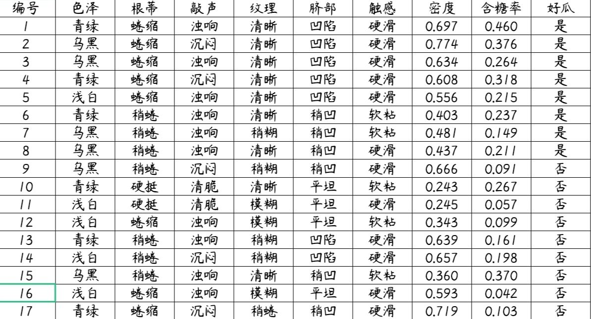
  

   贝叶斯分类器训练示例
  

- [x] 样本特征
  > - 离散特征:
  > > - 色泽、根蒂、敲声、纹理、脐部、触感
  > - 连续特征：密度、含糖率
  > - 类别:好瓜（8个）坏瓜（9个）

- [x] 类别先验概率估计

$$P(c_k)=\frac{|D_{c_k}|}{|D|}=\begin{cases}
P(好瓜)=\frac{|D_{好瓜}|}{|D|}=\frac{8}{17} \approx 0.471 \newline
P(坏瓜)=\frac{|D_{坏瓜}|}{|D|}=\frac{9}{17} \approx 0.529
\end{cases}$$

  <table>
  <thead>
    <tr>
      <th>编号</th>
      <th>色泽</th>
      <th>根蒂</th>
      <th>敲声</th>
      <th>纹理</th>
      <th>脐部</th>
      <th>触感</th>
      <th>密度</th>
      <th>含糖量</th>
      <th>好瓜</th>
    </tr>
  </thead>
  <tbody>
    <tr>
      <td>西瓜1</td>
      <td>青绿</td>
      <td>蜷缩</td>
      <td>浊响</td>
      <td>清晰</td>
      <td>凹陷</td>
      <td>硬滑</td>
      <td>0.697</td>
      <td>0.460</td>
      <td>？</td>
    </tr>
  </tbody>
  </table>

    
- [x] 类别条件概率估计————离散特征
  > - 以特征“色泽”为例，为获得西瓜1的类别条件概率，首先从训练集中获取如下统计数据

> - 8个好瓜

  <table>
  <thead>
    <tr>
      <th>色泽</th>
      <th>个数</th>
    </tr>
  </thead>
  <tbody>
    <tr>
      <td>青绿|好瓜</td>
      <td>3</td>
    </tr>
    <tr>
      <td>乌黑|好瓜</td>
      <td>4</td>
    </tr>
    <tr>
      <td>浅白|好瓜</td>
      <td>1</td>
    </tr>
  </tbody>
  </table>

> - 9个坏瓜

  <table>
  <thead>
    <tr>
      <th>色泽</th>
      <th>个数</th>
    </tr>
  </thead>
  <tbody>
    <tr>
      <td>青绿|坏瓜</td>
      <td>3</td>
    </tr>
    <tr>
      <td>乌黑|坏瓜</td>
      <td>2</td>
    </tr>
    <tr>
      <td>浅白|坏瓜</td>
      <td>4</td>
    </tr>
  </tbody>
  </table>

> - 计算色泽特征的类别条件概率(其实只用算出西瓜1色泽特征值对应的类别条件概率，也就是只用算 $P_{青绿|好瓜}$ 和 $P_{青绿|坏瓜}$ )

$$P_{青绿|好瓜}=P(色泽=青绿|好瓜)=\frac{3}{8}=0.375,P_{乌黑|好瓜}=\frac{4}{8}=0.500,P_{浅白|好瓜}=\frac{1}{8}=0.125$$

$$P_{青绿|坏瓜}=P(色泽=青绿|好瓜)=\frac{3}{9}=0.333,P_{乌黑|坏瓜}=\frac{2}{9}=0.222,P_{浅白|坏瓜}=\frac{4}{9}=0.445$$

> - 同理，可以计算其余离散特征的类别条件的概率(也只用算出跟西瓜1特征值对应的类别条件概率)。

- [x] 与离散特征类似，从训练数据中统计出连续特征的均值和方差后，根据待分类样本的特征计算类别条件概率

  <table>
  <thead>
    <tr>
      <th></th>
      <th>密度均值</th>
      <th>密度方差</th>
    </tr>
  </thead>
  <tbody>
    <tr>
      <td>好瓜</td>
      <td>0.574</td>
      <td>0.129²</td>
    </tr>
    <tr>
      <td>坏瓜</td>
      <td>0.496</td>
      <td>0.195²</td>
    </tr>
  </tbody>
  </table>

> - 注：此时就要把西瓜1的密度带入进行算类别条件概率，即密度为0.694

$$P_{密度:0.694|好瓜}=P(密度:0.694|好瓜)=\frac{1}{\sqrt{2 \pi} ·0.129}e^{-\frac{(0.697-0.574)^2}{2 · 0.129^2}} \approx 1.959$$

$$P_{密度:0.694|坏瓜}=P(密度:0.694|坏瓜)=\frac{1}{\sqrt{2 \pi} ·0.195}e^{-\frac{(0.697-0.496)^2}{2 · 0.195^2}} \approx 1.203$$

- [x] 贝叶斯决策

$$f(a)= \underset{\substack{c_k \in Y}}{\arg\max} P(c_k)\prod\limits_{j=1}^d P(a_{i_j}|c_k)$$

$$P(好瓜)×(P_{青绿|好瓜}×P_{蜷缩|好瓜}× \dots ×P_{密度:0.694|好瓜} × P_{含糖量:0.460|好瓜}) \approx 0.038$$

$$P(坏瓜)×(P_{青绿|坏瓜}×P_{蜷缩|坏瓜}× \dots ×P_{密度:0.694|坏瓜} × P_{含糖量:0.460|坏瓜}) \approx 6.80×10^{-5}$$

> - 由于 $0.038 > 6.80×10^{-5}$ 。因此，朴素贝叶斯分类器将西瓜1判定为“好瓜”。

##### 朴素贝叶斯分类器中的拉普拉斯平滑调整

- [x] 拉普拉斯平滑
  > - 若训练集样本不充分，可能有些类别或特征并未出现，从而导致该特征在某些类别下的条件概率为0,即

$$|D_{c_k}|=0或|D_{c_k,a_{i_j}}|=0时，将导致P(c_k)=\frac{|D_{c_k}|}{|D|}=0或P(a_{i_j}|c_k)=\frac{|D_{c_k,a_{i_j}}|}{|D_{c_k}|}=0$$

- [x] **为避免这种情况出现，需要进行拉普拉斯平滑** ~~(说白了就是手动对所有类别或特征虚拟一个训练样本，避免有类别或特征样本数为0)~~

$$\hat{P}(c) =\frac{|D_{c_k}|+1}{|D|+K},K为类别数$$

> - 分母 $+K$ 是因为对于每个类别都 $+1$ 了，所以进行平滑。

$$\hat{P}(a_{i_j}|c_k)=\frac{|D_{c_k,a_{i_j}}|+1}{|D_{c_k}|+N_{j}},N_{j}为a_{i_j}的可能取值个数$$

> - 同理，由于该特征中每个取值情况下的类别 $c_k$ 都 $+1$ 了，所以分母中该类别要加上该特征的可能取值数

###### 示例

  <table>
  <thead>
    <tr>
      <th>编号</th>
      <th>色泽</th>
      <th>根蒂</th>
      <th>敲声</th>
      <th>纹理</th>
      <th>脐部</th>
      <th>触感</th>
      <th>密度</th>
      <th>含糖量</th>
      <th>好瓜</th>
    </tr>
  </thead>
  <tbody>
    <tr>
      <td>西瓜2</td>
      <td>青绿</td>
      <td>蜷缩</td>
      <td>清脆</td>
      <td>清晰</td>
      <td>凹陷</td>
      <td>硬滑</td>
      <td>0.697</td>
      <td>0.460</td>
      <td>？</td>
    </tr>
  </tbody>
  </table>

> - 在使用上面训练数据训练朴素贝叶斯分类器时，对“敲声=清脆”的西瓜2，有

$$P_{清脆|好瓜}=P(敲声=清脆|好瓜)=\frac{0}{8}=0$$

> - 由于在做决策时概率相乘，有一个值为0。因此，无论西瓜2的其他特征是什么，分类的结果都将是“坏瓜”。

- [x] 进行拉普拉斯平滑

> - 先验概率， $\hat{P}(c) =\frac{|D_{c_k}|+1}{|D|+K},K为类别数$

$$\hat{P}(好瓜)=\frac{8+1}{17+2} \approx 0.474,\hat{P}(坏瓜)=\frac{9+1}{17+2} \approx 0.526$$

> - 条件概率， $\hat{P}(a_{i_j}|c_k)=\frac{|D_{c_k,a_{i_j}}|+1}{|D_{c_k}|+N_{j}},N_{j}为a_{i_j}的可能取值个数$

$$\hat{P}_{清脆|好瓜}=\hat{P}(敲声=清脆|好瓜)=\frac{0+1}{8+3} \approx 0.091$$

##### 朴素贝叶斯分类器的优缺点

 - [x] 优点
  > - 算法逻辑简单，易于实现
  > - 分类过程中时空开销小

- [x] 缺点
  > - 朴素贝叶斯模型假设特征之间相互独立，这个假设在实际中往往不成立。在特征个数比较多或者特征之间相关性较大时，分类效果比较差。
  > - 需要知道先验概率，且先验概率很多时候取决于假设，假设的模型可以有出入。

### 感知机

> - 深度学习基于感知机

#### 基本术语

- [x] 特征向量与标签
  > - 若样本 $x_i$ 包含 $d$ 个属性(特征)， $x_i$ 的特征向量表示为： $x_i=(x_{i_1},\dots ,x_{i_j},\dots ,x_{i_d})^T$
  > - 样本 $x_i$ 的分类标签记为 $y_i$ ， $y_ \in \lbrace +1,-1\rbrace$ ，比如 $+1$ 对应好瓜， $-1$ 对应坏瓜。
  > - 数据集 $T=\lbrace (x_1,y_1),\dots ,(x_i,y_i),\dots ,(x_n,y_n)\rbrace$ ， $n$ 为样本个数。

- [x] 特征空间与输出空间
  > - 由样本特征向量 $x_i=(x_{i_1},\dots ,x_{i_j},\dots ,x_{i_d})^T$ 张成的空间称为“特征空间”或“输入空间”。
  > - 所有 $y_i$ 的集合称为“输出空间”， $\lbrace +1,-1\rbrace$ 。

> 二维特征空间示例

  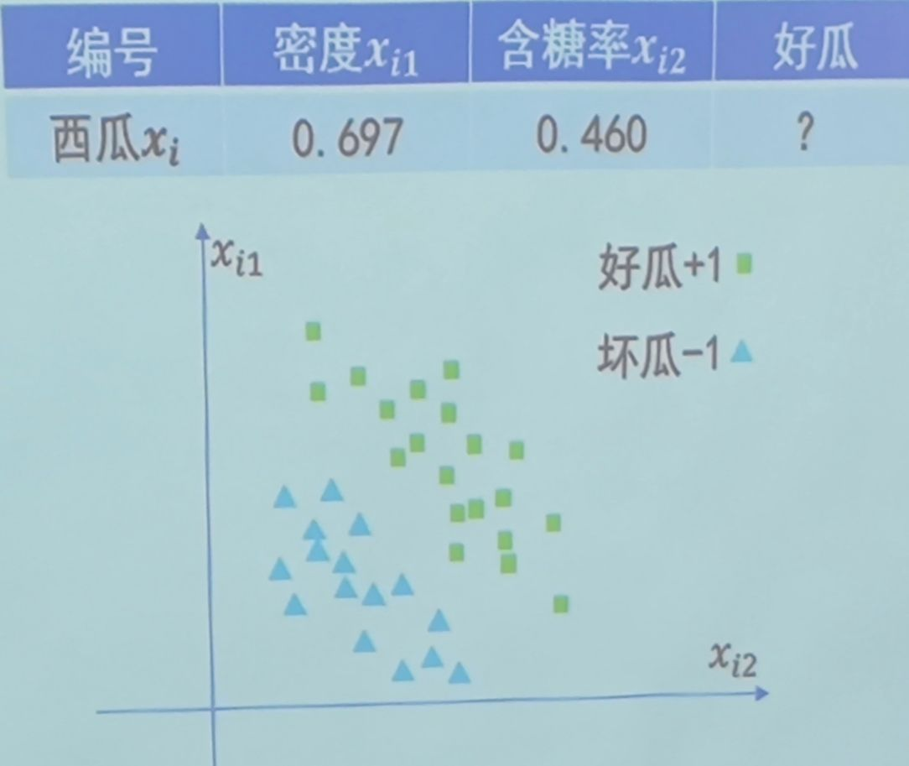
  

   二维特征空间示例
  

#### 感知机及其原理

- [x] **感知机：在特征空间寻找超平面进行线性划分**
  > - 感知机是一种线性分类模型，通过寻找超平面对数据进行线性划分
  > - 在如图所示二维情况下，感知机模型可以找到能够正确划分数据类别 $\lbrace +1,-1\rbrace$ 的直线
  > - 高维情况下，感知机将尝试找到合适的超平面，将数据正确划分

$$超平面方程：\omega ^Tx+b=0$$

> - 此处 $\omega$ 和 $x$ 均为向量

  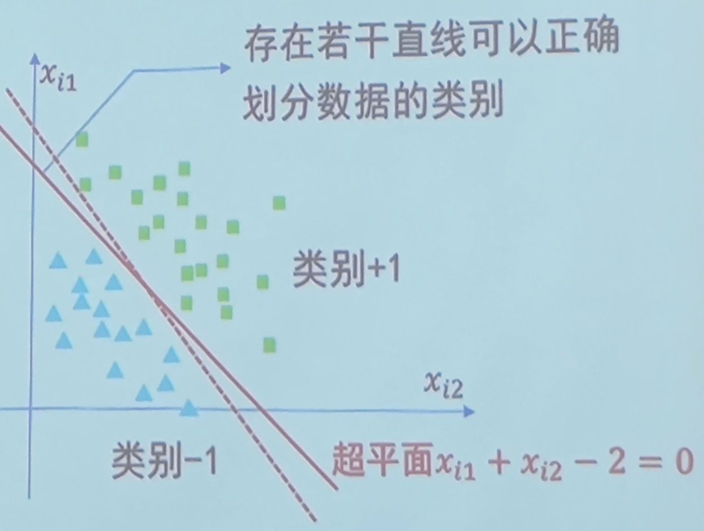
  

   感知机二维情况
  

#### 感知机模型

- [x] 感知机的处理流程
  > - 输入是样本的特征向量 $x_i=(x_{i_1},\dots ,x_{i_j},\dots ,x_{i_d})^T$
  > - 感知机先对样本的每个属性进行线性组合： $\sum\limits_{j=1}^d \omega _j x _{i_j}+b$
  > - 再将线性组合得到的值，用符号函数 $sign(·)$ 进行分类映射，输出分类结果 $\hat{y_i}$ 。即

$$\hat{y_i}=sign(\sum\limits_{j=1}^d \omega _j x _{i_j}+b)$$

  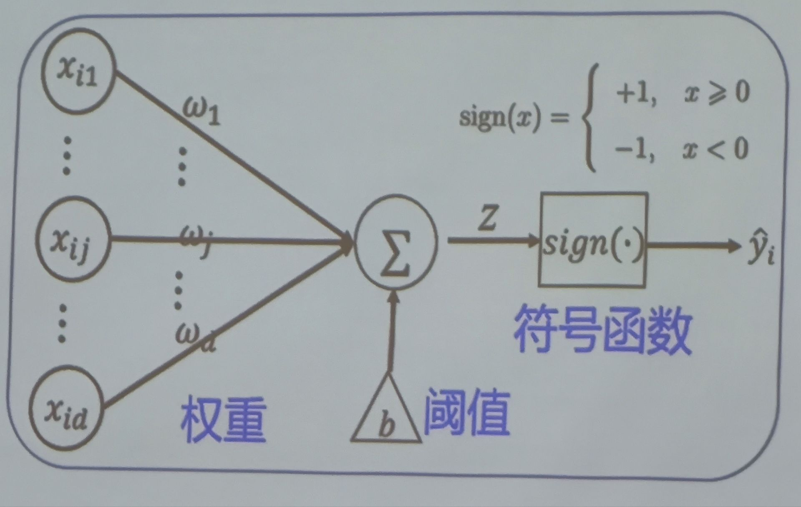
  

   感知机的处理流程
  

- [x]  `权重` ，也就是对于样本的特征向量 $x_i$ 的每个分量 $x_{i_j}$ 的加权，对于不同样本的相同方向 $j$ 上的分量的权重 $\omega _j$ 是一致的。

- [x]  `阈值` ，也就是上述输出结果中的 $b$ 。
  > -  `权重` 确定了分类超平面的 `方向` , `阈值` 确定了分类超平面的 `位置` 。
  > - 特征空间为二维时，`权重`与 `阈值` 分别也就是类似 `频率` 和 `截距` 。比如超平面为 $x_{i_1}+x_{i_2}-3=0$ ，那么 <kbd>-3</kbd> 为阈值， <kbd>1</kbd>为 $x_{i_1}$ 和 $x_{i_2}$ 的权重

- [x]  `符号函数sign()`
  > - 权重与阈值确定了超平面，符号函数则完成分类的功能：将输入属性的线性组合 $z$ 映射到输出空间 $\lbrace +1,-1\rbrace$ 。

> - 观察一下符号函数

$$sign(x)=\begin{cases}
+1 , x \geq 0 \newline
-1 , x \leq 0
\end{cases}$$

> - 那么对比输出 $\hat{y_i}=sign(\sum\limits_{j=1}^d \omega _j x _{i_j}+b)$ ，可知符号函数的作用就是首先判断出样本在超平面的哪一边(一个平面显然是可以将空间分成两个部分的，所以 $超平面 \leq 0$ 时，就在超平面上方部分包括超平面，归入类别 $+1$ ，反之则在超平面下方，归入类别 $-1$ )

#### 感知机如何从数据中学习？

- [x] 感知机的目标是寻找一个分类超平面,已知权重与阈值确定了超平面，因此需要学习的参数包括：权重 $\omega$ 和阈值 $b$ 。

- [x] 首先随机初始化参数权重 $\omega$ 和阈值 $b$。如图参数随机初始化得到的分类超平面大概率不能正确分类，需要学习。

  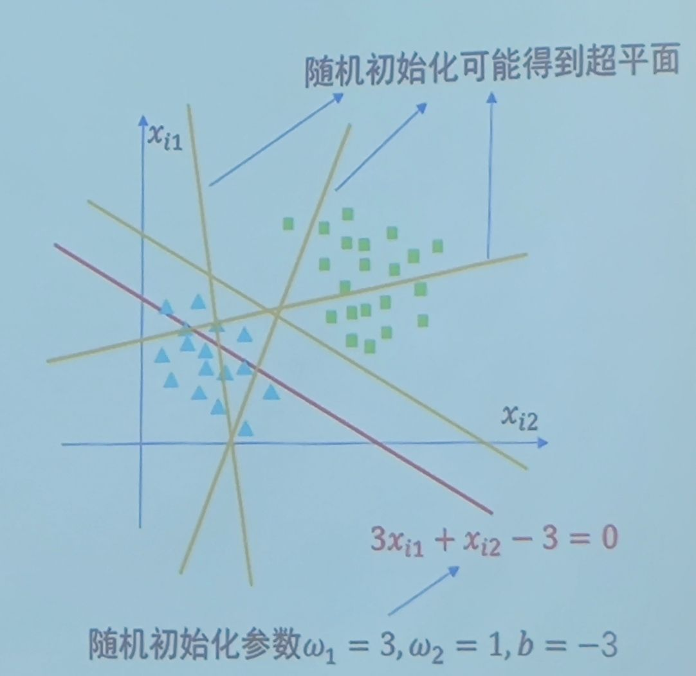
  

   参数随机初始化得到的分类超平面
  

- [x] 然后用 `误分类驱动` 的 `梯度下降学习` 算法（后面详讲）进行参数学习。

- [x] 误分类数据
  > - 感知机的数学模型:

$$\hat{y_i}=sign(\sum\limits_{j=1}^d w _j x _{i_j}+b)=sign(\omega ^Tx_i+b),\omega = (w_1,w_2,\dots ,w_d)^T$$

> - 假设数据 $x_i$ 被误分类，则误分类数据 $x_i$ 应满足： $y_i ×(\omega ^Tx_i+b)<0$ ，即 $y_i≠ \hat{y_i}$ , $y_i$ 与 $\omega ^Tx_i+b$ 的符号相反。

  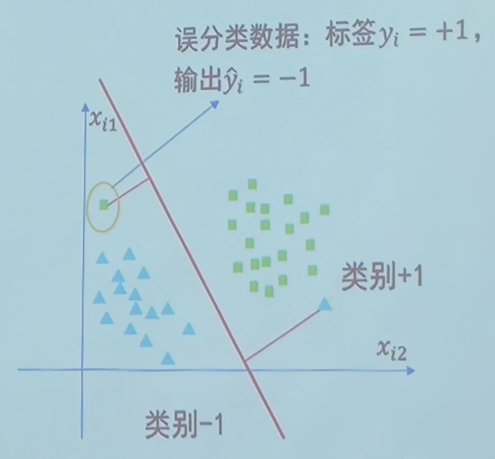
  

   误分类数据
  

- [x] 损失函数
  > - 定义损失函数：

$$L(\omega,b)=-\sum\limits_{x_i \in M} y_i ×(\omega ^Tx_i+b),M是误分类数据的集合$$

> - 损失函数的意义：由于误分类数据有 $-y_i ×(\omega ^Tx_i+b)>0$ ，所以损失函数总是大于 $0$ 的。学习的目标是最小化损失函数至 $0$ ，此时 $M$ 为空,意味着没有误分类数据，所有样本均正确分类。

- [x] 优化目标

$$\min\limits_{\omega,b} L(\omega,b)=\min\limits_{\omega,b} -\sum\limits_{x_i \in M} y_i ×(\omega ^Tx_i+b)$$

> - 令 $\hat{\omega}=(\omega^T,b)^T=(w_1,w_2,\dots ,w_d,b)^T，\hat{x_i}=(x_i^T,1)^T=(x_{i_1},\dots ,x_{i_j},\dots ,x_{i_d},1)^T$ ，则优化目标可以进一步写成：

$$\min\limits_{\hat{\omega}} L(\hat{\omega})=\min\limits_{\hat{\omega}} -\sum\limits_{x_i \in M} y_i ×(\hat{\omega}^T \hat{x_i})$$

> - 这里采用 `梯度下降法` 进行优化。

##### 梯度下降法
  > - 假设有一个函数 $f(x)$ ，导数 $f'(x)$ 代表 $f(x)$ 在点 $x$ 处的斜率。
  > - 根据泰勒公式有： $f(x+ \epsilon )≈f(x)+\epsilon f(x)$ ， $\epsilon$ 称为 `步长`
  > - 所以可以将 $x$ 往导数的反方向移动一小步 $\epsilon$ 来减小 $f(x)$ ，这种技术称为 `梯度下降` 。

  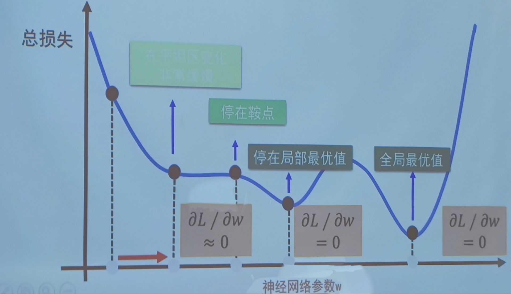

> - 当输入 $x$ 是向量时， $f(x)$ 的梯度记为 $\nabla _x f(x)=(\frac{\partial f}{\partial x_1},\frac{\partial f}{\partial x_2},\dots ,\frac{\partial f}{\partial x_d})^T$

> - 由梯度的数学定义可知：梯度的反方向是使 $f$ 下降最快的方向，所以在梯度下降法中，一般沿着梯度的反方向更新自变量：

$$x'\leftarrow x-\rho \nabla_x f(x)$$

$$\rho \in (0,1)为学习率，是一个确定步长大小的标量$$

> - 优化目标

$$\min\limits_{\hat{\omega}} L(\hat{\omega})=\min\limits_{\hat{\omega}} -\sum\limits_{x_i \in M} y_i ×(\hat{\omega}^T \hat{x_i})$$

> - 使用梯度下降法进行优化，求梯度：

$$\nabla_{\hat{\omega}}L(\hat{\omega})=-\sum\limits_{x_i \in M} y_i \hat{x_i}$$

> - 遍历选取误分类数据： $\hat{x_i} \in M$ ，沿着梯度反方向更新参数：

$$\hat{\omega} \leftarrow \hat{\omega}+\rho y_i \hat{x_i}$$

> - 通过迭代误分类数据，可以期待损失函数不断减小，直到为0

- [x] 感知机学习规则
  > - 梯度下降法得到的参数更新规则：

$$\hat{\omega} = \hat{\omega}+\rho y_i \hat{x_i},for \hat{x_i} \in M$$

> - 令 $\hat{\omega}=(\omega^T,b)^T=(w_1,w_2,\dots ,w_d,b)^T，\hat{x_i}=(x_i^T,1)^T=(x_{i_1},\dots ,x_{i_j},\dots ,x_{i_d},1)^T$ ，则有

$$w_j=w_j+\rho y_i x_{x_j},for \ \hat{x_i} \in M$$

> - $y_i ,\hat{y_i} \in \lbrace +1,-1\rbrace$ ，推出一般参考书常见的感知机学习规则

$$w_j \leftarrow w_j + \Delta w_j$$

$$\Delta w_j = \rho (y_i - \hat{y_i})x_{i_j}$$

> - 这里的 $x_{i_j}$ 不要求是误分类数据的属性，因为正确分类的数据有 $y_i=\hat{y_i},\Delta w_j=0$ ，参数不更新

- [x] 感知机学习算法

> - 输入：数据集 $T=\lbrace (x_1,y_1),\dots ,(x_i,y_i),\dots ,(x_n,y_n)\rbrace$ ， $n$ 为样本个数，学习率 $\rho$ 。
> - 输出： $w_j,j=1,2,\dots ,d+1;b=w_{d+1}$ ，感知机模型 $\hat{y_i}=sign(\sum\limits_{j=1}^d w_j x _{i_j}+b)$ 。
> - 损失函数: $L(\hat{\omega})= -\sum\limits_{x_i \in M} y_i ×(\hat{\omega}^T \hat{x_i})$
> - (1) 随机初始化 $w_j$ ;
> - (2) 在训练集中选取数据 $(x_i,y_i)$ ;
> - (3)

$$w_j \leftarrow w_j + \Delta w_j$$

$$\Delta w_j = \rho (y_i - \hat{y_i})x_{i_j}$$

> - (4) 转至(2)，直到所有数据被正确分类

#### 感知机的参数学习示例

$$w_j \leftarrow w_j + \Delta w_j$$

$$\Delta w_j = \rho (y_i - \hat{y_i})x_{i_j}$$

> - 训练数据如下所示

  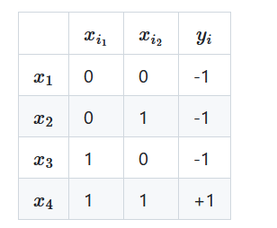
  

   感知机的训练集
  

- [x] ①感知机权重初始化：
  > - 随机初始化参数 $w_1=2,w_2=\frac{2}{3},b=-1,\hat{y_i}=sign(2x _{i_1}+ \frac{2}{3} x _{i_2}-1)$

  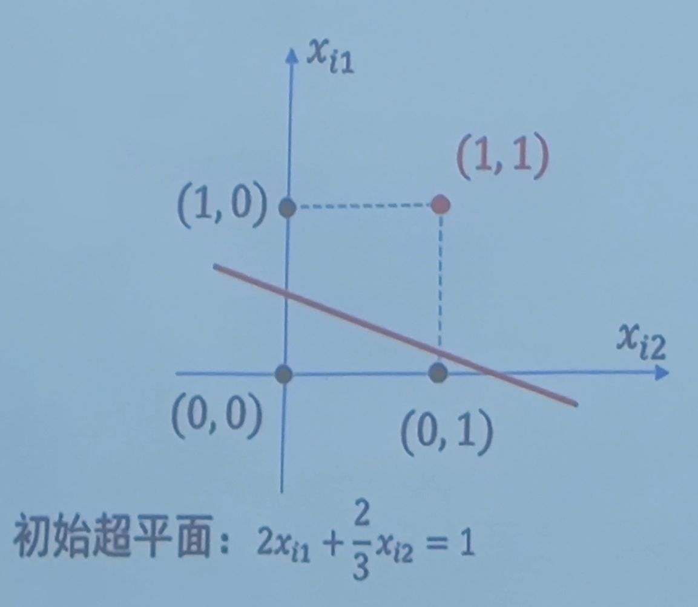
  

   初始超平面
  

- [x] ②输入 $(0,0)$ ，输出 $-1$ ;输入 $(0,1)$ ，输出 $-1$ ;输入 $(1,1)$ ，输出 $+1$ ;
  > - 输出正确，权重不发生改变。

- [x] 输入 $(1,0)$ ，输出 $\hat{y_i}=+1,y_i=-1$ ，输出错误，更新权重:
  > - 学习率 $\rho$ 取 $\frac{1}{3}$

$$w_1 \leftarrow w_1 + \Delta w_1,w_2 \leftarrow w_2 + \Delta w_2$$

$$\Delta w_1 =\frac{1}{3} (-1 - 1)1,\Delta w_2 =\frac{1}{3} (-1 - 1)0$$

$$w_1 = 2 - \frac{2}{3} =\frac{4}{3},w_1 =\frac{2}{3} +0=\frac{2}{3}$$

$$\hat{y_i}=sign(\frac{4}{3} x _{i_1}+ \frac{2}{3} x _{i_2}-1)$$

  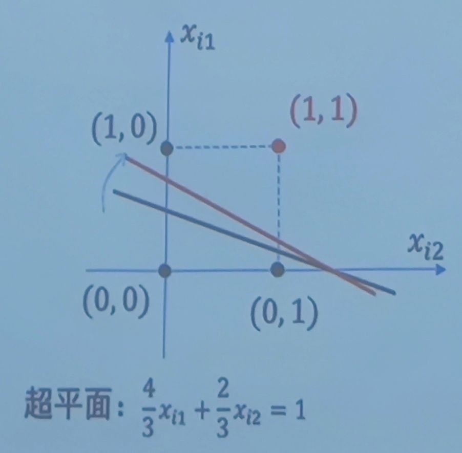
  

   第二个超平面
  

- [x] ④输入 $(0,0)$ ，输出 $-1$ ;输入 $(0,1)$ ，输出 $-1$ ;输入 $(1,1)$ ，输出 $+1$ ;
  > - 输出正确，权重不发生改变。

- [x] ⑤输入 $(1,0)$ ，输出 $\hat{y_i}=+1,y_i=-1$ ，输出错误，更新权重:

$$w_1 \leftarrow w_1 + \Delta w_1,w_2 \leftarrow w_2 + \Delta w_2$$

$$\Delta w_1 =\frac{1}{3} (-1 - 1)1,\Delta w_2 =\frac{1}{3} (-1 - 1)0$$

$$w_1 = \frac{4}{3} - \frac{2}{3} =\frac{2}{3},w_1 =\frac{2}{3} +0=\frac{2}{3}$$

$$\hat{y_i}=sign(\frac{2}{3} x _{i_1}+ \frac{2}{3} x _{i_2}-1)$$

  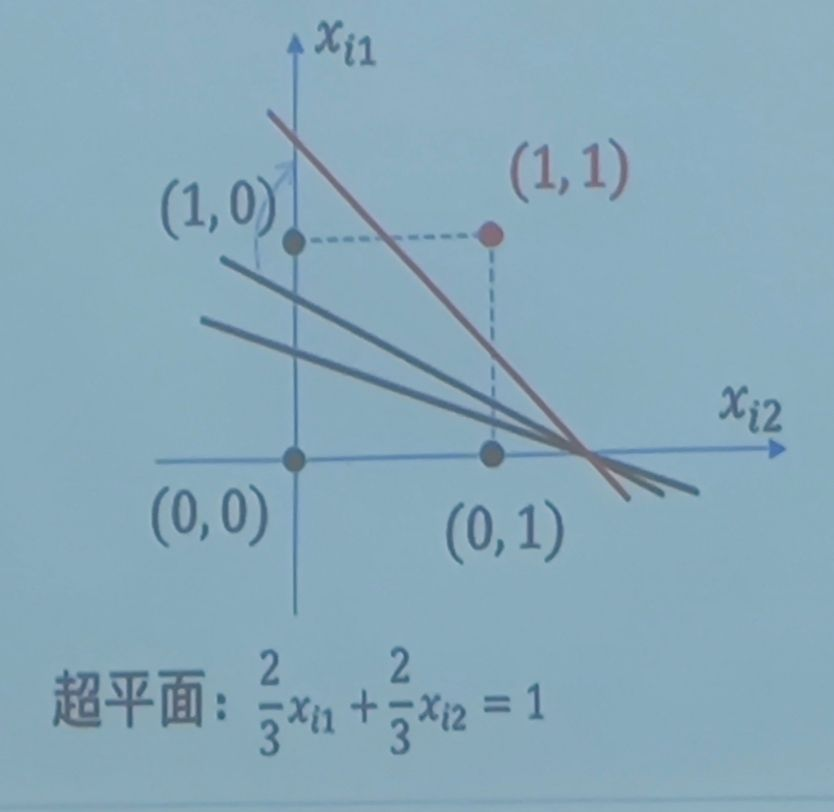
  

   第三个超平面
  

- [x] ⑥超平面将所有样本正确分类，学习收敛，训练结束。

#### 感知机的局限性

> - 单层感知机只能对线性可分的数据进行分类。

> - 如果数据线性不可分，感知机的学习过程不会收敛。

> 下图中的数据图，上方的就是一个线性可分的数据集，而下方的则是不可分的。 ~~(这个可以用于理解感知机也就是利用一个线或者一个面对这个数据集进行切分)~~

  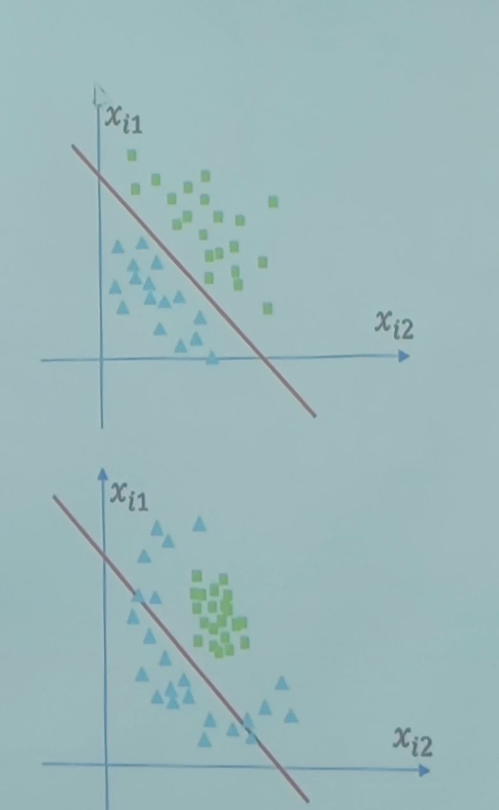
  

   线性可分和不可分
  

#### 神经网络

##### 多层感知机

- [x] 单层的感知机只能解决线性可分的问题，对于线性不可分的分类问题可以使用多层感知机（多个感知机的组合，在多层感知机中，每个单元称为神经元）。
  > - 众多简单单元的组合，最终拟合复杂的函数。类似的模型有很多，比如生物神经系统、傅里叶级数、泰勒展开等等。

> - 注：单纯的累加单层感知机是得不到多层感知机的，因为线性累加得到的还是线性的，所以要非线性化。

- [x] 两层感知机可以解决“异或”问题

  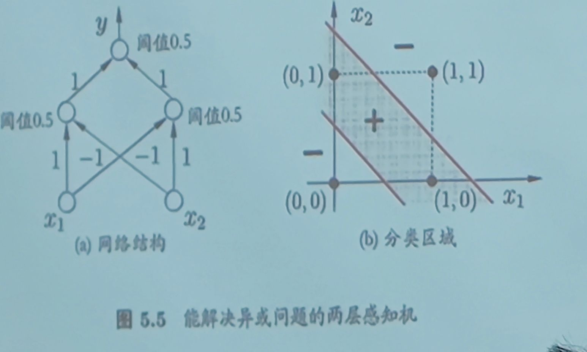

- [x] 人工神经网络
  > - 常见的神经网络是下面这种层级结构，每层神经元与下一层神经元全连接，神经元之间同层互联或跨层互联。

  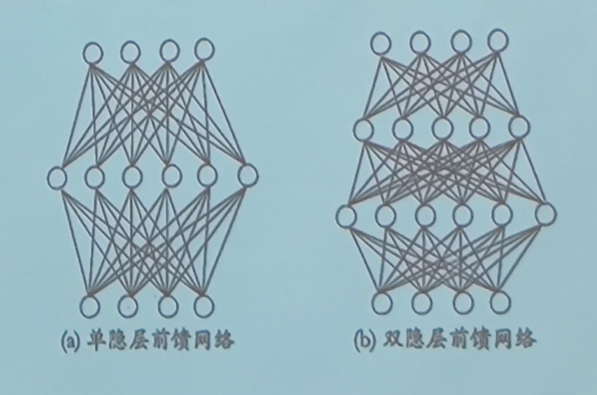
  

   人工神经网络
  

##### 神经网络与深度学习

> - 单层神经网络无法解决非线性问题。

> - 虽然 `McCulloch` 和 `Pitts` 1943年在论文中证明了大量神经元连接成任意深度网络，能够获得任何所期望的函数关系。

> - 但是对于特定的网络结构，什么函数可以拟合，什么函数不能拟合还是难以刻画的。

> - 且此时多层网络的训练算法还看不到希望，神经网络的研究进入了“冰河期”。

> - `Hornik` 1989证明，实际上单一的足够大的隐层能够以任意精度表示输入的任何连续函数，称为万能近似定理。

> - 万能近似定理表明：无论我们想要什么样的函数，一个大的单隐层网络所能拟合的函数集合都能将其包含在内。

> - 然而要满足万能近似定理，网络的隐藏单元数量往往是指数级的。这个结论最初是关于逻辑门电路网的，后来被扩展到更一般的连续值激活网络。

> - 隐层大的不可实现，并且不能保证训练算法能够学到我们想要的函数。

> - 此外，复杂的模型往往需要大量的训练数据和计算资源，并且网络结构的设计依赖经验，充斥大量的“窍门”，缺乏理论指导。

> - 这些缺点导致神经网络研究再次进入低谷，NIPS会议甚至多年不接受以神经网络为主题的论文。

> - 在2010年前后，随着计算能力的迅猛提升，神经网络以“深度学习”（深度学习的章节详细介绍）的名义重新崛起。因此一般我们认为神经网络和深度学习是等价的。

## 广义线性分类器

### 支持向量机

#### 概述

##### 基础概念

- [x] 支持向量机（Support Vector Machine,SVM)
  > - 在特征空间上的间隔最大的线性分类器，即支持向量机的学习策略为 `间隔最大化`

  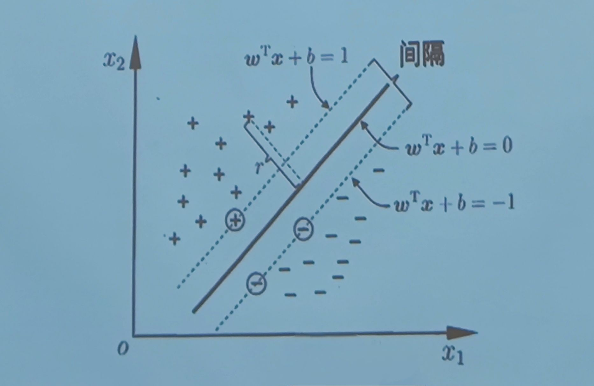
  

   支持向量机
  

- [x] 分类
  > - 线性可分支持向量机：针对完全线性可分问题，优化目标实现“硬间隔”最大化
  > - 线性支持向量机：针对非完全线性可分问题，优化目标实现“软间隔”最大化

  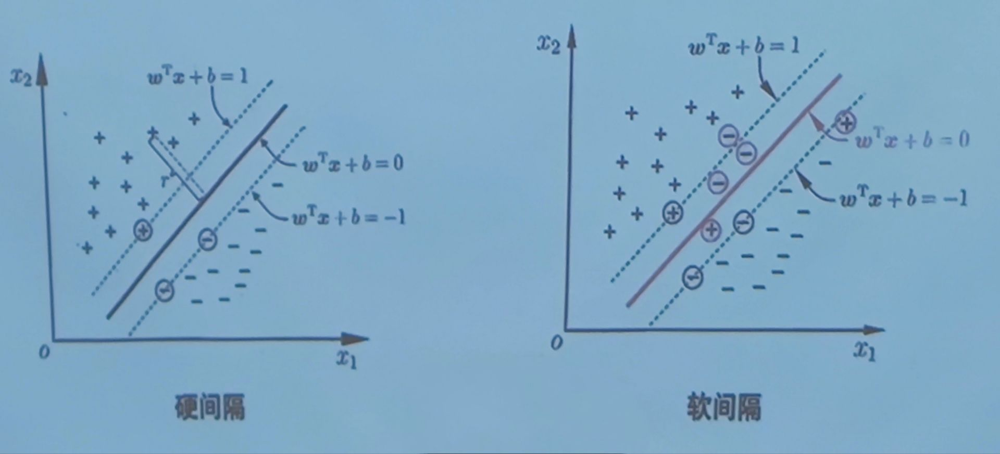

##### 定义

- [x] 对于数据集 $\lbrace (x_1,y_1),\dots ,(x_n，y_n)\rbrace$ ，在特征空间中寻找一个合适的超平面，实现对数据的线性划分
  > - 样本 $x_i$ 包含 $d$ 个属性(特征): $x_i=(x_{i_1},\dots ,x_{i_j},\dots ,x_{i_d})^T$
  > - $y_i$ 为样本 $x_i$ 对应的分类标签记: $y_i \in \lbrace -1,+1 \rbrace$
  > - 划分超平面： $\omega ^Tx+b=0$

  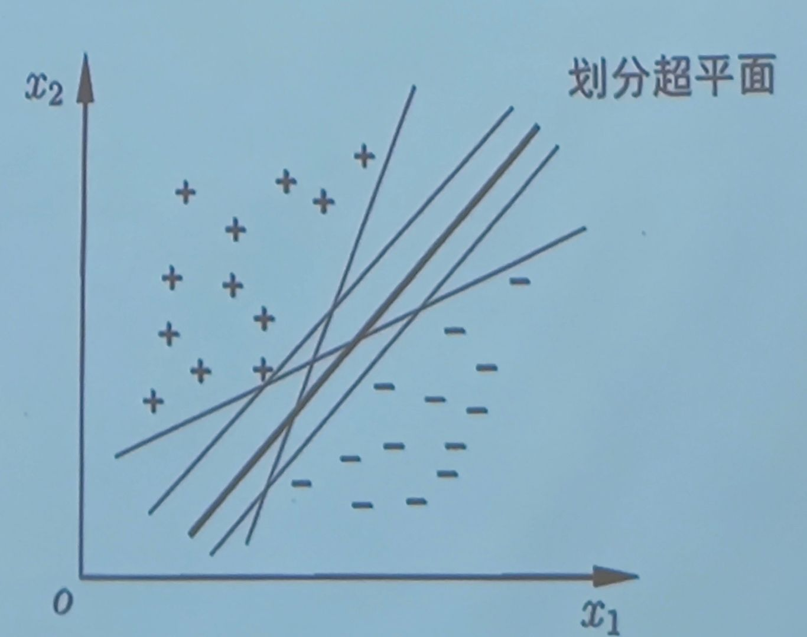
  

   划分超平面
  

#### 线性可分支持向量机————硬间隔最大化

##### 间隔

- [x] 若 $H=\lbrace x:\omega^Tx+b= \epsilon \rbrace$ 可以分离样本空间，这个是可以通过感知机的方法得到这个超平面的：
  > - 将 $H$ 向两个方向平移至首次与两个类别的样本点相交，得到两个超平面 $H_1$ ，和 $H_2$ ，即为 `支撑超平面` ，支撑超平面上的样本点被称为 `支持向量` 。也就是把感知机得到的超平面向两类数据的方向分别平移，直到两个类别的样本点有点出现在平移后的超平面上，而此时超平面就被称为支撑超平面。
  > - 显然，划分超平面的选择只与 `支持向量` 有关

- [x] 位于两个支撑超平面 `正中间的超平面` 是分离这两类数据最好的选择，也就是 `划分超平面`

- [x] 超平面 $H_1$ 和 $H_2$ 之间的距离即为 `间隔`

- [x] 样本到划分超平面的距离： $r=\frac{y_i(\omega ^Tx_i+b)}{||\omega||_2}$
  > - 范数 $||\vec{x}||_2$ 是表示 $\vec{x}$ 的模长，上面的向量 $x$ 或其他变量没有写成 $\vec{x}$ 或 $\mathbf{x}$ 的形式是便于观看，请注意辨别。下面将 $||\omega||_2$ 省略为 $||\omega||$ 一般向量的模数不写下标默认为2-模数，而其实上可以直接将点到超平面距离写为 $r=\frac{|\omega ^Tx_i+b|}{||\omega||_2}$ ，但是由于 $y_i$ 的取值为 $+1$ 或 $-1$ ，而其与 $x_i$ 在超平面哪个位置有关，很显然 $\omega ^Tx_i+b \geq 0$ 时 $y_i$ ，此时 $|\omega ^Tx_i+b|=y_i(\omega ^Tx_i+b)$ 另种情况一致。

- [x] 样本集到划分超平面的距离： $\rho = \min\limits_{(x_i,y_i)} \frac{y_i(\omega ^Tx_i+b)}{||\omega||}=\frac{a}{||\omega||}$

- [x] 优化目标： `最大化` 样本集到划分超平面的距离，即:

$$\lambda = \max\limits_{\omega,b}\frac{a}{||\omega||} \ s.t. \ y_i(\omega ^Tx_i+b) \geq a,\forall i$$ 

> - 注：数学中 $s.t.$ 的意思是 $subject \ to$ 表示受后面的条件约束或者使得后面的条件满足。
> - 此处有后面的约束条件是因为， $a = \min\limits_{(x_i,y_i)} y_i(\omega ^Tx_i+b)$ 也就是需要将上面中 $a$ 的条件带入进来才可以，不然相当于这个 $a$ 为一个常量，但是实际上还是与样本分布点有关系，所以才需要加上约束条件 。

- [x] 令 $\omega ' = \frac{\omega}{a}$ , $b' =\frac{b}{a}$ ，优化目标即可归一化为:

$$\lambda = \max\limits_{\omega,b}\frac{2}{||\omega '||} \ s.t. \ y_i(\omega '^T x_i+b') \geq 1,\forall i$$ 

> - **此处分母不为1，是因为对于两个类别样本集分别到划分超平面都有一个这样的距离，所以乘了2。**

> 上面的 约束条件 也可以写为 $y_i(\omega '^T x_i+b') -1 \geq 0,\forall i$

###### 示例

- [x] 假设超平面 $(\omega,b)$ 能使样本正确分类，需满足:

$$y_i(\omega^Tx_i+b) \geq 1$$

- [x] 对于任意标签为 $y_i=+1$ 的样本点，需满足

$$\omega^Tx_i+b \geq 1$$

> - 得到支撑超平面 $H_1$ 方程为： $\omega^Tx+b=+1$ 。同理，支撑超平面 $H_2$ 方程为： $\omega^Tx+b=-1$

- [x] 最优划分超平面方程为： $\omega^Tx+b=0$

- [x] 由平行直线距离公式，间隔为: $\lambda =\frac{2}{||\omega||}$

- [x] 显然， `间隔` 是只关于法向量 $\omega$ 的函数

  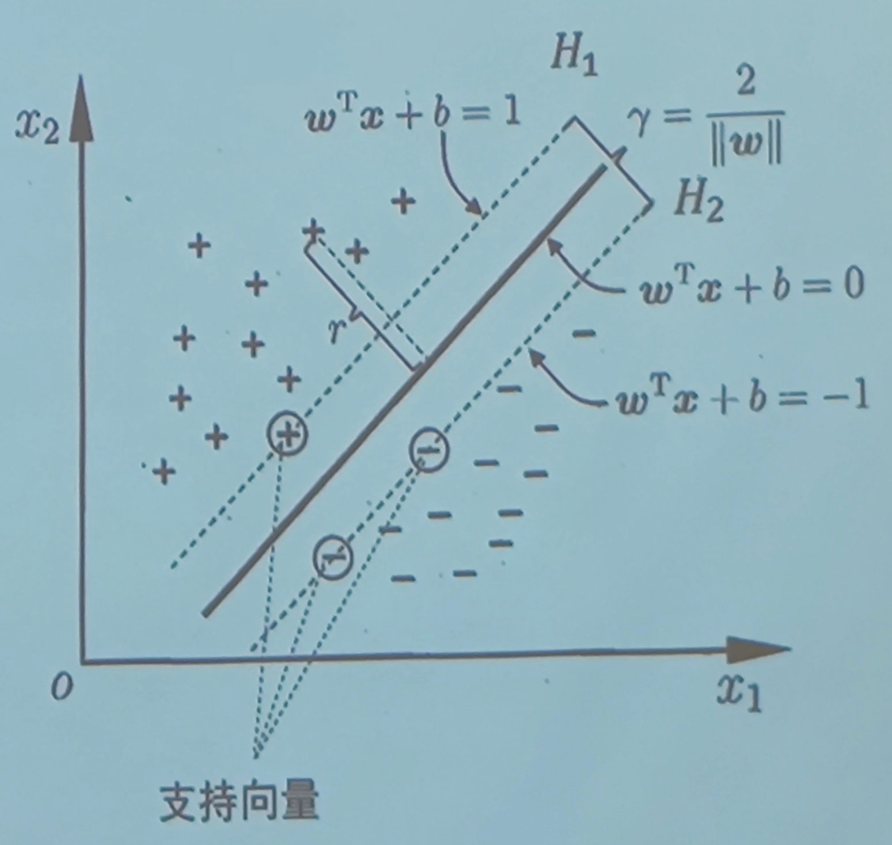
  

   间隔
  

###### 间隔最大化

- [x] 线性 `SVM` 的优化训练，等价于找到“最大间隔”的划分超平面,即找到参数 $\omega$ 和 $b$ ，使得 $\lambda$ 最大

- [x] 最大化 $||\omega||^{-1}$ ，等价于最小化 $||\omega||^2$ ，优化目标定义为：

$$\min\limits_{\omega,b} \frac{1}{2} ||\omega||^2$$

$$s.t. \ y_i(\omega ^T· x_i+b)-1≥0, i=1,2,…,N$$

> 此处约束条件可以见 <kbd><a href="#/?id=yueshutiaojian1">上面的推导</a></kbd> 。

- [x] 为便于计算，使用拉格朗日乘子法将“间隔最大化”的 `原始问题转换为对偶问题`

###### 数学原理的推导与证明： $原始问题$

- [x] 假设存在一个 `原始问题` ，问题形如:

$$\min\limits_{X \in R^n} f(x) \ s.t. \ c_i(x) ≤ 0,i= 1,2,\dots , k \ h_j(x)=0,j=1,2,\dots , l$$

> $f(x),c_i(x),h_j(x)$ 均为定义在上的连续可微函数，若不考虑其约束条件，那么对 $f(x)$ 求导数即可求出最优解，但是这在有约束条件的情况下是不可行的；因此引入一种方法将 `约束条件“去掉”`

- [x] 因此引入拉格朗日乘子 $α_i,β_j$ ;，其中 $α_i≥0$ ，定义拉格朗日函数(详情可见数分里面的概念)：

$$L(x,α,β)=f(x)+\sum\limits_{i=1}^k α_ic_i(x)+\sum\limits_{j=1}^l β_jh_j(x)$$

- [x] 当且仅当在满足约束条件且 $α_i≥0$ 时，原始问题等价为:

$$\min\limits _{x} f(x) = \min\limits _{x} \max\limits _{α,β:α_i \geq 0} L(x,α,β)$$

> - 证明如下:
> - 首先考虑后半部分，对 $L(x,α,β)$ 关于参数 $α_i,β_j$ 求最大值，此时 $α_i,β_j$ 的值将被固定，此最大值即为只与 $x$ 有关的函数，定义该函数为：

$$\theta_p(x)=\max\limits_{α,β:α_i \geq 0}L(x,α,β)$$

> - 对于原拉格朗日函数： $L(x,α,β)=f(x)+\sum\limits_{i=1}^k α_ic_i(x)+\sum\limits_{j=1}^l β_jh_j(x)$
> - 当满足原始约束条件 $\lbrace c_i(x)≤0,h_j(x)=0|i=1,2, \dots ,k;j=1,2,\dots ,l\rbrace$ 且 $α_i≥0$ 时，易得 $α_i·c_i(x)≤0$ 且 $β_j·h_j(x)=0$ ,该函数的最大值为 $f(x)$ 。若不满足条件，则该函数最大值趋于 $+ \infty$ (如 $α_i$ ，趋于 $+ \infty$ 使 $α_i·c_i(x)$ 趋于 $+ \infty$ 。(此处也就是因为对于 $c_i(x)$ 没有约束条件了，此处有假设 $α_i≥0$ ， $c_i(x) > 0$ 那么就有上面的情况)
> - 证得：

$$\theta_p(x)=\begin{cases}
f(x) , & x \text{满足原始问题约束且} α_i≥0 \newline
\text{+} \infty ,& \text{其他} \newline
\end{cases}$$

> - 因此得证： $\min\limits _{x} f(x) = \min\limits _{x} \theta _p(x)=\min\limits _{x} \max\limits _{α,β:α_i \geq 0} L(x,α,β)$

###### 数学原理的推导与证明： $对偶问题$

- [x] 针对 `原始问题` ：

$$\min\limits_{x} f(x) = \min\limits_{x}\theta_p(x)=\min\limits_{x} \max\limits_{α,β:α_i \geq 0} L(x,α,β)$$

- [x] 定义其 `对偶问题` ：

$$\max\limits _{α,β:α _i \geq 0} \theta _{D}(α,β) = \max\limits _{α,β:α _i \geq 0} \min\limits _{x} L(x,α,β)$$

> 可以看成两种问题在形式上是对称的，只是优化参数顺序的不同

- [x] 当且仅当 [`KKT条件`](#/?id=KKT) 满足时， ***原始问题与对偶问题的最优值相等*** 。

###### 数学原理的推导与证明： $KKT条件$

- [x] 存在 $L(x^{\*},α^{\*},β^{\*})$ ，其中 $x^{\*},a^{\*}$ 和 $β^{\*}$ 同时为 `原始问题和对偶问题` 的 `最优解` 的 `充分必要条件` 是 $x^{\*},a^{\*}$ 和 $β^{\*}$ 满足 `KKT条件` ：

$$\nabla_x L(x^{\*},α^{\*},β^{\*})=0 \ (鞍点满足条件)$$

$$\nabla_α L(x^{\*},α^{\*},β^{\*})=0 \ (鞍点满足条件)$$

$$\nabla_β L(x^{\*},α^{\*},β^{\*})=0 \ (鞍点满足条件)$$

$$α_i^{\*} c_i(x^{\*})=0 \ ,i=1,2\dots , k \ (使最大值f(x)可以取得的约束条件)$$

$$c_i(x^{\*}) ≤ 0 \ ,i=1,2\dots , k \ (原始约束条件)$$

$$α_i^{\*} ≥ 0 \ ,i=1,2\dots , k \ (引入α_i^{\*}的约束条件)$$

$$h(x^{\*})= 0 ,j=1,2,\dots , l (原始约束条件)$$

> - 关于证明该为充要条件， [`请点击此处`](https://blog.csdn.net/gaofeipaopaotang/article/details/108058871)

###### 支持向量机的对偶问题求解

- [x] 回顾原始问题:

$$\min\limits_{\omega,b} \frac{1}{2} ||\omega||^2$$

$$s.t. \ y_i(\omega ^T· x_i+b)-1≥0, i=1,2,…,N$$

- [x] 首先引入拉格朗日乘子向量 $α=(α_1,α_2,\dots ,α_N),α_i \geq 0$ ，定义拉格朗日函数：

$$L(\omega,b,α)=\frac{1}{2} ||\omega||^2+\sum\limits _{i=1}^N α_i·[1-y _i(\omega ^T· x_i+b)]=\frac{1}{2} ||\omega||^2-\sum\limits _{i=1}^N α _i·y _i(\omega ^T· x _i+b)+\sum\limits _{i=1}^N α _i$$

> - 那么对比上述原始问题中 $f(x) = \frac{1}{2} ||\omega||^2$ ， $c _i(x) = 1-y _i(\omega ^T· x _i+b) \leq 0$ ， $h_j(x)=0$ (这个是显然的)。

- [x] 对偶问题 <kbd>求解步骤</kbd> :
  > - (1) 满足 `KKT条件` ，
  > - (2) 通过将 **参数 $\omega,b$ 用 $α$ 表示** ，将原函数 **转换为只与 $α$ 有关的函数(对偶问题)，根据 `对偶问题形式` 求解 $a^{\*}$ 。**
  > - (3) 根据求得的对偶问题的解 $α^{\*}$ ， **推及得到原始问题的解 $\omega^{\*}，b^{\*}$ 。**

> - 步骤一：列出相关 `KKT条件`

$$(1) \ \nabla_{\omega} L(\omega^{\*},b^{\*},α^{\*})=0 \ (鞍点满足条件)$$

$$(2) \ \nabla_b L(\omega^{\*},b^{\*},α^{\*})=0 \ (鞍点满足条件)$$

$$(3) \ \nabla_α L(\omega^{\*},b^{\*},α^{\*})=0 \ (鞍点满足条件)$$

$$(4) \ α_i^{\*} c_i(x^{\*})=0 \ ,i=1,2\dots , k \ (使最大值f(x)可以取得的约束条件)$$

$$(5) \ c_i(x^{\*}) ≤ 0 \ ,i=1,2\dots , k \ (原始约束条件)$$

$$(6) \ α_i^{\*} ≥ 0 \ ,i=1,2\dots , k \ (引入α_i^{\*}的约束条件)$$

> - 步骤二：将参数 $\omega,b$ 用 $α$ 表示，得到 `对偶问题格式` ：
> > - 首先根据 `KKT条件` (1),(2),(6)求解([`矩阵求导公式`](https://blog.csdn.net/weixin_45816954/article/details/119817108?app_version=6.2.9&code=app_1562916241&csdn_share_tail=%7B%22type%22%3A%22blog%22%2C%22rType%22%3A%22article%22%2C%22rId%22%3A%22119817108%22%2C%22source%22%3A%222301_79807208%22%7D&uLinkId=usr1mkqgl919blen&utm_source=app))：

$$(1) \ \nabla_{\omega} L(\omega^{\*},b^{\*},α^{\*})=0 \rightarrow \omega·I - \sum\limits _{i=1}^N α _i y _i ·I x _i = 0 \rightarrow \omega = \sum\limits _{i=1}^N α _i y _i x _i$$

$$(2) \ \nabla_b L(\omega^{\*},b^{\*},α^{\*})=0 \rightarrow - \sum\limits _{i=1}^N α _i y _i = 0 \rightarrow \sum\limits _{i=1}^N α _i y _i = 0$$

$$(6) \ α_i^{\*} ≥ 0 \ ,i=1,2\dots , k \rightarrow 保留$$

> > - 将上述(1)(2)结果关系式代入，得到对偶问题:

$$\max\limits _{α} - \frac{1}{2} \sum\limits _{i=1}^N \sum\limits _{j=1}^N α _i α _j y _i y _j(x _i ·x _j^T)+ \sum\limits _{i=1}^N α_i$$

$$s.t. \ \sum\limits _{i=1}^N α _i y _i = 0 ; \ α_i ≥ 0 \ ,i=1,2\dots , N$$

> > > - 推导过程: $L(\omega,b,α)=\frac{1}{2} ||\omega||^2-\sum\limits _{i=1}^N α _i·y _i(\omega ^T· x _i+b)+\sum\limits _{i=1}^N α _i = \frac{1}{2} \omega · \omega ^T -\sum\limits _{i=1}^N α _i·y _i(\omega ^T· x _i+b)+\sum\limits _{i=1}^N α _i$ ，带入 $\omega = \sum\limits _{i=1}^N α _i y _i x _i$ ，有( $\omega ^T=\sum\limits _{i=1}^N α _i y _i x _i^T$ 因为在此处只有 $x_i$ 为向量 $x _i=(x _{i _1},\dots ,x _{i _j},\dots ,x _{i _d})^T$ )
> > > - $L(b,α)=\sum\limits _{i=1}^N α _i y _i x _i · \sum\limits _{j=1}^N α _j y _j x _j^T -\sum\limits _{i=1}^N α _i·y _i \sum\limits _{j=1}^N α _j y _j x _j^T· x _i-\sum\limits _{i=1}^N α _i·y _i · b +\sum\limits _{i=1}^N α _i$
> > > - 带入 $\sum\limits _{i=1}^N α _i y _i = 0$ 则有 $L(α)=- \frac{1}{2} \sum\limits _{i=1}^N \sum\limits _{j=1}^N α _i α _j y _i y _j(x _i ·x _j^T)+ \sum\limits _{i=1}^N α_i$

> - 步骤三：将对偶问题的解 $α^{\*}$ ，推及得到原始问题的解 $\omega^{\*}，b^{\*}$ ，获得最终结果
> > - 在求得对偶问题的解 $α^{\*}$ 的情况下，结合其他条件，可推及得到原始问题对 $\omega，b$ 的解 $\omega^{\*}，b^{\*}$ :

$$\omega^{\*} = \sum\limits _{i=1}^N α^{\*}_i y _i x _i , \ b^{\*}=\frac{1}{N} \sum\limits _{j=1}^N \left( y _j + \sum\limits _{i=1}^N α^{\*}_i y _i x _i·x _j^T\right)$$

> > > - $b^{\*}$ 的确定步骤，由于对于任意 `支持向量` $(x_i,y_i)$ 都有 $y_i (\omega^T x_i +b)=1$ ( [`约束条件决定`](#/?id=rule1) )，即有 $y_i \left( \sum\limits _{j=1}^N α^{\*}_j y _j x _j^T x _i+b\right)=1$ 。
> > > - 理论上，可以选择任意支持向量并通过上述式子求解得到 $b$ ，但实际上通常采用一种 `更鲁棒` 的做法，也就是使用所有支向量求解的平均值 $\frac{1}{N} \sum\limits _{j=1}^N \left( y _j + \sum\limits _{i=1}^N α^{\*}_i y _i x _i·x _j^T\right)$ 

> > - 得到最终 `划分超平面` 的函数表达：

$$f(x)=sign \left(\sum\limits_{i=1}^N (α^{\*}_i y _i x _i^T)·x+b^{\*} \right)$$

> 注：上述过程仍然需要满足 `KKT条件` ，即满足

$$\begin{cases}
α_i \geq 0 \newline
1 - y_i (\omega^T x_i +b) \leq 0 \newline
α_i·[1 - y_i (\omega^T x_i +b)]=0\newline
\end{cases}$$

> 所以有对于任意训练样本 $(x_i,y_i)$ ，总有 $α_i=0$ 或 $y_i (\omega^T x_i +b) = 1$ 。若 $α_i=0$ ，那么该样本将不会在上面最终得到的 `划分超平面` 的函数表达式求和中出现，也就不会对 $f(x)$ 有任何影响；若 $α_i > 0$ ，那么必然有 $y_i (\omega^T x_i +b) = 1$ 。其所对应的样本点位于 最大间隔的边界 上，是一个 `支持向量` 。这也显示出支持向量机的重要性质： **训练完成后，大部分的训练样本都不需要保留，最终模型仅与 `支持向量` 有关。**

###### 对偶问题参数 $\alpha$ 的求解算法————SMO

- [x]  `SMO(Swquential Minimal Optimization)` 适用于求解 `二次规划问题` ，而上面的 `对偶问题` 也正好是 [`二次规划问题`](https://zh.wikipedia.org/wiki/%E4%BA%8C%E6%AC%A1%E8%A7%84%E5%88%92) 。

- [x]  `SMO` 的基本思路是先固定 $α_i$ 之外的所有参数，然后求 $α_i$ 上的极值，由于存在约束需 $\sum\limits_{i=1}^N α_i·y_i=0$ ，若固定 $α_i$ 之外的其他变量，则 $α_i$ 可由其他变量导出。于是， `SMO` 每次选择两个变量 $α_i$ 和 $α_j$ ，并固定其他参数，这样，在参数初始化后， `SMO` 不断执行如下两个步骤直至收敛：
  > - 选取一对需更新的变量 $α_i$ 和 $α_j$
  > - 固定 $α_i$ 和 $α_j$ 以外的参数，求解上面式子 $\max\limits _{α} - \frac{1}{2} \sum\limits _{i=1}^N \sum\limits _{j=1}^N α _i α _j y _i y _j(x _i ·x _j^T)+ \sum\limits _{i=1}^N α_i$ 获得更新后的 $α_i$ 和 $α_j$ 。

- [x] 注意到只需选取的 $α_i$ 和 $α_j$ 中有一个不满足 `KKT条件` $\sum\limits _{i=1}^N α _i y _i = 0 ; \ α_i^{\*} ≥ 0 \ ,i=1,2\dots , k$ ，目标函数就会在迭代后减小.直观来看， `KKT条件` 违背的程度越大，则变量更新后可能导致的目标函数值减幅越大.于是， `SMO` 先选取违背 `KKT条件` 程度最大的变量，第二个变量应选择一个使目标函数值减小最快的变量，但由于比较各变量所对应的目标函数值减幅的复杂度过高，因此 `SMO` 采用了一个启发式：使选取的两变量所对应样本之间的间隔最大，一种直观的解释是，这样的两个变量有很大的差别，与对两个相似的变量进行更新相比，对它们进行更新会带给目标函数值更大的变化。

- [x]  `SMO` 算法之所以高效，恰由于在固定共他参数后，仅优化两个参数的过程能做到非常高效，具体来说，仅考虑 $α_i$ 和 $α_j$ 时，式 $\max\limits _{α} - \frac{1}{2} \sum\limits _{i=1}^N \sum\limits _{j=1}^N α _i α _j y _i y _j(x _i ·x _j^T)+ \sum\limits _{i=1}^N α_i$ 中的约束可重写为

$$α_iy_i+α_jy_j=c,α_i \geq 0, \ α_j \geq 0$$

- [x] 其中

$$c=- \sum\limits^N_{k \not = i,j}α_ky_k$$

> - 是使 $\sum\limits^N_{i=0} α_iy_i=0$ 成立的常数.用

$$α_iy_i+α_jy_j=c$$

- [x] 消去式 $\max\limits _{α} - \frac{1}{2} \sum\limits _{i=1}^N \sum\limits _{j=1}^N α _i α _j y _i y _j(x _i ·x _j^T)+ \sum\limits _{i=1}^N α_i$ 中的变量 $α_j$ ，则得到一个关于 $α_i$ 的单变量二次规划问题，仅有的约束是 $α_i ≥ 0$ .不难发现，这样的二次规划问题具有闭式解，于是不必调用数值优化算法即可高效地计算出更新后的 $α_i$ 和 $α_j$ 。

#### 线性支持向量机————软间隔最大化

##### 软间隔

- [x] 允许某些样本不满足线性分割约束，区别于前面介绍的要求所有样本满足线性分割约束的“ `硬间隔` ”，线性支持向量机即基于“ `软间隔` ”最大化实现的支持向量机。(详见上述 <kbd><a href="#/?id=distance1">软硬间隔的区别</a></kbd> )

###### 软间隔最大化

- [x] 基于软间隔，存在部分样本点不再满足 `函数间隔大于等于1` 的约束条件。
  > - 为此，对每个样本点 $(x_i,y_i)$ 引入松弛变量 $\xi _i≥0$ ，约束条件变为:

$$y_i(\omega^T·x_i+b)≥1- \xi$$

- [x] 基于软间隔最大化的优化目标为：

$$\min\limits_{\omega,b,\xi_i} \frac{1}{2} ||\omega||^2+C \sum\limits_{i=i}^N \xi _i$$

$$s.t. \ y_i(\omega ^T· x_i+b)≥1- \xi _i, i=1,2,\dots ,N$$

$$\xi _i \geq 0 , i=1,2,\dots ,N$$

> $C$ 为惩罚参数，表示对 `误分类` 的 `惩罚程度`

###### 对偶问题

- [x] 转换为对偶问题：

$$\max\limits _{α} - \frac{1}{2} \sum\limits _{i=1}^N \sum\limits _{j=1}^N α _i α _j y _i y _j(x _i ·x _j^T)+ \sum\limits _{i=1}^N α_i$$

$$s.t. \ \sum\limits _{i=1}^N α _i y _i = 0 ; \ 0 \leq α_i \leq C \ ,i=1,2\dots , N$$

- [x] 转换为对偶问题的求解过程

$$L(\omega,b,\xi,α,\mu) \equiv \frac{1}{2} ||\omega||^2+C \sum\limits_{i=i}^N \xi _i - \sum\limits _{i=1}^N α_i·[y _i(\omega ^T· x_i+b)-1+\xi _i] - \sum\limits _{i=1}^N \mu _i \xi _i$$

$$\nabla_{\omega}L(\omega,b,\xi,α,\mu)=\omega - \sum\limits _{i=1}^N α _i y _i x _i = 0 \rightarrow \omega = \sum\limits _{i=1}^N α _i y _i x _i$$

$$\nabla_{b}L(\omega,b,\xi,α,\mu)=- \sum\limits _{i=1}^N α _i y _i = 0 \rightarrow \sum\limits _{i=1}^N α _i y _i = 0$$

$$\nabla_{\xi _i}L(\omega,b,\xi,α,\mu) = C- α _i - \mu _i = 0 \rightarrow C- α _i - \mu _i = 0$$

> - 可以推出

$$\max\limits_{α} L(\omega,b,\xi,α,\mu)= - \frac{1}{2} \sum\limits _{i=1}^N \sum\limits _{j=1}^N α _i α _j y _i y _j(x _i ·x _j^T)+ \sum\limits _{i=1}^N α_i$$

- [x] 相应划分超平面的函数表达：

$$f(x)=sign \left(\sum\limits_{i=1}^N (α^{\*}_i y _i x _i^T)·x+b^{\*} \right)$$

> 注：上述过程仍然需要满足 `KKT条件` ，即满足

$$\begin{cases}
α_i \geq 0 ,\mu _i \geq 0 \newline
1 - \xi _i - y_i (\omega^T x_i +b) \leq 0 \newline
α_i·[1 - \xi _i - y_i (\omega^T x_i +b)]=0\newline
\xi _i \geq 0 ,\mu _i \xi _i =0
\end{cases}$$

#### 非线性支持向量机————使用核函数映射到高维空间

##### 概述

- [x] 在现实任务中， `原始样本空间内` 也许并不存在一个能正确划分两类样本的超平面，即 `线性不可分`

- [x] 对于 `线性不可分` 的训练数据，可将样本从原始空间映射到一个新的特征空间，使得 `样本数据在新的特征空间内线性可分` ，一般的，这个特征空间是 `高维` 的

  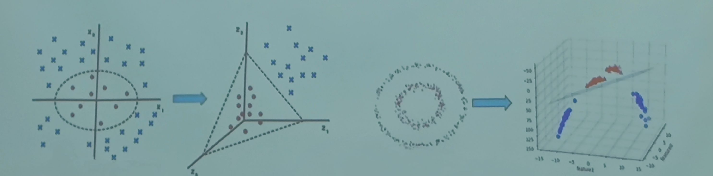
  

   将低维数据映射为高维空间数据
  

- [x] 线性不可分的二维样本数据映射到三维特征空间，实现线性可分的示例：

  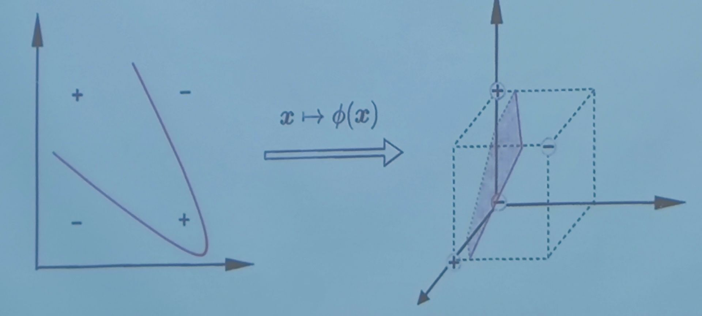
  

   将低维数据映射为高维空间数据
  

- [x] $\phi(x)$ 表示将 $x$ 从低维空间映射到新特征空间对应的特征 `映射函数` 。

##### 对偶问题

- [x] 特征空间中划分超平面： $f(x)=\omega^T \phi(x)+b$ ，

- [x] 优化目标：

$$\min\limits_{\omega,b,\xi_i} \frac{1}{2} ||\omega||^2+C \sum\limits_{i=i}^N \xi _i$$

$$s.t. \ y_i(\omega ^T· \phi (x_i)+b) ≥ 1 - \xi_i , i=1,2,\dots ,N$$

- [x] 对偶问题:

$$\max\limits _{α} - \frac{1}{2} \sum\limits _{i=1}^N \sum\limits _{j=1}^N α _i α _j y _i y _j(\phi(x _i)^T ·\phi(x _j))+ \sum\limits _{i=1}^N α_i$$

$$s.t. \ \sum\limits _{i=1}^N α _i y _i = 0 ; \ 0 \leq α_i \leq C \ ,i=1,2\dots , N$$

##### 核函数

- [x] 在对偶函数中存在高维运算 $\phi(x _i)^T ·\phi(x _j)$ (也就是映射函数的内积)。定义核函数：

$$\kappa (x_i,x_j)= < \phi(x_i),\phi(x_j) > = \phi(x _i)^T ·\phi(x _j)$$

- [x] 核函数的 `充分必要条件` ： [`对称半正定矩阵`](https://baike.baidu.com/item/%E5%8D%8A%E6%AD%A3%E5%AE%9A%E7%9F%A9%E9%98%B5/2152711) 。

- [x] 因此，只需找到一个满足对称半正定性质的函数，即可作为核函数代入运算，而无需考虑原始的映射函数 $\phi (x)$ (这是因为找映射函数非常难找，同时计算也非常困难，所以直接找核函数方便点)。

- [x] 核函数的引入使得 `SVM` 的优化求解不再局限于找出映射函数 $\phi (x)$ 。

###### 核函数的意义

- [x] 原始的方法中涉及到对 $\phi(x _i)^T ·\phi(x _j)$ 的计算，这是样本 $x_i,x_j$ 映射到新的特征空间后的内积，而新的特征空间往往是 `更高维甚至无穷维` 的，使得对 $\phi(x _i)^T ·\phi(x _j)$ 的直接计算是复杂且困难的。

- [x] 通过核函数，可以将复杂的内积运算，转化为直接的核函数表示，从而有效解决这一问题。

###### 常用的核函数

  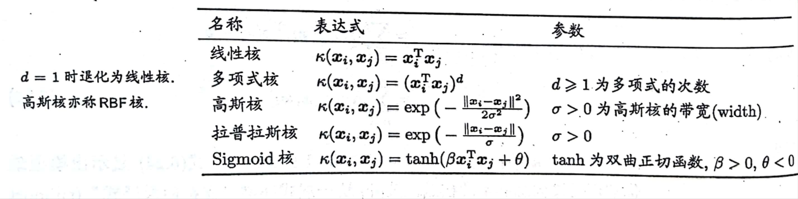
  

   常用的核函数
  

###### 基于核函数的对偶问题

- [x] 基于核函数的对偶问题可重写为：

$$\max\limits _{α} - \frac{1}{2} \sum\limits _{i=1}^N \sum\limits _{j=1}^N α _i α _j y _i y _j \kappa (x_i,x_j) + \sum\limits _{i=1}^N α_i$$

$$s.t. \ \sum\limits _{i=1}^N α _i y _i = 0 ; \ 0 \leq α_i \leq C \ ,i=1,2\dots , N$$

- [x] 划分超平面基于核函数的表达：

$$f(x)=\omega^T \phi(x)+b=\sum\limits _{i=1}^N α _i y _i \phi(x _i)^T ·\phi(x) +b + \sum\limits _{i=1}^N α _i y _i \kappa (x_i,x) +b$$

##### 难点：如何选择核函数？————示例

  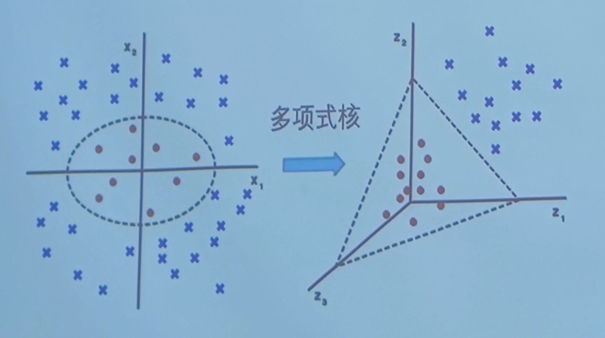
  

   示例
  

> - 核函数：

$$\kappa (x_i,x_j)= < x_i,x_j > ^2 = < x_{i_1}x_{j_1}+x_{i_2}x_{j_2} > ^2 = x^2 _{i_1} x^2 _{j_1} +x^2 _{i_2} x^2 _{j_2}+2 x _{i _1} x _{j _1} x _{i _2} x _{j _2}=<(x^2 _{i _1},x^2 _{i_2}, \sqrt{2x _{i _1} x _{i _2}}),(x^2 _{j _1},x^2 _{j _2}, \sqrt{2x _{j _1} x _{j _2}})>$$

> - 多项式核

$$(z_1,z_2,z_3)=\phi(x)=(x^2_1,x^2_2,\sqrt{2x_1x_2})$$

##### 难点：如何选择核函数？————根据样本数 $n$ 与特征维度 $m$

- [x] 一般选用高斯核或者线性核。

- [x] 当 $n,m$ 较大，且特征 $m>>n$ 时，此时考虑高斯核函数的映射后空间维数更高，更复杂，也容易过拟合，因此选用线性核函数。

- [x] 若 $n$ 一般大小，而特征 $m$ 较小，此时进行高斯核函数映射后，不仅能够实现高维空间中线性可分，而且计算方面不会有很大的消耗，因此选用高斯核函数。

- [x] 若 $n$ 很大，而特征 $m$ 较小，同样难以避免计算复杂的问题，因此更多考虑选用线性核函数。灵活运用，具体情况具体分析。

#### 支持向量机的优缺点

- [x] 优点
  > - 采用核函数的方法克服了 `维数灾难` 和 `非线性可分` 的问题，实现向高维空间映射时不增加计算的复杂性。
  > -  `软间隔最大化` 利用 `松弛变量` 可以允许一些 `点到分类平面的距离不满足原先要求` ，有效 `避免噪声干扰` 对模型学习的影响。

- [x] 缺点
  > - 分类效果与核函数的选择关系很大，往往需要尝试多种核函数。
  > - 难以解决多分类问题。

## 本章小结

  <table>
  <thead>
    <tr>
      <th>模型</th>
      <th>基本概念</th>
      <th>优点</th>
      <th>缺点</th>
    </tr>
  </thead>
  <tbody>
    <tr>
      <td>决策树</td>
      <td>基于特征对实例进行分类的树形结构，本质上是一组规则集合</td>
      <td>可解释性强，实现简单，运算速度快</td>
      <td>在训练数据上比较耗时,容易过拟合</td>
    </tr>
    <tr>
      <td>贝叶斯分类器</td>
      <td>概率框架下实施决策的基本方法，基于概率和误判损失来选择最优的类别标记</td>
      <td>算法实现简单，收敛速度快</td>
      <td>只能得到局部最优解，抗干扰能力差，非凸数据集难以收敛</td>
    </tr>
    <tr>
      <td>感知机</td>
      <td>根据输入实例的特征向量对其进行分类的线性分类模型</td>
      <td>容易处理高维数据</td>
      <td>需要大量训练样本；训练时间长</td>
    </tr>
    <tr>
      <td>支持向量机</td>
      <td>在特征空间上的间隔最大的广义线性分类器，求解凸二次规划的的最优算法</td>
      <td>模型只与支持向量有关；省了内存，鲁棒性强</td>
      <td>非线性SVM需要进行核函数映射，计算开销较大,难以解决多分类问题</td>
    </tr>
  </tbody>
  </table>

# 第四章 聚类

## 概述

### 分类与聚类

> - 分类：给定标签，进行预测
> - 聚类：无事先定义好的类别，按某种标准对样本进行划分

### 定义

- [x] 将数据集 $D = \lbrace x_1,x_2,\dots ,x_N\rbrace$ 分为 $k$ 个不相交的子集：

$$\lbrace C_l_l|l=1,2,\dots ,k\rbrace, C_i \cap C_j = \varnothing 且 D = \cup C_j$$

- [x] 每个子集 $C_l$ 称为一个“簇”(cluster)，每个簇对应于一些潜在的概念(类别)

- [x] 对于 $x_i \in C_1$ ，称 $x_i$ 具有簇标记 $\lamda _l$

### 目的

- [x] 寻找数据内在的分布结构
  > - 将一堆杂乱无章的水果进行划分，寻找出颜色，大小或形状的组合。

- [x] 使类内具有相似的特性，类间具有不同的特性
  > - 划分成相同类别的水果颜色，大小，或者形状相似，不同类别的水果之间特性不同

- [x] 其他任务的前置过程
  > - 一开始没有水果类型的定义，先对水果进行聚类，根据聚类结果将每个簇定义为一个类，再基于这些类训练分类模型，用于判断新样本的类型。

## $K-means$

### 场景

- [x] 样本没有标签，类别/簇的数量未知

- [x] 划分簇要求：在特征空间中簇内样本距离小，簇间样本距离大

### 基本思想：基于样本之间的距离进行簇划分

- [x] 使得簇内样本尽量紧密连接，簇间的距离尽量大

- [x] 需要预先设定好划分的簇数

- [x] 聚类目标：
> - 最小化样本与其所属类中心之间的距离的总和 $E$ ：

$$E=\sum\limits_{j=1}^k \sum\limits_{x \in C_j} ||x-\mu_j||^2_2$$

> - 其中聚类中心 $\mu_j$ 是簇 $C_j$ 中样本的均值：

$$\mu_j = \frac{1}{|C_j|} \sum\limits_{x \in C_j} x$$

### 求解方法

- [x] `K-means` 方法的求解是 `NP-hard` 问题
  > - 存在 $N$ 个样本、 $k$ 种类别，共有 $k^N$ 种可能的分类结果,样本空间大小随着 $N$ 的增长是指数增长的
  > - 使用启发式的迭代方法，每一步寻找局部最优

### 启发式算法

- [x] 随机选择 $k$ 个初始的聚类中心

$$\mu_j j \in \lbrace 1,\dots ,k \rbrace$$

- [x] 计算每个样本到各个聚类中心的距离，将样本分配给距离最近的簇

$$\lamda _i=\underset{\substack{j \in \lbrace 1,\dots ,k \rbrace$}}{\arg\min} d(x_i,\mu_j)$$

- [x] 根据新的簇划分结果，更新聚类中心： $\mu_j'=\frac{1}{|C_j|}\sum\limits_{x \in C_j}x$

- [x] 重复进行簇划分和聚类中心的更新，直至聚类中心不再更新，达到收敛

- [x] 样本间距离计算

  

#### $k-means$ 算法

- [x] 算法流程

> - 选择 $k$ 个初始聚类中心 $\mu_j$
> - Do
> > - 计算每个样本到聚类中心的距离，将样本分配给距离最近的簇

$$\lamda _i=\underset{\substack{j \in \lbrace 1,\dots ,k \rbrace$}}{\arg\min} d(x_i,\mu_j)$$

$$C _{\lamda_i} = C _{\lamda_i} \cup \lbrace x_i \rbrace$$

> > - 更新聚类中心

$$\mu_j'=\frac{1}{|C_j|}\sum\limits_{x \in C_j}x$$

$$if \ \mu_j \not = \mu_j' then \mu_j=\mu_j'$$

> - $Until \ \mu_j == \mu_j'(收敛)$

#### 启发式算法的依据

- [x] 目标函数 $E$ ：

$$E=\sum\limits_{j=1}^k \sum\limits_{x \in C_j} ||x-\mu_j||^2_2 =\sum\limits_{j=1}^k \sum\limits_{i=1}^N r_{ij}||x-\mu_j||^2_2$$

> - 其中

$$r_{ij}=\begin{cases}
1 , x_i \in C_j \newline
0 , x_i \notin C_j
\end{cases}$$

- [x] 对聚类中心求偏导：

$$\frac{\partial{E}}{\partial{\mu_j}} = 2\sum\limits_{i=1}^N r_{ij}(x_i-\mu_j)=0$$

$$\mu_j = \frac{\sum\limits_{i=1}^N r_{ij}x_i}{\sum\limits_{i=1}^N r_{ij}}=\frac{1}{|C_j|} \sum\limits_{x \in C_j}x$$

> - 最后一步 $\sum\limits_{i=1}^N r_{ij = |C_j|,\sum\limits_{i=1}^N r_{ij}x_i=\sum\limits_{x \in C_j}x$，得到的结果即聚类中心的更新公式

- [x] 每步选择使目标函数最小的更新结果，是一种贪心算法

### $K-means$ 的问题与改进

#### 需要提前确定 $K$ 值

- [x] 问题：需要提前确定 $K$ 值

- [x] 改进：手肘法确定 $K$ 值
  > - 使用不同的 $K$ 多次运行，选择拐点

> - 拐点也就是函数拟合后，在函数图像上拐弯的点。

#### 贪心算法容易局部最优，对初始中心点的选择敏感

- [x] 问题：贪心算法容易局部最优，对初始中心点的选择敏感

- [x] 改进：更好地选择初始中心点
  > - `K-means++`
  > - 1、在数据集 $D$ 中随机选择一个点作为初始聚类中心
  > - 2、当聚类中心数量 $m$ 小于规定的 $k$ 时，循环下述过程直至选出 $k$ 个聚类中心：
  > > - 计算其余每个样本点 $x$ 到当前 $m$ 个聚类中心 $\lbrace \mu_i \rbrace _{i=1,\dots,m}$ 的最短距离 $d(x)$
  > > - 定义样本点 $x$ 被选为下一个聚类中心的概率为 $\frac{d(x_j)^2}{\sum\limits_{x_k \in D/\lbrace \mu_i \rbrace _{i=1,\dots,m}}d(x_k)^2}$
  > > > - 越远的点被选到的概率越大，使得初始化的聚类中心更分散 
  > >
  > > - 在其余所有样本中按上述概率最大，得到下一个聚类中心 $\mu_{m+1}$

#### 易受数据分布特性的影响

- [x] 问题：易受数据分布特性的影响
  > - 形状特殊
  > - 大小不一致
  > - 密度不一致

- [x] 改进：过分割+后处理进行缓解
  > - 选择较大的聚类数 $K$ 进行过分割,得到 $K$ 个较小的簇
  > - 将 $K$ 个较小簇进行聚合成所需簇数

### 高斯混合模型

### 密度聚类

### 层次聚类

# 第七章 深度学习:神经网络

## 神经网络定义

### 深度学习

- [x] 深度学习是一种机器学习技术，它通过训练多层神经网络来从数据中学习特征表示。这种方法在许多机器学习任务中都能取得很好的效果，包括图像分类、语音识别、自然语言处理等。深度学习种类可包括前馈神经网络(FNN)、卷积神经网络(CNN)和循环神经网络(RNN)等。

- [x] 深度学习的优势
  > - 减少人工设计、依赖大量计算
  > - 自动适应新数据

- [x] 深度学习的学习目的:找到一个最优函数
  > - 详细步骤看 <kbd><a href="#/?id=第一章-绪论">第一章绪论的内容</a></kbd>
  > - 有区别的点在于神经网络第一步建立模型的时候，不用数学模型，而是建立一个巨大的函数集合

- [x] 生物神经元到神经网络中的神经元
  > - 单个神经细胞只有两种状态：兴奋和抑制;
  > - 神经网络中的神经元是由模仿生物神经元而得来，即在给定一定输入后，神经元会根据计算得出自己的状态为兴奋还是抑制(激活和不激活)。

### 神经元

$$z=a_1w_1+\dots+a_kw_k+\dots+a_Kw_K+b$$

  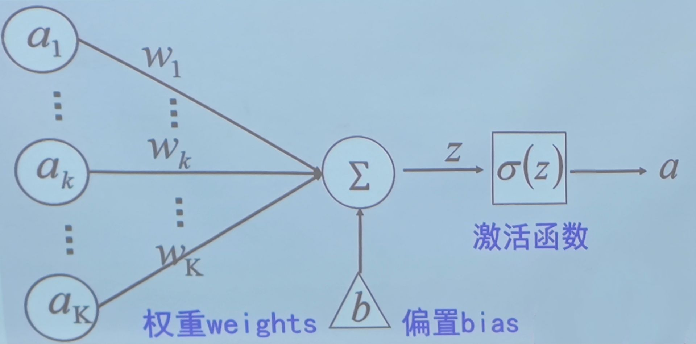
  

   神经元
  

> 理解:简单线性函数 $f(x)=kx+b$ ，$k$ 为斜率 $b$ 为截距。

### 激活函数

- [x] 为什么引入激活函数？
  > - 1.为了增强网络的表达能力，需要激活函数来线性函数改为非线性函数；
  > - 2.非线性的激活函数通常具有连续性，因为连续非线性激活函数可以求导，所以可以用最优化的方法来求解。

  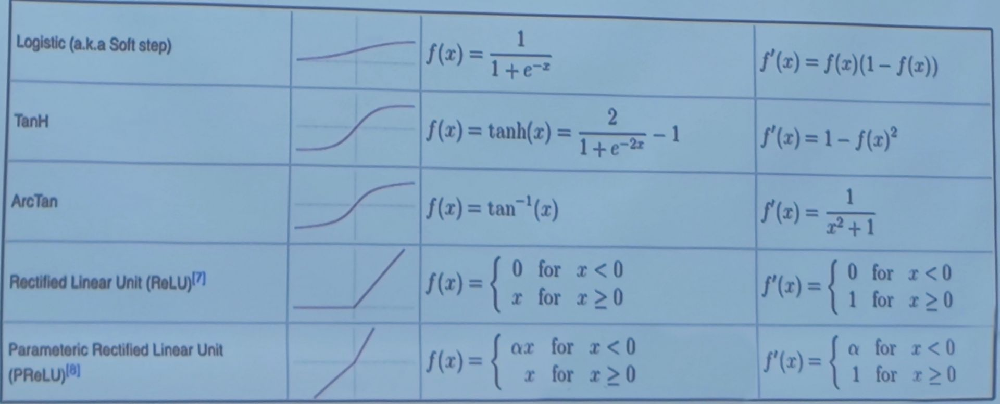
  

   常见激活函数
  

### 网络结构

- [x] 神经元不同的连接方式构成不同的网络结构
  > 每个神经元都有自己的权重和偏置参数

## 前馈神经网络

### 计算示例

  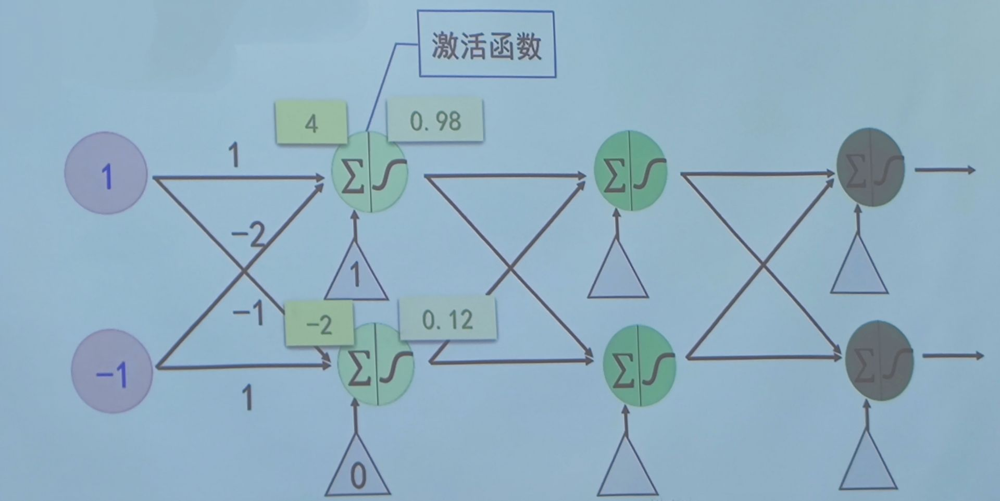
  

   示例
  

> - 上图中这个值为 `4` 的 $z_1$ (第二列上方的圆形节点)推导为两个最初的神经元(最左边一列的两个圆形节点，后面用圆形节点表示神经元)值 `1` 和 `-1` 分别乘上它们的权重值(对应箭头上的值) `1` 和 `-2` 相加后再加上偏置参数 `1` (第二列上方新神经元下三角形内的值)，也就是 `1×1+(-1)×(-2)+1=4` ，第二个 $z_2$ 值为 `-2=1×(-1)+(-1)×1+0` 。而右侧 $z_1$ 的 `0.98` 为 $z_1$ 通过激活函数 $f$ ，也就是从此处输出的 $f(z_1)=0.98$ ，下方的为 $f(z_2)0.12$ 。故两个新神经元的值为 `0.98` 和 `0.12` 。
> - 从左到右依此推导所得结果如下所示

  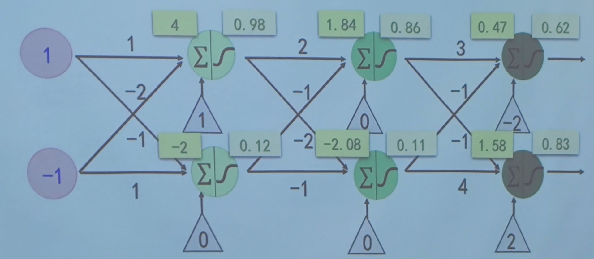
  

   示例结果
  

> - 根据输入和最后的输出值，可以得到该神经网络的最终函数表达式

$$f\left(\left[ \begin{matrix}
1\newline
-1\end{matrix}\right]\right)=\left[\begin{matrix}
0.62 \newline
0.83 \end{matrix}\right]
$$

### 相关概念

  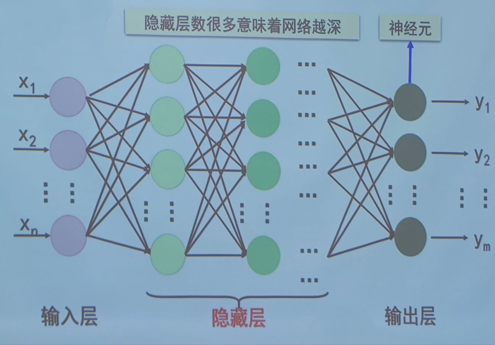
  

   相关概念
  

#### 输出层

- [x] 常用 `softmax` 函数作为输出层激活函数：$y_i = \frac{e^{z_i}}{\sum\limits_{j=1}^ne^{z_j}}$ ，容易理解、便于计算。

  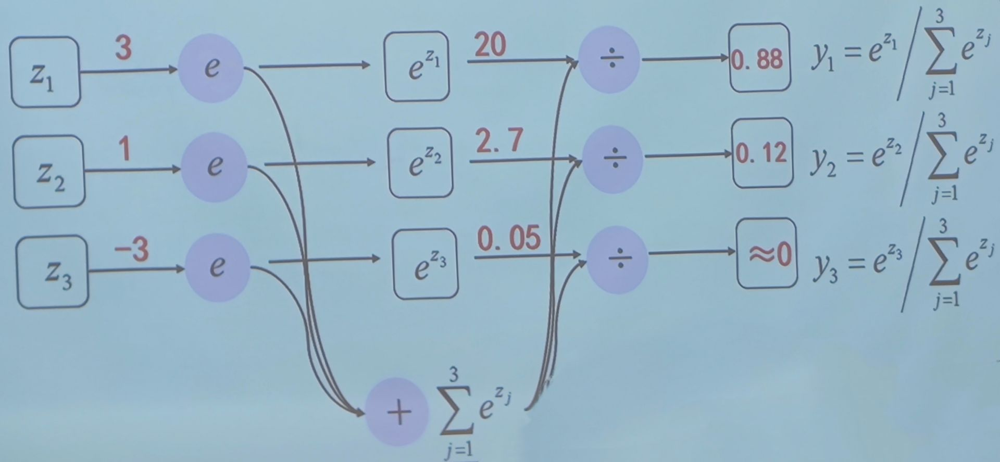
  

   示例
  

> 相当于计算概率值：
> - $1 > y_i > 0$
> - $\sum\limits_{i=1} y_i=1$

### 应用示例:手写识别

  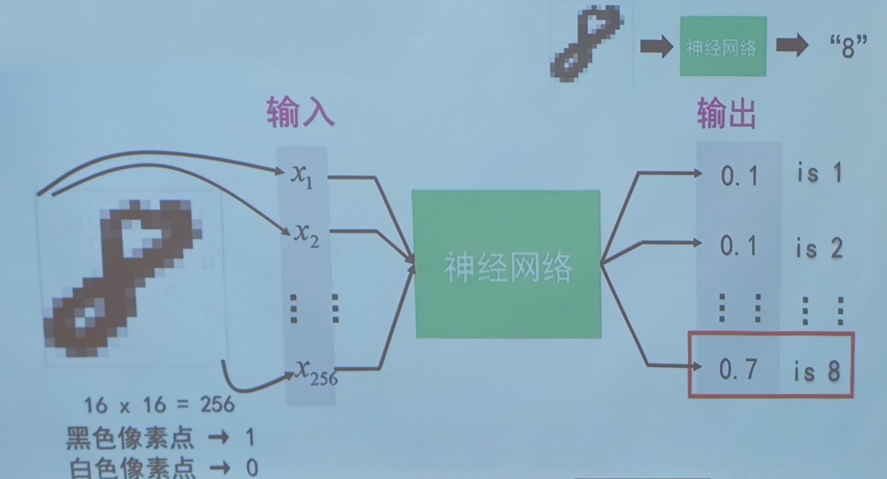
  

   应用示例:手写识别
  

> 也就是分别输入 `256` 个像素点的值，然后输出分别为 `0-9` 中可能的数字对应概率，此例中当然希望为 `8` 的概率更大。

## 神经网络的优化:损失函数

  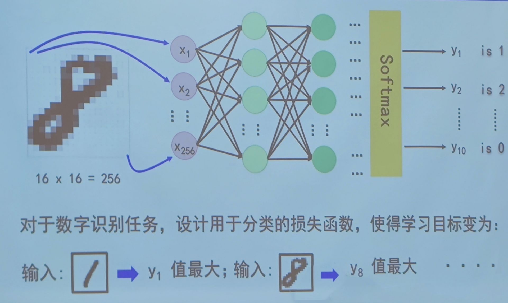
  

   应用示例:手写识别
  

- [x] 希望误差最小化，下面的示例中则希望除了识别为 `1` ，其他所有概率为 $0$

  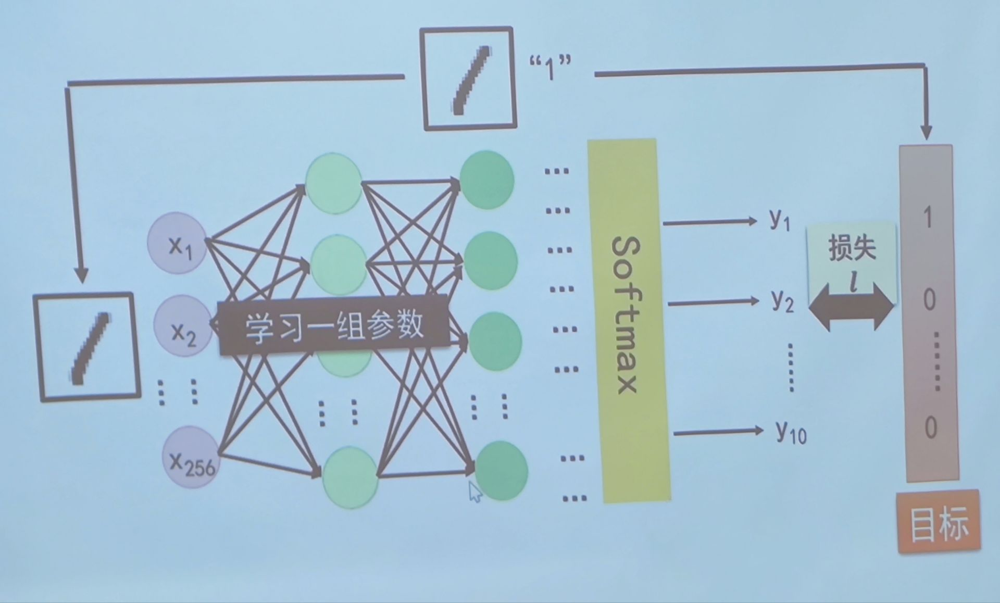
  

   应用示例:手写识别
  

> 对所有训练数据，希望有总损失: $L=\sum\limits_{r=1}^Rl_r$ 尽可能小，则此时要对神经网络中各神经元的权值和偏置参数进行调整，也就是需要进行 `参数学习` 。

  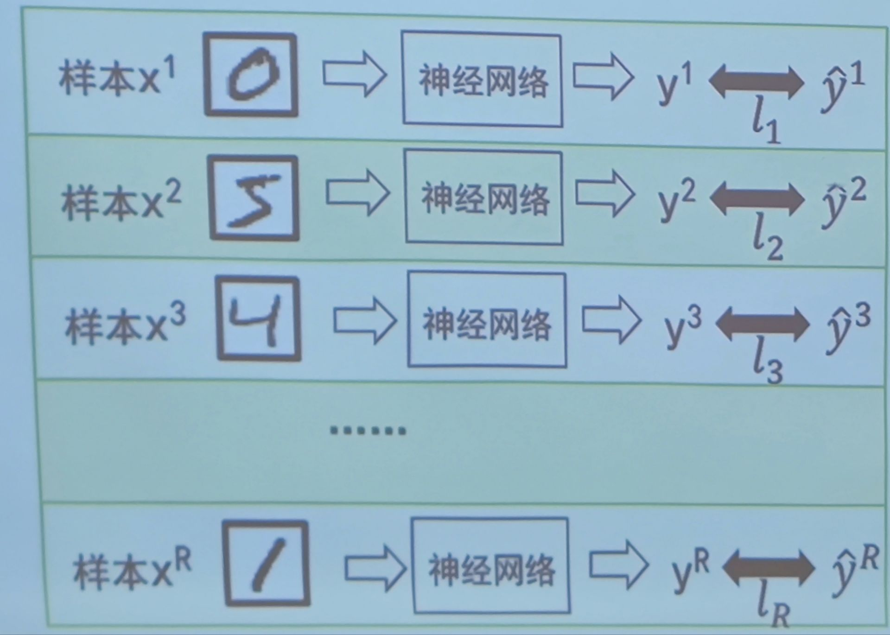

## 神经网络的优化:参数学习

- [x] 枚举所有的可能的取值，这个是不合理的
  > - 网络参数 $\theta = \lbrace w_1,w_2,w_3,\dots,b_1,b_2,b_3,\dots \rbrace$ 参数个数巨大，以下为例

  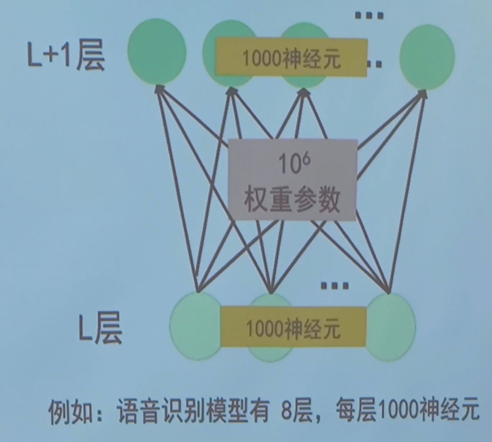
  

   示例
  

> 这个也就是个完全二分图，所以有 $1000·1000=10^6$

- [x] 寻找模型参数 $\theta^{\*}$ 使得总损失 $L$ 最小

#### 梯度下降法

- [x] [`梯度下降法`](#/?id=梯度下降法)

  
   
   
  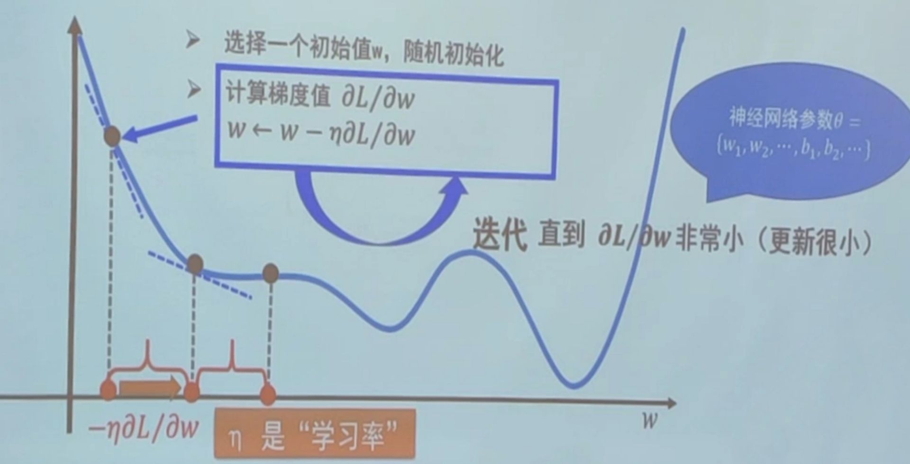
  

   梯度下降法
  

> - 初始值影响
> - 选取不同的初始值，可能到达不同的局部最小值，例如 $A \rightarrow C,B \rightarrow D$ 。

  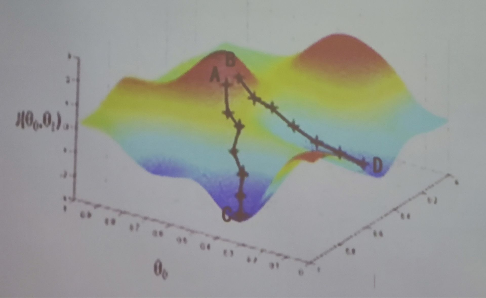
  

   示例
  

#### 反向传播算法

- [x] 反向传播算法
  > - 也就是每一轮对所有的神经元权重 $w_i$ 进行优化，使得总的误差减小，但是这个只能得到局部最优解，因为 $w_i$ 在每轮中都是依此更新的，所以在后面的 $w_j$ 更新完以后，可能前面的 $w_i(i < j)$ 又不符合最优结果了，但是这个算法总体上是使得总的误差减小的。
  > - 也就是用总的损失 $L$ 一步步往回推对应 $w_i$ 的调整度， $\eta$ 和 `梯度下降法` 中一样，为学习率。使得更新后其偏导为 $\frac{\partial{L}}{\partial{w_i}}=0$ ，也就是 $w_i$ 对 $L$ 没有影响的时候，显然此时的 $w_i$ 已经是局部最优解

  
  

   反向传播算法
  

> - 按照上面推 $w_1$ 的方式依此递推 $w_i$ 。
> 那么怎么求梯度 $\frac{\partial{L}}{\partial{w_i}}$ ，因为在每一层中会将上层的参数($W_la^l+b$)当做输入再加上权重在带入激活函数，所以很难直接通过信号正向传播的方式对其进行求解。
> > $a^l$ 为第 $l$ 层的输出

##### 信号正向传播

- [x] 假设第 $l$ 层神经元状态为 $z^l$，经激活函数后的输出值为 $y^l$

  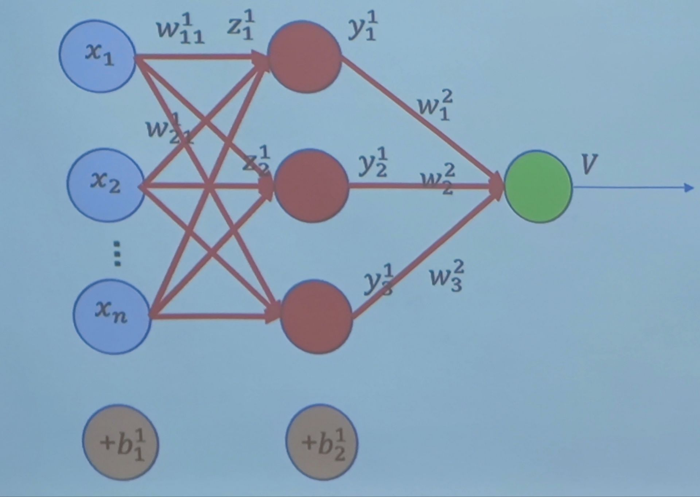
  

   示例
  

> - $z_1^1=w_{11}^1x_1+w_{21}^1x_2+\dots +w_{n1}^1x_n+b_1^1$
> - 则经过激活函数后输出为 $y_1^1=f(z_1^1)=f(w_{11}^1x_1+w_{21}^1x_2+\dots +w_{n1}^1x_n+b_1^1)$
> - 同理， $y_2^1=f(z_2^1)=f(w_{12}^1x_1+w_{22}^1x_2+\dots +w_{n2}^1x_n+b_2^1)$
> - 同理， $y_3^1=f(z_3^1)=f(w_{13}^1x_1+w_{23}^1x_2+\dots +w_{n3}^1x_n+b_3^1)$
> - $此处只考虑三个神经元$ (其他多个神经元时同理)
> - 那么有， $V=f(w_1^2y_1^1+w_2^2y_2^1+w_3^2y_3^1+b_2)$

##### 反向传播算法求解梯度 $\frac{\partial{L}}{\partial{w_i}}$

> - ~~也就是用空间换时间。~~

- [x] 算法示例: $e=(a+b)·(b+1)$ ，求 $\frac{\partial{e}}{\partial{a}},\frac{\partial{e}}{\partial{b}}$ 。( **其实也可以这个方式对 $l$ 层中每个权重 $w^l_i$ 一直递推到总损失 $L$ ，那么树状图就是最下面为第一层的权重，最上方为总损失函数 $L$ ，同时 $w_i^l$ 的值可以通过对应层的输入输出值来赋值** )

  > - 引入两个中间变量 $c,d:c=a+b,d=b+1,e=e·d$ ，那么可以得到下面的 `树状图1`

  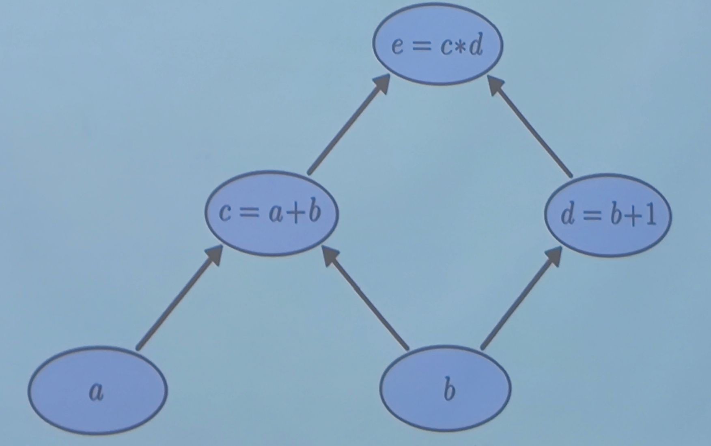
  

   树状图1
  

> - 若对上述树状图中的自下而上进行赋值并求对应的偏导，则如 `树状图2` 所示

  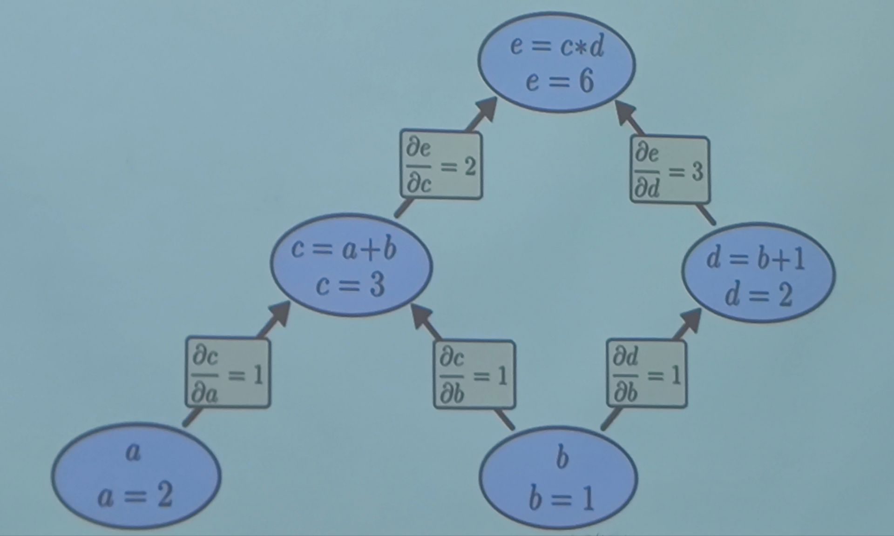
  

   树状图2
  

- [x] 链式法则
  > - $\frac{\partial{e}}{\partial{a}}=\frac{\partial{e}}{\partial{c}}·\frac{\partial{c}}{\partial{a}}$ 图中 $\frac{\partial{e}}{\partial{a}}$ 的值等于从 $a$ 到 $e$ 的路径上的偏导值的乘积
  > - $\frac{\partial{e}}{\partial{b}}=\frac{\partial{e}}{\partial{c}}·\frac{\partial{c}}{\partial{b}}+\frac{\partial{e}}{\partial{d}}·\frac{\partial{d}}{\partial{b}}$ 上图中 $\frac{\partial{e}}{\partial{b}}$ 的值等于从 $b$ 到 $e$ 的路径( $b-c-e$ )上的偏导值的乘积加上路径( $b-d-e$ )上的偏导值的乘积。
  > - 若自下而上求解，很多路径被重复访问了。比如图中，求 $\frac{\partial{e}}{\partial{a}}$ 需要计算路径 $a-c-e$ ，求 $\frac{\partial{e}}{\partial{b}}$ 都需要计算路径 $b-c-e$ 和 $b-d-e$ ，路径 $c-e$ 被访问了两次。

> - 那么此时不自下而上求解
> - 自上而下：从最上层的节点 $e$ 开始，对于 $e$ 的下一层的所有子节点，将 $e$ 的值( $e$ 是最顶点，值 $=1$ )乘以 $e$ 到某个节点路径上的偏导值，并将结果发送到该子节点中。 该子节点的值被设为“发送过来的值”，继续此过程向下传播
> - 第一层：节点 $e$ 初始值为 $1$
> - 第二层：节点 $e$ 向节点 $c$ 发送 $1×2$ ，节点 $e$ 向节点得 $d$ 发送 $1×3$ ，节点 $c$ 值为 $2$ ，节点 $d$ 值为 $3$
> - 第三层：节点 $c$ 向 $a$ 发送 $2×1$ ，节点 $c$ 向 $b$ 发送 $2×1$ ，节点 $d$ 向 $b$ 发送 $3×1$ ，节点 $a$ 值为 $2$ ，节点 $b$ 值为 $2×1+3×1=5$
> - 即顶点 $e$ 对 $a$ 的偏导数为 $2$ ，顶点 $e$ 对 $b$ 的偏导数为5。

## 卷积神经网络

### 全连接网络(过去的深度学习模型)的缺点

- [x] 在建立模型时，模型架构不够灵活

- [x] 模型参数过多

### 卷积神经网络

- [x] 局部连接
  > - 以一个图片( `256×256` 像素)为例，全连接则输入 `256×256` 个像素点，而卷积神经网络则选取更小的片段比如 `16×16` 的图片进行输入，但是选取多个这样的小图片(并且每两个相邻的小图片有重叠部分)

- [x] 权重共享(基于局部连接)

  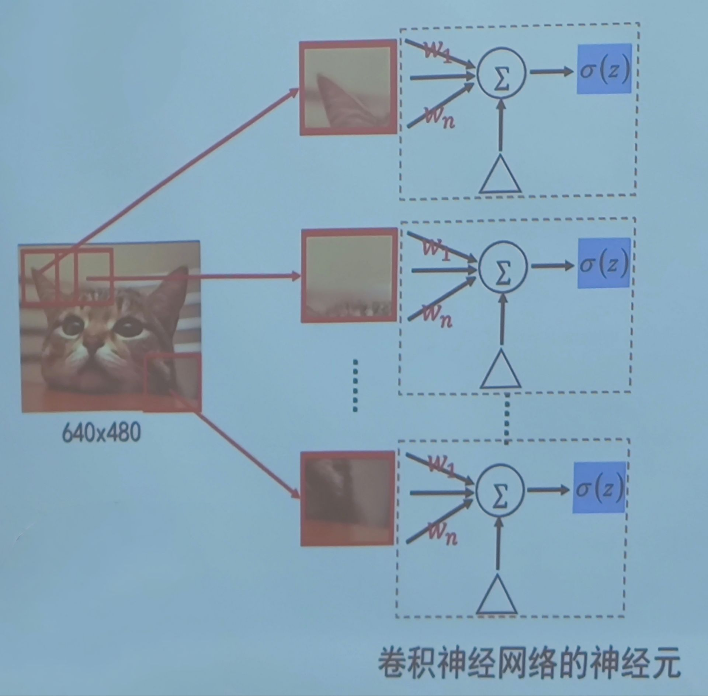
  

   示例
  

> - 神经元权重相同都为 $w_1,\dots,w_n$

- [x] 下采样
  > - 以图片为例，就是将一个 `256×256` 像素的图片截取一半也就是缩小一倍，只含其中有明显特征的一部分 `128×128` 的图片

#### 对比示例

  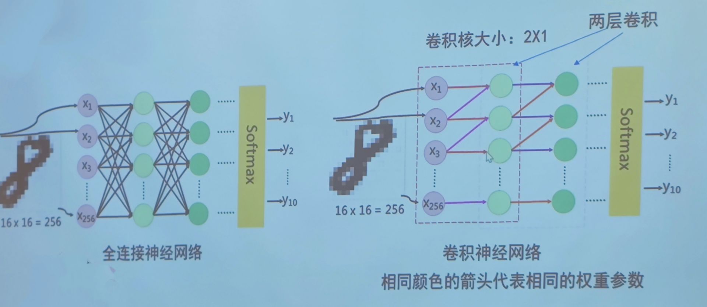
  

   示例
  

#### 卷积神经网络结构

  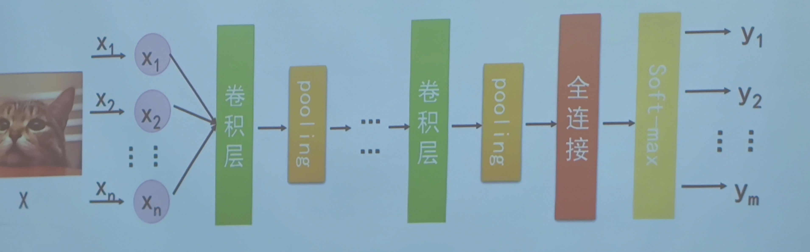
  

   卷积神经网络结构
  

> `pooling` 层是类似两个数据选择丢弃一个，减少一个输入样本，减少参数，用于下采样。

##### 卷积核

- [x] 卷积操作
  > - [`矩阵卷积算法`](https://blog.csdn.net/ruibin_cao/article/details/82775425)
  > - 注：在此处的矩阵卷积不用先将 `kernel` 进行 `reverse`

  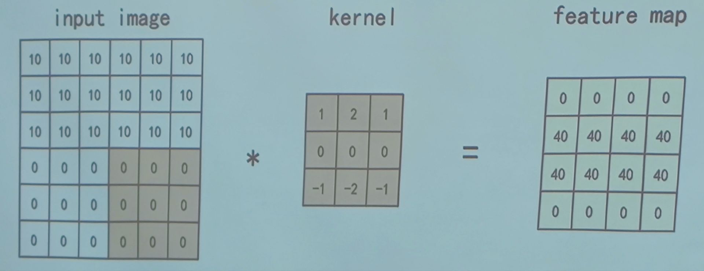
  

   卷积示例
  

> - 以上式结果为例，令结果矩阵为 $E$ ，那么对应 $E[i,j]$ 求法也就是将 `kernel` 左上角元素和 `input image` 的元素 $(i,j)$ 对齐(如果 `kernel` 右下角元素也没出 `input image` 的范围大小)，然后在 `kernel` 大小(上面例子为 `3×3` )的方格内，将 `input image` 的元素和 `kernel` 中元素相乘后，将 `3×3=9` 个元素相加，然后向右移步长个(本例为 `1` )单位并计算得到得到 $E(i,j+1)$ 。直到 `kernel` 右上角元素出界限，然后下移步长行将 `kernel` 左上角元素和 `input image` 这行的第一个元素对齐。
> - 那么， $E[0,0]=E[0,1]=E[0,2]=E[0,3]=10×1+10×2+10×1+10×0+10×0+10×0+10×(-1)+10×(-2)+10×(-1)=0$
> - $E[1/2,0-4]=10×1+10×2+10×1+10×0+10×0+10×0+0×(-1)+0×(-2)+0×(-1)=40$

> - $image \ size=w_I×h_I$
> - $kernel \ size=w_k×h_k$
> - $srtide = 1；stride为卷积窗口(卷积核)移动的步长$ 
> - $feature \ map \ size = w_f×h_f$ ，其中 $w_f=\frac{w_I-w_k}{stride}+1,h_f=\frac{h_I-h_k}{stride}+1$

##### 卷积层

- [x] 其实卷积和全连接在实质上是一个东西，只是换了个方面在看待网络。

  
  

   单卷积核卷积层
  

> - 一个卷积核可以提取图像的一种特征
> - 多个卷积核提取多种特征

  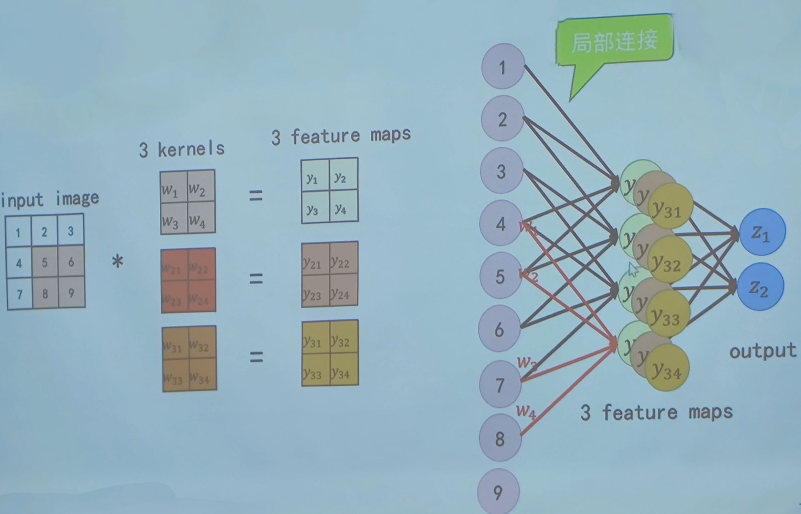
  

   多卷积核卷积层
  

> - 对于如上 `size`为 `3×3` 的 `image` ，如需提取 `100` 个特征，卷积层需要 `100` 个卷积核，假设卷积核大小为 `4` ，则共需 `4×100` 个参数。

##### 多通道卷积

  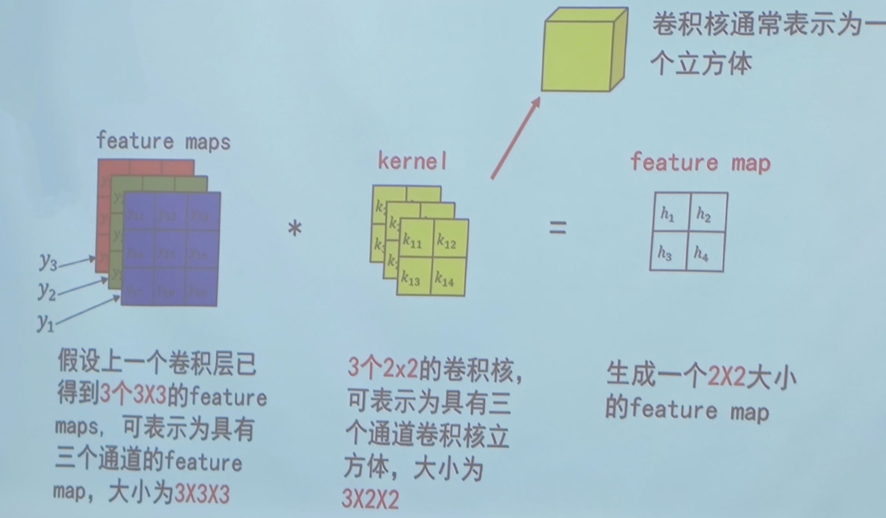
   
   
  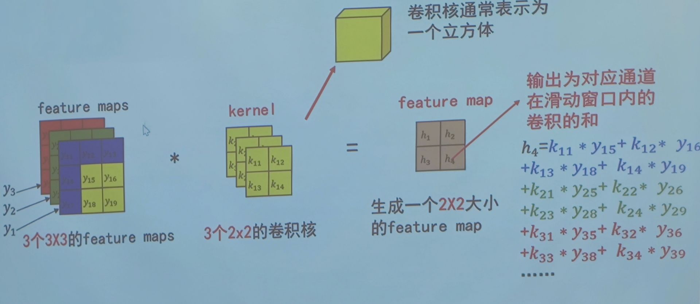
  

   多通道卷积
  

##### 多通道多核卷积

  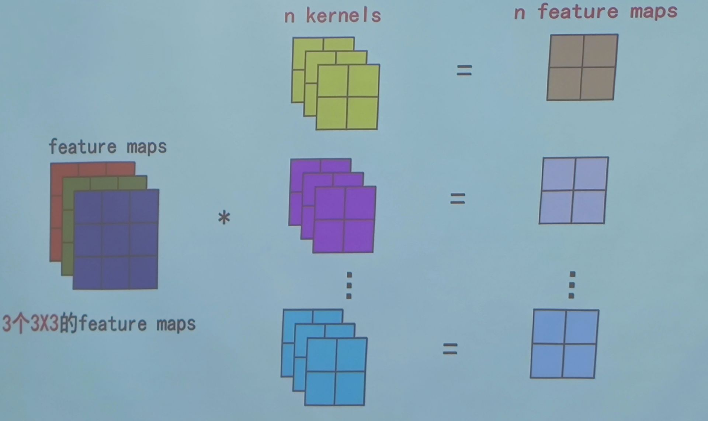
  

   多通道多核卷积
  

##### 池化层

- [x] 通过下采样缩减特征图的尺度，常用最大池化(Max pooling)(也就是取池内最大元素)和平均池化(Avg pooling)(取池内所有元素之和)。

  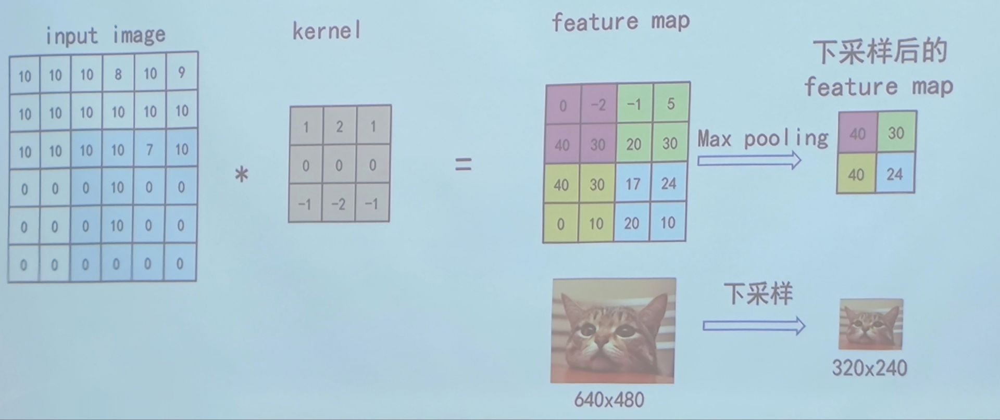
  

   示例
  

##### LeNet-5参数计算

> `LeNet-5` 用于判别手写文字

  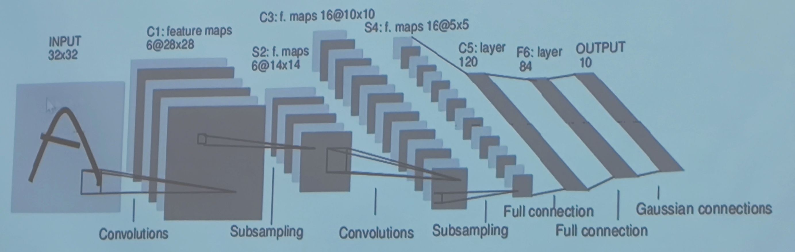

> - (卷积层): `6` 个卷积核，卷积核大小为 `5×5` ，共有 `6×25+6=156` 个参数(加了 `6` 个偏置)。
> - (pooling层): `6` 个 `feature map` ，则共有 `6×(1+1)=12` 个参数。(计算过程是 `2×2` 单元里的元素乘以训练参数 $w$ ,再加上偏置 $b$ )
> - C3层： `16` 个多通道卷积核，常规设置下每个卷积核通道数均为 `6` ，共 `96` 个平面卷积核。本网络中每个卷积核实际通道数分别为 `3` 、 `3` 、 `3` 、...、 `6` (如连接表所示)，共 `60` 个平面卷积核。每个平面卷积大小为 `5×5` ，则共有 `60×25+16=1516` 个参数(加 `16` 个偏置)。

  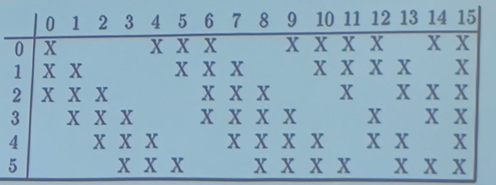
  

   S2层到C3层的连接表
  

> - S4层: `16` 个 `feature map` ，则共有 `16×(1+1)=32` 个参数。(计算过程同S2)
> - C5层: `120` 个多通道卷积核，每个卷积核通道数为 `16` ，共有 `120×16=1920` 个平面卷积核，每个平百卷积核大小为 `5×5` ,则共有 `1920×25+120=48120` 个参数(加 `120` 个偏置)。
> - F6层:全连接层，可训练参数为 `84×(120+1) =10164` 。
> - 输出层:由 `10` 个欧氏径向基函数组成。

## 网络正则化

- [x] 训练普通的神经网络时有什么不足？
  > - 梯度消失问题，由于网络的深度与导数的链式法则，模型训练容易进入到激活函数的梯度饱和区(梯度很小)，连续多层小于 $1$ 的梯度相乘会使梯度接近零，最终造成梯度消失。
  > - 分布不一致问题，由于数据的多样性，不同输入数据的统计信息分布不一致，而神经网络对输入分布的变化十分敏感(神经网络的输入分布若发生了改变，那么其参数需要重新学习,这种现象叫作内部协变量偏移Internal Covariate Shift)。

- [x] 解决方案
  > - `Batch Normalization`

### 批量归一化(Batch Normalization, BN)

> - 为了缓解这些问题，我们可以对神经网络的输入进行归一化操作，使其分布保持稳定。
> - 在神经网络的训练时，通常是按小批量样本( `mini-batch` ，大小为 `batch size` )进行训练的，批量归一化的意思就是对一个小批量训练数据做归一化操作，具体来说就是求出这批数据的均值和方差，然后用该均值和方差对这批训练数据做归一化。

#### 批量归一化定义

- [x] 对于一个深层神经网络，设第 $l$ 层的输入为 $z^{(l)}$ ，神经元的输出为 $a^{(l)}$ ，设 $f(·)$ 为激活函数， $W$ 和 $b$ 为可学习参数，则有:

$$a^{(l)}=f(z^{(l)})=f(Wa^{(l-1)}+b)$$

- [x] 为了提高优化效率，使得净输入 $z^{(1)}$ 的分布一致，把 $z^{(l)}$ 每一维都归一到标准正态分布，给定一个包含 $K$ 个样本的小批量样本集合 $\lbrace z^{(k,l)} \rbrace^K_{k=1}$ ，计算样本的均值和方差:

$$\mu_B=\frac{1}{K}\sum\limits_{k=1}^K z^{(k,l)}$$
$$\sigma_B^2=\frac{1}{K}\sum\limits_{k=1}^K (z^{(k,l)}-\mu_B)\circ (z^{(k,l)}-\mu_B)$$

> - 注： $\circ$ 为哈达玛积，表示向量按元素相乘，此处很明显由于神经网络的每层输入和输出都是一个向量，学习参数也是。

- [x] 批量归一化的作用就是将输入在 `batch` 的维度上进行归一化，即:

$$BN_{\gamma,\beta}(z^{(l)})=\frac{z^{(l)}-\mu_B}{\sqrt{\sigma_B^2+\epsilon}} \circ \gamma +\beta$$

  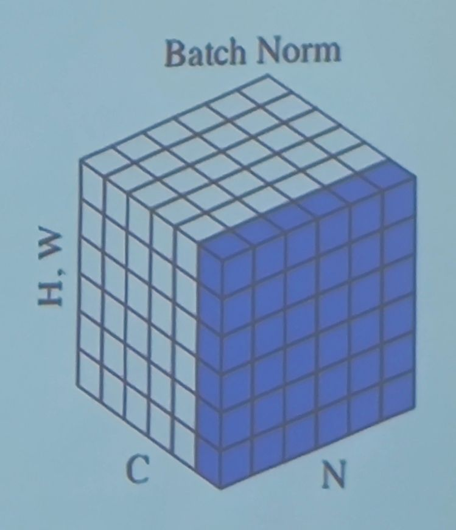

> - 为了使得归一化不对网络的表示能力造成负面影响，可以通过一个附加的缩放和平移变换改变取值区间,其中 $\gamma$ 为缩放系数， $β$ 为平移系数，可以使网络的输出 `重构原始特征的表达能力` 。 $\epsilon$ 是一个很小的常数，用来避免分母为零。

##### 批量归一化中的 $\gamma$ 和 $\beta$ 参数

> - 缩放系数 $\gamma$ 和平移系数 $\beta$ 作为网络参数通过反向传播算法和梯度下降法进行学习，缩放系数 $\gamma$ 控制每个特征的重要性，平移系数 $\beta$ 能够消除标准化带来的影响，可以增加模型的灵活性，使其能够对不同的输入数据产生不同的响应。
> - 从最保守的角度考虑，当 $\gamma=\sqrt{\sigma_B^2},\beta=\mu_B$ 时，通过归一化可以还原为原始的输入值 $BN_{\gamma,\beta}(z^{(l)})=z^{(l)}0$ 。

#### 测试阶段批量数据太小怎么办?

> - 测试阶段 `mini-batch` 的数量 `batch size` 可能较小(甚至为 $1$ )，直接计算方差与均值不能体现整体的数据分布,直接使用批量归一化没有明显效果。

- [x] 解决方案:引入“移动平均”机制:
  >- 在训练阶段，记录每次输入 `mini-batch` 的均值和方差，并用“移动平均”机制更新，记为 $\mu_{mov}$ 和 $\sigma_{mov}$ ，作为数据集整体分布的均值和方差。在测试阶段，直接使用 $\mu_{mov}$ 和 $\sigma_{mov}$ 对新的输入进行归一化。

##### 移动平均:训练阶段

- [x] 对每一次 `mini-batch` 的输入数据，计算 `mini-batch` 数据的均值和方差，第一个 `mini-batch` 直接使用计算得到的均值和方差 $\mu_{0}$ 和 $\sigma_{0}$ 保存为移动平均的值，即: $\mu_{mov_0}$ 和 $\sigma_{mov_0}$

$$\mu_{mov_0}=\mu_{0} ,\sigma_{mov_0}=\sigma_{0}$$

- [x] 对之后每次计算 `mini-batch` 数据的均值和方差，会使用当前的 `mini-batch` 的均值和方差以及上一阶段保存的移动平均的值，更新总体均值和方差的移动平均的值。这里采用加权平均的方式，假设当前 `mini-batch` 的均值和方差为 $\mu_{i}$ 和 $\sigma_{i}$ ;，上一阶段的估计值为 $\mu_{mov_{i-1}}$ 和 $\sigma_{mov_{i-1}}$ ，更新方式如下:

$$\mu_{mov_{i}} = m\mu_{mov_{i-1}}+(1-m)\mu_{i}$$
$$\sigma_{mov_{i}} = m\sigma_{mov_{i-1}}+(1-m)\sigma_{i}$$

> - 其中， $m$ 是一个小于 $1$ 的常数，一般 $m = 0.99$ ，通过移动平均机制，使得整个数据集的均值和方差估计值可以更加准确地反应真实分布。

- [x] 在测试阶段，使用最终得到的数据整体分布的均值 $\mu_{mov}$ 和 $\sigma_{mov}$ 进行归一化:

$$\hat{z}^{(l)}=\frac{z^{(l)}-\mu_{mov}}{\sqrt{\sigma_{mov}^2+\epsilon}}$$

- [x] 注意区别的是，在训练阶段，还是使用 `当前数据本身` 计算得到的均值 $\mu_B$ 和方差 $\sigma_B$ 进行归一化:

$$\hat{z}^{(l)}=\frac{z^{(l)}-\mu_{B}}{\sqrt{\sigma_{B}^2+\epsilon}}$$

#### 批量归一化原理过程(训练阶段)

  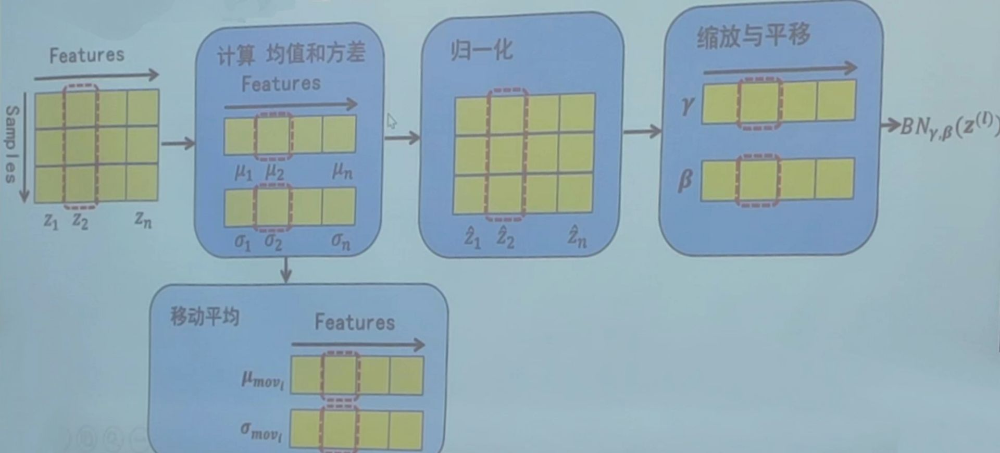
  

   批量归一化原理过程(训练阶段)
  

- [x] 首先计算均值和方差

$$\mu_B=\frac{1}{K}\sum\limits_{k=1}^K z^{(k,l)}, \sigma_B^2=\frac{1}{K}\sum\limits_{k=1}^K (z^{(k,l)}-\mu_B)\circ (z^{(k,l)}-\mu_B)$$

> - 注: $\mu_B=(\mu_1,\mu_2,\dots,\mu_n),\sigma_B=(\sigma_1,\sigma_2,\dots,\sigma_n)$ 

- [x] 然后执行移动平均

$$\mu_{mov_{i}} = m\mu_{mov_{i-1}}+(1-m)\mu_{i},\sigma_{mov_{i}} = m\sigma_{mov_{i-1}}+(1-m)\sigma_{i}$$

- [x] 其次进行归一化

$$\hat{z}^{(l)}=\frac{z^{(l)}-\mu_{B}}{\sqrt{\sigma_{B}^2+\epsilon}}$$

- [x] 最后进行缩放与平移

$$BN_{\gamma,\beta}(z^{(l)})=\hat{z}^{(l)} \circ \gamma +\beta$$

#### 批量归一化作用

> - ①缓解梯度消失问题:批量归一化可以控制数据的分布范围，在遇到 `sigmoid` 或者 `tanh` 等激活函数时，可以让激活函数的输入落在梯度非饱和区(梯度不会太小)，缓解梯度消失问题。
> - ②加快网络收敛:使得网络中每层输入数据的分布相对稳定，加速模型学习速度;

  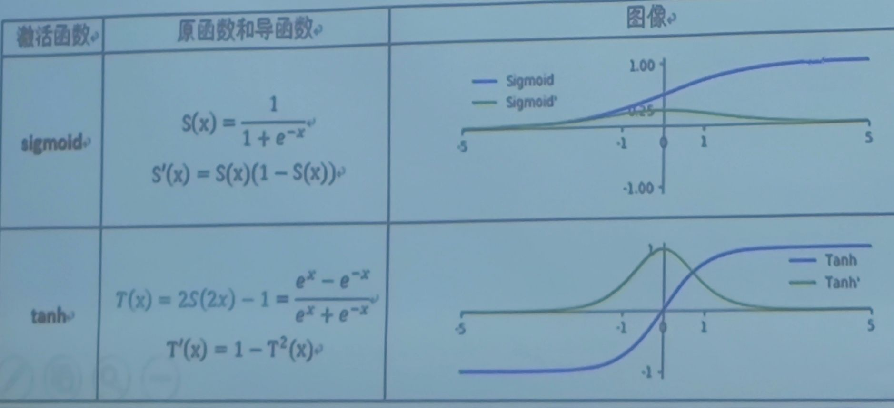

#### 批量归一化作用:梯度简单分析

- [x] 对前馈神经网络第 $l$ 层的前向传播有:

$$a^l=f(z^l)=f(W_la^{l-1}+b)$$

> - 其中 $a^l$ 为第 $l$ 层网络的输出， $a^{l-1}$ 第 $l$ 层的输入， $f(·)$ 为激活函数， $W$ 为第 $l$ 层网络的参数权重矩阵。该层输出与输入的梯度关系为:

$$\frac{\partial{a^l}}{\partial{a^{l-1}}}=\frac{\partial{a^l}}{\partial{z^l}}·\frac{\partial{z^l}}{\partial{a^{l-1}}}=h_l·W_l^T$$

> $h_l=diag \left(f'(z^l)\right)$ ，为激活函数的导数，是一个对角矩阵。

- [x] 梯度经过多层网络的反向传播，到第 $k$ 层( $k<l$ )的参数矩阵的梯度为:

$$\frac{\partial{a^l}}{\partial{W_k}}=\frac{\partial{a^l}}{\partial{a^k}}·\frac{\partial{a^k}}{\partial{W_k}}$$

> - 其中第 $l$ 层输出 $a^l$ 与第 $k$ 层输出 $a^k$ 的梯度关系为(由上式子中的链式法则得到的):

$$\frac{\partial{a^l}}{\partial{a^k}}=\frac{\partial{a^l}}{\partial{a^{l-1}}}·\frac{\partial{a^{l-1}}}{\partial{a^{l-2}}}·\dots ·\frac{\partial{a^{k+1}}}{\partial{a^k}}=\prod\limits_{i=k+1}^l h_iW_i^T$$

> - 若激活函数为 `sigmoid` 或 `tanh` ，则 $h_i$ 小于 $1$ ，当 $W_i$ 内的元素很小(也小于 $1$ )时，两项相乘仍然小于 $1$ ，多层累积以后， $a^l$ 与 $a^k$ 之间的梯度就有可能十分微小，甚至消失(相对地，若 $W_i$ 内元素很大可能发生 `梯度爆炸` )，因此第 $k$ 层的参数矩阵的梯度受此影响，网络无法持续训练。

- [x] 引入 `批量归一化` 的第 $l$ 层的前向传播有: $a^l=f(\hat{z}^l)=f(BN(z^l))=f(\frac{W_la^{l-1}-\mu_l}{\sigma_l})$

- [x] 针对该层的反向传播过程为: $\frac{\partial{a^l}}{\partial{a^{l-1}}}=\frac{\partial{a^l}}{\partial{\hat{z}^l}}·\frac{\partial{\hat{z}^l}}{\partial{a^{l-1}}}=\hat{h_l}·\frac{W_l^T}{\sigma_l}$ , $\hat{h_l}$ 为输入归一化后的激活函数的导数。

- [x] 连续多层的梯度反向传播为: $\frac{\partial{a^l}}{\partial{a^k}}=\prod\limits_{i=k+1}^l \hat{h_i}·\frac{W_i^T}{\sigma_i}$

> - (1) 经过归一化之后，激活函数的输入落在梯度非饱和区，因此 $\hat{h_i}$ 不会太小;
> - (2) 若 $W_i$ 很小，那么变换后的 $W_ia^{i-1}$ 必然很小，从而使得其标准差 $\sigma_i$ 较小(若 $W_i$ 很大，标准差 $\sigma_i$ 较大)，则 $\frac{W_i^T}{\sigma_i}$ 在一个合适的范围区间，因此避免了 `梯度消失或爆炸` ，即梯度与 $W_i$ 的尺度无关。

#### 批量归一化存在什么缺点呢?

> - 对 `batch size` 大小比较敏感，若 `batch size` 太小，计算的均值和方差不足以代表整个数据分布。

- [x] 解决方案
  > - `Layer Normalization`

### 层归一化(Layer Normalization,LN)

#### 层归一化定义

- [x] 同样假设某层的输入为 $z=[z_1,z_2,\dots ,z_m]$ ，维度为 $m$ ，也就是该层神经元个数。与批量归一化不同，层归一化是针对每个输入的样本 $z$ ，分别做归一化:

$$\mu=\frac{1}{m} \sum\limits_{i=1}z_i$$
$$\sigma^2=\frac{1}{m} \sum\limits_{i=1}(z_i-\mu)^2$$

  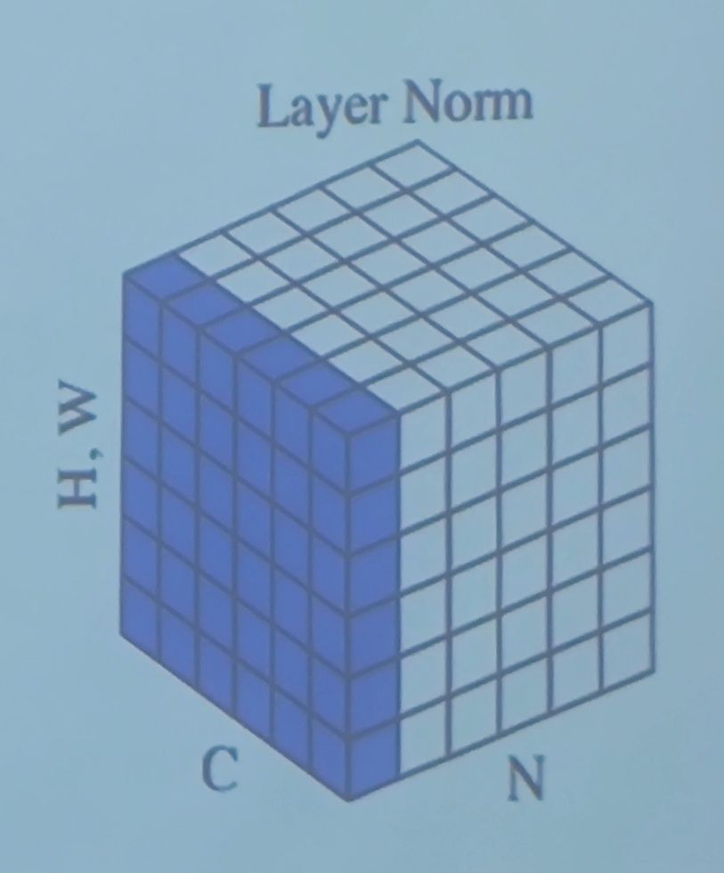

> - 输入 $z$ 是向量， $\mu$ 和 $\sigma^2$ 是标量,并加入缩放系数 $\gamma$ 和平移系数 $\beta$ ,

$$LN_{\gamma,\beta}=\frac{z-\mu}{\sqrt{\sigma+\epsilon}} \circ \gamma +\beta$$

#### 批量归一化 vs 层归一化

- [x] 批量归一化作用在整体 `batch` 数据层面，层归一化作用在单个数据层面。

  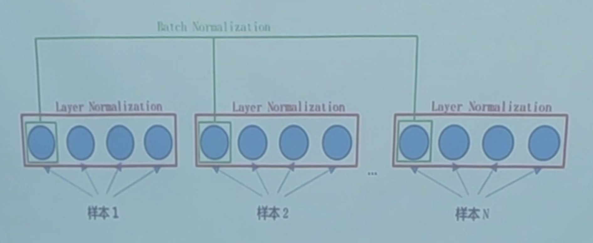

### 训练普通的神经网络还有什么不足?

- [x] `过拟合` :深度学习的模型中如果模型的参数太多，而训练样本又太少，训练出来的模型很容易产生过拟合的现象，即模型在训练数据上损失函数较小，预测准确率较高;但是在测试数据上损失函数比较大，预测准确率较低。

- [x] 解决方案
  > - `Dropout`

### Dropout

#### Dropourt工作流程

- [x] 首先以概率 $1-p$ 随机删掉网络(使其不起作用)中部分隐藏神经元;

- [x] 在训练阶段，对于每个批次样本，把输入通过修改后的网络(前向传播)，然后把损失的梯度(这个位置指的是通过总损失，然后修改没删除的神经元的参数)通过修改后的网络(反向传播，也就是反向传播算法)，在没有被删除的神经元上更新对应的参数;
  > - 这个位置可以看出来，由于神经元的数据是向前推导的，最后会得到最终的输出和总损失，而梯度和参数的更新是由总损失 $L$ 一直推导到第一层的参数，也就是反向传播

- [x] 在测试阶段，不需要随机删除神经元，但是需要对神经元的权重进行调整，让它乘上概率 $p$ ，再进行前向传播。

  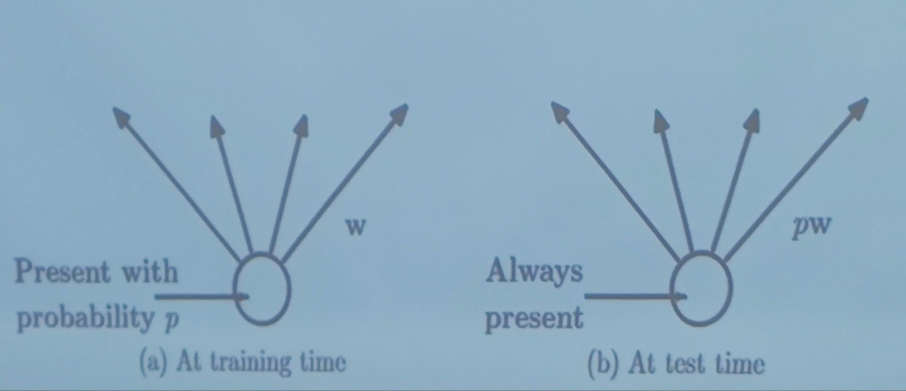
  

   Dropourt工作流程
  

##### 无Dropout层的情况

  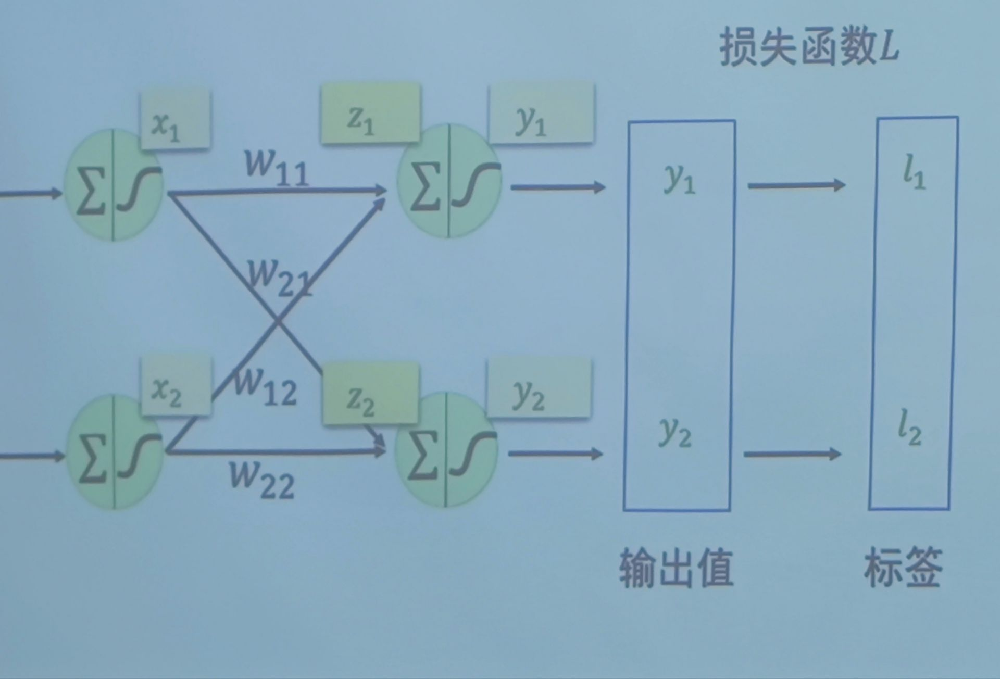
  

   无Dropout层的情况
  

$$z_1=w_{11}x_1+w_{12}x_2$$

$$z_1=w_{21}x_1+w_{22}x_2$$

$$y_1=f(z_1)=f(w_{11}x_1+w_{12}x_2)$$

$$y_2=f(z_2)=f(w_{21}x_1+w_{22}x_2)$$

$$loss=L(y,l)$$

##### 训练阶段加入Dropout:随机删除第一个神经元( $p=0.5$ )

  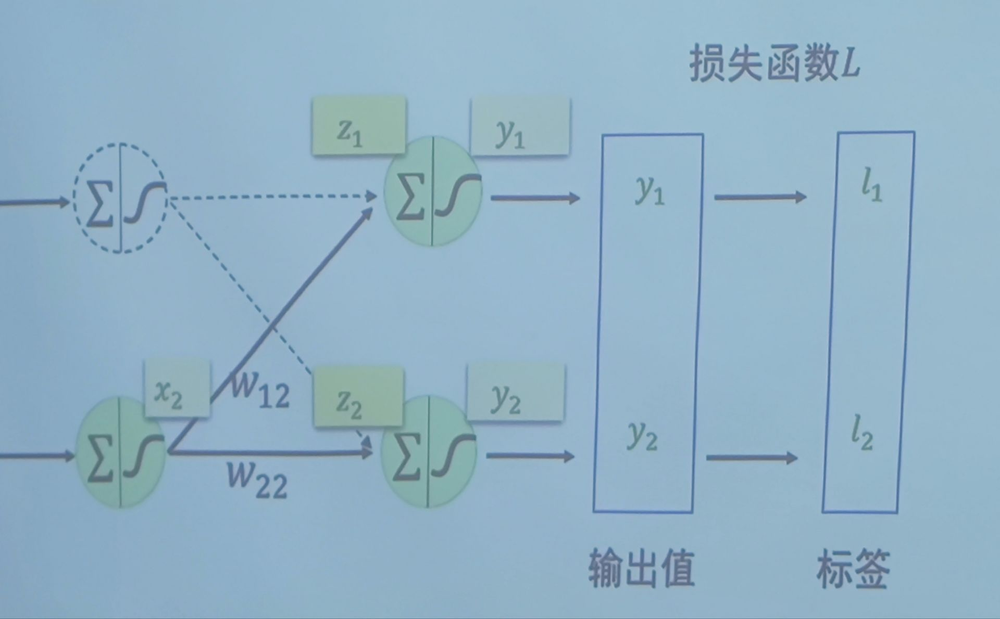
  

   训练阶段加入Dropout
  

$$z_1=w_{12}x_2$$

$$z_1=w_{22}x_2$$

$$y_1=f(z_1)=f(w_{12}x_2)$$

$$y_2=f(z_2)=f(w_{22}x_2)$$

$$loss=L(y,l)$$

> - 此时只用反向传播算法对 $w_{12}$ 和 $w_{22}$ 进行调整

##### Dropout测试阶段:不删除神经元，但相关参数变化( $p=0.5$ )

  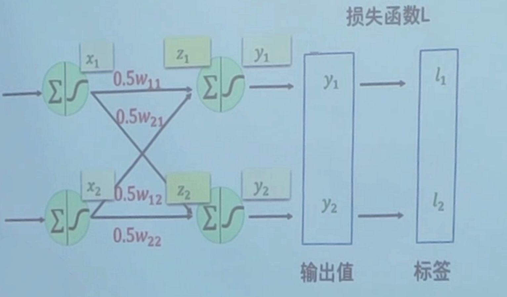
  

   Dropout测试阶段
  

> 也就是对要分别乘上没有被删除和被删除的概率。

$$z_1=0.5w_{11}x_1+0.5w_{12}x_2$$

$$z_1=0.5w_{21}x_1+0.5w_{22}x_2$$

$$y_1=f(z_1)=f(0.5w_{11}x_1+0.5w_{12}x_2)$$

$$y_2=f(z_2)=f(0.5w_{21}x_1+0.5w_{22}x_2)$$

$$loss=L(y,l)$$

> - 在实际情况中， `Dropout` 的参数 $p$ 不一定取值 $0.5$ ，而会根据具体网络情况选择

#### Dropourt作用

> - 降低过拟合:在深度学习中，模型如果过于复杂，容易发生过拟合现象。 `Dropout` 可以随机关闭一部分神经元，使得每次网络的拓扑结构都会发生变化，从而减少网络的复杂度,降低过拟合。
> - 提高泛化能力:通过 `Dropout` ，模型输入不依赖某些特定的神经元，从而提高模型的泛化能力，增强模型鲁棒性。
