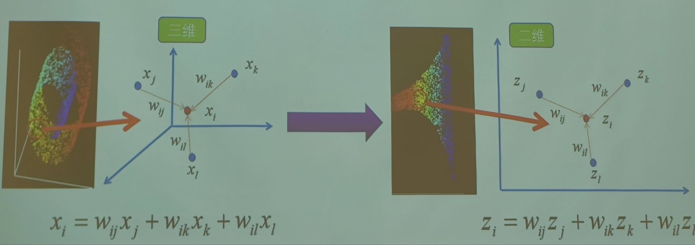
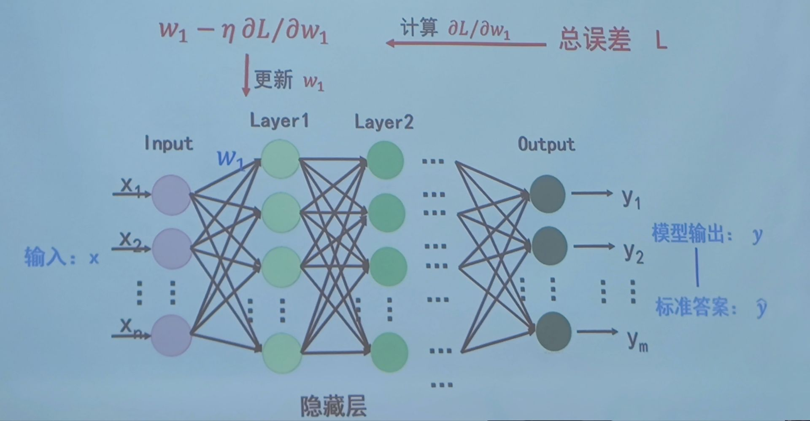
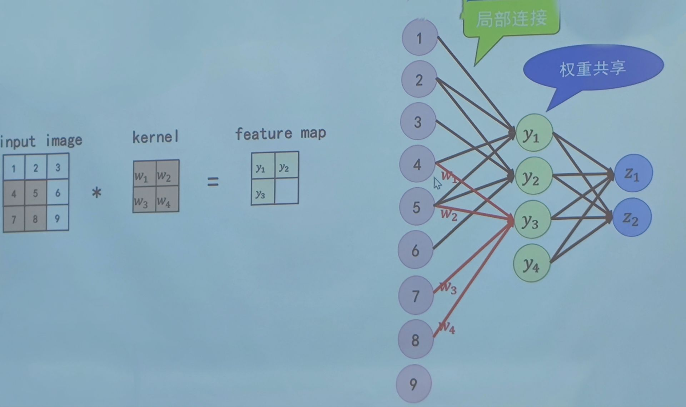
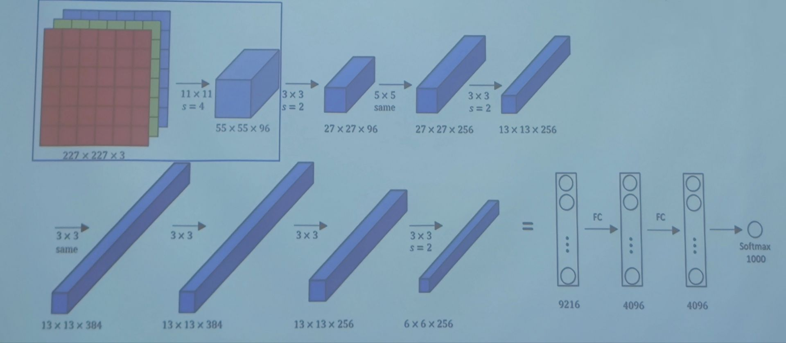
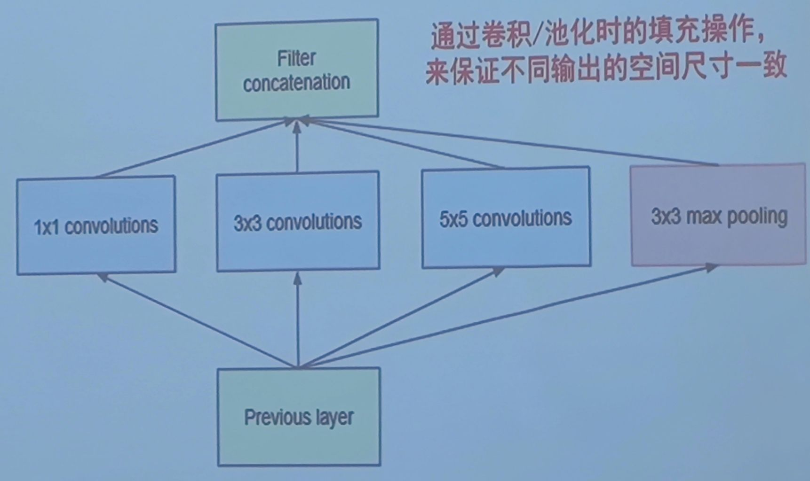
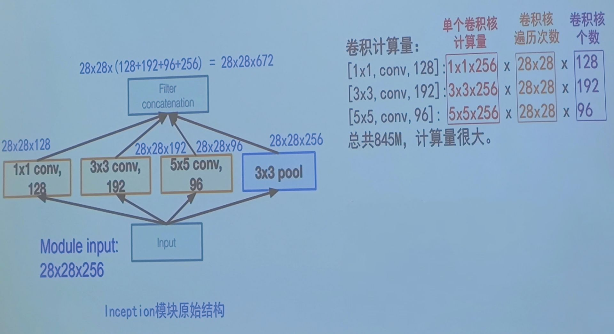
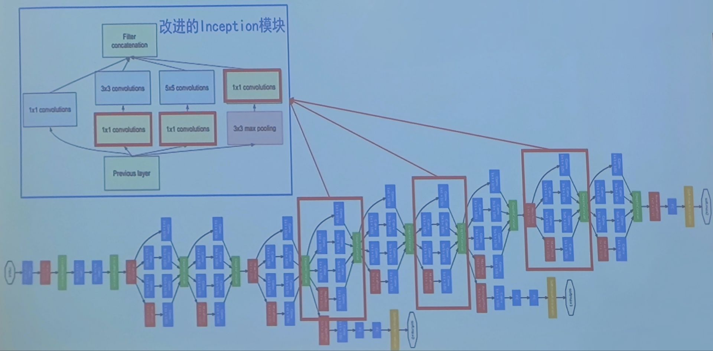
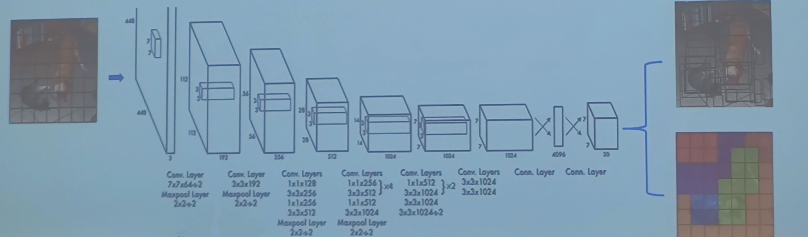
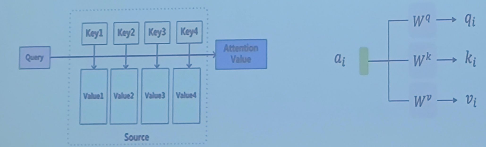
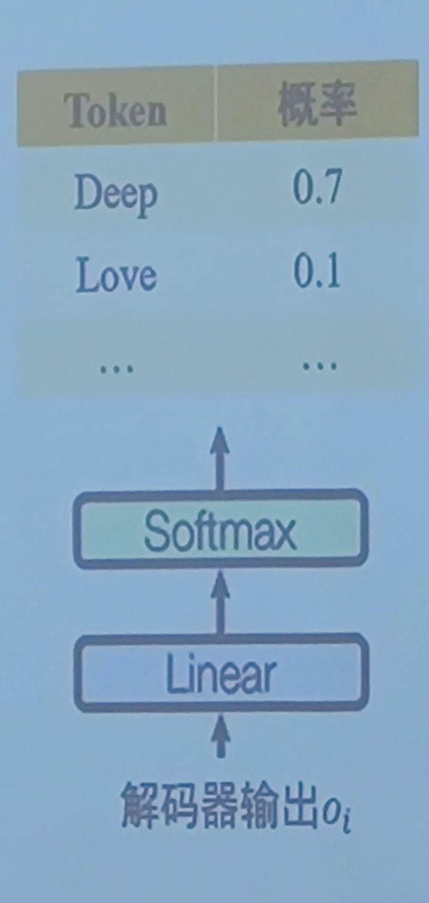

# 课前须知

## 考核方式

- [x] 一次作业(单独完成)，看情况布置， ~~可能不布置~~ ，提交代码和书面报告。 **本学期(24春)有，已经定了。**

- [x] 一次课程项目(组队完成，本学期5人一组)，提交代码和书面报告，并进行课堂汇报

<div align="center">
  <table>
  <tr>
    <th>考勤</th>
    <th>作业</th>
    <th>课程项目</th>
    <th>课程汇报</th>
    <th>总分</th>
  </tr>
  <tr>
    <td>10</td>
    <td>20</td>
    <td>50</td>
    <td>20</td>
    <td>100</td>
  </tr>
</table>
</div> 

## 课程资源

- [x] 提供高性能服务器：30W服务器两台，100W服务器一台

- [x] 提供实验室一间

- [x] 每类课程项目分配助教一对一指导

## 课程目标

- [x] 掌握机器学习的基础理论

- [x] 掌握机器学习的应用技能

- [x] 鼓励面向前沿的深入探索

## 助教联系方式和指导方向

- [ ] 徐本峰，benfeng@mail.ustc.edu.cn &nbsp; 大语言模型，ACL2023、ICLR2023、EMNLP2022、AAAD021、ACL2020
- [ ] 陈卓为，chenzw01@mail.ustc.edu.cn &nbsp; 图像生成，AAAI2024、CVPR2023、ACM &nbsp; MM2022
- [ ] 张坤，kkzhang@mail.ustc.edu.cn &nbsp; 图文对齐，CVPR2022、T-MM2022、AAAI2022
- [ ] 黄梦琪，huangmq@mail.ustc.edu.cn &nbsp; 图像生成，CVPR2024、CVPR2023(2篇)、ACM &nbsp; MM2022(最佳学生论文)
- [ ] 付哲仁，fzr@mail.ustc.edu.cn &nbsp; 图文对齐，CVLR2024、CVPR2023、T-MM2022、T-CSVT2022、AAAI2021
- [ ] 李家昂，jail@mail.ustc.edu.cn &nbsp; 知识推理，EMNLP2023、ICASSP2023
- [ ] 李佳豪，jiahao66@mail.ustc.edu.cn &nbsp; 大语言模型，EMNLP2023、EMNLP2022
- [ ] 涂科宇，tky2017ustc_dx@mail.ustc.edu.cn &nbsp; 图像生成，ACM &nbsp; MM2023
- [ ] 郭文歆，noc1064@mail.ustc.edu.cn &nbsp; 图文对齐，COLING2024
- [ ] 夏厚，overwhelmed@mail.ustc.edu.cn &nbsp; 图文对齐

# 第一章 绪论

## 基础知识

- [x] 机器学习：寻找一个合适的函数，使得输入(要求、问题、描述等)转化为想要的输出(回答、解释、答案)
  > - 图像分类
  > - 文本生成

- [x] 学习过程

> 通俗说法：


  
> 专业术语


> - 举例：
> - 建立模型(也就是提供一些函数选择): $\lbrace f(x)=k·x|k=1,2,3,\dots ,\dots \rbrace$
> - 损失函数(判断函数是不是最优选择): $\min \sum (y-f(x))^2$
> - 参数学习： $f(x)=2x$ (已经有散点图的情况下进行模拟)

## 机器学习分类

### 监督学习

- [x] 数据：有标签信息

- [x] 主要思想：分类、回归

### 无监督学习

- [x] 若数据不包含标签信息，是否可以挖掘数据内在规律？

- [x] 数据:无标签信息

- [x] 学习目标:探索数据的内在性质与规律，挖掘数据之间的关系
  > 聚类和降维

## 数据
- [x] 数据内容：属性、标签
- [x] 数据划分：训练集、测试集

## 性能评价

- [x] 查准率、精确度(Precision)/准确率(Accuracy):所有样本中被正确预测结果的比例，用检测阳性/阴性来说明

$$查准率=\frac{真阳性数}{真阳性数+假阳性数},其中假阳性数也就是检测为阳性但是实际为阴性的样本数$$

- [x] 召回率(Recall)又叫 `查全率` ，它是 `针对原样本` 而言的，它的含义是 `在实际为正的样本中被预测为正样本的概率` ，同样用检测阳性/阴性来说明

$$查全率=\frac{真阳性数}{真阳性数+假阴性数},其中假阴性数也就是检测为阴性但是实际为阳性的样本数$$

- [x] P-R曲线：查准率-查重率构成的曲线
  > - 准确率和召回率越高越好，但是一般情况下，两者之间存在一定的反比关系
  > - 当一模型的P-R曲线“包住”另一个模型时，认为该模型较优，图中B优于C
  > - 当两个指标发生冲突时，需要一些性能度量来综合考虑查准率和查全率
  > > - mAP：平均精度，P-R曲线与坐标轴围成的面积大小，越大越好
  > > - 平衡点：P-R曲线和P=R直线的交点，“查准率=查全率”时的取值，越大越好
  > > - F1分数：查准率与查全率的调和平均，越大越好

$$\frac{1}{F1}=\frac{1}{2}·(\frac{1}{查准率}+\frac{1}{查全率})$$

<p align="center">
  
  <p align="center">
   <span>P-R曲线</span>
  </p>
</p>

## 模型表现

- [x] 训练误差：模型在训练样本上的错误率
- [x] 泛化误差：模型在新样本（模型没有学习过的未知样本）上的错误率
- [x] 泛化能力不足的两种表现：
  > - 欠拟合：对训练样本的一般性质没有学好，在训练集和测试集上误差都很大
  > - 过拟合：过度拟合了训练样本的特性，在训练样本上误差很小、在新样本上误差很大

- [x] 例：树叶训练
  > - 过拟合模型分类结果:不是树叶(误以为树叶必须有锯齿)
  > - 欠拟合模型分类站果:→是树叶(误以为绿色的都是树叶)

# 第二章 回归分析

## 概述

### 回归

- [x] 对于给定的数据集： $D=\lbrace (x_1,y_1),(x_2,y_2),\dots ,(x_n,y_n)\rbrace$ ，其中 $x_i \in C=R^d,y_i \in Y=R$ ，是连续值(如果为分散值，则为分类而不是回归)
  > - 寻找 $C$ 上的映射函数： $f(x):C \rightarrow Y$
  > - 使得： $f(x_i) \approx y_i$

### 线性回归

- [x] 映射函数：线性函数 $f(x_i)=w·x_i+b$

- [x] 对样本 $x_i$ 进行线性变换

### 一元线性回归

- [x] 映射函数：线性函数 $f(x_i)=w·x_i+b$

- [x] 每个样本 $x_i$ 是一维的

### 多元线性回归

- [x] 实际应用场景中的变量大多具有多个属性
  > - 例如，想对房价进行预测，房价的影响因素有多个属性：面积，房龄，楼层等
  > - 假设房价与上述因素满足 `多元线性关系` ，需要寻找 `多元线性函数` 来预测房价： $房价=面积×w_1+房龄×w_2+楼层×w_3+b$

### 非线性回归

- [x] 线性函数无法准确拟合变量之间的关系时，使用更复杂的非线性回归方法，也就是将数据拟合为非一次方程的模式

### 性能评价

- [x] 为了使得回归模型的预测值和回归目标尽可能接近。常使用 `均方误差` 衡量性能

$$E(F;D)=\frac{1}{n} \sum\limits_{i=1}^n (f(x_i)-y_i)^2$$

## 线性回归

### 问题定义
- [x] 目标：寻找最优线性回归函数

$$f(x_i)=w_1x_{i1}+w_2x_{i2}+ \dots +w_dx_{id}+b=\omega ^Tx_i+b$$

> **注： $x_i$ 和 $\omega$ 在此处均为d维向量，即 $x_i ,\omega \in R^d$**

- [x] 如何获得最优解参数 $\omega ^{\*}$ 和 $b^{\*}$ ?
  > - 方法一：最小二乘法————将误差最小化
  > - 方法二：极大似然法————将概率最大化

### 最小二乘法

#### 一元线性回归

- [x] 一元情况，即 `样本属性是一维的` ，向量 $x_i$ 在此处为一个值，线性回归模型试图学得： $f(x)=\omega x+b$ ，使得 $f(x_i) \approx y_i$

- [x] 使用 `均方误差` 来衡量预测结果与回归目标之间的误差：

$$E(F;D)=\frac{1}{n} \sum\limits_{i=1}^n (f(x_i)-y_i)^2 = \frac{1}{n} \sum\limits_{i=1}^n (\omega x_i +b-y_i)^2$$

- [x] 最小二乘法的目标是使得 `均方误差最小化` :

$$(\omega ^{\*},b^{\*})=\underset{\substack{(\omega, b)}}{\arg\min} E(F;D)=\underset{\substack{(\omega, b)}}{\arg\min} \sum\limits _{i=1}^n (\omega x_i +b-y_i)^2$$

> **注：此处的 `argmin` 就是后续函数取最小值时的参数值， $\frac{1}{n}$ 由于为定值被省略了**

##### 一元线性回归如何求解最优参数
- [x] $(\omega ^{\*},b^{\*})=\underset{\substack{(\omega, b)}}{\arg\min} \sum\limits _{i=1}^n (\omega x_i +b-y_i)^2$ 怎么求解最优的 $(\omega ^{\*},b^{\*})$

> 由于 $\sum\limits _{i=1}^n (\omega x_i +b-y_i)^2$ 是关于 $\omega ,b$ 的二次函数，，所以二次极值点只有一个，所以存在唯一的全局最优解。
> > 证明：对于二元二次函数而言不难有假设 $g(x,y)=ax^2+by^2+cxy+dx+ey+f$ ，那么对于极值点 $(x_0,y_0)$ 而言有

$$\begin{cases}
g _x(x_0,y_0) = \frac{\partial g}{\partial x}| _{x=x_0,y=y_0} =0\newline
g _y(x_0,y_0) = \frac{\partial g}{\partial y}| _{x=x_0,y=y_0} =0\newline
\end{cases}$$

> > 带入 $g(x,y)=ax^2+by^2+cxy+dx+ey+f$ 到上述方程组则有方程组

$$\begin{cases}
g _x(x_0,y_0) =2ax_0 +cy_0 +d=0\newline
g _y(x_0,y_0) =2by_0 +cx_0 +e=0\newline
\end{cases}$$

> > 解得

$$\begin{cases}
x_0=\frac{ec-2bd}{4ab-c^2} \newline
y_0=\frac{2ae-cd}{4ab-c^2} \newline
\end{cases}
$$

> > 上述可以看出来只有唯一一个极值点，故存在唯一的全局最优解，因为很明显，对于回归问题中的 $a,b$ 都是非负值，一定存在唯一极小值点，故存在全局最优解

> 所以回到回归问题中，求最优的 $(\omega ^{\*},b^{\*})$ 即对 $\sum\limits _{i=1}^n (\omega x_i +b-y_i)^2$ 求偏导即可，即有

$$\begin{cases}
\frac{\partial E(\omega ,b)}{\partial \omega}=0 \newline
\frac{\partial E(\omega ,b)}{\partial b}=0 \newline
\end{cases} \rightarrow 
\begin{cases}
\sum\limits_{i=1}^n 2(\omega x_i +b-y_i)x_i = 2\left(w\sum\limits_{i=1}^n x_i^2-\sum\limits_{i=1}^n (y_i-b)x_i\right)=0 \newline
\sum\limits_{i=1}^n 2(\omega x_i +b-y_i)=2nb+2\sum\limits_{i=1}^n (\omega x_i-y_i)=2\left(nb-\sum\limits_{i=1}^n (y_i-\omega x_i)\right)=0 \newline
\end{cases} \rightarrow
\begin{cases}
\omega^{\*}=\frac{\sum\limits _{i=1}^n y _i(x _i- \overline{x})}{\sum\limits _{i=1}^n x_i^2- \frac{1}{n}\left(\sum\limits _{i=1}^n x_i \right)^2} , & \text{其中} \overline{x}=\frac{1}{n} \sum\limits _{i=1}^n x_i\newline
b^{\*}=\frac{1}{n} \sum\limits _{i=1}^n (y_i- \omega x_i)\newline
\end{cases}$$

#### 多元线性回归

- [x] 多元线性回归同样通过最小化均方误差来对 $\omega,b$ 进行估计
  > - 回归函数 $f(x_i)=w_1x_{i1}+w_2x_{i2}+ \dots +w_dx_{id}+b=\omega ^Tx_i+b$
  > - 均方误差 $E(F;D)=\frac{1}{n} \sum\limits _{i=1}^n (f(x_i)-y_i)^2=\frac{1}{n} \sum\limits _{i=1}^n (\omega ^T x_i+b-y_i)^2$
  > - 最优参数 $(\omega ^{\*},b^{\*})=\underset{\substack{(\omega, b)}}{\arg\min} E(F;D)=\underset{\substack{(\omega, b)}}{\arg\min} \sum\limits _{i=1}^n (\omega ^T x_i +b-y_i)^2$

> 与一元不同的是上述表达式中的 $x_i,\omega$ 是多维向量，而不是一个单独值

#### 多元线性回归何求解最优参数

- [x] 由于 $E(F;D)=\frac{1}{n} \sum\limits _{i=1}^n (f(x_i)-y_i)^2=\frac{1}{n} \sum\limits _{i=1}^n (\omega ^T x_i+b-y_i)^2$
> - 令： $\hat{\omega}=(\omega ^T,b)^T=(w_1,\dots , w_d,b)^T \ \ \ \ \hat{x_i}=(x_i^T,1)^T=(x_{i1},\dots ,x_{id},1)^T$ ，此处也说明 $\omega ,x_i \in R^d$
> - 有 $E(F;D)=\frac{1}{n} \sum\limits _{i=1}^n (\omega ^T x_i+b-y_i)^2=\frac{1}{n} \sum\limits _{i=1}^n (\hat{\omega} ^T \hat{x_i}-y_i)^2=\frac{1}{n} \sum\limits _{i=1}^n (y_i- \hat{\omega} ^T \hat{x_i})^2$
> - 令： $E_i=y_i- \hat{\omega} ^T \hat{x_i}$
> - 有 $E(F;D)=\frac{1}{n} \sum\limits _{i=1}^n (y_i- \hat{\omega} ^T \hat{x_i})^2=\frac{1}{n} \sum\limits _{i=1}^n E_i^2$
> - 则有

$$E(F;D)=\frac{1}{n} \sum\limits _{i=1}^n E_i^2=\frac{1}{n}(E _1,\dots ,E _n)\left(\begin{matrix}
E _1 \newline
\vdots \newline
E _n\end{matrix}\right)=\frac{1}{n}\left(\begin{matrix}
E _1 \newline
\vdots \newline
E _n\end{matrix}\right)^T\left(\begin{matrix}
E _1 \newline
\vdots \newline
E _n\end{matrix}\right)$$

> - 令 $E_i=y_i- \hat{\omega} ^T \hat{x_i}$
> - 则有

$$E(F;D)=\frac{1}{n}\left(\begin{matrix}
y_1- \hat{\omega} ^T \hat{x_1} \newline
\vdots \newline
y_n- \hat{\omega} ^T \hat{x_n}\end{matrix}\right)^T\left(\begin{matrix}
y_1- \hat{\omega} ^T \hat{x_1} \newline
\vdots \newline
y_n- \hat{\omega} ^T \hat{x_n}\end{matrix}\right)=\frac{1}{n}\left[\left(\begin{matrix}
y_1 \newline
\vdots \newline
y_n \end{matrix}\right)-\left(\begin{matrix}
\hat{\omega} ^T \hat{x_1} \newline
\vdots \newline
\hat{\omega} ^T \hat{x_n}\end{matrix}\right)\right]^T\left[\left(\begin{matrix}
y_1 \newline
\vdots \newline
y_n \end{matrix}\right)-\left(\begin{matrix}
\hat{\omega} ^T \hat{x_1} \newline
\vdots \newline
\hat{\omega} ^T \hat{x_n}\end{matrix}\right)\right]$$

> **注：此处最后一步是根据行列式性质得到的，这是因为 $\hat{\omega}^T\hat{x_i}$ 和 $y_i$ 无关可以直接拆分**

> - 由于有

$$\left(\begin{matrix}
\hat{\omega} ^T \hat{x_1} \newline
\vdots \newline
\hat{\omega} ^T \hat{x_n}\end{matrix}\right)=(\hat{\omega} ^T\hat{x_1},\dots ,\hat{\omega} ^T\hat{x_n})^T=[\hat{\omega} ^T(\hat{x_1},\dots ,\hat{x_n})]^T=(\hat{x_1},\dots ,\hat{x_n})^T \hat{\omega}=\left(\begin{matrix}
\hat{x_1}^T \newline
\vdots \newline
\hat{x_n}^T\end{matrix}\right)\hat{\omega}$$

> - 则

$$E(F;D)=\frac{1}{n}\left[\left(\begin{matrix}
y_1 \newline
\vdots \newline
y_n \end{matrix}\right)-\left(\begin{matrix}
\hat{x_1}^T \newline
\vdots \newline
\hat{x_n}^T\end{matrix}\right)\hat{\omega}\right]^T\left[\left(\begin{matrix}
y_1 \newline
\vdots \newline
y_n \end{matrix}\right)-\left(\begin{matrix}
\hat{x_1}^T \newline
\vdots \newline
\hat{x_n}^T\end{matrix}\right)\hat{\omega}\right]$$

> - 不妨令

$$X=\left(\begin{matrix}
\hat{x_1}^T \newline
\vdots \newline
\hat{x_n}^T\end{matrix}\right)=\left(\begin{matrix}
x_{11} \ \cdots \ x_{1d} \ 1\newline
\vdots \ \ddots \ \vdots \ \ \ \ \ \ \ \  \vdots\newline
x_{n1} \ \cdots \ x_{nd} \ 1\end{matrix}\right),y=\left(\begin{matrix}
y_1 \newline
\vdots \newline
y_n \end{matrix}\right)=(y_1,\dots ,y_n)^T$$

> - 则有

$$E(F;D)=\frac{1}{n}(y-X\hat{\omega})^T(y-X\hat{\omega})$$

- [x] 优化目标表示为 $\hat{\omega}^{\*}=\underset{\substack{\hat{\omega}}}{\arg\min} (y-X\hat{\omega})^T(y-X\hat{\omega})$

- [x] 求解 $\hat{\omega}^{\*}$ ，需要通过矩阵求导，[常见矩阵求导公式](https://blog.csdn.net/weixin_45816954/article/details/119817108?app_version=6.2.9&code=app_1562916241&csdn_share_tail=%7B%22type%22%3A%22blog%22%2C%22rType%22%3A%22article%22%2C%22rId%22%3A%22119817108%22%2C%22source%22%3A%222301_79807208%22%7D&uLinkId=usr1mkqgl919blen&utm_source=app)：

$$\frac{\partial E(F;D)}{\partial \hat{\omega}}=\frac{2}{n}X^T(X\hat{\omega}-y)$$

- [x] 令上式为0可得到 $\hat{\omega}$ 最优解的闭式解，但涉及矩阵求逆，需分情况讨论

###### 求解情形一

- [x] 当 $X^TX$ 为 [满秩矩阵](https://baike.baidu.com/item/%E6%BB%A1%E7%A7%A9%E7%9F%A9%E9%98%B5) 或 [正定矩阵](https://baike.baidu.com/item/%E6%AD%A3%E5%AE%9A%E7%9F%A9%E9%98%B5)，(此处就是为了保证 $X^TX$ 存在逆矩阵)令上式为0可得
  > - **方阵的满秩，和方阵可逆，和方阵的行列式不等于零，和组成方阵的各个列向量线性无关，和齐次方程组只有零解，这些都是等价的。**

$$\frac{2}{n}X^T(X \hat{\omega} - y)=0$$

$$\hat{\omega}^{\*}=(X^TX)^{-1}X^Ty$$

> 最终得到的多元线性回归模型为：

$$f(\hat{x_i})=\hat{\omega}^{\*T}\hat{x_i}=\hat{x_i}^T\hat{\omega}^{\*}=\hat{x_i}^T (X^TX)^{-1}X^Ty$$

##### 求解情形二

- [x] 当 $X^TX$ 为满秩矩阵或正定矩阵，则 $X^TX$ 不存在逆矩阵
  > - 此时可以求出多个 $\hat{\omega}$ ，都能使均方误差最小化，如何处理？
  > - 常见做法是 `正则化(regularization)` 项，使得原式有唯一解
  > > - 正则项 $E_w=||\hat{\omega}||^2_2$ ，为2-范数的平方。(向量范数有∞-范数(最大范数) $||X|| _{\infty} =\max\limits _{1 \leq i \leq n}|x_i|$ ，1-范数 $||X||_1=\sum\limits _{i=1}^n|x_i|$ ，2-范数 $||X||_2=(\sum\limits _{i=1}^n|x_i|^2)^{\frac{1}{2}}$ ，p-范数 $||X|| _p=(\sum\limits _{i=1}^n|x_i|^p)^{\frac{1}{p}}$ ,矩阵范数有行和范数 $||A|| _{\infty}=\max\limits _{1 \leq i \leq n} \sum\limits _{j=1}^n |a _{ij}|$ ,列和范数 $||A|| _1=\max\limits _{1 \leq j \leq n} \sum\limits _{i=1}^n |a _{ij}|$ ,谱范数 $||A|| _2=\sqrt{\lambda _{max}(A^TA)}$ )
  > > - 优化目标变为: $E(f;D)=\frac{1}{n}(y-X\hat{\omega})^T(y-X\hat{\omega})+\lambda ||\hat{\omega}||^2_2$
  > > - 最优解变为: $\hat{\omega}^{\*}=(X^TX+ \lambda I)^{-1}X^Ty$
  > > - 通过调整正则项的系数，可以使得 $X^TX+ \lambda I$ 的逆存在，从而原式有唯一解

### 极大似然法

- [x] 似然函数：设总体 $X$ 有概率函数 $g(x;θ)$ ，其中 $x$ 为样本， $θ$ 为参数，当固定 $x$ 时把 $g(x;θ)$ 看做 $θ$ 的函数，称为似然函数，记作 $L(x;θ)$ 或 $L(θ)$
- [x] 在简单样本的情况下，一般有 $L(x;θ)=\prod\limits_{i=1}^n g(x_i;θ)$
  > - 例：抛一枚不均匀的硬币，抛到正面( $x=0$ )的概率为 $θ$ ，抛到反面( $x=1$ )的概率为 $1-θ$ ，则 $g(x=0;θ)=θ,g(x=1;θ)=1-θ$
  > - 从总体X中抽样十个样本，即抛硬币10次，其中7次正面3次反面，则似然函数为

$$L(x_1,\dots ,x_{10};θ)=\prod\limits_{i=1}^{10} g(x_i;θ)=θ^7(1-θ)^3$$

- [x] 极大似然估计：在给定 $x$ 时，参数 $θ$ 的极大似然估计值 $\hat{θ}$ 满足,

$$L(\hat{θ})= \max\limits_{θ} L(x;θ)$$

- [x] 极大似然估计表示在参数为 $\hat{θ}$ 时，能够观察到 $x$ 的可能性最大

- [x] 通常使用对数似然函数 $l(θ)=\ln L(θ)$ 进行计算
  > - 例：抛不均匀硬币的似然函数为 $L(x_1,\dots ,x_{10};θ)=\prod\limits_{i=1}^{10} g(x_i;θ)=θ^7(1-θ)^3$
  > - 对数似然函数为 $l(θ)=7 \ln θ + 3 \ln (1-θ)$
  > - 求极大值点： $\frac{dl(θ)}{dθ}=\frac{7}{θ}-\frac{3}{1-θ}$ 解得极大似然估计 $\hat{θ}=0.7$

- [x] 线性回归函数

$$f(x_i)=\omega ^Tx_i+b$$

- [x] 假设回归值 $f(x_i)$ 与真实结果 $y_i$ 之间的误差 $\epsilon _i$ 服从均值为零的正态分布

$$y_i=\omega ^T x_i+b+\epsilon _i,i=1,\dots ,m$$

$$\epsilon _i \sim N(0,\sigma ^2),且\epsilon _i与\epsilon _j独立，\forall i≠j$$

- [x] 固定 $(x_i,y_i)_{i=1 \dots n}$ ,把 $\lbrace \epsilon _i\rbrace _{i=1 \dots n}$ 的概率分布看成 $\omega ,b$ 的函数，得到似然函数(相当于把误差 $\epsilon _i$ 用 $y_i- \omega ^Tx_i-b$ 表示出来了，然后通过每一个误差为正态分布且无关变量相当与将其概率相乘即可获得似然函数)

$$(\omega,b)=\prod\limits _{i=1}^n \frac{1}{\sqrt{2\pi \sigma ^2}}e^{-\frac{1}{2\sigma ^2}(y_i- \omega ^Tx_i-b)^2}$$

- [x] 进一步，得到对数似然函数:

$$l(\omega ,b)=\sum\limits _{i=1}^n \ln \left[\frac{1}{\sqrt{2\pi \sigma ^2}}e^{-\frac{1}{2\sigma ^2}(y_i- \omega ^Tx_i-b)^2}\right]=\sum\limits _{i=1}^n \left[-\frac{1}{2}\ln 2 \pi -\frac{1}{2}\ln \sigma ^2 - \frac{1}{2 \sigma ^2}(y_i- \omega ^Tx_i-b)^2 \right]=const. - \frac{1}{2 \sigma ^2}\sum\limits _{i=1}^n (y_i- \omega ^Tx_i-b)^2$$

- [x] 通过极大对数似然函数即可求得回归模型的参数

### 最小二乘法与极大似然法

- [x] 最小二乘法————将误差最小化： $\min\limits_{\omega ,b} \sum\limits_{i=1}^n(y_i- \omega ^Tx_i-b)^2$

- [x] 极大似然法————将概率最大化： $\max\limits_{\omega ,b} - \frac{1}{2 \sigma ^2} \sum\limits_{i=1}^n (y_i- \omega ^Tx_i-b)^2$

- [x] `在误差服从均值为零的正态分布的假设下` (该条件与欧式距离有关，暂不最了解)，从极大似然法的解中可以推导出最二乘法使用的均方误差函数，两种解法实际上等分。

## 非线性回归

- [x] 真实世界中变量之间往往呈现复杂的 `非线性关系` ，线性回归方法无法准确拟合，需要非线性回归。

### 线性基函数回归

- [x] 引入基函数对线性回归进行拓展
  > - 基函数对样本进行非线性变换： $x \rightarrow \phi(x)$
  > - 对多个基函数进行线性组合

$$f(x)=w_0+w _1\phi _1(x)+\dots +w _M\phi _M(x)=\sum\limits _{j=0}^M w _j\phi _j(x) \ \ \text{其中} \phi _0(x)=1$$

- [x] 多项式基函数

$$\phi _j(x)=x^j$$

- [x] 高斯基函数

$$\phi _j(x)=e^{-\frac{(x- \mu _j^2)}{2s^2}}$$

- [x] 仍可用最小二乘法与极大似然法求解
  > - 回归函数 $f(x)=w_0+w _1\phi _1(x)+\dots +w _M\phi _M(x)=\sum\limits _{j=0}^M w _j\phi _j(x) \ \ \text{其中} \phi _0(x)=1$
  > - 均方误差 $E(f;D)=\sum\limits _{i=1}^n (y_i-f(x_i))^2=\sum\limits _{i=1}^n (y_i-\sum\limits _{j=0}^M w _j\phi _j(x))^2$

$$(w_0^{\*},\dots ,w_M^{\*})=\underset{\substack{(w_0,\dots ,w_M)}}{\arg\min} E(f;D)$$

#### 常见基函数举例

- [x] 多项式基函数 $\phi _j(x)=x^j$

<p align="center">
  
  <p align="center">
   <span>多项式基函数</span>
  </p>
</p>

- [x] 高斯基函数 $\phi _j(x)=e^{-\frac{(x- \mu _j^2)}{2s^2}}$

<p align="center">
  
  <p align="center">
   <span>高斯基函数</span>
  </p>
</p>

- [x] sigmoid基函数 $\phi _j(x)=\sigma \left(\frac{x- \mu _j}{s}\right),\text{其中} \sigma (a)= \frac{1}{1+e^{-a}}$ 

<p align="center">
  
  <p align="center">
   <span>sigmoid基函数</span>
  </p>
</p>

#### 多项式回归

- [x] 多项式回归函数等价于用多项式基拓展后的线性函数

$$f(x)=w_0+w_1x+w_2x^2+\dots +w_Mx^M=\sum\limits_{j=0}^M w_jx^j$$

- [x] 多项式阶数 $M$ 的选择，需要根据数据点来进行拟合，但是有的时候，回归曲线能够拟合所有的数据点。但是与实际曲线相过大也不好，所以 $M$ 不宜过大，也不宜过小，多项式阶数太高，可能会导致模型在训练集上 `过拟合` ，阶数太低，可能导致 `欠拟合` 。

##### 用正则化减少过拟合

- [x] 目的：使模型偏好权重较小的函数，防止模型学出过于复杂的函数(简单而言，正则项是为了不让某一项的权重过大)

- [x] 方法：在原目标函数之外添加限制参数的正则项，即 $E_D(w)+ \lambda E_w(w)$

- [x] 正则项常取参数的范数和： $\sum\limits_{j=i}^M|w_j|^q$ ，不同 $q$ 值对参数大小的限制范围不同
  > 例：取 $q=2$ ，修正的误差函数为 $||y-w^T \phi(x)||^2_2+\lambda |w|_2^2$ ，然后取合适的 $\lambda$ 对参数进行限制，不宜过大过小，按照实际要求来算。

- [x] 如何选择合适的超参数 $\lambda$ ？
  > 实验中，通过参考模型在验证集上的效果进行选择


<br>

# 第三章 分类
## 概述

- [x] 与回归的区别就是，分类研究对象是离散的，但是回归是连续的

### 分类任务

- [x] 根据数据的特征信息(图像、文本、语音等)，为其自动分配合理的、预定义的类别标签

- [x] 形式化定义
  > - 给定训练集 $D=\lbrace (x_1,y_1), \dots ,(x_n，y_n)\rbrace$ ，其中 $x_i \in X$ 为待分类的样本(图像、文本、音频等)， $y_i \in Y=\lbrace 1,…,K\rbrace$ 为类别标签，$K$ 为类别数
  > - 希望寻找到合适的决策函数 $f：X→Y$ ，使得 $f(x_i)≈y_i$ 

- [x] 与回归任务的对比
  > - 数据 $D=\lbrace (x_1,y_1), \dots ,(x_n，y_n)\rbrace$
  > - 学习目标：寻找一个映射函数 $f：X→Y$ ，使得 $f(x_i)≈y_i$
  > - 回归任务中，标签 $y_i$ 的取值是 `连续` 的；分类任务中，标签 $y_i$ 的取值是 `离散` 的

## 非线性分类器

### 决策树

#### 概念

- [x] 什么是决策树？
  > - 决策树：一种对实例进行分类的树形结构
  > - 内部节点： `分割节点` ，对一个特征进行分割
  > - 叶节点： `预测节点` ，对应一个决策结果

- [X] 本质：一组 `分类规则` 的集合，根节点到叶节点的一条路径就是一个规则
  > - 输入通过分割节点进行路由，并在叶节点处得到给出的预测分类

<p align="center">
  
  <p align="center">
   <span>决策树示例1</span>
  </p>
</p>

- [x] 几何解释：分割样本空间

- [x] 为什么选择使用决策树？
  > - 与神经网络相比，树形图结构简洁明了， `可解释性强`
  > - 且运算指令简单，不需要深入了解很多背景知识，易于非专业人士掌握

- [x] 从样本中归纳决策树
  > - 搜索合适的决策树
  > - 不同的特征选取方式将决定不同的决策树若考虑样本的所有特征和所有可能取值,存在指数级的候选决策树
  > - 生成的决策树应规模尽可能小

- [x] 如何生成决策树
  > - 根据贪心算法
  > - 分而治之策略
  > > - 关键问题：基于 `某种指标`进行 `特征选择`
  > > > - 选取对训练数据有足够分类能力的特征，用于划分特征空间
  > > > - 经典指标： `信息增益` 、 `增益率` 、 `基尼指数` 等

> 经典流程见下


#### 特征选择（划分选择）

##### 信息增益

- [x] 信息增益：`信息熵` 的期望减少
  > - 信息熵：数据集D 的 `不确定性` 的度量(混淆程度)

$$H(D)=\sum\limits_{k=1}^K -p_k \log _2p_k$$

> - $p_x$ 为数据集中第 $k$ 类样本占所有样本的比例， $V$ 是类别总数
> - 例：数据集 $D$ 中有10个样本，其中好瓜有5个，坏瓜有5个，随机取样，取到好瓜和坏瓜的概率各为0.5，则 $D$ 的信息熵为:

$$H(D)=-(0.5 log_2 0.5 +0.5log_2 0.5)= 1$$

> - 信息熵为统计特性参数，反映了每次试验所能获得的平均信息量， $E(D)$ 的值越小 $D$ 纯度越高

> 接着上述的例子，假设10个瓜中，有很多特征，比如 `纹理` 、 `脐部` 、 `根蒂` 等等，并且每种特征都有自己的子集，比如 `脐部` 分为 `凹陷` 、 `稍凹` 、 `平坦` 。见下表。

<div align="center">
  <table>
  <tr>
    <th>编号</th>
    <th>色泽</th>
    <th>根蒂</th>
    <th>纹理</th>
    <th>脐部</th>
    <th>好瓜</th>
  </tr>
  <tr>
    <td>1</td>
    <td>青绿</td>
    <td>蜷缩</td>
    <td>清晰</td>
    <td>凹陷</td>
    <td>是</td>
  </tr>
  <tr>
    <td>2</td>
    <td>浅白</td>
    <td>蜷缩</td>
    <td>清晰</td>
    <td>凹陷</td>
    <td>是</td>
  </tr>
  <tr>
    <td>3</td>
    <td>青绿</td>
    <td>蜷缩</td>
    <td>清晰</td>
    <td>凹陷</td>
    <td>是</td>
  </tr>
  <tr>
    <td>4</td>
    <td>乌黑</td>
    <td>蜷缩</td>
    <td>清晰</td>
    <td>稍凹</td>
    <td>是</td>
  </tr>
  <tr>
    <td>5</td>
    <td>青绿</td>
    <td>蜷缩</td>
    <td>稍糊</td>
    <td>稍凹</td>
    <td>是</td>
  </tr>
  <tr>
    <td>6</td>
    <td>乌黑</td>
    <td>蜷缩</td>
    <td>清晰</td>
    <td>平坦</td>
    <td>否</td>
  </tr>
  <tr>
    <td>7</td>
    <td>青绿</td>
    <td>硬挺</td>
    <td>稍糊</td>
    <td>凹陷</td>
    <td>否</td>
  </tr>
  <tr>
    <td>8</td>
    <td>青绿</td>
    <td>硬挺</td>
    <td>清晰</td>
    <td>稍凹</td>
    <td>否</td>
  </tr>
  <tr>
    <td>9</td>
    <td>乌黑</td>
    <td>硬挺</td>
    <td>模糊</td>
    <td>平坦</td>
    <td>否</td>
  </tr>
  <tr>
    <td>10</td>
    <td>乌黑</td>
    <td>稍蜷</td>
    <td>模糊</td>
    <td>稍凹</td>
    <td>否</td>
  </tr>
</table>
</div>

> - 数据集D的信息熵(只看最终结果，因为最终就是为了判断是不是好瓜，所以按照是不是好瓜来计算信息熵)为

$$H(D)=-(0.5 log_2 0.5+0.5 log_2 0.5)=1$$

> - 按照特征“脐部”将数据集分为三个子集


> - 特征“脐部”将数据集分为三个子集
> > - “凹陷”： $D^1=\lbrace 1,2,3,7\rbrace$ ，其中 $\lbrace 1,2,3\rbrace$ 为好瓜, $7$ 为坏瓜。

$$H(D^1)=-(\frac{3}{4}\log_2 \frac{3}{4}+\frac{1}{4}\log_2 \frac{1}{4})=0.811$$

> > - 同理可计算 $H(D^2)=1，H(D^3)=0$

> - `信息增益` ： $Gain(D,A)= H(D)-\sum\limits_{v=1}^V \frac{|D^v|}{|D|}H(D^v)$ 表示由于特征 $A$ 使得数据集 $D$ 进行分类的不确定性的减少程度
> - 其中 $V$ 表示特征 $A$ 共有 $V$ 个取值，将数据集划分为 $V$ 个子集，第 $v$ 个子集为 $D^v$ ，这里 $|D^v|$ 表示 $D^v$ 中元素个数， $|D|$ 表示数据集 $D$ 的元素个数
> > - 例：数据集 $D$ 的信息熵为H(D)=1，特征“脐部”将数据集分为三个子集，$H(D^1)=0.811,H(D^2)=1,H(D^3)=0$
> > - $Gain(D,脐部)=1-(\frac{4}{10}x0.811+\frac{4}{10}x1+\frac{2}{10}×0)= 0.275$
> 
> - 信息增益本质上是熵的期望减少
> - 信息增益越大，表示特征 $A$ 的划分能更大程度降低不确定性，意味着 $A$ 具有更强的分类能力
> - 经典算法： [`ID3算法`](https://baike.baidu.com/item/ID3%E7%AE%97%E6%B3%95) ，使用信息增益作为特征选择指标

> - 缺点：对可取值较多的特征有偏好
> > - 若将“编号”也视作特征，该特征具有10种取值，可产生10个分支，每个分支仅一个样本
> > - 可以计算出，特征“编号”的信息增益为1，远大于其他候选特征，但使用“编号”来划分数据集是没有意义的
> > - 为减少这种偏好带来的不利影响，可使用 `信息增益率` 作为指标进行特征选择

##### 增益率

- [x] 信息增益率：信息增益与特征信息熵的比值
  > - 信息增益率： $Gain_R(D,A)=\frac{Gain(D,A)}{H_A(D)}$ ，在信息增益基础上增加惩罚项，同样表示由于特征 $A$ 使得数据集 $D$ 进行分类的不确定性的减少程度，越大越好
  > - 其中，若特征 $A$ 将数据集划分为 $V$ 个子集，第 $v$ 个子集为 $D^v$ ，则特征信息熵 $H_A(D)=-\sum\limits_{v=1}^V \frac{|D^v|}{|D|}\log_2 \frac{|D^v|}{|D|}$，表示数据集 $D$ 关于特征 $A$ 的值的熵
  > - 特征A的取值越多( $V$ 越大)，则 $H_A(D)$ 通常会越大
  > - 在一定程度上可以避免ID3倾向于选择取值较多的特征作为节点的问题

- [x] 经典算法： [`C4.5算法`](https://baike.baidu.com/item/C4.5%E7%AE%97%E6%B3%95) ，使用信息增益率作为特征选择指标

##### 基尼指数

- [x] `基尼系数` :表示集合 $D$ 的不确定性
  > - $Gini\underline{}index(D,A) = \sum\limits_{v=1}^V \frac{|D^v|}{|D|}Gini(D^v)$ ，表示经特征 $A$ 分割成 $V$ 个子集后数据集 $D$ 的不确定性，越小越好
  > - 其中， $Gini(D)=1-\sum\limits_{k=1}^K p_k^2$ ，表示从数据集中随机抽取两个样本，其来自不同类别的概率
  > - $p_x$ 为数据集中第 $k$ 类样本占所有样本的比例

- [x] 经典算法： [`CART算法`](https://baike.baidu.com/item/%E6%95%B0%E6%8D%AE%E6%8C%96%E6%8E%98%E7%AE%97%E6%B3%95/9640405?fromModule=search-result_lemma-recommend)，使用基尼系数作为特征选择指标

#### 其他决策树生成算法

- [x] 上述算法均为基于贪婪决策的算法
  > - 其他算法：随机算法
  > > - 随机选择特征来拆分节点从而构建的决策树
  > > - 需要多棵随机决策树 `集成学习` 以保证良好的性能
  > > - 经典算法：RDT、ET、PERT、RS等

<p align="center">
  
  <p align="center">
   <span>随机算法生成决策树</span>
  </p>
</p>

#### 剪枝处理

##### 概念

- [x] `过拟合问题`

- [x] 例：ID3算法生成决策树
  > - 容易产生过拟合问题
  > > - 可能把训练集自身的一些特点当作所有数据都具有的一般性质
  > > - 如：所有脐部凹陷，色泽浅白的都是坏瓜

- [x] 解决策略： `决策树剪枝`

<p align="center">
  
  <p align="center">
   <span>训练集与验证集</span>
  </p>
</p>

<p align="center">
  
  <p align="center">
   <span>剪枝前生成过拟合决策树</span>
  </p>
</p>

##### 预剪枝(prepruning)

- [x] 基于信息增益准则，选取属性“脐部”来对训练集进行划分，并产生3个分支，如下图所示。然而是否应该进行这个划分呢？
  > - 预剪枝要对划分前后的泛化性能进行估计

> - 例：以上面过拟合的决策树为例，在划分之前，所有样例集中在根结点，若不进行划分，该结点将被标记为叶结点，其类别标记为训练样例数最多的类别，假设将这个叶结点标记为“好瓜”(这个可以通过样本来判断，因为该节点有10个样例，有5个好瓜，5个坏瓜，两者数目相等可以选择实验中更偏向的一种结果或任选一个，数目不相等时选更多的一种)，用上表的验证集对这个单结点决策树进行评估，则编号为{4,5,8}的样例被分类正确，另外4个样例分类错误，于是，验证集精度为 $\frac{3}{7}×100$ % =42.9% .

<p align="center">
  
  <p align="center">
   <span>预剪枝决策树</span>
  </p>
</p>

> - 在用属性“脐部”划分之后，上图的结点②、③、④分别包含编号为{1,2,3,14}、{6,7,15,17}、{10,16}的训练样例，因此这3个结点分别被标记为叶结点“好瓜”、“好瓜”、“坏瓜”，此时，验证集中编号为{4,5,8,11,12}的样例被分类正确，验证集精度为号 $\frac{5}{7}×100$ %=71.4%>42.9% .于是，用“脐部”进行划分得以确定.

> - 然后，决策树算法应该对结点②进行划分，基于信息增益准则将挑选出划分属性“色泽”.然而，在使用“色泽”划分后，编号为{5}的验证集样本分类结果会由正确转为错误，使得验证集精度下降为57.1%.于是，预剪枝策略将禁止结点②被划分.
> - 对结点③，最优划分属性为“根蒂”，划分后验证集精度仍为71.4%.这个划分不能提升验证集精度，于是，预剪枝策略禁止结点③被划分.
> - 对结点④，其所含训练样例已属于同一类，不再进行划分.
> - 于是，基于预剪枝策略从上表数据所生成的决策树如上图所示，其验证集精度为71.4%.这是一棵仅有一层划分的决策树，亦称“决策树桩”(decisio stump).

- [x] 对比剪枝前后的决策树可看出，预剪枝使得决策树的很多分支都没有“展开”。
  > - 优点：这不仅降低了过拟合的风险，还显著减少了决策树的训练时间开销和测试时间开销.但另一方面，有些分支的当前划分虽不能提升泛化性能、甚至可能导致泛化性能暂时下降，但在其基础上进行的后续划分却有可能导致性能显著提高；
  > - 缺点：预剪枝基于“贪心”本质禁止这些分支展开，给预剪枝决策树带来了 `欠拟合` 的风险.

##### 后剪枝(post-pruning)

- [x] 后剪枝先从训练集生成一棵 `完整决策树` ，例如基于上表数据得到如上图未剪枝的决策树.易知，该决策树的验证集精度为42.9%.(只有3个正确)
  > - 后剪枝首先考察原图中的结点⑥.若将其领衔的分支剪除，则相当于把⑥替换为叶结点.替换后的叶结点包含编号为{7,15}的训练样本，于是，该叶结点的类别标记为“好瓜”，此时决策树的验证集精度提高至57.1%.于是后剪枝策略决定剪枝，如下图所示.
  > - 然后考察结点⑤，若将其领衔的子树替换为叶结点，则替换后的叶结点包含编号为{6,7，15}的训练样例，叶结点类别标记为“好瓜”，此时决策树验证集精度仍为57.1%.于是，可以不进行剪枝.
  > - 对结点②，若将其领衔的子树替换为叶结点，则替换后的叶结点包含编号为{1,2,3,14}的训练样例，叶结点标记为“好瓜”.此时决策树的验证集精度提高至71.4%.于是，后剪枝策略决定剪枝.
  > - 对结点③和①，若将其领衔的子树替换为叶结点，则所得决策树的验证集精度分别为71.4%与42.9%，均未得到提高.于是它们被保留.
  > - 最终，基于后剪枝策略从上表数据所生成的决策树如下图所示，其验证集精度为71.4%.

- [x] 对比剪枝前后和预剪枝和后剪枝的决策树可看出，后剪枝决策树通常比预剪枝决策树保留了更多的分支，一般情形下，后剪枝决策树的 `欠拟合风险` 很小，泛化性能往往优于预剪枝决策树，但后剪枝过程是在生成完全决策树之后进行的，并且要 `自底向上` 地对树中的所有非叶结点进行逐一考察，因此其训练时间开销比未剪枝决策树和预剪枝决策树都要大得多.
  > - 优点：能够显著改善过拟合问题,提高泛化性能和对噪声的鲁棒性
  > - 缺点：需要自底向上地对所有非叶结点逐一考察，开销较大


<p align="center">
  
  <p align="center">
   <span>后剪枝决策树</span>
  </p>
</p>

## 线性分类器

### 贝叶斯分类器

#### 一个例子

- [x] 依赖先验的决策
  > - 已知有20个西瓜，其中好瓜8个，坏瓜12个
  > - 对于一个新西瓜，如何判断其好坏？

<div align="center">
<table>
  <tr>
    <th>好瓜</th>
    <th>坏瓜</th>
  </tr>
  <tr>
    <td>8</td>
    <td>12</td>
  </tr>
</table>
</div>

- [x] 增加可观测信息
  > - 若增加可观测信息：西瓜的触感(硬滑、软粘)。
  > - 已知该新西瓜的触感为硬滑，判断西瓜的好坏？

<table>
  <tr>
    <td></td>
    <td>好瓜</td>
    <td>坏瓜</td>
  </tr>
  <tr>
    <td>硬滑</td>
    <td>6</td>
    <td>3</td>
  </tr>
  <tr>
    <td>软黏</td>
    <td>2</td>
    <td>9</td>
  </tr>
  <tr>
    <td>总计</td>
    <td>8</td>
    <td>12</td>
  </tr>
</table>

$$P(A=硬滑)=\frac{6+3}{20}=0.45,P(A=硬滑|Y=好瓜)=\frac{6}{8}=0.75$$

$$P(Y=好瓜|A= 硬滑)= \frac{P(A=硬滑|Y=好瓜)P(Y=好瓜)}{P(A=硬滑)}= \frac{0.75×0.4}{0.45} = 0.667$$

$$P(Y=坏瓜|A=硬滑)=0.333$$

- [x] 增加了可观测信息后，判断新西瓜为好瓜的概率从0.4上升至0.667,为坏瓜的概率从0.6下降至0.333

$$P(Y=好瓜|A=硬滑)>P(Y=坏瓜|A=硬滑)，因此该西瓜为好瓜$$

#### 贝叶斯公式和贝叶斯决策论

- [x] 贝叶斯公式
$$P(Y|A)=\frac{P(A,Y)}{P(A)}=\frac{P(A|Y)P(Y)}{P(A)} \rightarrow P(类别|特征)=\frac{P(特征|类别)P(类别)}{P(特征)}$$

> - $P(Y|A)$ 为后验概率， $P(Y)$ 为先验概率

> - 先验概率 $P(Y)$ ：分析以往经验得到的不同类别的概率

$$P(Y=c_x)，C_x表示不同类别，如好瓜/坏瓜$$

>后验概率 $P(Y|A)$ ：基于特征计算样本属于不同类别的概率(也就是在加了限制以后)

$$P(Y=C_x|A=a)，c_x表示不同类别，a表示特征“触感”的不同取值，如硬滑/软粘$$

- [x] 贝叶斯决策论

$$P(Y|A)=\frac{P(A,Y)}{P(A)}=\frac{P(A|Y)P(Y)}{P(A)} \rightarrow P(类别|特征)=\frac{P(特征|类别)P(类别)}{P(特征)}$$

> - 这个位置一定要分清楚什么是 `特征` ，什么是 `分类` ， `分类` 理解为想要机器通过算法后输出后的结果，也就是上面的是否好瓜， `特征` 理解为帮助机器输出结果中添加的筛查条件，也就是上面的硬滑/软粘。

$$↓ \text{在已知西瓜触感为硬滑的条件下，选择后验概率最大的类别作为预测结果}$$

$$贝叶斯最优分类器:f(a)=\underset{\substack{c_k \in Y}}{\arg\min} P(c_k|a),Y=\lbrace c_1,c_2,\dots ,c_K \rbrace$$

- [x] 假设选择 $0-1$ 损失函数 $L(Y,f(A))$ ，其中 $A$ 为样本的特征， $f(A)$ 为分类函数(也就是在特征 $A$ 情况下，样本 $x$ 转化为分类的集合 $Y$ 中的一个，也就是机器所执行的分类算法), $Y=\lbrace c_1,c_2,\dots ,c_K \rbrace$ 为分类类别
  > - 下面这个函数也就是代表：如果在特征 $A$ 下，如果 $x$ 确实属于分类 $c_i$ ，且 $f(A)=c_i$ 也就是机器判断 $x$ 属于 $c_1$ ，那么 $L(c_i,f(A))=0$ ，也就是正确判断，此时没有损失，误判则为 $1$ ，表示有损失。

$$L(Y,f(A))=\begin{cases}
1 , & Y \not = f(A) \newline
0 , & Y = f(A)
\end{cases}
$$

- [x] 对每个类别 $c_k$ 分别计算损失，得到损失函数期望，也就是有损失时乘上其对应的后验概率。

$$R(f)= E_A \sum\limits_{k=1}^K [L(c_k,f(A))P(c_k|A)]$$

- [x] 为了使期望风险最小化，只需在特征 $A=a$ 下求极小化：

$$f(a) = \underset{\substack{f(a) \in Y}}{\arg\min} \sum\limits_{k=1}^K L(c_k, f(a)) P(c_k|A=a) = \underset{\substack{f(a) \in Y}}{\arg\min} \sum\limits_{k=1}^K P(f(a) \not = c_k|A=a) =  \underset{\substack{f(a) \in Y}}{\arg\min} (1-P(f(a) = c_k|A=a)) = \underset{\substack{f(a) \in Y}}{\arg\max} P(f(a) = c_k|A=a)$$

- [x] 得到后验概率最大化，即贝叶斯最优分类器

$$f(a)= \underset{\substack{c_k \in Y}}{\arg\max} P(c_k|A=a)$$

#### 贝叶斯分类器

- [x] 基于贝叶斯决策的分类器： $$f(a)= \underset{\substack{c_k \in Y}}{\arg\max} P(c_k|A=a)$$

- [x] 变量和参数(这个位置就是强调分类器的输入和输出，输入为 $x$ ，也就是数据集，输出为 $y$ ，也就是属于的分类类别)
  > - 数据集 $D=\lbrace (x_1,y_1),\dots ,(x_N，y_N)\rbrace$
  > - 其中 $x_n \in X$ 为待分类的样本，具有特征 $a_i$ ，由 $d$ 种特征组成 $a_i=(a_{i_1},\dots,a_{i_d})$
  > - $y_n \in Y=\lbrace c_1,c_2,\dots ,c_K \rbrace$ 为类别， $K$ 为类别数

- [x] 核心是估计后验概率

$$P(c_k|a_i)=\frac{P(c_k)P(a_i|c_k)}{P(a_i)}$$

- [x] 如何估计条件概率分布 $P(a_i|c_k)$ ?
  > - 对于 $a_i=(a_{i_1},\dots,a_{i_d})$ ，共有 $d$ 种特征，每种特征 $a_{i_j}$ 的可取值为 $N_j$ 个， $Y$ 可取值有 $K$ 个，那么条件概率分布个数为 $K \prod\limits_{j=1}^d N_j$ ;
  > - 以下面数据集为例，色泽有3种(青绿、乌黑、浅白),根蒂有3种(蜷缩、稍蜷、硬挺)，则特征取值组合有 $3×3=9$ 个，分类类别只有好瓜/坏瓜2种，所以条件概率分布个数为 $9×2=18$ 个。

<div align="center">
  <table>
  <thead>
    <tr>
      <th>编号</th>
      <th>色泽</th>
      <th>根蒂</th>
      <th>好瓜</th>
    </tr>
  </thead>
  <tbody>
    <tr>
      <td>1</td>
      <td>青绿</td>
      <td>蜷缩</td>
      <td>是</td>
    </tr>
    <tr>
      <td>2</td>
      <td>乌黑</td>
      <td>蜷缩</td>
      <td>是</td>
    </tr>
    <tr>
      <td>3</td>
      <td>乌黑</td>
      <td>蜷缩</td>
      <td>是</td>
    </tr>
    <tr>
      <td>4</td>
      <td>青绿</td>
      <td>蜷缩</td>
      <td>是</td>
    </tr>
    <tr>
      <td>5</td>
      <td>浅白</td>
      <td>蜷缩</td>
      <td>是</td>
    </tr>
    <tr>
      <td>6</td>
      <td>青绿</td>
      <td>稍蜷</td>
      <td>是</td>
    </tr>
    <tr>
      <td>7</td>
      <td>乌黑</td>
      <td>稍蜷</td>
      <td>是</td>
    </tr>
    <tr>
      <td>8</td>
      <td>乌黑</td>
      <td>稍蟋</td>
      <td>是</td>
    </tr>
    <tr>
      <td>9</td>
      <td>乌黑</td>
      <td>稍蜷</td>
      <td>否</td>
    </tr>
    <tr>
      <td>10</td>
      <td>青绿</td>
      <td>硬挺</td>
      <td>否</td>
    </tr>
    <tr>
      <td>...</td>
      <td>...</td>
      <td>...</td>
      <td>...</td>
    </tr>
    <tr>
      <td>17</td>
      <td>青绿</td>
      <td>蜷缩</td>
      <td>否</td>
    </tr>
  </tbody>
</table>
</div>

#### 朴素贝叶斯分类器

- [x] 可以采用“特征条件独立性假设”简化 $P(a_i|c_k)$ 计算
  > - 特征条件独立性假设：假设 $P(a_i|c_k)$ 中 $a_i$ 的各维特征独立(相关系数为0)，否则就要算联合分布，各维特征独立举个例子就是颜色中黑色和触感中硬滑是互不影响的，互相影响就可能是黑色中没有硬滑的等等。
  > - 在该假设下，若样本 $x_i$ 包含 $d$ 个特征 $a_i=(a_{i_1},\dots,a_{i_d})$ ，则

$$P(a_i|c_k)=\prod\limits_{j=1}^d P(a_{i_j}|c_k)$$

> - 由此可将贝叶斯公式改写为 $P(c_k|a_i)=\frac{P(c_k)P(a_i|c_k)}{P(a_i)}=\frac{P(c_k)\prod\limits_{j=1}^d P(a_{i_j}|c_k)}{P(a_i)}$

- [x] 类别先验概率估计

$$P(c_k)=\frac{|D_{c_k}|}{|D|},D_{c_x}表示训练集D中第c_k类样本组成的集合$$

- [x] 类别条件概率估计(离散值和连续值要分开算)

> - 离散特征

$$P(a_{i_j}|c_k)=\frac{|D_{c_k,a_{i_j}}|}{|D_{c_k}|},D_{c_k,a_{i_j}}表示D_{c_k}中在第j个特征上取值为a{i_j}的样本组成的集合$$

> - 连续特征(假设服从正态分布， $\mu_{c_k}$ 为特征 $c_k$ 均值 $\sigma_{c_k}$ 为特征 $c_k$ 密度方差)

$$P(a_{i_j}|c_k)=\frac{1}{\sqrt{2 \pi} \sigma_{c_k,j}}e^{-\frac{(x_{i_j}- \mu_{c_k,j})^2}{2 \sigma_{c_k,j}^2}},由某一概率分布估计类别概率$$

- [x] 决策过程

> - 首先估计类别先验概率

$$P(c_k)=\frac{|D_{c_k}|}{|D|}$$

> - 然后估计类别条件概率

$$P(a_{i}|c_k)=\prod\limits_{j=1}^d P(a_{i_j}|c_k)$$

> - 最后进行贝叶斯决策

$$f(a)= \underset{\substack{c_k \in Y}}{\arg\max} P(c_k)\prod\limits_{j=1}^d P(a_{i_j}|c_k)$$

> > - 注：这里没有除以 $P(a_i)$ 是因为对于每个类别 $P(a_i)$ 都相等，只与该特征在所有瓜中的占比有关，与类别无关，因为不是条件概率。

##### 示例

<p align="center">
  
  <p align="center">
   <span>贝叶斯分类器训练示例</span>
  </p>
</p>

- [x] 样本特征
  > - 离散特征:
  > > - 色泽、根蒂、敲声、纹理、脐部、触感
  > - 连续特征：密度、含糖率
  > - 类别:好瓜（8个）坏瓜（9个）

- [x] 类别先验概率估计

$$P(c_k)=\frac{|D_{c_k}|}{|D|}=\begin{cases}
P(好瓜)=\frac{|D_{好瓜}|}{|D|}=\frac{8}{17} \approx 0.471 \newline
P(坏瓜)=\frac{|D_{坏瓜}|}{|D|}=\frac{9}{17} \approx 0.529
\end{cases}$$

<div align="center">
  <table>
  <thead>
    <tr>
      <th>编号</th>
      <th>色泽</th>
      <th>根蒂</th>
      <th>敲声</th>
      <th>纹理</th>
      <th>脐部</th>
      <th>触感</th>
      <th>密度</th>
      <th>含糖量</th>
      <th>好瓜</th>
    </tr>
  </thead>
  <tbody>
    <tr>
      <td>西瓜1</td>
      <td>青绿</td>
      <td>蜷缩</td>
      <td>浊响</td>
      <td>清晰</td>
      <td>凹陷</td>
      <td>硬滑</td>
      <td>0.697</td>
      <td>0.460</td>
      <td>？</td>
    </tr>
  </tbody>
  </table>
</div>
    
- [x] 类别条件概率估计————离散特征
  > - 以特征“色泽”为例，为获得西瓜1的类别条件概率，首先从训练集中获取如下统计数据

> - 8个好瓜

<div align="center">
  <table>
  <thead>
    <tr>
      <th>色泽</th>
      <th>个数</th>
    </tr>
  </thead>
  <tbody>
    <tr>
      <td>青绿|好瓜</td>
      <td>3</td>
    </tr>
    <tr>
      <td>乌黑|好瓜</td>
      <td>4</td>
    </tr>
    <tr>
      <td>浅白|好瓜</td>
      <td>1</td>
    </tr>
  </tbody>
  </table>
</div>

> - 9个坏瓜

<div align="center">
  <table>
  <thead>
    <tr>
      <th>色泽</th>
      <th>个数</th>
    </tr>
  </thead>
  <tbody>
    <tr>
      <td>青绿|坏瓜</td>
      <td>3</td>
    </tr>
    <tr>
      <td>乌黑|坏瓜</td>
      <td>2</td>
    </tr>
    <tr>
      <td>浅白|坏瓜</td>
      <td>4</td>
    </tr>
  </tbody>
  </table>
</div>

> - 计算色泽特征的类别条件概率(其实只用算出西瓜1色泽特征值对应的类别条件概率，也就是只用算 $P_{青绿|好瓜}$ 和 $P_{青绿|坏瓜}$ )

$$P_{青绿|好瓜}=P(色泽=青绿|好瓜)=\frac{3}{8}=0.375,P_{乌黑|好瓜}=\frac{4}{8}=0.500,P_{浅白|好瓜}=\frac{1}{8}=0.125$$

$$P_{青绿|坏瓜}=P(色泽=青绿|好瓜)=\frac{3}{9}=0.333,P_{乌黑|坏瓜}=\frac{2}{9}=0.222,P_{浅白|坏瓜}=\frac{4}{9}=0.445$$

> - 同理，可以计算其余离散特征的类别条件的概率(也只用算出跟西瓜1特征值对应的类别条件概率)。

- [x] 与离散特征类似，从训练数据中统计出连续特征的均值和方差后，根据待分类样本的特征计算类别条件概率

<div align="center">
  <table>
  <thead>
    <tr>
      <th></th>
      <th>密度均值</th>
      <th>密度方差</th>
    </tr>
  </thead>
  <tbody>
    <tr>
      <td>好瓜</td>
      <td>0.574</td>
      <td>0.129²</td>
    </tr>
    <tr>
      <td>坏瓜</td>
      <td>0.496</td>
      <td>0.195²</td>
    </tr>
  </tbody>
  </table>
</div>

> - 注：此时就要把西瓜1的密度带入进行算类别条件概率，即密度为0.694

$$P_{密度:0.694|好瓜}=P(密度:0.694|好瓜)=\frac{1}{\sqrt{2 \pi} ·0.129}e^{-\frac{(0.697-0.574)^2}{2 · 0.129^2}} \approx 1.959$$

$$P_{密度:0.694|坏瓜}=P(密度:0.694|坏瓜)=\frac{1}{\sqrt{2 \pi} ·0.195}e^{-\frac{(0.697-0.496)^2}{2 · 0.195^2}} \approx 1.203$$

- [x] 贝叶斯决策

$$f(a)= \underset{\substack{c_k \in Y}}{\arg\max} P(c_k)\prod\limits_{j=1}^d P(a_{i_j}|c_k)$$

$$P(好瓜)×(P_{青绿|好瓜}×P_{蜷缩|好瓜}× \dots ×P_{密度:0.694|好瓜} × P_{含糖量:0.460|好瓜}) \approx 0.038$$

$$P(坏瓜)×(P_{青绿|坏瓜}×P_{蜷缩|坏瓜}× \dots ×P_{密度:0.694|坏瓜} × P_{含糖量:0.460|坏瓜}) \approx 6.80×10^{-5}$$

> - 由于 $0.038 > 6.80×10^{-5}$ 。因此，朴素贝叶斯分类器将西瓜1判定为“好瓜”。

##### 朴素贝叶斯分类器中的拉普拉斯平滑调整

- [x] 拉普拉斯平滑
  > - 若训练集样本不充分，可能有些类别或特征并未出现，从而导致该特征在某些类别下的条件概率为0,即

$$|D_{c_k}|=0或|D_{c_k,a_{i_j}}|=0时，将导致P(c_k)=\frac{|D_{c_k}|}{|D|}=0或P(a_{i_j}|c_k)=\frac{|D_{c_k,a_{i_j}}|}{|D_{c_k}|}=0$$

- [x] **为避免这种情况出现，需要进行拉普拉斯平滑** ~~(说白了就是手动对所有类别或特征虚拟一个训练样本，避免有类别或特征样本数为0)~~

$$\hat{P}(c) =\frac{|D_{c_k}|+1}{|D|+K},K为类别数$$

> - 分母 $+K$ 是因为对于每个类别都 $+1$ 了，所以进行平滑。

$$\hat{P}(a_{i_j}|c_k)=\frac{|D_{c_k,a_{i_j}}|+1}{|D_{c_k}|+N_{j}},N_{j}为a_{i_j}的可能取值个数$$

> - 同理，由于该特征中每个取值情况下的类别 $c_k$ 都 $+1$ 了，所以分母中该类别要加上该特征的可能取值数

###### 示例

<div align="center">
  <table>
  <thead>
    <tr>
      <th>编号</th>
      <th>色泽</th>
      <th>根蒂</th>
      <th>敲声</th>
      <th>纹理</th>
      <th>脐部</th>
      <th>触感</th>
      <th>密度</th>
      <th>含糖量</th>
      <th>好瓜</th>
    </tr>
  </thead>
  <tbody>
    <tr>
      <td>西瓜2</td>
      <td>青绿</td>
      <td>蜷缩</td>
      <td>清脆</td>
      <td>清晰</td>
      <td>凹陷</td>
      <td>硬滑</td>
      <td>0.697</td>
      <td>0.460</td>
      <td>？</td>
    </tr>
  </tbody>
  </table>
</div>

> - 在使用上面训练数据训练朴素贝叶斯分类器时，对“敲声=清脆”的西瓜2，有

$$P_{清脆|好瓜}=P(敲声=清脆|好瓜)=\frac{0}{8}=0$$

> - 由于在做决策时概率相乘，有一个值为0。因此，无论西瓜2的其他特征是什么，分类的结果都将是“坏瓜”。

- [x] 进行拉普拉斯平滑

> - 先验概率， $\hat{P}(c) =\frac{|D_{c_k}|+1}{|D|+K},K为类别数$

$$\hat{P}(好瓜)=\frac{8+1}{17+2} \approx 0.474,\hat{P}(坏瓜)=\frac{9+1}{17+2} \approx 0.526$$

> - 条件概率， $\hat{P}(a_{i_j}|c_k)=\frac{|D_{c_k,a_{i_j}}|+1}{|D_{c_k}|+N_{j}},N_{j}为a_{i_j}的可能取值个数$

$$\hat{P}_{清脆|好瓜}=\hat{P}(敲声=清脆|好瓜)=\frac{0+1}{8+3} \approx 0.091$$

##### 朴素贝叶斯分类器的优缺点

 - [x] 优点
  > - 算法逻辑简单，易于实现
  > - 分类过程中时空开销小

- [x] 缺点
  > - 朴素贝叶斯模型假设特征之间相互独立，这个假设在实际中往往不成立。在特征个数比较多或者特征之间相关性较大时，分类效果比较差。
  > - 需要知道先验概率，且先验概率很多时候取决于假设，假设的模型可以有出入。

### 感知机

> - 深度学习基于感知机

#### 基本术语

- [x] 特征向量与标签
  > - 若样本 $x_i$ 包含 $d$ 个属性(特征)， $x_i$ 的特征向量表示为： $x_i=(x_{i_1},\dots ,x_{i_j},\dots ,x_{i_d})^T$
  > - 样本 $x_i$ 的分类标签记为 $y_i$ ， $y_ \in \lbrace +1,-1\rbrace$ ，比如 $+1$ 对应好瓜， $-1$ 对应坏瓜。
  > - 数据集 $T=\lbrace (x_1,y_1),\dots ,(x_i,y_i),\dots ,(x_n,y_n)\rbrace$ ， $n$ 为样本个数。

- [x] 特征空间与输出空间
  > - 由样本特征向量 $x_i=(x_{i_1},\dots ,x_{i_j},\dots ,x_{i_d})^T$ 张成的空间称为“特征空间”或“输入空间”。
  > - 所有 $y_i$ 的集合称为“输出空间”， $\lbrace +1,-1\rbrace$ 。

> 二维特征空间示例

<p align="center">
  
  <p align="center">
   <span>二维特征空间示例</span>
  </p>
</p>

#### 感知机及其原理

- [x] **感知机：在特征空间寻找超平面进行线性划分**
  > - 感知机是一种线性分类模型，通过寻找超平面对数据进行线性划分
  > - 在如图所示二维情况下，感知机模型可以找到能够正确划分数据类别 $\lbrace +1,-1\rbrace$ 的直线
  > - 高维情况下，感知机将尝试找到合适的超平面，将数据正确划分

$$超平面方程：\omega ^Tx+b=0$$

> - 此处 $\omega$ 和 $x$ 均为向量

<p align="center">
  
  <p align="center">
   <span>感知机二维情况</span>
  </p>
</p>

#### 感知机模型

- [x] 感知机的处理流程
  > - 输入是样本的特征向量 $x_i=(x_{i_1},\dots ,x_{i_j},\dots ,x_{i_d})^T$
  > - 感知机先对样本的每个属性进行线性组合： $\sum\limits_{j=1}^d \omega _j x _{i_j}+b$
  > - 再将线性组合得到的值，用符号函数 $sign(·)$ 进行分类映射，输出分类结果 $\hat{y_i}$ 。即

$$\hat{y_i}=sign(\sum\limits_{j=1}^d \omega _j x _{i_j}+b)$$

<p align="center">
  
  <p align="center">
   <span>感知机的处理流程</span>
  </p>
</p>

- [x]  `权重` ，也就是对于样本的特征向量 $x_i$ 的每个分量 $x_{i_j}$ 的加权，对于不同样本的相同方向 $j$ 上的分量的权重 $\omega _j$ 是一致的。

- [x]  `阈值` ，也就是上述输出结果中的 $b$ 。
  > -  `权重` 确定了分类超平面的 `方向` , `阈值` 确定了分类超平面的 `位置` 。
  > - 特征空间为二维时，`权重`与 `阈值` 分别也就是类似 `频率` 和 `截距` 。比如超平面为 $x_{i_1}+x_{i_2}-3=0$ ，那么 <kbd>-3</kbd> 为阈值， <kbd>1</kbd>为 $x_{i_1}$ 和 $x_{i_2}$ 的权重

- [x]  `符号函数sign()`
  > - 权重与阈值确定了超平面，符号函数则完成分类的功能：将输入属性的线性组合 $z$ 映射到输出空间 $\lbrace +1,-1\rbrace$ 。

> - 观察一下符号函数

$$sign(x)=\begin{cases}
+1 , x \geq 0 \newline
-1 , x \leq 0
\end{cases}$$

> - 那么对比输出 $\hat{y_i}=sign(\sum\limits_{j=1}^d \omega _j x _{i_j}+b)$ ，可知符号函数的作用就是首先判断出样本在超平面的哪一边(一个平面显然是可以将空间分成两个部分的，所以 $超平面 \leq 0$ 时，就在超平面上方部分包括超平面，归入类别 $+1$ ，反之则在超平面下方，归入类别 $-1$ )

#### 感知机如何从数据中学习？

- [x] 感知机的目标是寻找一个分类超平面,已知权重与阈值确定了超平面，因此需要学习的参数包括：权重 $\omega$ 和阈值 $b$ 。

- [x] 首先随机初始化参数权重 $\omega$ 和阈值 $b$。如图参数随机初始化得到的分类超平面大概率不能正确分类，需要学习。

<p align="center">
  
  <p align="center">
   <span>参数随机初始化得到的分类超平面</span>
  </p>
</p>

- [x] 然后用 `误分类驱动` 的 `梯度下降学习` 算法（后面详讲）进行参数学习。

- [x] 误分类数据
  > - 感知机的数学模型:

$$\hat{y_i}=sign(\sum\limits_{j=1}^d w _j x _{i_j}+b)=sign(\omega ^Tx_i+b),\omega = (w_1,w_2,\dots ,w_d)^T$$

> - 假设数据 $x_i$ 被误分类，则误分类数据 $x_i$ 应满足： $y_i ×(\omega ^Tx_i+b)<0$ ，即 $y_i≠ \hat{y_i}$ , $y_i$ 与 $\omega ^Tx_i+b$ 的符号相反。

<p align="center">
  
  <p align="center">
   <span>误分类数据</span>
  </p>
</p>

- [x] 损失函数
  > - 定义损失函数：

$$L(\omega,b)=-\sum\limits_{x_i \in M} y_i ×(\omega ^Tx_i+b),M是误分类数据的集合$$

> - 损失函数的意义：由于误分类数据有 $-y_i ×(\omega ^Tx_i+b)>0$ ，所以损失函数总是大于 $0$ 的。学习的目标是最小化损失函数至 $0$ ，此时 $M$ 为空,意味着没有误分类数据，所有样本均正确分类。

- [x] 优化目标

$$\min\limits_{\omega,b} L(\omega,b)=\min\limits_{\omega,b} -\sum\limits_{x_i \in M} y_i ×(\omega ^Tx_i+b)$$

> - 令 $\hat{\omega}=(\omega^T,b)^T=(w_1,w_2,\dots ,w_d,b)^T，\hat{x_i}=(x_i^T,1)^T=(x_{i_1},\dots ,x_{i_j},\dots ,x_{i_d},1)^T$ ，则优化目标可以进一步写成：

$$\min\limits_{\hat{\omega}} L(\hat{\omega})=\min\limits_{\hat{\omega}} -\sum\limits_{x_i \in M} y_i ×(\hat{\omega}^T \hat{x_i})$$

> - 这里采用 `梯度下降法` 进行优化。

##### 梯度下降法
  > - 假设有一个函数 $f(x)$ ，导数 $f'(x)$ 代表 $f(x)$ 在点 $x$ 处的斜率。
  > - 根据泰勒公式有： $f(x+ \epsilon )≈f(x)+\epsilon f(x)$ ， $\epsilon$ 称为 `步长`
  > - 所以可以将 $x$ 往导数的反方向移动一小步 $\epsilon$ 来减小 $f(x)$ ，这种技术称为 `梯度下降` 。

<p align="center">
  
</p>

> - 当输入 $x$ 是向量时， $f(x)$ 的梯度记为 $\nabla _x f(x)=(\frac{\partial f}{\partial x_1},\frac{\partial f}{\partial x_2},\dots ,\frac{\partial f}{\partial x_d})^T$

> - 由梯度的数学定义可知：梯度的反方向是使 $f$ 下降最快的方向，所以在梯度下降法中，一般沿着梯度的反方向更新自变量：

$$x'\leftarrow x-\rho \nabla_x f(x)$$

$$\rho \in (0,1)为学习率，是一个确定步长大小的标量$$

> - 优化目标

$$\min\limits_{\hat{\omega}} L(\hat{\omega})=\min\limits_{\hat{\omega}} -\sum\limits_{x_i \in M} y_i ×(\hat{\omega}^T \hat{x_i})$$

> - 使用梯度下降法进行优化，求梯度：

$$\nabla_{\hat{\omega}}L(\hat{\omega})=-\sum\limits_{x_i \in M} y_i \hat{x_i}$$

> - 遍历选取误分类数据： $\hat{x_i} \in M$ ，沿着梯度反方向更新参数：

$$\hat{\omega} \leftarrow \hat{\omega}+\rho y_i \hat{x_i}$$

> - 通过迭代误分类数据，可以期待损失函数不断减小，直到为0

- [x] 感知机学习规则
  > - 梯度下降法得到的参数更新规则：

$$\hat{\omega} = \hat{\omega}+\rho y_i \hat{x_i},for \hat{x_i} \in M$$

> - 令 $\hat{\omega}=(\omega^T,b)^T=(w_1,w_2,\dots ,w_d,b)^T，\hat{x_i}=(x_i^T,1)^T=(x_{i_1},\dots ,x_{i_j},\dots ,x_{i_d},1)^T$ ，则有

$$w_j=w_j+\rho y_i x_{x_j},for \ \hat{x_i} \in M$$

> - $y_i ,\hat{y_i} \in \lbrace +1,-1\rbrace$ ，推出一般参考书常见的感知机学习规则

$$w_j \leftarrow w_j + \Delta w_j$$

$$\Delta w_j = \rho (y_i - \hat{y_i})x_{i_j}$$

> - 这里的 $x_{i_j}$ 不要求是误分类数据的属性，因为正确分类的数据有 $y_i=\hat{y_i},\Delta w_j=0$ ，参数不更新

- [x] 感知机学习算法

> - 输入：数据集 $T=\lbrace (x_1,y_1),\dots ,(x_i,y_i),\dots ,(x_n,y_n)\rbrace$ ， $n$ 为样本个数，学习率 $\rho$ 。
> - 输出： $w_j,j=1,2,\dots ,d+1;b=w_{d+1}$ ，感知机模型 $\hat{y_i}=sign(\sum\limits_{j=1}^d w_j x _{i_j}+b)$ 。
> - 损失函数: $L(\hat{\omega})= -\sum\limits_{x_i \in M} y_i ×(\hat{\omega}^T \hat{x_i})$
> - (1) 随机初始化 $w_j$ ;
> - (2) 在训练集中选取数据 $(x_i,y_i)$ ;
> - (3)

$$w_j \leftarrow w_j + \Delta w_j$$

$$\Delta w_j = \rho (y_i - \hat{y_i})x_{i_j}$$

> - (4) 转至(2)，直到所有数据被正确分类

#### 感知机的参数学习示例

$$w_j \leftarrow w_j + \Delta w_j$$

$$\Delta w_j = \rho (y_i - \hat{y_i})x_{i_j}$$

> - 训练数据如下所示

<p align="center">
  
  <p align="center">
   <span>感知机的训练集</span>
  </p>
</p>

- [x] ①感知机权重初始化：
  > - 随机初始化参数 $w_1=2,w_2=\frac{2}{3},b=-1,\hat{y_i}=sign(2x _{i_1}+ \frac{2}{3} x _{i_2}-1)$

<p align="center">
  
  <p align="center">
   <span>初始超平面</span>
  </p>
</p>

- [x] ②输入 $(0,0)$ ，输出 $-1$ ;输入 $(0,1)$ ，输出 $-1$ ;输入 $(1,1)$ ，输出 $+1$ ;
  > - 输出正确，权重不发生改变。

- [x] 输入 $(1,0)$ ，输出 $\hat{y_i}=+1,y_i=-1$ ，输出错误，更新权重:
  > - 学习率 $\rho$ 取 $\frac{1}{3}$

$$w_1 \leftarrow w_1 + \Delta w_1,w_2 \leftarrow w_2 + \Delta w_2$$

$$\Delta w_1 =\frac{1}{3} (-1 - 1)1,\Delta w_2 =\frac{1}{3} (-1 - 1)0$$

$$w_1 = 2 - \frac{2}{3} =\frac{4}{3},w_1 =\frac{2}{3} +0=\frac{2}{3}$$

$$\hat{y_i}=sign(\frac{4}{3} x _{i_1}+ \frac{2}{3} x _{i_2}-1)$$

<p align="center">
  
  <p align="center">
   <span>第二个超平面</span>
  </p>
</p>

- [x] ④输入 $(0,0)$ ，输出 $-1$ ;输入 $(0,1)$ ，输出 $-1$ ;输入 $(1,1)$ ，输出 $+1$ ;
  > - 输出正确，权重不发生改变。

- [x] ⑤输入 $(1,0)$ ，输出 $\hat{y_i}=+1,y_i=-1$ ，输出错误，更新权重:

$$w_1 \leftarrow w_1 + \Delta w_1,w_2 \leftarrow w_2 + \Delta w_2$$

$$\Delta w_1 =\frac{1}{3} (-1 - 1)1,\Delta w_2 =\frac{1}{3} (-1 - 1)0$$

$$w_1 = \frac{4}{3} - \frac{2}{3} =\frac{2}{3},w_1 =\frac{2}{3} +0=\frac{2}{3}$$

$$\hat{y_i}=sign(\frac{2}{3} x _{i_1}+ \frac{2}{3} x _{i_2}-1)$$

<p align="center">
  
  <p align="center">
   <span>第三个超平面</span>
  </p>
</p>

- [x] ⑥超平面将所有样本正确分类，学习收敛，训练结束。

#### 感知机的局限性

> - 单层感知机只能对线性可分的数据进行分类。

> - 如果数据线性不可分，感知机的学习过程不会收敛。

> 下图中的数据图，上方的就是一个线性可分的数据集，而下方的则是不可分的。 ~~(这个可以用于理解感知机也就是利用一个线或者一个面对这个数据集进行切分)~~

<p align="center">
  
  <p align="center">
   <span>线性可分和不可分</span>
  </p>
</p>

#### 神经网络

##### 多层感知机

- [x] 单层的感知机只能解决线性可分的问题，对于线性不可分的分类问题可以使用多层感知机（多个感知机的组合，在多层感知机中，每个单元称为神经元）。
  > - 众多简单单元的组合，最终拟合复杂的函数。类似的模型有很多，比如生物神经系统、傅里叶级数、泰勒展开等等。

> - 注：单纯的累加单层感知机是得不到多层感知机的，因为线性累加得到的还是线性的，所以要非线性化。

- [x] 两层感知机可以解决“异或”问题

<p align="center">
  
</p>

- [x] 人工神经网络
  > - 常见的神经网络是下面这种层级结构，每层神经元与下一层神经元全连接，神经元之间同层互联或跨层互联。

<p align="center">
  
  <p align="center">
   <span>人工神经网络</span>
  </p>
</p>

##### 神经网络与深度学习

> - 单层神经网络无法解决非线性问题。

> - 虽然 `McCulloch` 和 `Pitts` 1943年在论文中证明了大量神经元连接成任意深度网络，能够获得任何所期望的函数关系。

> - 但是对于特定的网络结构，什么函数可以拟合，什么函数不能拟合还是难以刻画的。

> - 且此时多层网络的训练算法还看不到希望，神经网络的研究进入了“冰河期”。

> - `Hornik` 1989证明，实际上单一的足够大的隐层能够以任意精度表示输入的任何连续函数，称为万能近似定理。

> - 万能近似定理表明：无论我们想要什么样的函数，一个大的单隐层网络所能拟合的函数集合都能将其包含在内。

> - 然而要满足万能近似定理，网络的隐藏单元数量往往是指数级的。这个结论最初是关于逻辑门电路网的，后来被扩展到更一般的连续值激活网络。

> - 隐层大的不可实现，并且不能保证训练算法能够学到我们想要的函数。

> - 此外，复杂的模型往往需要大量的训练数据和计算资源，并且网络结构的设计依赖经验，充斥大量的“窍门”，缺乏理论指导。

> - 这些缺点导致神经网络研究再次进入低谷，NIPS会议甚至多年不接受以神经网络为主题的论文。

> - 在2010年前后，随着计算能力的迅猛提升，神经网络以“深度学习”（深度学习的章节详细介绍）的名义重新崛起。因此一般我们认为神经网络和深度学习是等价的。

## 广义线性分类器

### 支持向量机

#### 概述

##### 基础概念

- [x] 支持向量机（Support Vector Machine,SVM)
  > - 在特征空间上的间隔最大的线性分类器，即支持向量机的学习策略为 `间隔最大化`

<p align="center">
  
  <p align="center">
   <span>支持向量机</span>
  </p>
</p>

- [x] 分类
  > - 线性可分支持向量机：针对完全线性可分问题，优化目标实现“硬间隔”最大化
  > - 线性支持向量机：针对非完全线性可分问题，优化目标实现“软间隔”最大化

<p align="center" id="distance1">
  
</p>

##### 定义

- [x] 对于数据集 $\lbrace (x_1,y_1),\dots ,(x_n，y_n)\rbrace$ ，在特征空间中寻找一个合适的超平面，实现对数据的线性划分
  > - 样本 $x_i$ 包含 $d$ 个属性(特征): $x_i=(x_{i_1},\dots ,x_{i_j},\dots ,x_{i_d})^T$
  > - $y_i$ 为样本 $x_i$ 对应的分类标签记: $y_i \in \lbrace -1,+1 \rbrace$
  > - 划分超平面： $\omega ^Tx+b=0$

<p align="center">
  
  <p align="center">
   <span>划分超平面</span>
  </p>
</p>

#### 线性可分支持向量机————硬间隔最大化

##### 间隔

- [x] 若 $H=\lbrace x:\omega^Tx+b= \epsilon \rbrace$ 可以分离样本空间，这个是可以通过感知机的方法得到这个超平面的：
  > - 将 $H$ 向两个方向平移至首次与两个类别的样本点相交，得到两个超平面 $H_1$ ，和 $H_2$ ，即为 `支撑超平面` ，支撑超平面上的样本点被称为 `支持向量` 。也就是把感知机得到的超平面向两类数据的方向分别平移，直到两个类别的样本点有点出现在平移后的超平面上，而此时超平面就被称为支撑超平面。
  > - 显然，划分超平面的选择只与 `支持向量` 有关

- [x] 位于两个支撑超平面 `正中间的超平面` 是分离这两类数据最好的选择，也就是 `划分超平面`

- [x] 超平面 $H_1$ 和 $H_2$ 之间的距离即为 `间隔`

- [x] 样本到划分超平面的距离： $r=\frac{y_i(\omega ^Tx_i+b)}{||\omega||_2}$
  > - 范数 $||\vec{x}||_2$ 是表示 $\vec{x}$ 的模长，上面的向量 $x$ 或其他变量没有写成 $\vec{x}$ 或 $\mathbf{x}$ 的形式是便于观看，请注意辨别。下面将 $||\omega||_2$ 省略为 $||\omega||$ 一般向量的模数不写下标默认为2-模数，而其实上可以直接将点到超平面距离写为 $r=\frac{|\omega ^Tx_i+b|}{||\omega||_2}$ ，但是由于 $y_i$ 的取值为 $+1$ 或 $-1$ ，而其与 $x_i$ 在超平面哪个位置有关，很显然 $\omega ^Tx_i+b \geq 0$ 时 $y_i$ ，此时 $|\omega ^Tx_i+b|=y_i(\omega ^Tx_i+b)$ 另种情况一致。

- [x] 样本集到划分超平面的距离： $\rho = \min\limits_{(x_i,y_i)} \frac{y_i(\omega ^Tx_i+b)}{||\omega||}=\frac{a}{||\omega||}$

- [x] 优化目标： `最大化` 样本集到划分超平面的距离，即:

$$\lambda = \max\limits_{\omega,b}\frac{a}{||\omega||} \ s.t. \ y_i(\omega ^Tx_i+b) \geq a,\forall i$$ 

> - 注：数学中 $s.t.$ 的意思是 $subject \ to$ 表示受后面的条件约束或者使得后面的条件满足。
> - 此处有后面的约束条件是因为， $a = \min\limits_{(x_i,y_i)} y_i(\omega ^Tx_i+b)$ 也就是需要将上面中 $a$ 的条件带入进来才可以，不然相当于这个 $a$ 为一个常量，但是实际上还是与样本分布点有关系，所以才需要加上约束条件 。

- [x] 令 $\omega ' = \frac{\omega}{a}$ , $b' =\frac{b}{a}$ ，优化目标即可归一化为:

$$\lambda = \max\limits_{\omega,b}\frac{2}{||\omega '||} \ s.t. \ y_i(\omega '^T x_i+b') \geq 1,\forall i$$ 

> - **此处分母不为1，是因为对于两个类别样本集分别到划分超平面都有一个这样的距离，所以乘了2。**

> 上面的 <span id="yueshutiaojian1">约束条件</span> 也可以写为 $y_i(\omega '^T x_i+b') -1 \geq 0,\forall i$

###### 示例

- [x] 假设超平面 $(\omega,b)$ 能使样本正确分类，需满足:

$$y_i(\omega^Tx_i+b) \geq 1$$

- [x] 对于任意标签为 $y_i=+1$ 的样本点，需满足

$$\omega^Tx_i+b \geq 1$$

> - 得到支撑超平面 $H_1$ 方程为： $\omega^Tx+b=+1$ 。同理，支撑超平面 $H_2$ 方程为： $\omega^Tx+b=-1$

- [x] 最优划分超平面方程为： $\omega^Tx+b=0$

- [x] 由平行直线距离公式，间隔为: $\lambda =\frac{2}{||\omega||}$

- [x] 显然， `间隔` 是只关于法向量 $\omega$ 的函数

<p align="center">
  
  <p align="center">
   <span>间隔</span>
  </p>
</p>

###### 间隔最大化

- [x] 线性 `SVM` 的优化训练，等价于找到“最大间隔”的划分超平面,即找到参数 $\omega$ 和 $b$ ，使得 $\lambda$ 最大

- [x] 最大化 $||\omega||^{-1}$ ，等价于最小化 $||\omega||^2$ ，优化目标定义为：

$$\min\limits_{\omega,b} \frac{1}{2} ||\omega||^2$$

$$s.t. \ y_i(\omega ^T· x_i+b)-1≥0, i=1,2,…,N$$

> 此处约束条件可以见 <kbd><a href="#/?id=yueshutiaojian1">上面的推导</a></kbd> 。

- [x] 为便于计算，使用拉格朗日乘子法将“间隔最大化”的 `原始问题转换为对偶问题`

###### 数学原理的推导与证明： $原始问题$

- [x] 假设存在一个 `原始问题` ，问题形如:

$$\min\limits_{X \in R^n} f(x) \ s.t. \ c_i(x) ≤ 0,i= 1,2,\dots , k \ h_j(x)=0,j=1,2,\dots , l$$

> $f(x),c_i(x),h_j(x)$ 均为定义在上的连续可微函数，若不考虑其约束条件，那么对 $f(x)$ 求导数即可求出最优解，但是这在有约束条件的情况下是不可行的；因此引入一种方法将 `约束条件“去掉”`

- [x] 因此引入拉格朗日乘子 $α_i,β_j$ ;，其中 $α_i≥0$ ，定义拉格朗日函数(详情可见数分里面的概念)：

$$L(x,α,β)=f(x)+\sum\limits_{i=1}^k α_ic_i(x)+\sum\limits_{j=1}^l β_jh_j(x)$$

- [x] 当且仅当在满足约束条件且 $α_i≥0$ 时，原始问题等价为:

$$\min\limits _{x} f(x) = \min\limits _{x} \max\limits _{α,β:α_i \geq 0} L(x,α,β)$$

> - 证明如下:
> - 首先考虑后半部分，对 $L(x,α,β)$ 关于参数 $α_i,β_j$ 求最大值，此时 $α_i,β_j$ 的值将被固定，此最大值即为只与 $x$ 有关的函数，定义该函数为：

$$\theta_p(x)=\max\limits_{α,β:α_i \geq 0}L(x,α,β)$$

> - 对于原拉格朗日函数： $L(x,α,β)=f(x)+\sum\limits_{i=1}^k α_ic_i(x)+\sum\limits_{j=1}^l β_jh_j(x)$
> - 当满足原始约束条件 $\lbrace c_i(x)≤0,h_j(x)=0|i=1,2, \dots ,k;j=1,2,\dots ,l\rbrace$ 且 $α_i≥0$ 时，易得 $α_i·c_i(x)≤0$ 且 $β_j·h_j(x)=0$ ,该函数的最大值为 $f(x)$ 。若不满足条件，则该函数最大值趋于 $+ \infty$ (如 $α_i$ ，趋于 $+ \infty$ 使 $α_i·c_i(x)$ 趋于 $+ \infty$ 。(此处也就是因为对于 $c_i(x)$ 没有约束条件了，此处有假设 $α_i≥0$ ， $c_i(x) > 0$ 那么就有上面的情况)
> - 证得：

$$\theta_p(x)=\begin{cases}
f(x) , & x \text{满足原始问题约束且} α_i≥0 \newline
\text{+} \infty ,& \text{其他} \newline
\end{cases}$$

> - 因此得证： $\min\limits _{x} f(x) = \min\limits _{x} \theta _p(x)=\min\limits _{x} \max\limits _{α,β:α_i \geq 0} L(x,α,β)$

###### 数学原理的推导与证明： $对偶问题$

- [x] 针对 `原始问题` ：

$$\min\limits_{x} f(x) = \min\limits_{x}\theta_p(x)=\min\limits_{x} \max\limits_{α,β:α_i \geq 0} L(x,α,β)$$

- [x] 定义其 `对偶问题` ：

$$\max\limits _{α,β:α _i \geq 0} \theta _{D}(α,β) = \max\limits _{α,β:α _i \geq 0} \min\limits _{x} L(x,α,β)$$

> 可以看成两种问题在形式上是对称的，只是优化参数顺序的不同

- [x] 当且仅当 [`KKT条件`](#/?id=KKT) 满足时， ***原始问题与对偶问题的最优值相等*** 。

###### 数学原理的推导与证明： $KKT条件$

- [x] 存在 $L(x^{\*},α^{\*},β^{\*})$ ，其中 $x^{\*},a^{\*}$ 和 $β^{\*}$ 同时为 `原始问题和对偶问题` 的 `最优解` 的 `充分必要条件` 是 $x^{\*},a^{\*}$ 和 $β^{\*}$ <span id="KKT">满足</span> `KKT条件` ：

$$\nabla_x L(x^{\*},α^{\*},β^{\*})=0 \ (鞍点满足条件)$$

$$\nabla_α L(x^{\*},α^{\*},β^{\*})=0 \ (鞍点满足条件)$$

$$\nabla_β L(x^{\*},α^{\*},β^{\*})=0 \ (鞍点满足条件)$$

$$α_i^{\*} c_i(x^{\*})=0 \ ,i=1,2\dots , k \ (使最大值f(x)可以取得的约束条件)$$

$$c_i(x^{\*}) ≤ 0 \ ,i=1,2\dots , k \ (原始约束条件)$$

$$α_i^{\*} ≥ 0 \ ,i=1,2\dots , k \ (引入α_i^{\*}的约束条件)$$

$$h(x^{\*})= 0 ,j=1,2,\dots , l (原始约束条件)$$

> - 关于证明该为充要条件， [`请点击此处`](https://blog.csdn.net/gaofeipaopaotang/article/details/108058871)

###### 支持向量机的对偶问题求解

- [x] 回顾原始问题:

$$\min\limits_{\omega,b} \frac{1}{2} ||\omega||^2$$

$$s.t. \ y_i(\omega ^T· x_i+b)-1≥0, i=1,2,…,N$$

- [x] 首先引入拉格朗日乘子向量 $α=(α_1,α_2,\dots ,α_N),α_i \geq 0$ ，定义拉格朗日函数：

$$L(\omega,b,α)=\frac{1}{2} ||\omega||^2+\sum\limits _{i=1}^N α_i·[1-y _i(\omega ^T· x_i+b)]=\frac{1}{2} ||\omega||^2-\sum\limits _{i=1}^N α _i·y _i(\omega ^T· x _i+b)+\sum\limits _{i=1}^N α _i$$

> - 那么对比上述原始问题中 $f(x) = \frac{1}{2} ||\omega||^2$ ， $c _i(x) = 1-y _i(\omega ^T· x _i+b) \leq 0$ ， $h_j(x)=0$ (这个是显然的)。

- [x] 对偶问题 <kbd>求解步骤</kbd> :
  > - (1) 满足 `KKT条件` ，
  > - (2) 通过将 **参数 $\omega,b$ 用 $α$ 表示** ，将原函数 **转换为只与 $α$ 有关的函数(对偶问题)，根据 `对偶问题形式` 求解 $a^{\*}$ 。**
  > - (3) 根据求得的对偶问题的解 $α^{\*}$ ， **推及得到原始问题的解 $\omega^{\*}，b^{\*}$ 。**

> - 步骤一：列出相关 `KKT条件`

$$(1) \ \nabla_{\omega} L(\omega^{\*},b^{\*},α^{\*})=0 \ (鞍点满足条件)$$

$$(2) \ \nabla_b L(\omega^{\*},b^{\*},α^{\*})=0 \ (鞍点满足条件)$$

$$(3) \ \nabla_α L(\omega^{\*},b^{\*},α^{\*})=0 \ (鞍点满足条件)$$

$$(4) \ α_i^{\*} c_i(x^{\*})=0 \ ,i=1,2\dots , k \ (使最大值f(x)可以取得的约束条件)$$

$$(5) \ c_i(x^{\*}) ≤ 0 \ ,i=1,2\dots , k \ (原始约束条件)$$

$$(6) \ α_i^{\*} ≥ 0 \ ,i=1,2\dots , k \ (引入α_i^{\*}的约束条件)$$

> - 步骤二：将参数 $\omega,b$ 用 $α$ 表示，得到 `对偶问题格式` ：
> > - 首先根据 `KKT条件` (1),(2),(6)求解([`矩阵求导公式`](https://blog.csdn.net/weixin_45816954/article/details/119817108?app_version=6.2.9&code=app_1562916241&csdn_share_tail=%7B%22type%22%3A%22blog%22%2C%22rType%22%3A%22article%22%2C%22rId%22%3A%22119817108%22%2C%22source%22%3A%222301_79807208%22%7D&uLinkId=usr1mkqgl919blen&utm_source=app))：

$$(1) \ \nabla_{\omega} L(\omega^{\*},b^{\*},α^{\*})=0 \rightarrow \omega·I - \sum\limits _{i=1}^N α _i y _i ·I x _i = 0 \rightarrow \omega = \sum\limits _{i=1}^N α _i y _i x _i$$

$$(2) \ \nabla_b L(\omega^{\*},b^{\*},α^{\*})=0 \rightarrow - \sum\limits _{i=1}^N α _i y _i = 0 \rightarrow \sum\limits _{i=1}^N α _i y _i = 0$$

$$(6) \ α_i^{\*} ≥ 0 \ ,i=1,2\dots , k \rightarrow 保留$$

> > - 将上述(1)(2)结果关系式代入，得到对偶问题:

$$\max\limits _{α} - \frac{1}{2} \sum\limits _{i=1}^N \sum\limits _{j=1}^N α _i α _j y _i y _j(x _i ·x _j^T)+ \sum\limits _{i=1}^N α_i$$

$$s.t. \ \sum\limits _{i=1}^N α _i y _i = 0 ; \ α_i ≥ 0 \ ,i=1,2\dots , N$$

> > > - 推导过程: $L(\omega,b,α)=\frac{1}{2} ||\omega||^2-\sum\limits _{i=1}^N α _i·y _i(\omega ^T· x _i+b)+\sum\limits _{i=1}^N α _i = \frac{1}{2} \omega · \omega ^T -\sum\limits _{i=1}^N α _i·y _i(\omega ^T· x _i+b)+\sum\limits _{i=1}^N α _i$ ，带入 $\omega = \sum\limits _{i=1}^N α _i y _i x _i$ ，有( $\omega ^T=\sum\limits _{i=1}^N α _i y _i x _i^T$ 因为在此处只有 $x_i$ 为向量 $x _i=(x _{i _1},\dots ,x _{i _j},\dots ,x _{i _d})^T$ )
> > > - $L(b,α)=\sum\limits _{i=1}^N α _i y _i x _i · \sum\limits _{j=1}^N α _j y _j x _j^T -\sum\limits _{i=1}^N α _i·y _i \sum\limits _{j=1}^N α _j y _j x _j^T· x _i-\sum\limits _{i=1}^N α _i·y _i · b +\sum\limits _{i=1}^N α _i$
> > > - 带入 $\sum\limits _{i=1}^N α _i y _i = 0$ 则有 $L(α)=- \frac{1}{2} \sum\limits _{i=1}^N \sum\limits _{j=1}^N α _i α _j y _i y _j(x _i ·x _j^T)+ \sum\limits _{i=1}^N α_i$

> - 步骤三：将对偶问题的解 $α^{\*}$ ，推及得到原始问题的解 $\omega^{\*}，b^{\*}$ ，获得最终结果
> > - 在求得对偶问题的解 $α^{\*}$ 的情况下，结合其他条件，可推及得到原始问题对 $\omega，b$ 的解 $\omega^{\*}，b^{\*}$ :

$$\omega^{\*} = \sum\limits _{i=1}^N α^{\*}_i y _i x _i , \ b^{\*}=\frac{1}{N} \sum\limits _{j=1}^N \left( y _j + \sum\limits _{i=1}^N α^{\*}_i y _i x _i·x _j^T\right)$$

> > > - $b^{\*}$ 的确定步骤，由于对于任意 `支持向量` $(x_i,y_i)$ 都有 $y_i (\omega^T x_i +b)=1$ ( [`约束条件决定`](#/?id=rule1) )，即有 $y_i \left( \sum\limits _{j=1}^N α^{\*}_j y _j x _j^T x _i+b\right)=1$ 。
> > > - 理论上，可以选择任意支持向量并通过上述式子求解得到 $b$ ，但实际上通常采用一种 `更鲁棒` 的做法，也就是使用所有支向量求解的平均值 $\frac{1}{N} \sum\limits _{j=1}^N \left( y _j + \sum\limits _{i=1}^N α^{\*}_i y _i x _i·x _j^T\right)$ 

> > - 得到最终 `划分超平面` 的函数表达：

$$f(x)=sign \left(\sum\limits_{i=1}^N (α^{\*}_i y _i x _i^T)·x+b^{\*} \right)$$

> 注：上述过程仍然需要满足 `KKT条件` ，即满足

$$\begin{cases}
α_i \geq 0 \newline
1 - y_i (\omega^T x_i +b) \leq 0 \newline
α_i·[1 - y_i (\omega^T x_i +b)]=0\newline
\end{cases}$$

> 所以有对于任意训练样本 $(x_i,y_i)$ ，总有 $α_i=0$ 或 $y_i (\omega^T x_i +b) = 1$ 。若 $α_i=0$ ，那么该样本将不会在上面最终得到的 `划分超平面` 的函数表达式求和中出现，也就不会对 $f(x)$ 有任何影响；若 $α_i > 0$ ，那么必然有 $y_i (\omega^T x_i +b) = 1$ 。其所对应的样本点位于 <span id="rule1">最大间隔的边界</span> 上，是一个 `支持向量` 。这也显示出支持向量机的重要性质： **训练完成后，大部分的训练样本都不需要保留，最终模型仅与 `支持向量` 有关。**

###### 对偶问题参数 $\alpha$ 的求解算法————SMO

- [x]  `SMO(Swquential Minimal Optimization)` 适用于求解 `二次规划问题` ，而上面的 `对偶问题` 也正好是 [`二次规划问题`](https://zh.wikipedia.org/wiki/%E4%BA%8C%E6%AC%A1%E8%A7%84%E5%88%92) 。

- [x]  `SMO` 的基本思路是先固定 $α_i$ 之外的所有参数，然后求 $α_i$ 上的极值，由于存在约束需 $\sum\limits_{i=1}^N α_i·y_i=0$ ，若固定 $α_i$ 之外的其他变量，则 $α_i$ 可由其他变量导出。于是， `SMO` 每次选择两个变量 $α_i$ 和 $α_j$ ，并固定其他参数，这样，在参数初始化后， `SMO` 不断执行如下两个步骤直至收敛：
  > - 选取一对需更新的变量 $α_i$ 和 $α_j$
  > - 固定 $α_i$ 和 $α_j$ 以外的参数，求解上面式子 $\max\limits _{α} - \frac{1}{2} \sum\limits _{i=1}^N \sum\limits _{j=1}^N α _i α _j y _i y _j(x _i ·x _j^T)+ \sum\limits _{i=1}^N α_i$ 获得更新后的 $α_i$ 和 $α_j$ 。

- [x] 注意到只需选取的 $α_i$ 和 $α_j$ 中有一个不满足 `KKT条件` $\sum\limits _{i=1}^N α _i y _i = 0 ; \ α_i^{\*} ≥ 0 \ ,i=1,2\dots , k$ ，目标函数就会在迭代后减小.直观来看， `KKT条件` 违背的程度越大，则变量更新后可能导致的目标函数值减幅越大.于是， `SMO` 先选取违背 `KKT条件` 程度最大的变量，第二个变量应选择一个使目标函数值减小最快的变量，但由于比较各变量所对应的目标函数值减幅的复杂度过高，因此 `SMO` 采用了一个启发式：使选取的两变量所对应样本之间的间隔最大，一种直观的解释是，这样的两个变量有很大的差别，与对两个相似的变量进行更新相比，对它们进行更新会带给目标函数值更大的变化。

- [x]  `SMO` 算法之所以高效，恰由于在固定共他参数后，仅优化两个参数的过程能做到非常高效，具体来说，仅考虑 $α_i$ 和 $α_j$ 时，式 $\max\limits _{α} - \frac{1}{2} \sum\limits _{i=1}^N \sum\limits _{j=1}^N α _i α _j y _i y _j(x _i ·x _j^T)+ \sum\limits _{i=1}^N α_i$ 中的约束可重写为

$$α_iy_i+α_jy_j=c,α_i \geq 0, \ α_j \geq 0$$

- [x] 其中

$$c=- \sum\limits^N_{k \not = i,j}α_ky_k$$

> - 是使 $\sum\limits^N_{i=0} α_iy_i=0$ 成立的常数.用

$$α_iy_i+α_jy_j=c$$

- [x] 消去式 $\max\limits _{α} - \frac{1}{2} \sum\limits _{i=1}^N \sum\limits _{j=1}^N α _i α _j y _i y _j(x _i ·x _j^T)+ \sum\limits _{i=1}^N α_i$ 中的变量 $α_j$ ，则得到一个关于 $α_i$ 的单变量二次规划问题，仅有的约束是 $α_i ≥ 0$ .不难发现，这样的二次规划问题具有闭式解，于是不必调用数值优化算法即可高效地计算出更新后的 $α_i$ 和 $α_j$ 。

#### 线性支持向量机————软间隔最大化

##### 软间隔

- [x] 允许某些样本不满足线性分割约束，区别于前面介绍的要求所有样本满足线性分割约束的“ `硬间隔` ”，线性支持向量机即基于“ `软间隔` ”最大化实现的支持向量机。(详见上述 <kbd><a href="#/?id=distance1">软硬间隔的区别</a></kbd> )

###### 软间隔最大化

- [x] 基于软间隔，存在部分样本点不再满足 `函数间隔大于等于1` 的约束条件。
  > - 为此，对每个样本点 $(x_i,y_i)$ 引入松弛变量 $\xi _i≥0$ ，约束条件变为:

$$y_i(\omega^T·x_i+b)≥1- \xi$$

- [x] 基于软间隔最大化的优化目标为：

$$\min\limits_{\omega,b,\xi_i} \frac{1}{2} ||\omega||^2+C \sum\limits_{i=i}^N \xi _i$$

$$s.t. \ y_i(\omega ^T· x_i+b)≥1- \xi _i, i=1,2,\dots ,N$$

$$\xi _i \geq 0 , i=1,2,\dots ,N$$

> $C$ 为惩罚参数，表示对 `误分类` 的 `惩罚程度`

###### 对偶问题

- [x] 转换为对偶问题：

$$\max\limits _{α} - \frac{1}{2} \sum\limits _{i=1}^N \sum\limits _{j=1}^N α _i α _j y _i y _j(x _i ·x _j^T)+ \sum\limits _{i=1}^N α_i$$

$$s.t. \ \sum\limits _{i=1}^N α _i y _i = 0 ; \ 0 \leq α_i \leq C \ ,i=1,2\dots , N$$

- [x] 转换为对偶问题的求解过程

$$L(\omega,b,\xi,α,\mu) \equiv \frac{1}{2} ||\omega||^2+C \sum\limits_{i=i}^N \xi _i - \sum\limits _{i=1}^N α_i·[y _i(\omega ^T· x_i+b)-1+\xi _i] - \sum\limits _{i=1}^N \mu _i \xi _i$$

$$\nabla_{\omega}L(\omega,b,\xi,α,\mu)=\omega - \sum\limits _{i=1}^N α _i y _i x _i = 0 \rightarrow \omega = \sum\limits _{i=1}^N α _i y _i x _i$$

$$\nabla_{b}L(\omega,b,\xi,α,\mu)=- \sum\limits _{i=1}^N α _i y _i = 0 \rightarrow \sum\limits _{i=1}^N α _i y _i = 0$$

$$\nabla_{\xi _i}L(\omega,b,\xi,α,\mu) = C- α _i - \mu _i = 0 \rightarrow C- α _i - \mu _i = 0$$

> - 可以推出

$$\max\limits_{α} L(\omega,b,\xi,α,\mu)= - \frac{1}{2} \sum\limits _{i=1}^N \sum\limits _{j=1}^N α _i α _j y _i y _j(x _i ·x _j^T)+ \sum\limits _{i=1}^N α_i$$

- [x] 相应划分超平面的函数表达：

$$f(x)=sign \left(\sum\limits_{i=1}^N (α^{\*}_i y _i x _i^T)·x+b^{\*} \right)$$

> 注：上述过程仍然需要满足 `KKT条件` ，即满足

$$\begin{cases}
α_i \geq 0 ,\mu _i \geq 0 \newline
1 - \xi _i - y_i (\omega^T x_i +b) \leq 0 \newline
α_i·[1 - \xi _i - y_i (\omega^T x_i +b)]=0\newline
\xi _i \geq 0 ,\mu _i \xi _i =0
\end{cases}$$

#### 非线性支持向量机————使用核函数映射到高维空间

##### 概述

- [x] 在现实任务中， `原始样本空间内` 也许并不存在一个能正确划分两类样本的超平面，即 `线性不可分`

- [x] 对于 `线性不可分` 的训练数据，可将样本从原始空间映射到一个新的特征空间，使得 `样本数据在新的特征空间内线性可分` ，一般的，这个特征空间是 `高维` 的

<p align="center">
  
  <p align="center">
   <span>将低维数据映射为高维空间数据</span>
  </p>
</p>

- [x] 线性不可分的二维样本数据映射到三维特征空间，实现线性可分的示例：

<p align="center">
  
  <p align="center">
   <span>将低维数据映射为高维空间数据</span>
  </p>
</p>

- [x] $\phi(x)$ 表示将 $x$ 从低维空间映射到新特征空间对应的特征 `映射函数` 。

##### 对偶问题

- [x] 特征空间中划分超平面： $f(x)=\omega^T \phi(x)+b$ ，

- [x] 优化目标：

$$\min\limits_{\omega,b,\xi_i} \frac{1}{2} ||\omega||^2+C \sum\limits_{i=i}^N \xi _i$$

$$s.t. \ y_i(\omega ^T· \phi (x_i)+b) ≥ 1 - \xi_i , i=1,2,\dots ,N$$

- [x] 对偶问题:

$$\max\limits _{α} - \frac{1}{2} \sum\limits _{i=1}^N \sum\limits _{j=1}^N α _i α _j y _i y _j(\phi(x _i)^T ·\phi(x _j))+ \sum\limits _{i=1}^N α_i$$

$$s.t. \ \sum\limits _{i=1}^N α _i y _i = 0 ; \ 0 \leq α_i \leq C \ ,i=1,2\dots , N$$

##### 核函数

- [x] 在对偶函数中存在高维运算 $\phi(x _i)^T ·\phi(x _j)$ (也就是映射函数的内积)。定义核函数：

$$\kappa (x_i,x_j)= < \phi(x_i),\phi(x_j) > = \phi(x _i)^T ·\phi(x _j)$$

- [x] 核函数的 `充分必要条件` ： [`对称半正定矩阵`](https://baike.baidu.com/item/%E5%8D%8A%E6%AD%A3%E5%AE%9A%E7%9F%A9%E9%98%B5/2152711) 。

- [x] 因此，只需找到一个满足对称半正定性质的函数，即可作为核函数代入运算，而无需考虑原始的映射函数 $\phi (x)$ (这是因为找映射函数非常难找，同时计算也非常困难，所以直接找核函数方便点)。

- [x] 核函数的引入使得 `SVM` 的优化求解不再局限于找出映射函数 $\phi (x)$ 。

###### 核函数的意义

- [x] 原始的方法中涉及到对 $\phi(x _i)^T ·\phi(x _j)$ 的计算，这是样本 $x_i,x_j$ 映射到新的特征空间后的内积，而新的特征空间往往是 `更高维甚至无穷维` 的，使得对 $\phi(x _i)^T ·\phi(x _j)$ 的直接计算是复杂且困难的。

- [x] 通过核函数，可以将复杂的内积运算，转化为直接的核函数表示，从而有效解决这一问题。

###### 常用的核函数

<p align="center">
  
  <p align="center">
   <span>常用的核函数</span>
  </p>
</p>

###### 基于核函数的对偶问题

- [x] 基于核函数的对偶问题可重写为：

$$\max\limits _{α} - \frac{1}{2} \sum\limits _{i=1}^N \sum\limits _{j=1}^N α _i α _j y _i y _j \kappa (x_i,x_j) + \sum\limits _{i=1}^N α_i$$

$$s.t. \ \sum\limits _{i=1}^N α _i y _i = 0 ; \ 0 \leq α_i \leq C \ ,i=1,2\dots , N$$

- [x] 划分超平面基于核函数的表达：

$$f(x)=\omega^T \phi(x)+b=\sum\limits _{i=1}^N α _i y _i \phi(x _i)^T ·\phi(x) +b + \sum\limits _{i=1}^N α _i y _i \kappa (x_i,x) +b$$

##### 难点：如何选择核函数？————示例

<p align="center">
  
  <p align="center">
   <span>示例</span>
  </p>
</p>

> - 核函数：

$$\kappa (x_i,x_j)= < x_i,x_j > ^2 = < x_{i_1}x_{j_1}+x_{i_2}x_{j_2} > ^2 = x^2 _{i_1} x^2 _{j_1} +x^2 _{i_2} x^2 _{j_2}+2 x _{i _1} x _{j _1} x _{i _2} x _{j _2}=<(x^2 _{i _1},x^2 _{i_2}, \sqrt{2x _{i _1} x _{i _2}}),(x^2 _{j _1},x^2 _{j _2}, \sqrt{2x _{j _1} x _{j _2}})>$$

> - 多项式核

$$(z_1,z_2,z_3)=\phi(x)=(x^2_1,x^2_2,\sqrt{2x_1x_2})$$

##### 难点：如何选择核函数？————根据样本数 $n$ 与特征维度 $m$

- [x] 一般选用高斯核或者线性核。

- [x] 当 $n,m$ 较大，且特征 $m>>n$ 时，此时考虑高斯核函数的映射后空间维数更高，更复杂，也容易过拟合，因此选用线性核函数。

- [x] 若 $n$ 一般大小，而特征 $m$ 较小，此时进行高斯核函数映射后，不仅能够实现高维空间中线性可分，而且计算方面不会有很大的消耗，因此选用高斯核函数。

- [x] 若 $n$ 很大，而特征 $m$ 较小，同样难以避免计算复杂的问题，因此更多考虑选用线性核函数。灵活运用，具体情况具体分析。

#### 支持向量机的优缺点

- [x] 优点
  > - 采用核函数的方法克服了 `维数灾难` 和 `非线性可分` 的问题，实现向高维空间映射时不增加计算的复杂性。
  > -  `软间隔最大化` 利用 `松弛变量` 可以允许一些 `点到分类平面的距离不满足原先要求` ，有效 `避免噪声干扰` 对模型学习的影响。

- [x] 缺点
  > - 分类效果与核函数的选择关系很大，往往需要尝试多种核函数。
  > - 难以解决多分类问题。

## 本章小结

<div align="center">
  <table>
  <thead>
    <tr>
      <th>模型</th>
      <th>基本概念</th>
      <th>优点</th>
      <th>缺点</th>
    </tr>
  </thead>
  <tbody>
    <tr>
      <td>决策树</td>
      <td>基于特征对实例进行分类的树形结构，本质上是一组规则集合</td>
      <td>可解释性强，实现简单，运算速度快</td>
      <td>在训练数据上比较耗时,容易过拟合</td>
    </tr>
    <tr>
      <td>贝叶斯分类器</td>
      <td>概率框架下实施决策的基本方法，基于概率和误判损失来选择最优的类别标记</td>
      <td>算法实现简单，收敛速度快</td>
      <td>只能得到局部最优解，抗干扰能力差，非凸数据集难以收敛</td>
    </tr>
    <tr>
      <td>感知机</td>
      <td>根据输入实例的特征向量对其进行分类的线性分类模型</td>
      <td>容易处理高维数据</td>
      <td>需要大量训练样本；训练时间长</td>
    </tr>
    <tr>
      <td>支持向量机</td>
      <td>在特征空间上的间隔最大的广义线性分类器，求解凸二次规划的的最优算法</td>
      <td>模型只与支持向量有关；省了内存，鲁棒性强</td>
      <td>非线性SVM需要进行核函数映射，计算开销较大,难以解决多分类问题</td>
    </tr>
  </tbody>
  </table>
</div>
<br>

# 第四章 聚类

## 概述

### 分类与聚类

> - 分类：给定标签，进行预测
> - 聚类：无事先定义好的类别，按某种标准对样本进行划分

### 定义

- [x] 将数据集 $D = \lbrace x_1,x_2,\dots ,x_N\rbrace$ 分为 $k$ 个不相交的子集：

$$\lbrace C_l|l=1,2,\dots ,k\rbrace, C_i \cap C_j = \varnothing 且 D = \cup C_j$$

- [x] 每个子集 $C_l$ 称为一个“簇”(cluster)，每个簇对应于一些潜在的概念(类别)

- [x] 对于 $x_i \in C_1$ ，称 $x_i$ 具有簇标记 $\lambda _l$

### 目的

- [x] 寻找数据内在的分布结构
  > - 将一堆杂乱无章的水果进行划分，寻找出颜色，大小或形状的组合。

- [x] 使类内具有相似的特性，类间具有不同的特性
  > - 划分成相同类别的水果颜色，大小，或者形状相似，不同类别的水果之间特性不同

- [x] 其他任务的前置过程
  > - 一开始没有水果类型的定义，先对水果进行聚类，根据聚类结果将每个簇定义为一个类，再基于这些类训练分类模型，用于判断新样本的类型。

## $K-means$ (K均值算法)

### 场景

- [x] 样本没有标签，类别/簇的数量未知

- [x] 划分簇要求：在特征空间中簇内样本距离小，簇间样本距离大

### 基本思想：基于样本之间的距离进行簇划分

- [x] 使得簇内样本尽量紧密连接，簇间的距离尽量大

- [x] 需要预先设定好划分的簇数

- [x] 聚类目标：

> - 最小化样本与其所属类中心之间的距离的总和 $E$ ：

$$E=\sum\limits_{j=1}^k \sum\limits_{x \in C_j} ||x-\mu_j||^2_2$$

> - 其中聚类中心 $\mu_j$ 是簇 $C_j$ 中样本的均值：

$$\mu_j = \frac{1}{|C_j|} \sum\limits_{x \in C_j} x$$

### 求解方法

- [x] `K-means` 方法的求解是 `NP-hard` 问题
  > - 存在 $N$ 个样本、 $k$ 种类别，共有 $k^N$ 种可能的分类结果,样本空间大小随着 $N$ 的增长是指数增长的
  > - 使用启发式的迭代方法，每一步寻找局部最优

### 启发式算法

- [x] 随机选择 $k$ 个初始的聚类中心

$$\mu_j j \in \lbrace 1,\dots ,k \rbrace$$

- [x] 计算每个样本到各个聚类中心的距离，将样本分配给距离最近的簇

$$\lambda _i=\underset{\substack{j \in \lbrace 1,\dots ,k \rbrace}}{\arg\min} d(x_i,\mu_j)$$

- [x] 根据新的簇划分结果，更新聚类中心： $\mu_j'=\frac{1}{|C_j|}\sum\limits_{x \in C_j}x$

- [x] 重复进行簇划分和聚类中心的更新，直至聚类中心不再更新，达到收敛

- [x] 样本间距离计算

<p align="center">
  
</p>

#### $K-means$ 算法

- [x] 算法流程

> - 选择 $k$ 个初始聚类中心 $\mu_j$
> - Do
> > - 计算每个样本到聚类中心的距离，将样本分配给距离最近的簇

$$\lambda _i=\underset{\substack{j \in \lbrace 1,\dots ,k \rbrace$}}{\arg\min} d(x_i,\mu_j)$$

$$C _{\lambda_i} = C _{\lambda_i} \cup \lbrace x_i \rbrace$$

> > - 更新聚类中心

$$\mu_j'=\frac{1}{|C_j|}\sum\limits_{x \in C_j}x$$

$$if \ \mu_j \not = \mu_j' \ then \ \mu_j=\mu_j'$$

> - $Until \ \mu_j == \mu_j'(收敛)$

#### 启发式算法的依据

- [x] 目标函数 $E$ ：

$$E=\sum\limits_{j=1}^k \sum\limits_{x \in C_j} ||x-\mu_j||^2_2 =\sum\limits_{j=1}^k \sum\limits_{i=1}^N r_{ij}||x-\mu_j||^2_2$$

> - 其中

$$r_{ij}=\begin{cases}
1 , x_i \in C_j \newline
0 , x_i \notin C_j
\end{cases}$$

- [x] 对聚类中心求偏导：

$$\frac{\partial{E}}{\partial{\mu_j}} = 2\sum\limits_{i=1}^N r_{ij}(x_i-\mu_j)=0$$

$$\mu_j = \frac{\sum\limits_{i=1}^N r_{ij}x_i}{\sum\limits_{i=1}^N r_{ij}}=\frac{1}{|C_j|} \sum\limits_{x \in C_j}x$$

> - 最后一步 $\sum\limits_{i=1}^N r_{ij} = |C_j|,\sum\limits_{i=1}^N r_{ij}x_i=\sum\limits_{x \in C_j}x$，得到的结果即聚类中心的更新公式

- [x] 每步选择使目标函数最小的更新结果，是一种贪心算法

### $K-means$ 的问题与改进

#### 需要提前确定 $K$ 值

- [x] 问题：需要提前确定 $K$ 值

- [x] 改进：手肘法确定 $K$ 值
  > - 使用不同的 $K$ 多次运行，选择拐点
  > - 拐点也就是函数拟合后，在函数图像上拐弯的点。

#### 贪心算法容易局部最优，对初始中心点的选择敏感

- [x] 问题：贪心算法容易局部最优，对初始中心点的选择敏感

- [x] 改进：更好地选择初始中心点
  > - `K-means++`
  > - 1、在数据集 $D$ 中随机选择一个点作为初始聚类中心
  > - 2、当聚类中心数量 $m$ 小于规定的 $k$ 时，循环下述过程直至选出 $k$ 个聚类中心：
  > > - 计算其余每个样本点 $x$ 到当前 $m$ 个聚类中心 $\lbrace \mu_i \rbrace _{i=1,\dots,m}$ 的最短距离 $d(x)$
  > > - 定义样本点 $x$ 被选为下一个聚类中心的概率为 $\frac{d(x_j)^2}{\sum\limits_{x_k \in D/\lbrace \mu_i \rbrace _{i=1,\dots,m}}d(x_k)^2}$
  > > > - 越远的点被选到的概率越大，使得初始化的聚类中心更分散 
  > >
  > > - 在其余所有样本中按上述概率最大，得到下一个聚类中心 $\mu_{m+1}$

#### 易受数据分布特性的影响

- [x] 问题：易受数据分布特性的影响
  > - 形状特殊
  > - 大小不一致
  > - 密度不一致

<p align="center">
  
</p>

- [x] 改进：过分割+后处理进行缓解
  > - 选择较大的聚类数 $K$ 进行过分割,得到 $K$ 个较小的簇
  > - 将 $K$ 个较小簇进行聚合成所需簇数

<p align="center">
  
</p>

## 高斯混合模型(GMM)

### 数据点与高斯分布

- [x] 自然界中数据常常符合高斯分布( $p(x)=\frac{1}{\sqrt{2\pi}\sigma}e^{-\frac{(x-\mu)^2}{2\sigma^2}}$ )的规律
  > - 身高分布
  > - 水果的重量和酸度的联合分布

> - 如果是多元向量 $\vec{x}$，那么有高斯分布 $p(\vec{x})=\frac{1}{(2\pi)^{\frac{n}{2}}\sqrt{|\sum|}}e^{-\frac{(\vec{x}-\vec{\mu})^T}{2\sum(\vec{x}-\vec{\mu})}}$
> - $n$ 为向量 $\vec{x}$ 的维度

### 场景

- [x] 小明去买水果，仓库里有苹果和西瓜的库存，西瓜的数量是苹果的 $9$ 倍
  > - 现在有一个 $1.6kg$ 的水果盲盒，小明想要大苹果而不是小西瓜，他进行了如下判断:
  > - 已知苹果重量符合高斯分布： $N_1(\mu_1 = 0.1,\sigma _1^2 = 0.01)$ ，那么苹果重 $1.6kg$ 的概率密度 $=0.38$
  > - 已知西瓜重量符合高斯分布： $N_2(\mu_2 = 3,\sigma _2^2 = 0.25)$ ，那么西瓜重 $1.6kg$ 的概率密度 $=0.05$

- [x] 苹果概率 $0.38 >$ 西瓜概率 $0.05$ ，盲盒更可能是大苹果，小明决定购买，但回家拆开发现是小西瓜，上述计算方法是否合理呢？

#### 分析

- [x] **小明忽视了仓库里西瓜的数量是苹果的 $9$ 倍**
  > - 按照仓库里的水果数量比例，一个水果盲盒有 $0.9$ 的概率是西瓜，有 $0.1$ 的概率是苹果
  > - 需要同时考虑水果重量和水果比例
  > > - $苹果比例×苹果重1.6kg的概率=0.1×0.38=0.038$
  > > - $西瓜比例×西瓜重1.6kg的概率=0.9×0.05=0.045$
  > > - $0.038 < 0.045$ ，这个 $1.6kg$ 的水果盲盒更有可能是西瓜
  > >
  > > - 考虑水果比例和各自的重量分布，能够给出仓库里水果的重量分布：

$$f(x)= 0.1×N_1(x|\mu_1,\sigma _1^2)+0.9×N_2(x|\mu_2,\sigma _2^2)$$

> - $N_i$ 代表水果重量

### 高斯混合模型：多个高斯分布的组合

- [x] 一元高斯混合模型：

$$p(x)=\sum\limits_{i=1}^k \alpha_iN(x|\mu_i,\sigma_i^2) \ , \ where \ \sum\limits_i \alpha_i = 1$$

- [x] 多元高斯混合模型:

$$p(x)=\sum\limits_{i=1}^k \alpha_iN(x|\mu_i,\sum_i) \ , \ where \ \sum\limits_i \alpha_i = 1$$

> - 混合高斯分布由 $k$ 个混合成分组成，每个混合成分对应一个高斯分布，其中 $\mu_i$ 与 $\sigma^2 / \sum_i$ 是第 $i$ 个高斯混合成分的的均值和方差， $\alpha_i > 0$ 是相应的“混合系数”。 

### GMM为什么能用于聚类

- [x] 用高斯分布拟合数据分布

- [x] 每个高斯分布对应一个簇

- [x] 计算后验概率进行簇的判别

### 算法流程

- [x] 假设高斯混合模型分布参数已知，计算后验概率分布判断每个样本的类别
  > - 对于训练集 $D$ ，令随机变量 $z_j \in \lbrace 1,2,\dots ,k\rbrace$ 表示样本 $x_j$ 属于哪个高斯分量，根据贝叶斯定理, $z_j$ 的后验概率分布如下:

$$p_{\mathcal{M}}(z_j=i|x_j)=\frac{P(z_j=i)·P_{\mathcal{M}}(x_j|z_j=i)}{p_{\mathcal{M}}(x_j)}=\frac{\alpha_i · p(x_j|\mu_i,\sum_i)}{\sum\limits_{l=1}^k \alpha_l · p(x_j|\mu_l,\sum_l)}=\gamma_{ji}$$

> - 注解：
> - $P_{\mathcal{M}}(x_j|z_j=i)$ 为似然函数，指类别 $i$ 的水果重量为 $x_j$ 的概率
> - $P(z_j=i)$ 为先验分布，每个类别所占比例，即混合系数 $α_i$
> - $p_{\mathcal{M}}(x_j)$ 为边缘分布，指整个仓库中水果重量为 $x_j$ 的概率

- [x] 对于样本 $x_j$ ，依据后验概率分布 $\lbrace \gamma_{ji} \rbrace_{i=1}$ ，最大概率进行簇的判别

#### 高斯混合模型分布参数求解
  > - [ ] GMM的参数 $\theta$ 包括：
  > > - $\theta = \lbrace(\alpha_i,\mu_i,\sum_i)|1 \leq i \leq k\rbrace$
  > > - $\alpha_i$ ：混合系数
  > > - $\mu_i$ ：高斯分布的均值
  > > - $\sum_i$ ：高斯分布的方差
  >
  > - [ ] 采用最大似然方法估计参数：
  > > - $\hat{\theta}=\underset{\substack{\theta}}{\arg\max} \prod\limits_{j=1}^N p(x_j|\theta)$

##### 高斯混合模型分布参数求解：最大化对数似然函数

- [x] 似然函数： $L(D)=\prod\limits_{j=1}^N p(x_j|\theta)=\prod\limits_{j=1}^N \sum\limits_{i=1}^k \alpha_i · p(x_j|\mu_i,\sum_i)$

- [x] 对数似然函数： $LL(D)=\log (\prod\limits_{j=1}^N p(x_j|\theta)) = \sum\limits_{j=1}^N \log (\sum\limits_{i=1}^k \alpha_i · p(x_j|\mu_i,\sum_i))$

- [x] 求解 $μ_i$ ：
  > - 求导 $\frac{\partial{LL(D)}}{\partial{\mu_i}}=0 \rightarrow \sum\limits_{j=1}^N \frac{\alpha_i · p(x_j|\mu_i,\sum_i)(x_j-\mu_i)}{\sum\limits_{i=1}^k \alpha_i · p(x_j|\mu_i,\sum_i)}=0$
  > - 解得 $\mu_i = \frac{\sum\limits_{j=1}^N \frac{\alpha_i · p(x_j|\mu_i,\sum_i)}{\sum\limits_{i=1}^k \alpha_i · p(x_j|\mu_i,\sum_i)} · x_j}{\sum\limits_{j=1}^N \frac{\alpha_i · p(x_j|\mu_i,\sum_i)}{\sum\limits_{i=1}^k \alpha_i · p(x_j|\mu_i,\sum_i)}} = \frac{\sum\limits_{j=1}^N \gamma_{ji} · x_j}{\sum\limits_{j=1}^N \gamma_{ji}}$
  > - 其中 $\gamma_{ji} = \frac{\alpha_i · p(x_j|\mu_i,\sum_i)}{\sum\limits_{l=1}^k \alpha_i · p(x_j|\mu_i,\sum_i)}$

- [x] 求解 $\sum_i$
  > - 求导 $\frac{\partial{LL(D)}}{\partial{\sum_i}}=0 \rightarrow \sum_i = \frac{\sum\limits_{j=1}^N \gamma_{ji}(x_j - \mu_i)(x_j - \mu_i)^T}{\sum\limits_{j=1}^N \gamma_{ji}}$
  > - 具体推导过程：
  > > - $LL(D)=\sum\limits_{j=1}^N \log \sum\limits_{i=1}^kp(z=i|x_j)\frac{p(x_j|\mu_i,\sigma_i)\alpha_i}{p(z=i|x_j)} = \sum\limits_{j=1}^N \log \sum\limits_{i=1}^kp(z=i|x_j)\frac{p(x_j|\mu_i,\sum_i)\alpha_i}{p(z=i|x_j)} \leq \sum\limits_{j=1}^N \sum\limits_{i=1}^kp(z=i|x_j) \log \frac{p(x_j|\mu_i,\sum_i)\alpha_i}{p(z=i|x_j)} \ (Jensen不等式)$
  > > - $= \sum\limits_{j=1}^N \sum\limits_{i=1}^k \gamma_{ji} \log \frac{p(x_j|\mu_i,\sum_i)\alpha_i}{\gamma_{ji}}=\sum\limits_{j=1}^N \sum\limits_{i=1}^k \gamma_{ji} (\log{\alpha_i}-\log{\gamma_{ji}}+\log{p(x_j|\mu_i,\sum_i)})$
  > > - 则 $\sum_i = \underset{\substack{\sum_i}}{\arg\max} \sum\limits_{j=1}^N \sum\limits_{i=1}^k \gamma_{ji} (\log{p(x_j|\mu_i,\sum_i)}) = \underset{\substack{\sum_i}}{\arg\max} \sum\limits_{j=1}^N \gamma_{ji} (\log{p(x_j|\mu_i,\sum_i)})$
  > > - 那么 $\frac{\partial}{\partial{\sum_i}}(\sum\limits_{j=1}^N \gamma_{ji} (\log{p(x_j|\mu_i,\sum_i)})) = \sum\limits_{j=1}^N \gamma_{ji} \frac{\partial}{\partial{\sum_i}} \[\log{|\sum_i|} + (x_j-\mu_i)^T \frac{1}{\sum_i}(x _j-\mu _i)\] = \sum\limits _{j=1}^N \gamma _{ji} \[\frac{1}{\sum_i}-(x_j-\mu_i)(x_j-\mu_i)^T {\frac{1}{(\sum_i)^2}}\]$
  > > - 偏导为 $0$ ，两端乘 $\sum_i$
  > > - $\sum\limits_{j=1}^N\gamma_{ji}\[\sum_i-(x_j-\mu_i)(x_j-\mu_i)^T\]=0$

#### 结果分析

$$\mu_i = \frac{\sum\limits_{j=1}^N \gamma_{ji} · x_j}{\sum\limits_{j=1}^N \gamma_{ji}}$$

> - 均值：在该簇中依据后验概率进行样本值的加权平均

$$\sum_i = \frac{\sum\limits_{j=1}^N \gamma_{ji}(x_j - \mu_i)(x_j - \mu_i)^T}{\sum\limits_{j=1}^N \gamma_{ji}}$$

> - 方差：在该簇中依据后验概率进行样本方差的加权平均

$$\alpha_i = \frac{1}{N} \sum\limits_{j=1}^N \gamma_{ji}$$

> - 混合系数：所有样本属于该类的概率的平均值

#### 算法流程

- [x] 初始化参数 $\theta = \lbrace(\alpha_i,\mu_i,\sum_i)|1 \leq i \leq k\rbrace$
  > - Do
  > > - 计算每个样本分配的后验概率分布 $\gamma_{ji} = \frac{\alpha_i · p(x_j|\mu_i,\sum_i)}{\sum\limits_{l=1}^k \alpha_i · p(x_j|\mu_i,\sum_i)}$
  > > - 根据公式更新参数
  > > - $\mu_i = \frac{\sum\limits_{j=1}^N \gamma_{ji} · x_j}{\sum\limits_{j=1}^N \gamma_{ji}},\sum_i = \frac{\sum\limits_{j=1}^N \gamma_{ji}(x_j - \mu_i)(x_j - \mu_i)^T}{\sum\limits_{j=1}^N \gamma_{ji}},\alpha_i = \frac{1}{N} \sum\limits_{j=1}^N\gamma_{ji}$
  > - $Until \ 收敛$ (更新前后参数的变化量小于一定阈值)

#### 参数求解也可以用 $EM$ 算法：一种针对仅有部分观测数据的通用框架

- [x] “全部”数据包括样本 $\lbrace x_j \rbrace$ 和分配 $\lbrace z_j \rbrace$ ， $z_j$ 是未知/无法观测的，称为隐变量
- [x] `EM算法` 分为 `Expectation` 和 `Maximization` 两步，重复执行直至收敛

> - `Expectation` ：基于现有参数，计算隐变量的概率分布，根据概率分布计算目标函数的期望(Expectation)，消除隐变量
> > -  对数似然: $LL(x,z)=\sum\limits_{j=1}^N\log (\sum\limits_{i=1}^k I(z_j=i)\alpha_i·p(x_j|\mu_i,\sum_i)) \geq \sum\limits_{j=1}^N\sum\limits_{i=1}^k I(z_j=i) \log (\alpha_i·p(x_j|\mu_i,\sum_i))$
> > > - 不等式的右侧，选择此对数似然下界 $Q(x,z)$ 作为优化目标：
> > > > - 1、增大这个下界就能够增大似然
> > > > - 2、将 $z$ 和 $x$ 从 $log$ 计算中分离，以便后续 $z$ 的消除
> >
> > - 其中指示函数(指示 $x_j$ 的标签 $z_j$ 是否是第 $i$ 类)：

$$I(z_j=i)=\begin{cases}
1 , z_j = i \newline
0 , z_j \not = i
\end{cases}$$

> > - 已知指示函数的期望: $E(I(z_j=i))=\gamma_{ji}$
> > - 求得目标函数的期望: $E_{z \sim \gamma}(Q(x,z))=\sum\limits_{j=1}^N\sum\limits_{i=1}^k \gamma_{ji}\log (\alpha_i · p(x_j|\mu_i,\sum_i)) \rightarrow 未知的隐变量z_j被消除$ 

> - Maximation：最大化(Maximation)目标函数的期望，更新参数
> > - 最大化 $E_{z \sim \gamma}(Q(x,z))=\sum\limits_{j=1}^N\sum\limits_{i=1}^k \gamma_{ji}\log (\alpha_i · p(x_j|\mu_i,\sum_i))$
> > - 由这个目标函数推导的参数的更新公式和前面推导的更新公式是一致的，即

$$\mu_i = \frac{\sum\limits_{j=1}^N \gamma_{ji} · x_j}{\sum\limits_{j=1}^N \gamma_{ji}},\sum_i = \frac{\sum\limits_{j=1}^N \gamma_{ji}(x_j - \mu_i)(x_j - \mu_i)^T}{\sum\limits_{j=1}^N \gamma_{ji}},\alpha_i = \frac{1}{N} \sum\limits_{j=1}^N\gamma_{ji}$$

- [x] `EM算法` 每次更新取最优解。是一种贪心算法。

### GMM与K-means

- [x] `K-means` 是 `GMM` 的特例，记参数为 $\lbrace(\alpha_i,\mu_i,\sum_i)\rbrace$
  > - 令 $\alpha_i = \frac{1}{k},\sum_i=\sigma I$ ， $\sigma$ 是被所有分量共享的方差参数， $\sigma → \rightarrow 0$ ，限定 $\gamma_{ji}$ 只能等于 $0$ 或 $1$
  > - $GMM初始化参数\lbrace(\alpha_i,\mu_i,\sum_i)\rbrace \leftrightarrow K-means初始化聚类中心μ_i(\alpha_i,\sum_i是定值)$
  > - $GMM计算后验概率\gamma_{ji} \leftrightarrow K-means距离最近的类的\gamma_{ji}最大$
  > > - $\gamma_{ji} = p_{\mathcal{M}}(z_j=i|x_j)=\frac{P(z_j=i)·P_{\mathcal{M}}(x_j|z_j=i)}{p_{\mathcal{M}}(x_j)}=\frac{\alpha_i · p(x_j|\mu_i,\sum_i)}{\sum\limits_{l=1}^k \alpha_l · p(x_j|\mu_l,\sum_l)}=\gamma_{ji}=\frac{\frac{1}{k}·e^{-\frac{||x_j-\mu_i||^2}{2\sigma}}}{\sum\limits_{l=1}^k\frac{1}{k}·e^{-\frac{||x_j-\mu_i||^2}{2\sigma}}}$ ， $||x_j-\mu_i||^2$ 最小的项的后验概率值是最大的。同时 $\sigma → \rightarrow 0$ 相当于对 $\gamma_{ji}$ 进行了二值化，只保留最大的为 $1$ ，其余为 $0$ 
  > >  
  > - $GMM更新参数\lbrace(\alpha_i,\mu_i,\sum_i)\rbrace \leftrightarrow K-means更新聚类中心μ_i(\alpha_i,\sum_i是定值)$

- [x] 可以解释 `K-means` 的一些局限性
  > - $\alpha_i=\frac{1}{k}$ ：各分量比例相同，只适用于分布均衡的样本
  > - $\sum_i = \sigma I$ ：方差各维度都一样，只能拟合圆形/球形分布

- [x] `K-means`
  > - 类型：硬分类，0-1判别
  > - 基于距离，只适于圆形或球形数据分布
  > - 对于不均衡的样本类别聚类效果不佳

- [x] `Gaussian Mixture Model(GMM)`
  > - 类型：软分类，概率分配
  > - 基于高斯分布，可拟合椭圆或椭球形的数据
  > - 通过混合参数考虑了各簇类的权重

## 密度聚类(Density-basesd clustering)

### 场景

- [x] 国庆花坛
  > - 国庆节，园丁在广场上用鲜花和绿草打造出了“欢度国庆”四个字。鲜花和绿草间都留下至少一米的空隙。现在需要大侄子将花和草回收进仓库，可大侄子是红绿色盲，如何能让他知道哪些是鲜花，哪些是绿草呢？
  > - 从一个位置开始收，跟它连着的距离一米以内的，就摞在一起,一米以外的，再重新放一堆
  > - 整理出三堆花盆，绿草盆摞在一起，“国”字花摞在一起，“庆”字花摞在一起

### 概念(基于算法DBSCAN)

- [x] $\epsilon -$ 邻域：对 $x_j \in D$ ,其 $\epsilon -$ 邻域包含样本集 $D$ 中与 $x_j$ 的距离不大于 $\epsilon$ 的样本，即 $N_{\epsilon}(x_j)=\lbrace x_i \in D|dist(x_i,x_j) ≤ \epsilon \rbrace$ 。

- [x] 核心对象(core object): 若 $x_j$ 的 $\epsilon -$ 邻域至少包含 $MinPts$ 个样本，即 $|N_{\epsilon}(x_j)| \geq MinPts$ ，则 $x_j$ 是一个核心对象。
  > - $MinPts$ 为最少样本量

- [x] 样本空间中的样本，存在下列关系：
  > - `密度直达` ：如果一个点在核心对象的半径区域内，那么这个点和核心对象称为密度直达，比如上图中的 $A$ 和 $B$ 、 $B$ 和 $C$ 等。
  > - `密度可达` ：如果有一系列点 $p_1,\dots ,p_n$ ，满足 $p_i$ 和 $p_{i+1}$ 是密度直达，则这个系列中不直达的点称为密度可达，如 $A$ 和 $D$ 。

- [x] `异常值(噪声点)` ：最终聚类完成以后，不属于任何簇(聚类结果)的值。

<p align="center">
  
  <p align="center">
   <span>示例</span>
  </p>
</p>

### $DBSCAN$ 算法步骤

- [x] 数据初始化：给定 `半径` 和 `最少样本量` ，寻找 `核心对象` 

- [x] 如设最少样本量为6， $A、B、C$ (如上图所示)为核心对象

- [x] 从样本集中随机抽取一个核心对象：
  > - 从该点出发，找到所有密度可达对象，构成一个簇
  > - 不断重复该过程，直到所有点都被处理过。

- [x] 聚类结果
  > - 样本点变成一个个连通区域，其中每一个区域就是获得的一个聚类结果

### DBSCAN优点与缺点

- [x] 优点:
  > - 不需人为划分簇个数，可以通过计算过程自动分出。
  > - 可处理噪声点，距离较远的数据不会被记入任何簇中，成为噪声点。
  > - 可处理任意形状空间聚类问题。

- [x] 缺点:
  > - 需指定 `最小样本量MinPts` 和 `半径ε` 两个参数，并且十分敏感。
  > - 数据量大时开销大，收敛时间长。
  > - 样本集密度不均匀，聚类间距相差很大时，质量较差。

## 层次聚类

### 两种策略

- [x] 自底向上：簇合井，每层选择距离最近的两个簇合并成新簇

- [x] 自顶向下：簇分割，每层保证分割后的两个簇距离最远

- [x] 本章只介绍自底向上方法： `Agglomerative Nesting(AGNES)`

### $AGNES$

#### 树形图

- [x] 根据树形图的层数进行簇类个数 $K$ 的划分

- [x] 需要计算簇之间的距离进行簇的选择
  > - 依据不同簇的样本间距离

<p align="center">
  
</p>

> - `Single-Link` ：最近点的距离，可能会产生链式效应，出现非常大的簇
> - `Comnlete-Link` ：最远点的距离，避免链式效应，对离群点非常敏感
> - `Average-Link` ：平均距离，上述方案的折中

#### 构建树形图

- 1、初始时每个样本为一个 `cluster` ，计算 `cluster` 之间的距离矩阵 $D$
- 2、遍历距离矩阵 $D$ ，找出最小距离的 `cluster` ，将其进行合并，并更新距离矩阵 $D$
- 3、重复2，直至最终只剩一个 `cluster`

#### $ACNES$ 的影响因子

- [x] 树形图的层数影响簇类个数 $K$ 的划分

- [x] 距离准则的影响

## 总结

- [x] 不同聚类方法的比较

<div align="center">
  <table>
  <thead>
    <tr>
      <th>聚类方法</th>
      <th>原理</th>
      <th>算法</th>
      <th>聚类形状</th>
      <th>算法效率</th>
    </tr>
  </thead>
  <tbody>
    <tr>
      <td>k-means(1967)</td>
      <td>基于距离</td>
      <td>贪心算法</td>
      <td>球形</td>
      <td>很高</td>
    </tr>
    <tr>
      <td>GMM(1997)</td>
      <td>基于分布</td>
      <td>EM算法</td>
      <td>椭球形</td>
      <td>一般</td>
    </tr>
    <tr>
      <td>DBSCAN(1996)</td>
      <td>基于密度</td>
      <td>簇传播</td>
      <td>任意形状</td>
      <td>一般</td>
    </tr>
    <tr>
      <td>AGNES(1973)</td>
      <td>基于层次</td>
      <td>簇聚合</td>
      <td>任意形状</td>
      <td>较差</td>
    </tr>
  </tbody>
  </table>
</div>

## 拓展 Clustering by fast search and find of density (Science 2014)

### 核心思想

- [x] 核心思想：
  > - 聚类中心的局部密度高
  > - 它们与任何具有较高局部密度的点之间的距离都相对较大

- [x] 根据样本间距离 $d_{ij}$ 计算相关变量：
  > - 样本点 $i$ 的局部密度 $\rho_i = \sum_j u(d_{ij}-d_c)$
  > > - $\rho_i$ 等价于点 $i$ 的 $d_c$ 半径内的点的数量
  > > - 其中对于 $x<0,u(x)=1$ ;对于 $x>0,u(x)=0$ ， $d_c$ 是截止距离(类似密度聚类的半径)

- [x] 样本点 $i$ 到密度更高点的距离 $\delta_i = \min\limits_{j:\rho_j > \rho_i}(d_{ij})$ ,
  > - $\delta_i$ 是点 $i$ 和具有更高密度的点之间的最小距离
  > - 对密度最高的样本点定义为最远距离 $\delta_i = \max\limits_{j}(d_{ij})$

### 案例展示

- [x] (A).二维空间中的原始样本点分布，(B)根据 $\rho_i$ 和 $\delta_i$ 特征所作的点分布图：
  > - $\delta_i$ 异常大的点 → 聚类中心
  > - 剩余点被分配给密度较高的最近聚类邻点相同的类等 → 分配到与该点同类
  > - 具有较高的类距离 $\delta_i$ 和较低的密度 $\rho_i$ → 可被认为是由单个点组成的集群，即异常值

<br>

# 第五章 降维

## 降维概述

### 维度
- [x] 什么是维度
  - 在机器学习领域，维度一般指的是样本属性的数量
  - 比如，在做分类任务时，一般会利用属性将样本转化为向量，再进行后续分类操作

<div align="center">
  <table>
  <thead>
    <tr>
      <th>身高</th>
      <th>体重</th>
      <th>发长</th>
    </tr>
  </thead>
  <tbody>
    <tr>
      <td>175</td>
      <td>65</td>
      <td>6</td>
    </tr>
  </tbody>
  </table>
</div>

> - 抽象成向量(175,65,6)(三维数据)

### 高维数据的问题

- [x] 但在实际任务中引入过多属性，即维数过高，往往会引发一系列问题

$$
\color{blue}{高维数据引发问题}\begin{cases}
\color{purple}{引入无效属性} \newline
\color{green}{导致样本稀疏} \newline
\color{pink}{计算复杂} \newline
\end{cases}
$$

#### 问题1 高维数据可能会引入无效属性

- [x] 现有数据属性：身高、体重、腿长、籍贯、出生日期、体脂率、所学专业
  - 目标：利用这些属性实现男女性别分类
  - 所有属性都有用吗？存储所有属性是否会造成空间浪费？
  - 也可以做属性选择,但很多时候并不清楚哪些属性有用

#### 问题2 高维数据会使样本变稀疏

<p align="center">
  
  <p align="center">
   <span>示例</span>
  </p>
</p>

> - 保持样本点数量不变，维度越高，样本在维度空间中变得越来越稀疏

### 维数灾难

- [x] 事实上，在高维情形下出现的数据样本稀疏、距离计算困难等问题是所有机器学习方法所面临的共同障碍，这就是机器学习领域的“ $\color{red}{维数灾难}$ ”

<p align="center">
  
</p>

> - 维数灾难是一个最早由美国应用数学家理查德·贝尔在考虑优化问题时首次提出来的术语，用来描述当(数学)几何维度增加时，分析和组织高维空间。

### 降维流程

- [x] 为了选择有效属性、缓解维数灾难，一个重要的途径就是 `降维`

- [x] 在统计学、机器学习中，降维是通过某种特定映射变换处理，将 $m$ 维数据降为 $d$ 维的过程，其中 $m > d$ 。

## 主成分分析(Principal Component Analysis)

### 问题动机

<p align="center">
  
</p>

> - 数据样本不同维度之间有相关性，难以判断哪些属性更加重要 $\rightarrow \color{red}{去相关}$
> - 为了实现 `去相关` ，可以寻求一个线性变换，使得各个维度之间没有相关性
> - 不同维度的重要性排序，保留重要的维度，舍弃次要维度，实现降维


### 思路流程

<p align="center">
  
</p>

- [x] 零均值化：为了便于推导计算，通常将数据每个维度减去该维度的均值 $X-\overline{X}$

- [x] 去相关：寻求一个变换矩阵 $W^T$ ，使得 $Y=W^T(X-\overline{X})$ 各维之间数据没有相关性

- [x] 降维：保留主要维度，舍弃掉次要维度，实现降维

#### 去相关

- [x] 相关性的度量：相关性系数 $\rho = \frac{Cov(a,b)}{\sqrt{D(a)}\sqrt{D(b)}}$ ，分子(协方差)为零，则相关系数为零
  - $Cov(a, b)= E[(a-E(a))(b-E(b))]= E(ab)-E(a)E(b)$

- [x] 为了度量多个维度间的相关性，引入协方差矩阵。 $n$ 个$m$ 维的数据形成矩阵 $X_{m×n}$ ，协方差矩阵： $\frac{1}{n}(X- \overline{X})(X- \overline{X})^T$ (零均值化处理，方便运算推导)。
  - 例如这里有 $3$ 维数据 $4$ 个样本

$$
X-\overline{X}=\left(\begin{matrix}
a_1 \ a_2 \ a_3 \ a_4 \newline
b_1 \ b_2 \ b_3 \ b_4 \newline
c_1 \ c_2 \ c_3 \ c_4 \newline
\end{matrix}\right)
$$

$$
\frac{1}{4}(X- \overline{X})(X- \overline{X})^T=\left(\begin{matrix}
\frac{1}{4}\sum\limits_{i=1}^4a_i^2 \ \frac{1}{4}\sum\limits_{i=1}^4a_ib_i \ \frac{1}{4}\sum\limits_{i=1}^4a_ic_i \newline
\frac{1}{4}\sum\limits_{i=1}^4b_ia_i \ \frac{1}{4}\sum\limits_{i=1}^4b_i^2 \ \frac{1}{4}\sum\limits_{i=1}^4b_ic_i \newline
\frac{1}{4}\sum\limits_{i=1}^4c_ia_i \ \frac{1}{4}\sum\limits_{i=1}^4c_ib_i \ \frac{1}{4}\sum\limits_{i=1}^4c_i^2 \newline
\end{matrix}\right) = \left(\begin{matrix}
cov(a,a) \ cov(a,b) \ cov(a,c) \newline
cov(b,a) \ cov(b,b) \ cov(b,c)\newline
cov(c,a) \ cov(c,b) \ cov(c,c)\newline
\end{matrix}\right)
$$

- [x] 如果我们能够找到一个线性变换 $W^T$ ，经过 $Y=W^T(X-\overline{X})$ 变换之后，使得 $Y$ 各个维度之间没有相关性，即 $Y$ 的协方差矩阵为对角阵

$$
\frac{1}{n}YY^T=\left(\begin{matrix}
\lambda_1 \ 0 \ \dots \ 0 \newline
0 \ \lambda_2 \ \dots \ 0 \newline
\vdots \ \ddots \ \vdots \ \vdots \newline
0 \ 0 \ \dots \ \lambda_m \newline
\end{matrix}\right)
$$

- [x] 这样在 $W^T$ 线性变化之下，就实现了对原始数据的去相关
  - 如何去求 $w^T$

- [x] 变换矩阵记为矩阵 $W^T$ ，则变换后的数据矩阵可以记为： $Y=W^T(X-\overline{X})$

- [x] 因此 $Y$ 的协方差矩阵为

$$\frac{1}{n}YY^T=\frac{1}{n}W^T(X-\overline{X})(W^T(X-\overline{X}))^T=\frac{1}{n}W^T(X-\overline{X})(X-\overline{X})^TW=W^T(\frac{1}{n}(X-\overline{X})(X-\overline{X})^T)W$$

> - 找到 $W$ ，实现对上 $\frac{1}{n}(X-\overline{X})(X-\overline{X})^T$ 的对角化 $\rightarrow$ $Y$ 的协方差矩阵对角化

##### 如何找到变换矩阵 $W^T$

- [x] 对 $\frac{1}{n}(X-\overline{X})(X-\overline{X})^T$ (对称矩阵)进行特征值分解，得到特征向量，将这些特征向量组合起来形成 $W$ ，发现这样产生的 $W^T$ 刚好是我们要寻找的变换矩阵。
  - <a href="https://blog.csdn.net/Scotfield_msn/article/details/54576987"><kbd>矩阵的特征值和特征向量</kbd></a>

$$(\frac{1}{n}(X-\overline{X})(X-\overline{X})^T) × w_i = \lambda_iw_i,i=1,2,\dots,m$$ 

> 特征值分解，得到特征向量

$$W = (w_1,w_2,\dots,w_m)$$

> W是标准正交矩阵 $\rightarrow W^T=W^{-1}$

$$
W^T(\frac{1}{n}(X-\overline{X})(X-\overline{X})^T)W=\left(\begin{matrix}
\lambda_1 \ 0 \ \dots \ 0 \newline
0 \ \lambda_2 \ \dots \ 0 \newline
\vdots \ \ddots \ \vdots \ \vdots \newline
0 \ 0 \ \dots \ \lambda_m \newline
\end{matrix}\right)
$$

> 因此 $W^T$ 就是我们要找的线性变换

#### 降维

- [x] 因此，经过 $Y=W^T(X-\overline{X})$ 变换后， $Y$ 各维度间不存在相关性,我们可以舍弃一些维度来实现降维
  - 应该舍弃哪些维度呢？

- [x] 几何意义:一般情况

<p align="center">
  
  <p align="center">
   <span>几何意义:一般情况</span>
  </p>
</p>

##### 信息损失分析

- [x] 重构误差是数据在丢掉维度上的方差

- [x] 所以可以舍弃方差最小的维度，这样就可以实现 `最小均方误差意义下的降维`

$$
\frac{1}{n}YY^T=\left(\begin{matrix}
\lambda_1 \ 0 \ \dots \ 0 \newline
0 \ \lambda_2 \ \dots \ 0 \newline
\vdots \ \ddots \ \vdots \ \vdots \newline
0 \ 0 \ \dots \ \lambda_m \newline
\end{matrix}\right)
$$

<p align="center">
  
</p>

> - 所以，在只使用前 $d$ 个特征向量的情况下, $x_i$ 与其逆 `PCA` 重构 $x_i'$ 之间的均方误差为:

$$\frac{1}{n}\sum\limits_{i=1}^n||x_i-x_i'||^2=\sum\limits_{j=d+1}^m\lambda_j$$

### 算法流程

- [x] $\color{red}{输入}$ ：①给定样本集 $X_{m×n}$ ②降维的目标维数 $d$

- [x] $\color{red}{过程}$ :
  - 对输入数据进行零均值化，即减去均值 $X-\overline{X}$
  - 计算协方差矩阵 $\frac{1}{n}(X-\overline{X})(X-\overline{X})^T$
  - 求出协方差矩阵的特征值及对应的特征向量，将特征值由大到小排序
  - 取最大的 $d$ 个特征值所对应的特征向量 $w_1,w_2,\dots ,w_d$

- [x] $\color{red}{输出}$ ：
  - 由此得到降维矩阵： $W'=(w_1,w_2,\dots ,w_d)$
  - 降维结果： $Y=W^T(X-\overline{X})$

#### 示例

<p align="center">
  
  <p align="center">
   <span>示例</span>
  </p>
</p>

##### 变换与重构

<p align="center">
  
  <p align="center">
   <span>示例</span>
  </p>
</p>

### PCA在人脸识别的应用


- [x] 思路梳理
  - 数据预处理：将每一张人脸拉成一个列向量，所有人脸构成一个矩阵，每列是一张脸。
  - 求平均脸：对每一行都求平均值，得到一个列向量，我们称之为“平均脸”。
  - 样本中心化：每一个脸都减去平均脸。
  - 对中心化后的样本，求协方差矩阵的特征向量。每一个特征向量都是一个主成分，称之为“特征脸”。

<p align="center">
  
  <p align="center">
   <span>示例</span>
  </p>
</p>

## 局部线性嵌入(LLE)

- [x] 局部线性
  - 局部线性的含义是整个数据集的局部范围内，数据符合线性关系

<p align="center">
  
  <p align="center">
   <span>局部线性</span>
  </p>
</p>

- [x] **LLE保留数据原有局部线性关系**

<p align="center">
  
  <p align="center">
   <span>示例</span>
  </p>
</p>

<br>

# 第六章 集成学习

## 基本介绍

### 集成学习

- [x] Boosting
  - 串行地训练一系列分类器，使得后来的基分类器更关注先前基分类器没有正确分类的数据，并最终将这些分类器进行结合

- [x] Bagging
  - 并行地训练多个分类器，采用自助采样(有放回的随机采样)得到多个训练子集，训练多个基分类器，并将这些分类器进行结合

<p align="center">
  
</p>

## Boosting方法

- [x] 不同Boosting方法的区别
  - 在每一轮如何调整训练数据的权重或概率分布
  - 如何将弱分类器组合成强分类器

> - AdaBoost是Boosting算法框架的一种具体实现

- [x] AdaBoost基本思想
  - 提高前一个弱分类器分类错误的样本的权重，以在后续弱分类训练中对这些样本更为关注
  - 对于弱分类器的组合采用加权形式，提高分类误差率小的弱分类器的权值，以提高其表决的作用

### AdaBoosting方法

- [x] 任务：如下图，实现一个二分类问题

<p align="center">
  
</p>

#### 以人脸检测为例介绍AdaBoost方法和应用

- [x] 人脸检测
  - 目标：找出图像中所有人脸

- [x] 实施方法:
  - 步骤一：构建人脸分类器，用于判断输入矩形框是否为人脸
    > - (1)依次构造T个基于 `Haar-like` 矩形特征的弱分类器用于人脸判断
    > - (2)根据弱分类器准确率，调整弱分类器及错分样本权重
    > - (3)将T个弱分类器集成强分类器
  - 步骤二：遍历图片中所有矩形框，输入上述分类器检测人脸判断是否为人脸

##### 人脸特征的表示方法

- [x] `Haar-like` 特征
  - 4种基本Haar-like特征原型，不同类型、大小、位置使特征种类大大增加，覆盖人脸各区域特征。

<p align="center">
  
</p>

- [x] 可以基于任意1个 `Haar-like` 特征构造1个弱分类器，每幅图像中存在上万个 `Haar-like` 特征，理论上可以构造上万个弱分类器

##### 基于Haar-like特征人脸检测的集成学习方法

- [x] 算法学习流程

<p align="center">
  
</p>

#### AdaBoost学习算法

- [x] 学习流程
  - $For \ t= 1,\dots ,T$
    > - (1)归一化权重 $w_t$ ，使 $n$ 个样本的权重和为 $1$ ： $W_{t,i}=\frac{w_{t,i}}{\sum\limits_{j=1}^nw_{t,j}}$
    > - (2) $For \ each \ j \ in \ F$ ,训练基于特征 $j$ 的弱分类器 $h$ ，计算其带权重的错误率 $\epsilon_j=\sum\limits_{i=1}^n w_{t,i}|h_j(x_i)-y_i|$
    > - (3)上一步所有弱分类器中，选择误差最小的弱分类器，并从集合 $F$ 中移出该特征，得到: $h_t = \underset{h_j}{\arg\min}(\epsilon_j), \epsilon_t=\epsilon_j$
    > - (4)定义 $e_i$ ，若 $x_i$ 被正确分类， $e_i=0$ ，否则 $e_i=1$ ；更新样本的权重 $w_{t+1,i}=w_{t,i}β_t^{1-e_i},β_t=\frac{\epsilon_t}{1-\epsilon_t}$
    > > - 错误率越小， $β_t$ 越小，正确分类样本权重下降越多，错误样本权重不变

- [x] 最终得到的强分类器
 - $For \ t= 1,\dots ,T$

$$H(x)=\begin{cases}
1 ,& if \ \sum\limits_{t=1}^T α_th_t(x) \geq \frac{1}{2}\sum\limits_{t=1}^T α_t \newline
0 ,& otherwise
\end{cases}$$

> - 其中 $α_t= \log \frac{1}{\beta_t}$ ，(弱分类器错误率越小， $β$ 越小， $α$ 越大)
  - 以强分类器输出结果作为分类标准：
    > - $H(x)$ 为1，则分类器判定为人脸
    > - $H(x)$ 为0，则分类器判定为非人脸

<p align="center">
  
</p>

#### 人脸检测的计算量巨大

- [x] 遍历所有可能的位置、大小，需要做多少次分类?
  - $320×240$ 图像， $20×20$ 矩形框，步长1个像素，尺度缩小因子0.9，则大约有样本:
  - $(320-20)×(240-20)(原图)+(0.9×320-20)×(0.9×240-20)(缩小0.9)+(0.9^2×320-20)×(0.9^2×240-20)(再缩小0.9)+\dots ≥300,000$

- [x] 问题
  - 如何进一步加速？
    > - 用人脸检测器遍历不同大小和位置的矩形框，从而检测出所有人脸

##### 如何进一步加速？

- [x] `Haar-like` 特征值的快速计算
  - 积分图法
    > - 积分图的构造方式为 $(x，y)$ 左上方区域内所有像素值的和，记为 $ii(x，y)$ (红色区域像素值之和)
    > - 定义： $ii(x,y)=\sum\limits_{x'\leq x,y' \leq y} i(x',y')$
    > - 从左到右，从上到下遍历一次图片， $\color{red}{记录每个像素点的积分值}$

<p align="center">
  
</p>


- [x] 快速的原因:省去了大量的重复运算

###### 示例1

- [x] $\alpha$ 区域的像素值为 $\alpha = ii(1)+ii(4)-[ii(2)+ii(3)]$ ，同理可得 $β= ii(3)+ii(6)- [ii(4)+ii(5)]$
  - 则该矩形类型对应的 `Haar-like` 特征值为 $β-a$

<p align="center">
  
</p>

###### 示例2

- [x] $\alpha$ 区域的像素值为 $\alpha=ii(1)+ ii(6)- [ii(2)+ii(5)]$ ，同理可得 $β= ii(2)+ii(7)- [ii(3)+ ii(6)]$ ， $\gamma=ii(3)+ii(8)- [ii(4)+ ii(7)]$
  - 则该矩形类型对应的 `Haar-like` 特征值为 $α+\gamma-β$

<p align="center">
  
</p>

###### 示例3

- [x] $\alpha$ 区域的像素值为 $\alpha=ii(1)+ ii(5)- [ii(2)+ii(4)]$ ，同理可得 $β= ii(2)+ ii(6)- [ii(3)+ ii(5)]$ ， $\gamma=ii(4)+ii(8)- [ii(5)+ii(7)]$ ， $\sigma=ii(5)+ii(9)- [ii(6)+ ii(8)]$
  - 则该矩形类型对应的 `Haar-like` 特征值为 $\alpha +\sigma -β-\gamma$

<p align="center">
  
</p>

##### 检测过程优化

- [x] 构建从粗到细的沙漏型分类器组合，优化筛选过程

<p align="center">
  
</p>

##### 级联分类器

- [x] 级联分类器

<p align="center">
  
</p>

- [x] 优化策略

<p align="center">
  
</p>

> - 策略：在前期粗检测阶段，适当调低阈值，保证高召回率，允许一定的假阳率。以尽可能让人脸样本都进入下一轮分类，经过多个级联，逐步降低假阳率
> - 举例：例如，共经过 $5$ 个级联，平均召回率为 $0.98$ ，假阳率是 $0.4$ ，最终的召回率是 $0.98^5= 0.90$ ,假阳率为 $0.4^5=0.01$

## Bagging方法

### 基本思想

- [x] Bagging这一名称来源于 `Bootstrap AGGregatING` 的缩写。顾名思义，“自助”和“结合”是Bagging的两个关键。有放回的随机采样。每次采大小为 $m$ 的子样本集，重复 $T$ 次。

<p align="center">
  
  <p align="center">
   <span>Bagging方法</span>
  </p>
</p>

### 随机森林

<p align="center">
  
</p>

- [x] 采用相对多数投票法集成上述3个基学习器得到随机森林模型。

- [x] 例子： $X=\lbrace 学区＝有，面积＝100，价格=2.0，地址=蜀山\rbrace$ ,3个基学习器结果分别为“不合适”，“合适”，“合适”，最终得到结果为“合适”

## 结合策略

### 平均法(回归问题)

- [x] 简单平均法
  - 对多个基学习器预测求平均： $H(x)=\frac{1}{T}\sum\limits_{i=1}^Th_i(x)$

- [x] 加权平均法
  - 对多个基学习器预测求加权平均： $H(x)=\sum\limits_{i=1}^Tw_ih_i(x)$

### 投票法（分类问题）

- [x] 绝对多数投票法
  - 即若某标记得票过半数，则预测结果为该标记，否则拒绝预测结果：

$$H(x)=\begin{cases}
c_j, & if \ \sum\limits_{i=1}^T h_i^j(x) > 0.5\sum\limits_{k=1}^N\sum\limits_{i=1}^Th_i^k(x); \newline
reject, & otherwise.
\end{cases}$$

- [x] 相对多数投票法
  - 预测结果为得票最多的标记，若多标记获得高票，则从中随机选一个：

$$H(x)=c_{\arg\max\sum\limits_{i=1}^T h_i^j(x)}$$

- [x] 加权投票法
  - 对样本加权后进行投票预测:

$$c_{\arg\max\sum\limits_{i=1}^T w_ih_i^j(x)}$$

### 学习法(Stacking)

- [x] 训练阶段
  - 初始数据集 $D=\lbrace(x_1,y_1),(x_2,y_2),\dots ,(x_m,y_m)\rbrace$ ， $D$ 按比例分成训练初级学习器的数据集 $D_1$ 和用于训练次级学习器的数据集 $D_2$ 。

<p align="center">
  
</p>

## 总结

- [x] 基本介绍

- [x] Boosting方法
  - AdaBoost：训练过程中，提高前一个弱分类器错误样本的权值，训练下一个弱分类器；集成弱分类器时，错误率低的弱分类器具有更高的权重。

- [x] Bagging方法
  - Bagging：并行训练多个分类器，采用自助采样得到训练子集，训练多个基分类器，并将这些分类器进行结合
  - 随机森林：以决策树为基学习器，在采样过程中引入随机性来保证决策树的多样性

- [x] 结合策略
  - 平均法，投票法，学习法

<br>

# 第七章 深度学习:神经网络

## 神经网络定义

### 深度学习

- [x] 深度学习是一种机器学习技术，它通过训练多层神经网络来从数据中学习特征表示。这种方法在许多机器学习任务中都能取得很好的效果，包括图像分类、语音识别、自然语言处理等。深度学习种类可包括前馈神经网络(FNN)、卷积神经网络(CNN)和循环神经网络(RNN)等。

- [x] 深度学习的优势
  > - 减少人工设计、依赖大量计算
  > - 自动适应新数据

- [x] 深度学习的学习目的:找到一个最优函数
  > - 详细步骤看 <kbd><a href="#/?id=第一章-绪论">第一章绪论的内容</a></kbd>
  > - 有区别的点在于神经网络第一步建立模型的时候，不用数学模型，而是建立一个巨大的函数集合

- [x] 生物神经元到神经网络中的神经元
  > - 单个神经细胞只有两种状态：兴奋和抑制;
  > - 神经网络中的神经元是由模仿生物神经元而得来，即在给定一定输入后，神经元会根据计算得出自己的状态为兴奋还是抑制(激活和不激活)。

### 神经元

$$z=a_1w_1+\dots+a_kw_k+\dots+a_Kw_K+b$$

<p align="center">
  
  <p align="center">
   <span>神经元</span>
  </p>
</p>

> 理解:简单线性函数 $f(x)=kx+b$ ，$k$ 为斜率 $b$ 为截距。

### 激活函数

- [x] 为什么引入激活函数？
  > - 1.为了增强网络的表达能力，需要激活函数来线性函数改为非线性函数；
  > - 2.非线性的激活函数通常具有连续性，因为连续非线性激活函数可以求导，所以可以用最优化的方法来求解。

<p align="center">
  
  <p align="center">
   <span>常见激活函数</span>
  </p>
</p>

### 网络结构

- [x] 神经元不同的连接方式构成不同的网络结构
  > 每个神经元都有自己的权重和偏置参数

## 前馈神经网络

### 计算示例

<p align="center">
  
  <p align="center">
   <span>示例</span>
  </p>
</p>

> - 上图中这个值为 `4` 的 $z_1$ (第二列上方的圆形节点)推导为两个最初的神经元(最左边一列的两个圆形节点，后面用圆形节点表示神经元)值 `1` 和 `-1` 分别乘上它们的权重值(对应箭头上的值) `1` 和 `-2` 相加后再加上偏置参数 `1` (第二列上方新神经元下三角形内的值)，也就是 `1×1+(-1)×(-2)+1=4` ，第二个 $z_2$ 值为 `-2=1×(-1)+(-1)×1+0` 。而右侧 $z_1$ 的 `0.98` 为 $z_1$ 通过激活函数 $f$ ，也就是从此处输出的 $f(z_1)=0.98$ ，下方的为 $f(z_2)0.12$ 。故两个新神经元的值为 `0.98` 和 `0.12` 。
> - 从左到右依此推导所得结果如下所示

<p align="center">
  
  <p align="center">
   <span>示例结果</span>
  </p>
</p>

> - 根据输入和最后的输出值，可以得到该神经网络的最终函数表达式

$$f\left(\left[ \begin{matrix}
1\newline
-1\end{matrix}\right]\right)=\left[\begin{matrix}
0.62 \newline
0.83 \end{matrix}\right]
$$

### 相关概念

<p align="center">
  
  <p align="center">
   <span>相关概念</span>
  </p>
</p>

#### 输出层

- [x] 常用 `softmax` 函数作为输出层激活函数：$y_i = \frac{e^{z_i}}{\sum\limits_{j=1}^ne^{z_j}}$ ，容易理解、便于计算。

<p align="center">
  
  <p align="center">
   <span>示例</span>
  </p>
</p>

> 相当于计算概率值：
> - $1 > y_i > 0$
> - $\sum\limits_{i=1} y_i=1$

### 应用示例:手写识别

<p align="center">
  
  <p align="center">
   <span>应用示例:手写识别</span>
  </p>
</p>

> 也就是分别输入 `256` 个像素点的值，然后输出分别为 `0-9` 中可能的数字对应概率，此例中当然希望为 `8` 的概率更大。

## 神经网络的优化:损失函数

<p align="center">
  
  <p align="center">
   <span>应用示例:手写识别</span>
  </p>
</p>

- [x] 希望误差最小化，下面的示例中则希望除了识别为 `1` ，其他所有概率为 $0$

<p align="center">
  
  <p align="center">
   <span>应用示例:手写识别</span>
  </p>
</p>

> 对所有训练数据，希望有总损失: $L=\sum\limits_{r=1}^Rl_r$ 尽可能小，则此时要对神经网络中各神经元的权值和偏置参数进行调整，也就是需要进行 `参数学习` 。

<p align="center">
  
</p>

## 神经网络的优化:参数学习

- [x] 枚举所有的可能的取值，这个是不合理的
  > - 网络参数 $\theta = \lbrace w_1,w_2,w_3,\dots,b_1,b_2,b_3,\dots \rbrace$ 参数个数巨大，以下为例

<p align="center">
  
  <p align="center">
   <span>示例</span>
  </p>
</p>

> 这个也就是个完全二分图，所以有 $1000·1000=10^6$

- [x] 寻找模型参数 $\theta^{\*}$ 使得总损失 $L$ 最小

#### 梯度下降法

- [x] [`梯度下降法`](#/?id=梯度下降法)

<p align="center">
  
  <br>
  <br>
  
  <p align="center">
   <span>梯度下降法</span>
  </p>
</p>

> - 初始值影响
> - 选取不同的初始值，可能到达不同的局部最小值，例如 $A \rightarrow C,B \rightarrow D$ 。

<p align="center">
  
  <p align="center">
   <span>示例</span>
  </p>
</p>

#### 反向传播算法

- [x] 反向传播算法
  > - 也就是每一轮对所有的神经元权重 $w_i$ 进行优化，使得总的误差减小，但是这个只能得到局部最优解，因为 $w_i$ 在每轮中都是依此更新的，所以在后面的 $w_j$ 更新完以后，可能前面的 $w_i(i < j)$ 又不符合最优结果了，但是这个算法总体上是使得总的误差减小的。
  > - 也就是用总的损失 $L$ 一步步往回推对应 $w_i$ 的调整度， $\eta$ 和 `梯度下降法` 中一样，为学习率。使得更新后其偏导为 $\frac{\partial{L}}{\partial{w_i}}=0$ ，也就是 $w_i$ 对 $L$ 没有影响的时候，显然此时的 $w_i$ 已经是局部最优解

<p align="center">
  
  <p align="center">
   <span>反向传播算法</span>
  </p>
</p>

> - 按照上面推 $w_1$ 的方式依此递推 $w_i$ 。
> 那么怎么求梯度 $\frac{\partial{L}}{\partial{w_i}}$ ，因为在每一层中会将上层的参数($W_la^l+b$)当做输入再加上权重在带入激活函数，所以很难直接通过信号正向传播的方式对其进行求解。
> > $a^l$ 为第 $l$ 层的输出

##### 信号正向传播

- [x] 假设第 $l$ 层神经元状态为 $z^l$，经激活函数后的输出值为 $y^l$

<p align="center">
  
  <p align="center">
   <span>示例</span>
  </p>
</p>

> - $z_1^1=w_{11}^1x_1+w_{21}^1x_2+\dots +w_{n1}^1x_n+b_1^1$
> - 则经过激活函数后输出为 $y_1^1=f(z_1^1)=f(w_{11}^1x_1+w_{21}^1x_2+\dots +w_{n1}^1x_n+b_1^1)$
> - 同理， $y_2^1=f(z_2^1)=f(w_{12}^1x_1+w_{22}^1x_2+\dots +w_{n2}^1x_n+b_2^1)$
> - 同理， $y_3^1=f(z_3^1)=f(w_{13}^1x_1+w_{23}^1x_2+\dots +w_{n3}^1x_n+b_3^1)$
> - $此处只考虑三个神经元$ (其他多个神经元时同理)
> - 那么有， $V=f(w_1^2y_1^1+w_2^2y_2^1+w_3^2y_3^1+b_2)$

##### 反向传播算法求解梯度 $\frac{\partial{L}}{\partial{w_i}}$

> - ~~也就是用空间换时间。~~

- [x] 算法示例: $e=(a+b)·(b+1)$ ，求 $\frac{\partial{e}}{\partial{a}},\frac{\partial{e}}{\partial{b}}$ 。( **其实也可以这个方式对 $l$ 层中每个权重 $w^l_i$ 一直递推到总损失 $L$ ，那么树状图就是最下面为第一层的权重，最上方为总损失函数 $L$ ，同时 $w_i^l$ 的值可以通过对应层的输入输出值来赋值** )

  > - 引入两个中间变量 $c,d:c=a+b,d=b+1,e=e·d$ ，那么可以得到下面的 `树状图1`

<p align="center">
  
  <p align="center">
   <span>树状图1</span>
  </p>
</p>

> - 若对上述树状图中的自下而上进行赋值并求对应的偏导，则如 `树状图2` 所示

<p align="center">
  
  <p align="center">
   <span>树状图2</span>
  </p>
</p>

- [x] 链式法则
  > - $\frac{\partial{e}}{\partial{a}}=\frac{\partial{e}}{\partial{c}}·\frac{\partial{c}}{\partial{a}}$ 图中 $\frac{\partial{e}}{\partial{a}}$ 的值等于从 $a$ 到 $e$ 的路径上的偏导值的乘积
  > - $\frac{\partial{e}}{\partial{b}}=\frac{\partial{e}}{\partial{c}}·\frac{\partial{c}}{\partial{b}}+\frac{\partial{e}}{\partial{d}}·\frac{\partial{d}}{\partial{b}}$ 上图中 $\frac{\partial{e}}{\partial{b}}$ 的值等于从 $b$ 到 $e$ 的路径( $b-c-e$ )上的偏导值的乘积加上路径( $b-d-e$ )上的偏导值的乘积。
  > - 若自下而上求解，很多路径被重复访问了。比如图中，求 $\frac{\partial{e}}{\partial{a}}$ 需要计算路径 $a-c-e$ ，求 $\frac{\partial{e}}{\partial{b}}$ 都需要计算路径 $b-c-e$ 和 $b-d-e$ ，路径 $c-e$ 被访问了两次。

> - 那么此时不自下而上求解
> - 自上而下：从最上层的节点 $e$ 开始，对于 $e$ 的下一层的所有子节点，将 $e$ 的值( $e$ 是最顶点，值 $=1$ )乘以 $e$ 到某个节点路径上的偏导值，并将结果发送到该子节点中。 该子节点的值被设为“发送过来的值”，继续此过程向下传播
> - 第一层：节点 $e$ 初始值为 $1$
> - 第二层：节点 $e$ 向节点 $c$ 发送 $1×2$ ，节点 $e$ 向节点得 $d$ 发送 $1×3$ ，节点 $c$ 值为 $2$ ，节点 $d$ 值为 $3$
> - 第三层：节点 $c$ 向 $a$ 发送 $2×1$ ，节点 $c$ 向 $b$ 发送 $2×1$ ，节点 $d$ 向 $b$ 发送 $3×1$ ，节点 $a$ 值为 $2$ ，节点 $b$ 值为 $2×1+3×1=5$
> - 即顶点 $e$ 对 $a$ 的偏导数为 $2$ ，顶点 $e$ 对 $b$ 的偏导数为5。

## 卷积神经网络

### 全连接网络(过去的深度学习模型)的缺点

- [x] 在建立模型时，模型架构不够灵活

- [x] 模型参数过多

### 卷积神经网络

- [x] 局部连接
  > - 以一个图片( `256×256` 像素)为例，全连接则输入 `256×256` 个像素点，而卷积神经网络则选取更小的片段比如 `16×16` 的图片进行输入，但是选取多个这样的小图片(并且每两个相邻的小图片有重叠部分)

- [x] 权重共享(基于局部连接)

<p align="center">
  
  <p align="center">
   <span>示例</span>
  </p>
</p>

> - 神经元权重相同都为 $w_1,\dots,w_n$

- [x] 下采样
  > - 以图片为例，就是将一个 `256×256` 像素的图片截取一半也就是缩小一倍，只含其中有明显特征的一部分 `128×128` 的图片

#### 对比示例

<p align="center">
  
  <p align="center">
   <span>示例</span>
  </p>
</p>

#### 卷积神经网络结构

<p align="center">
  
  <p align="center">
   <span>卷积神经网络结构</span>
  </p>
</p>

> `pooling` 层是类似两个数据选择丢弃一个，减少一个输入样本，减少参数，用于下采样。

##### 卷积核

- [x] 卷积操作
  > - [`矩阵卷积算法`](https://blog.csdn.net/ruibin_cao/article/details/82775425)
  > - 注：在此处的矩阵卷积不用先将 `kernel` 进行 `reverse`

<p align="center">
  
  <p align="center">
   <span>卷积示例</span>
  </p>
</p>

> - 以上式结果为例，令结果矩阵为 $E$ ，那么对应 $E[i,j]$ 求法也就是将 `kernel` 左上角元素和 `input image` 的元素 $(i,j)$ 对齐(如果 `kernel` 右下角元素也没出 `input image` 的范围大小)，然后在 `kernel` 大小(上面例子为 `3×3` )的方格内，将 `input image` 的元素和 `kernel` 中元素相乘后，将 `3×3=9` 个元素相加，然后向右移步长个(本例为 `1` )单位并计算得到得到 $E(i,j+1)$ 。直到 `kernel` 右上角元素出界限，然后下移步长行将 `kernel` 左上角元素和 `input image` 这行的第一个元素对齐。
> - 那么， $E[0,0]=E[0,1]=E[0,2]=E[0,3]=10×1+10×2+10×1+10×0+10×0+10×0+10×(-1)+10×(-2)+10×(-1)=0$
> - $E[1/2,0-4]=10×1+10×2+10×1+10×0+10×0+10×0+0×(-1)+0×(-2)+0×(-1)=40$

> - $image \ size=w_I×h_I$
> - $kernel \ size=w_k×h_k$
> - $srtide = 1；stride为卷积窗口(卷积核)移动的步长$ 
> - $feature \ map \ size = w_f×h_f$ ，其中 $w_f=\frac{w_I-w_k}{stride}+1,h_f=\frac{h_I-h_k}{stride}+1$

##### 卷积层

- [x] 其实卷积和全连接在实质上是一个东西，只是换了个方面在看待网络。

<p align="center">
  
  <p align="center">
   <span>单卷积核卷积层</span>
  </p>
</p>

> - 一个卷积核可以提取图像的一种特征
> - 多个卷积核提取多种特征

<p align="center">
  
  <p align="center">
   <span>多卷积核卷积层</span>
  </p>
</p>

> - 对于如上 `size`为 `3×3` 的 `image` ，如需提取 `100` 个特征，卷积层需要 `100` 个卷积核，假设卷积核大小为 `4` ，则共需 `4×100` 个参数。

##### 多通道卷积

<p align="center">
  
  <br>
  <br>
  
  <p align="center">
   <span>多通道卷积</span>
  </p>
</p>

##### 多通道多核卷积

<p align="center">
  
  <p align="center">
   <span>多通道多核卷积</span>
  </p>
</p>

##### 池化层

- [x] 通过下采样缩减特征图的尺度，常用最大池化(Max pooling)(也就是取池内最大元素)和平均池化(Avg pooling)(取池内所有元素之和)。

<p align="center">
  
  <p align="center">
   <span>示例</span>
  </p>
</p>

##### LeNet-5参数计算

> `LeNet-5` 用于判别手写文字

<p align="center">
  
</p>

> - (卷积层): `6` 个卷积核，卷积核大小为 `5×5` ，共有 `6×25+6=156` 个参数(加了 `6` 个偏置)。
> - (pooling层): `6` 个 `feature map` ，则共有 `6×(1+1)=12` 个参数。(计算过程是 `2×2` 单元里的元素乘以训练参数 $w$ ,再加上偏置 $b$ )
> - C3层： `16` 个多通道卷积核，常规设置下每个卷积核通道数均为 `6` ，共 `96` 个平面卷积核。本网络中每个卷积核实际通道数分别为 `3` 、 `3` 、 `3` 、...、 `6` (如连接表所示)，共 `60` 个平面卷积核。每个平面卷积大小为 `5×5` ，则共有 `60×25+16=1516` 个参数(加 `16` 个偏置)。

<p align="center">
  
  <p align="center">
   <span>S2层到C3层的连接表</span>
  </p>
</p>

> - S4层: `16` 个 `feature map` ，则共有 `16×(1+1)=32` 个参数。(计算过程同S2)
> - C5层: `120` 个多通道卷积核，每个卷积核通道数为 `16` ，共有 `120×16=1920` 个平面卷积核，每个平百卷积核大小为 `5×5` ,则共有 `1920×25+120=48120` 个参数(加 `120` 个偏置)。
> - F6层:全连接层，可训练参数为 `84×(120+1) =10164` 。
> - 输出层:由 `10` 个欧氏径向基函数组成。

## 网络正则化

- [x] 训练普通的神经网络时有什么不足？
  > - 梯度消失问题，由于网络的深度与导数的链式法则，模型训练容易进入到激活函数的梯度饱和区(梯度很小)，连续多层小于 $1$ 的梯度相乘会使梯度接近零，最终造成梯度消失。
  > - 分布不一致问题，由于数据的多样性，不同输入数据的统计信息分布不一致，而神经网络对输入分布的变化十分敏感(神经网络的输入分布若发生了改变，那么其参数需要重新学习,这种现象叫作内部协变量偏移Internal Covariate Shift)。

- [x] 解决方案
  > - `Batch Normalization`

### 批量归一化(Batch Normalization, BN)

> - 为了缓解这些问题，我们可以对神经网络的输入进行归一化操作，使其分布保持稳定。
> - 在神经网络的训练时，通常是按小批量样本( `mini-batch` ，大小为 `batch size` )进行训练的，批量归一化的意思就是对一个小批量训练数据做归一化操作，具体来说就是求出这批数据的均值和方差，然后用该均值和方差对这批训练数据做归一化。

#### 批量归一化定义

- [x] 对于一个深层神经网络，设第 $l$ 层的输入为 $z^{(l)}$ ，神经元的输出为 $a^{(l)}$ ，设 $f(·)$ 为激活函数， $W$ 和 $b$ 为可学习参数，则有:

$$a^{(l)}=f(z^{(l)})=f(Wa^{(l-1)}+b)$$

- [x] 为了提高优化效率，使得净输入 $z^{(1)}$ 的分布一致，把 $z^{(l)}$ 每一维都归一到标准正态分布，给定一个包含 $K$ 个样本的小批量样本集合 $\lbrace z^{(k,l)} \rbrace^K_{k=1}$ ，计算样本的均值和方差:

$$\mu_B=\frac{1}{K}\sum\limits_{k=1}^K z^{(k,l)}$$
$$\sigma_B^2=\frac{1}{K}\sum\limits_{k=1}^K (z^{(k,l)}-\mu_B)\circ (z^{(k,l)}-\mu_B)$$

> - 注： $\circ$ 为哈达玛积，表示向量按元素相乘，此处很明显由于神经网络的每层输入和输出都是一个向量，学习参数也是。

- [x] 批量归一化的作用就是将输入在 `batch` 的维度上进行归一化，即:

$$BN_{\gamma,\beta}(z^{(l)})=\frac{z^{(l)}-\mu_B}{\sqrt{\sigma_B^2+\epsilon}} \circ \gamma +\beta$$

<p align="center">
  
</p>

> - 为了使得归一化不对网络的表示能力造成负面影响，可以通过一个附加的缩放和平移变换改变取值区间,其中 $\gamma$ 为缩放系数， $β$ 为平移系数，可以使网络的输出 `重构原始特征的表达能力` 。 $\epsilon$ 是一个很小的常数，用来避免分母为零。

##### 批量归一化中的 $\gamma$ 和 $\beta$ 参数

> - 缩放系数 $\gamma$ 和平移系数 $\beta$ 作为网络参数通过反向传播算法和梯度下降法进行学习，缩放系数 $\gamma$ 控制每个特征的重要性，平移系数 $\beta$ 能够消除标准化带来的影响，可以增加模型的灵活性，使其能够对不同的输入数据产生不同的响应。
> - 从最保守的角度考虑，当 $\gamma=\sqrt{\sigma_B^2},\beta=\mu_B$ 时，通过归一化可以还原为原始的输入值 $BN_{\gamma,\beta}(z^{(l)})=z^{(l)}0$ 。

#### 测试阶段批量数据太小怎么办?

> - 测试阶段 `mini-batch` 的数量 `batch size` 可能较小(甚至为 $1$ )，直接计算方差与均值不能体现整体的数据分布,直接使用批量归一化没有明显效果。

- [x] 解决方案:引入“移动平均”机制:
  >- 在训练阶段，记录每次输入 `mini-batch` 的均值和方差，并用“移动平均”机制更新，记为 $\mu_{mov}$ 和 $\sigma_{mov}$ ，作为数据集整体分布的均值和方差。在测试阶段，直接使用 $\mu_{mov}$ 和 $\sigma_{mov}$ 对新的输入进行归一化。

##### 移动平均:训练阶段

- [x] 对每一次 `mini-batch` 的输入数据，计算 `mini-batch` 数据的均值和方差，第一个 `mini-batch` 直接使用计算得到的均值和方差 $\mu_{0}$ 和 $\sigma_{0}$ 保存为移动平均的值，即: $\mu_{mov_0}$ 和 $\sigma_{mov_0}$

$$\mu_{mov_0}=\mu_{0} ,\sigma_{mov_0}=\sigma_{0}$$

- [x] 对之后每次计算 `mini-batch` 数据的均值和方差，会使用当前的 `mini-batch` 的均值和方差以及上一阶段保存的移动平均的值，更新总体均值和方差的移动平均的值。这里采用加权平均的方式，假设当前 `mini-batch` 的均值和方差为 $\mu_{i}$ 和 $\sigma_{i}$ ;，上一阶段的估计值为 $\mu_{mov_{i-1}}$ 和 $\sigma_{mov_{i-1}}$ ，更新方式如下:

$$\mu_{mov_{i}} = m\mu_{mov_{i-1}}+(1-m)\mu_{i}$$
$$\sigma_{mov_{i}} = m\sigma_{mov_{i-1}}+(1-m)\sigma_{i}$$

> - 其中， $m$ 是一个小于 $1$ 的常数，一般 $m = 0.99$ ，通过移动平均机制，使得整个数据集的均值和方差估计值可以更加准确地反应真实分布。

- [x] 在测试阶段，使用最终得到的数据整体分布的均值 $\mu_{mov}$ 和 $\sigma_{mov}$ 进行归一化:

$$\hat{z}^{(l)}=\frac{z^{(l)}-\mu_{mov}}{\sqrt{\sigma_{mov}^2+\epsilon}}$$

- [x] 注意区别的是，在训练阶段，还是使用 `当前数据本身` 计算得到的均值 $\mu_B$ 和方差 $\sigma_B$ 进行归一化:

$$\hat{z}^{(l)}=\frac{z^{(l)}-\mu_{B}}{\sqrt{\sigma_{B}^2+\epsilon}}$$

#### 批量归一化原理过程(训练阶段)

<p align="center">
  
  <p align="center">
   <span>批量归一化原理过程(训练阶段)</span>
  </p>
</p>

- [x] 首先计算均值和方差

$$\mu_B=\frac{1}{K}\sum\limits_{k=1}^K z^{(k,l)}, \sigma_B^2=\frac{1}{K}\sum\limits_{k=1}^K (z^{(k,l)}-\mu_B)\circ (z^{(k,l)}-\mu_B)$$

> - 注: $\mu_B=(\mu_1,\mu_2,\dots,\mu_n),\sigma_B=(\sigma_1,\sigma_2,\dots,\sigma_n)$ 

- [x] 然后执行移动平均

$$\mu_{mov_{i}} = m\mu_{mov_{i-1}}+(1-m)\mu_{i},\sigma_{mov_{i}} = m\sigma_{mov_{i-1}}+(1-m)\sigma_{i}$$

- [x] 其次进行归一化

$$\hat{z}^{(l)}=\frac{z^{(l)}-\mu_{B}}{\sqrt{\sigma_{B}^2+\epsilon}}$$

- [x] 最后进行缩放与平移

$$BN_{\gamma,\beta}(z^{(l)})=\hat{z}^{(l)} \circ \gamma +\beta$$

#### 批量归一化作用

> - ①缓解梯度消失问题:批量归一化可以控制数据的分布范围，在遇到 `sigmoid` 或者 `tanh` 等激活函数时，可以让激活函数的输入落在梯度非饱和区(梯度不会太小)，缓解梯度消失问题。
> - ②加快网络收敛:使得网络中每层输入数据的分布相对稳定，加速模型学习速度;

<p align="center">
  
</p>

#### 批量归一化作用:梯度简单分析

- [x] 对前馈神经网络第 $l$ 层的前向传播有:

$$a^l=f(z^l)=f(W_la^{l-1}+b)$$

> - 其中 $a^l$ 为第 $l$ 层网络的输出， $a^{l-1}$ 第 $l$ 层的输入， $f(·)$ 为激活函数， $W$ 为第 $l$ 层网络的参数权重矩阵。该层输出与输入的梯度关系为:

$$\frac{\partial{a^l}}{\partial{a^{l-1}}}=\frac{\partial{a^l}}{\partial{z^l}}·\frac{\partial{z^l}}{\partial{a^{l-1}}}=h_l·W_l^T$$

> $h_l=diag \left(f'(z^l)\right)$ ，为激活函数的导数，是一个对角矩阵。

- [x] 梯度经过多层网络的反向传播，到第 $k$ 层( $k<l$ )的参数矩阵的梯度为:

$$\frac{\partial{a^l}}{\partial{W_k}}=\frac{\partial{a^l}}{\partial{a^k}}·\frac{\partial{a^k}}{\partial{W_k}}$$

> - 其中第 $l$ 层输出 $a^l$ 与第 $k$ 层输出 $a^k$ 的梯度关系为(由上式子中的链式法则得到的):

$$\frac{\partial{a^l}}{\partial{a^k}}=\frac{\partial{a^l}}{\partial{a^{l-1}}}·\frac{\partial{a^{l-1}}}{\partial{a^{l-2}}}·\dots ·\frac{\partial{a^{k+1}}}{\partial{a^k}}=\prod\limits_{i=k+1}^l h_iW_i^T$$

> - 若激活函数为 `sigmoid` 或 `tanh` ，则 $h_i$ 小于 $1$ ，当 $W_i$ 内的元素很小(也小于 $1$ )时，两项相乘仍然小于 $1$ ，多层累积以后， $a^l$ 与 $a^k$ 之间的梯度就有可能十分微小，甚至消失(相对地，若 $W_i$ 内元素很大可能发生 `梯度爆炸` )，因此第 $k$ 层的参数矩阵的梯度受此影响，网络无法持续训练。

- [x] 引入 `批量归一化` 的第 $l$ 层的前向传播有: $a^l=f(\hat{z}^l)=f(BN(z^l))=f(\frac{W_la^{l-1}-\mu_l}{\sigma_l})$

- [x] 针对该层的反向传播过程为: $\frac{\partial{a^l}}{\partial{a^{l-1}}}=\frac{\partial{a^l}}{\partial{\hat{z}^l}}·\frac{\partial{\hat{z}^l}}{\partial{a^{l-1}}}=\hat{h_l}·\frac{W_l^T}{\sigma_l}$ , $\hat{h_l}$ 为输入归一化后的激活函数的导数。

- [x] 连续多层的梯度反向传播为: $\frac{\partial{a^l}}{\partial{a^k}}=\prod\limits_{i=k+1}^l \hat{h_i}·\frac{W_i^T}{\sigma_i}$

> - (1) 经过归一化之后，激活函数的输入落在梯度非饱和区，因此 $\hat{h_i}$ 不会太小;
> - (2) 若 $W_i$ 很小，那么变换后的 $W_ia^{i-1}$ 必然很小，从而使得其标准差 $\sigma_i$ 较小(若 $W_i$ 很大，标准差 $\sigma_i$ 较大)，则 $\frac{W_i^T}{\sigma_i}$ 在一个合适的范围区间，因此避免了 `梯度消失或爆炸` ，即梯度与 $W_i$ 的尺度无关。

#### 批量归一化存在什么缺点呢?

> - 对 `batch size` 大小比较敏感，若 `batch size` 太小，计算的均值和方差不足以代表整个数据分布。

- [x] 解决方案
  > - `Layer Normalization`

### 层归一化(Layer Normalization,LN)

#### 层归一化定义

- [x] <span id="cengguiyihua">同样</span>假设某层的输入为 $z=[z_1,z_2,\dots ,z_m]$ ，维度为 $m$ ，也就是该层神经元个数。与批量归一化不同，层归一化是针对每个输入的样本 $z$ ，分别做归一化:

$$\mu=\frac{1}{m} \sum\limits_{i=1}z_i$$
$$\sigma^2=\frac{1}{m} \sum\limits_{i=1}(z_i-\mu)^2$$

<p align="center">
  
</p>

> - 输入 $z$ 是向量， $\mu$ 和 $\sigma^2$ 是标量,并加入缩放系数 $\gamma$ 和平移系数 $\beta$ ,

$$LN_{\gamma,\beta}=\frac{z-\mu}{\sqrt{\sigma+\epsilon}} \circ \gamma +\beta$$

#### 批量归一化 vs 层归一化

- [x] 批量归一化作用在整体 `batch` 数据层面，层归一化作用在单个数据层面。

<p align="center">
  
</p>

### 训练普通的神经网络还有什么不足?

- [x] `过拟合` :深度学习的模型中如果模型的参数太多，而训练样本又太少，训练出来的模型很容易产生过拟合的现象，即模型在训练数据上损失函数较小，预测准确率较高;但是在测试数据上损失函数比较大，预测准确率较低。

- [x] 解决方案
  > - `Dropout`

### Dropout

#### Dropourt工作流程

- [x] 首先以概率 $1-p$ 随机删掉网络(使其不起作用)中部分隐藏神经元;

- [x] 在训练阶段，对于每个批次样本，把输入通过修改后的网络(前向传播)，然后把损失的梯度(这个位置指的是通过总损失，然后修改没删除的神经元的参数)通过修改后的网络(反向传播，也就是反向传播算法)，在没有被删除的神经元上更新对应的参数;
  > - 这个位置可以看出来，由于神经元的数据是向前推导的，最后会得到最终的输出和总损失，而梯度和参数的更新是由总损失 $L$ 一直推导到第一层的参数，也就是反向传播

- [x] 在测试阶段，不需要随机删除神经元，但是需要对神经元的权重进行调整，让它乘上概率 $p$ ，再进行前向传播。

<p align="center">
  
  <p align="center">
   <span>Dropourt工作流程</span>
  </p>
</p>

##### 无Dropout层的情况

<p align="center">
  
  <p align="center">
   <span>无Dropout层的情况</span>
  </p>
</p>

$$z_1=w_{11}x_1+w_{12}x_2$$

$$z_1=w_{21}x_1+w_{22}x_2$$

$$y_1=f(z_1)=f(w_{11}x_1+w_{12}x_2)$$

$$y_2=f(z_2)=f(w_{21}x_1+w_{22}x_2)$$

$$loss=L(y,l)$$

##### 训练阶段加入Dropout:随机删除第一个神经元( $p=0.5$ )

<p align="center">
  
  <p align="center">
   <span>训练阶段加入Dropout</span>
  </p>
</p>

$$z_1=w_{12}x_2$$

$$z_1=w_{22}x_2$$

$$y_1=f(z_1)=f(w_{12}x_2)$$

$$y_2=f(z_2)=f(w_{22}x_2)$$

$$loss=L(y,l)$$

> - 此时只用反向传播算法对 $w_{12}$ 和 $w_{22}$ 进行调整

##### Dropout测试阶段:不删除神经元，但相关参数变化( $p=0.5$ )

<p align="center">
  
  <p align="center">
   <span>Dropout测试阶段</span>
  </p>
</p>

> 也就是对要分别乘上没有被删除和被删除的概率。

$$z_1=0.5w_{11}x_1+0.5w_{12}x_2$$

$$z_1=0.5w_{21}x_1+0.5w_{22}x_2$$

$$y_1=f(z_1)=f(0.5w_{11}x_1+0.5w_{12}x_2)$$

$$y_2=f(z_2)=f(0.5w_{21}x_1+0.5w_{22}x_2)$$

$$loss=L(y,l)$$

> - 在实际情况中， `Dropout` 的参数 $p$ 不一定取值 $0.5$ ，而会根据具体网络情况选择

#### Dropourt作用

> - 降低过拟合:在深度学习中，模型如果过于复杂，容易发生过拟合现象。 `Dropout` 可以随机关闭一部分神经元，使得每次网络的拓扑结构都会发生变化，从而减少网络的复杂度,降低过拟合。
> - 提高泛化能力:通过 `Dropout` ，模型输入不依赖某些特定的神经元，从而提高模型的泛化能力，增强模型鲁棒性。

<br>

# 第八章 视觉识别

## 视觉表征

### 视觉识别基础框架


### 测量空间：图像数字化

- [x] 自然的图像要能让计算机可读，需要通过摄像头等传感器的数字化的过程，主要包括空间采样(空间坐标的离散化)和幅度量化(幅度的离散化)两步，影响图像最终的质量，即图像分辨率。


- [x] 图像在计算机中可用一个二维离散函数 $f(x,y)$ 表示。 $(x,y)$ 代表像素的空间坐标，函数值 $f$ 代表在该坐标的像素值，其空间位置和像素值强度都是离散的，取值都是正整数。
  > - 根据f的数据类型，分为二值图像，灰度图像和彩色图像三种表示。

- [x] 二值图像的像素取值只有两种状态，分别表示黑(0)和白(1)，也就是只含0,1的矩阵。

- [x] 灰度图像的像素取值表示亮度属性，取值通常在0-255，值越大越亮(纯黑为0，纯白为1)，也就是含0-255的矩阵。

- [x] 彩色图像通常用3个颜色通道混合表示，常见为RGB格式(red green blue，红绿蓝)，是依据人眼识别的颜色定义出的颜色空间，每个基色分量直接决定其基色的强度，也就是3个含0-255的矩阵的乘积，分别表示红绿蓝的取值。

### “测量空间”到“类别空间”的难点：语义鸿沟

- [x] 语义鸿沟指的是图像的底层视觉特性和高层语义概念之间的鸿沟，要让计算机完成视觉识别，需要突破语义鸿沟，在“测量空间”与“类别空间”架起一座桥梁，即建立特征空间，有两部分难点:
  > - 相似的视觉特性，不同的语义概念。
  > - 不相似的视觉特性，相同的语义概念。
  > > - 不同视角
  > > - 不同大小
  > > - 形变
  > > - 不同光照
  > > - 背景干扰

### 特征空间：视觉表征定义

- [x] 视觉特征表示，是将抽象的图像内容转化为计算机能处理的数字向量和可度量的数字特征，良好的视觉表征需要具有分辨性、泛化性、高效性等特点。


### 特征空间：发展历程

- [x] 近十几年来，视觉特征表示技术经历了很长的发展过程，存在着(1)从全局特征到局部特征，(2)从底层图像特征到高层视觉语义特征，(3)从传统手工设计特征到深度学习端到端特征等的发展变化。

#### 特征空间：早期的传统视觉表征(1990-2003)

- [x] 关注于全局特征提取，用全局的视觉底层的统计特性表示图像，如颜色、形状、纹理等。
  > - $颜色 \rightarrow 提取颜色分布特征(柱状图)$
  > - $形状 \rightarrow 提取形状分布特征(柱状图)$
  > - $纹理 \rightarrow 提取纹理分布特征(柱状图)$

- [x] 早期视觉表征存在较大的问题：简单的全局特征会丢掉了大部分图像细节信息。

#### 特征空间：中期的传统视觉表征(2003-2012)

- [x] 关注于局部特征提取，用中层视觉的局部特性表示图像，例如图像的区块(patch)。

- [x] 文本表征的经典模型：词袋模型(Bag-of-Mords)，即一个句子可以用装着这些词的袋子来表示，不考虑句子的文法以及词的顺序。

- [x] 类似地，图片能被表示为视觉词袋(Bag-of-VisualWords)吗？
  > - $图像 \rightarrow 视觉词袋$
  > - 其实是需要关键词的，需要找到局部恒定不变的特征，不然只是将大问题变成小问题，因为不能识别整个人，怎么就一定能识别眼睛呢。

- [x] 问题1：如何确定图像的区块坐标？
  > - 答：特征检测子(Feature Detector)

- [x] 问题2：怎么把图像区块表示为向量？
  > - 答：特征描述子(Feature Descriptor)

- [x] 特征检测子：检测图像区块中心位置。
  > - ①稳定性：对图像变化稳定，例如放大、缩小、旋转、光照变化、仿射变换等；
  > - ②重复性：同一场景下的相似图像的检测结果是相同的。

- [x] 特征描述子：描述区块的视觉内容。
  > - ①高效性：提取效率高;
  > - ②紧凑性：能够压缩存储;
  > - ③判别性：不同的视觉内容辨别性高;
  > - ④鲁棒性：对尺度变化、方向变化、仿射变换等不敏感。

- [x] 常见的特征检测子有 `Harris` , `DoG` , `SURF` 等。

<p align="center">
  
  <p align="center">
   <span>常见的特征检测子</span>
  </p>
</p>

> - 也就是对矩阵的两个特征值的特征向量方向进行拉伸，一个是变化最快的方向，一个是变化最慢的方向，可获得 `Harris` 角点。

- [x] <a href="https://blog.csdn.net/Scotfield_msn/article/details/54576987"><kbd>矩阵的特征值和特征向量</kbd></a>

- [x] 常见的特征描述子有SIFT等，SIFT的计算步骤如下：
  > 1. 像素梯度的计算(大小及方向)；
  > 2. 局部区块主方向的计算；
  > 3. 局部区块梯度直方图的提取;
  > 4. 特征的归一化。


- [x] 基于“视觉词袋”的图像表征流程图如下：


#### 特征空间：基于深度学习的视觉表征(2012—Now)

- [x] 基于深度学习的视觉表征，使用深度神经网络模型，把输入的图片直接映射为低维的特征向量，从而免去了人工选取特征表示的过程，得到高质量的表征需要大规模有标注数据进行预训练，例如图像分类。


#### 特征空间：深度特征具有语义特性

- [x] 深度特征之间的距离能直接反映图像之间的 `语义相关性` ，基于深度视觉特征可使用传统的机器学习算法(例如：线性分类器、决策树、SVM)进行视觉识别。

## 深度视觉表征网络

### 深度卷积网络

- [x] 视觉表征网络主要是以“ `卷积网络` ”为架构的模型，由于卷积网络在视觉识别上的优越表现，随着深度学习技术的发展，网络模型的深度和宽度、模型参数的大小、模型带来的性能提升都在不断增加。

#### 典型深度卷积网络

- [x] 典型卷积网络由卷积层、池化层、全连接层、激活函数等构成，结构范式如下:
  > - $输入图像 \rightarrow [(卷积层+激活函数)×N+ 池化层]×M \rightarrow (全连接层+激活函数)×L \rightarrow Softmax函数 \rightarrow 分类结果$

- [x] 著名的ImageNet大规模视觉识别挑战(ILSVRC，图像分类任务，共1000个类别)的赢家，从2012年开始模型都是深度卷积网络，并且在2015年超过人类水平。

#### AlexNet

- [x] 2012年提出并取得了当年ImageNet图像分类竞赛(ILSVRC)的冠军，性能提升远超同行水平，是第一个深度卷积网络模型，模型由5个卷积层、3个池化层和3个全连接层组成(省略了激活函数):
  > - $Convl → MaxPooll → Conv2 → MaxPool2 → Conv3 → Conv4 → Conv5 → MaxPool3 → FC6 → FC7 →FC8$

<p align="center">
  
</p>

##### AlexNet：中间变量

- [x] $回顾$ ：卷积层输入大小为 $I$ ，卷积核大小为 $K×K$ ，步长为 $S$ ，填充数为 $P$ ，卷积层输出的大小为： $\frac{I-K+2P}{S}+1$

<p align="center">
  
</p>

- `Conv1` ：卷积核 $11×11$ ，步长 $4$ ，填充 $0$ (算出来不为整数就填充)，卷积核数 $96$
  > - 输入尺寸： $227 × 227 × 3$
  > - 输出尺寸： $\frac{227-11+2×0}{4} + 1=55$ ,即 $55 × 55 × 96$

- `Conv2` ：卷积核 $5×5$ ，步长 $1$ ，填充 $2$ ( `same` 也就是大小和前面一样，进行填充)，卷积核数 $256$
  > - 输入尺寸： $27×27×96$
  > - 输出尺寸： $\frac{27-5+2×2}{1}+1 =27$ ,即 $27 × 27 × 256$

- `Conv3` ： 卷积核 $3×3$ ，步长 $1$ ，填充 $1$ ，卷积核数 $384$
  > - 输入尺寸： $13 ×13 ×256$
  > - 输出尺寸： $\frac{13-3+2×1}{1}+1=13$ ,即 $13× 13×384$

- `MaxPool2` ： 池化窗 $3×3$ ，步长 $2$ ，填充 $0$
  > - 输入尺寸： $27×27 ×256$
  > - 输出尺寸： $\frac{27-3+2×0}{2}+1= 13$ ,即 $13 ×13 ×256$

- `FC6` ：输入 $9216$ 神经元，输出 $4096$ 神经元
- `FC7` ：输入 $4096$ 神经元，输出 $4096$ 神经元
- `FC8` ：输入 $4096$ 神经元，输出 $1000$ 神经元(类别数目)

##### Alexlet：所有中间变量细节

<div align="center">
  <table>
  <thead>
    <tr>
      <th>模型结构名称</th>
      <th>输出尺寸</th>
      <th>参数大小</th>
    </tr>
  </thead>
  <tbody>
    <tr>
      <td>输入原图</td>
      <td>227×227×3</td>
      <td></td>
    </tr>
    <tr>
      <td>Conv1：卷积核11×11，步长4，填充0，卷积核数96</td>
      <td>55×55×96</td>
      <td>(11×11×3+1)×96(+1为卷积核的偏置项)</td>
    </tr>
    <tr>
      <td>MaxPool1：池化窗3×3，步长2，填充0</td>
      <td>27×27×96</td>
      <td>0</td>
    </tr>
    <tr>
      <td>Conv2:卷积核5×5，步长1,填充2，卷积核数256</td>
      <td>27×27×256</td>
      <td>(5×5×96+1)×256</td>
    </tr>
    <tr>
      <td>MaxPool2：池化窗3×3，步长2，填充0</td>
      <td>13×13×256</td>
      <td>0</td>
    </tr>
    <tr>
      <td>Conv3：卷积核3×3，步长1，填充1，卷积核数384</td>
      <td>13×13×384</td>
      <td>(3×3×256+1)×384</td>
    </tr>
    <tr>
      <td>Conv4：卷积核3×3，步长1，填充1，卷积核数384</td>
      <td>13×13×384</td>
      <td>(3×3×384+1)×384</td>
    </tr>
    <tr>
      <td>Conv5：卷积核3×3，步长1，填充1，卷积核数256</td>
      <td>13×13×256</td>
      <td>(3×3×384+1)×256</td>
    </tr>
    <tr>
      <td>MaxPool3：池化窗3×3，步长2，填充0</td>
      <td>6×6×256(9216)</td>
      <td>0</td>
    </tr>
    <tr>
      <td>FC6：输入9216神经元，输出4096神经元</td>
      <td>4096</td>
      <td>9216×4096+4096(加上的4096为全连接层的偏置项)</td>
    </tr>
    <tr>
      <td>FC7：输入4096神经元，输出4096神经元</td>
      <td>4096</td>
      <td>4096×4096+4096</td>
    </tr>
    <tr>
      <td>FC8：输入4096神经元，输出1000神经元(类别数目)</td>
      <td>1000</td>
      <td>4096×1000+1000</td>
    </tr>
  </tbody>
  </table>
</div>
<br>

##### AlexNet：其他细节

- [x] 首次使用了很多现代深度学习仍在使用的技术：使用GPU训练、数据增强、Dropout正则化等;
- [x] 受制于当时硬件限制，使用了两块GPU进行模型的并行训练；
- [x] **第一次使用 $ReLU$ 激活函数** ；
- [x] 参数总量约为60M(6000万)，其中卷积层参数2.3M(占总参数的3.8%)，全连接层参数58.6M(占总参数量的96.2%)。

##### AlexNet：数据增强

- [x] 对于视觉识别任务十分重要，当训练数据集较小的时候使用十分有效，可以丰富图像训练集、防止过拟合，数据增强方法一直沿用至今，常用的数据增强方式有:
  > - 随机裁剪，随机地裁剪图像部分区域;
  > - 随机翻转，随机地水平或垂直翻转图像；
  > - 颜色抖动，改变图像的饱和度、亮度、对比度;
  > - 噪声干扰，添加高斯噪声或椒盐噪声。

##### AlexNet： $ReLU$ 激活函数

- [x] 激活函数 $ReLU$ 是神经网络能够再次崛起的重要因素之一，它有效解决非线性激活函数 $sigmoid$ 和 $tanh$ 的易饱和的问题，收敛速度提高。

- [x] 如右下图，相同的网络，只是激活函数不同(实线为 $ReLU$ ，虚线为 $tanh$ )，在 `CIFAR10` 上， $ReLU$ 的收敛速度显著加快 $6-7$ 倍。

<p align="center">
  
</p>

#### VGG

- [x] 使用更小的卷积核窗口和更深的网络结构，取得了2014年ILSVRC竞赛的 `第二名` 。
    - 全部使用 $3×3$ 卷积核(步长1、填充1)，和2×2池化核(步长2、填充0);
    - 网络层数：8层→16层或19层；

- [x] **AlexNet的缺陷** ：使用较大的卷积核(例如 $11×11$ 和 $5×5$ 的)去增大感受野，获取更大范围的图片信息，但模型参数量较大。

<p align="center">
  
</p>

##### VGG的改进：小卷积核的叠加

- [x] 使用多个更小的卷积核(例如 $3×3$ 的)的叠加来代替大卷积核。

- [x] 问题：为什么可以使用更小的卷积核( $3×3$ )？
    - 回答：堆叠2个 $3×3$ 的卷积层和1个 $5×5$ 的卷积层具有相同的感受野，3个 $3×3$ 的卷积层和1个 $7×7$ 的卷积层具有相同的感受野，但网络结构更深，参数量更小。

<p align="center">
  
</p>

##### VGG：3×3感受野的叠加 vs 7×7感受野

- [x] 可以看出，3个 $3×3$ 的卷积层堆叠之后的感受野范围( $\color{blue}{蓝色框}$ )，和一个 $7×7$ 的卷积层相同。
    - 一个 $7×7$ 卷积核参数量为： $7×7= 49$
    - 三个 $3×3$ 卷积核参数量为： $3×(3×3)= 27$ ，参数量减为原来的55%。

<p align="center">
  
</p>

##### VGG-16:中间变量细节

> - 全部使用 $3×3$ 卷积核(步长1、填充1)和 $2×2$ 池化核(步长2)

<div align="center">
  <table>
  <thead>
    <tr>
      <th>模型结构名称</th>
      <th>输出尺寸</th>
    </tr>
  </thead>
  <tbody>
    <tr>
      <td></td>
      <td>224×224×3(原图)</td>
    </tr>
    <tr>
      <td>Conv-3×3(为卷积核尺寸)-64(为卷积核个数)</td>
      <td>224×224×64</td>
    </tr>
    <tr>
      <td>Conv-3×3-64</td>
      <td>224×224×64</td>
    </tr>
    <tr>
      <td>MaxPool-2×2(池化核尺寸)</td>
      <td>112×112×64</td>
    </tr>
    <tr>
      <td>Conv-3×3-128</td>
      <td>112×112×128</td>
    </tr>
    <tr>
      <td>Conv-3×3-128</td>
      <td>112×112×128</td>
    </tr>
    <tr>
      <td>MaxPool-2×2</td>
      <td>56×56×128</td>
    </tr>
    <tr>
      <td>Conv-3×3-256</td>
      <td>56×56×256</td>
    </tr>
    <tr>
      <td>Conv-3×3-256</td>
      <td>56×56×256</td>
    </tr>
    <tr>
      <td>Conv-3×3-256</td>
      <td>56×56×256</td>
    </tr>
    <tr>
      <td>MaxPool-2×2</td>
      <td>28×28×256</td>
    </tr>
    <tr>
      <td>Conv-3×3-512</td>
      <td>28×28×512</td>
    </tr>
    <tr>
      <td>Conv-3×3-512</td>
      <td>28×28×512</td>
    </tr>
    <tr>
      <td>Conv-3×3-512</td>
      <td>28×28×512</td>
    </tr>
    <tr>
      <td>MaxPool-2×2</td>
      <td>14×14×512</td>
    </tr>
    <tr>
      <td>Conv-3×3-512</td>
      <td>14×14×512</td>
    </tr>
    <tr>
      <td>Conv-3×3-512</td>
      <td>14×14×512</td>
    </tr>
    <tr>
      <td>Conv-3×3-512</td>
      <td>14×14×512</td>
    </tr>
    <tr>
      <td>MaxPool-2×2</td>
      <td>7×7×512(25088)</td>
    </tr>
    <tr>
      <td></td>
      <td>4096</td>
    </tr>
    <tr>
      <td>FC-25088-4096</td>
      <td>4096</td>
    </tr>
    <tr>
      <td>FC-4096-4096</td>
      <td>1000</td>
    </tr>
    <tr>
      <td>FC-4096-1000</td>
      <td>1000(类别概率)</td>
    </tr>
  </tbody>
  </table>
</div>
<br>

> - 参数总量 $128M$

<p align="center">
  
</p>

##### VGG的缺陷

- [x] 网络每一层的卷积核尺度是固定的，无法捕获多尺度的空间信息，无法学习多尺度的视觉特征。

- [x] 随着网络层数增多，网络的参数量和计算量急剧增大(特别是全连接层)，效率太低。

- [x] 问题：如何学习多尺度的视觉特征？
    - 回答：同时使用不同尺寸的卷积层和池化层。

<p align="center">
  
</p>

#### GoogLeNet

- [x] 2014年提出并取得了当年ILSVRC竞赛的 `第一名` ，使用更深的网络，但更高的计算效率。
    - 网络层数有22层，但参数量是AlexNet的 $\frac{1}{12}$ (8层)，VGG16的 $\frac{1}{27}$ (16层)；
    - 同时使用不同尺寸的卷积层，引入融合不同尺度特征信息的 `Inception` 模块；
    - 没有使用全连接层，全是卷积层和池化层。

##### GoogLeNlet: Inception模块

- [x] 包含多个不同感受野大小的卷积操作，使用拥有不同感受野的 $1×1$ 、 $3×3$ 、 $5×5$ 的卷积层，再加上 $3×3$ 的池化层，并在通道维度上拼接起来作为输出特征映射，使得学习到的特征能融合不同尺度的空间信息。
    - 但带来一个问题：在同一层使用多个不同尺寸的卷积核会导致计算量过大。

<p align="center">
  
  <p align="center">
   <span>原始的Inception模块</span>
  </p>
</p>

##### GoogLellet：原始的Inception模块计算实例

<p align="center">
  
</p>

- [x] 解决方案：加入“ `Bottleneck Layer` ”，使用 $1×1$ 的卷积核减少特征图的通道数量(特征降维)，从而减少计算量，提升计算效率。

##### GoogLellet：整体结构

- [x] GoogLeNet大量使用了改进的Inception模块，相比原始的结构， `额外` 加入了3个 $1×1$ 的 `卷积层` 。

<p align="center">
  
  <p align="center">
   <span>GoogLellet：整体结构</span>
  </p>
</p>

##### GoogLeNet：1×1卷积

- [x] $1×1$ 卷积保持特征图的空间维度不变，但可以减少通道维度大小，因此 `Inception` 模块引入 $\color{cyan}{3个额外的1×1卷积层}$：

<p align="center">
  
</p>

##### GoogLeNet：改进的Inception模块计算实例

<p align="center">
  
</p>

> 可以看出，加入“ $\text{purple}{Bott \ leneck \ Layer}$ ”能极大地提高计算效率。

##### GoogLeNet：其他细节

- [x] 使用全局平均池化(global average pooling)代替网络最后的全连接层输出，减少参数量。

- [x] 网络的参数总量约为5M， 是AIexNet的 $\frac{1}{12}$ (参数约为 $60M$ )，VGG16的 $\frac{1}{27}$ （参数约为 $138M$ )。

- [x] 在之后的改进版本中，引入了 $\color{pink}{Batch \ Normalization}$ 层来加速网络收敛。

<p align="center">
  
</p>

#### ResNet

- [x] 2015年提出并取得了当年ILSVRC的第一名，网络非常深（网络层数最少有18层，最多有152层），首次使用残差单元( `Residual block` )，给卷积层增加直连边(恒等映射层)，提高信息的传播效率。

<p align="center">
  
  <p align="center">
   <span>ResNet</span>
  </p>
</p>

##### ResNet:(1)残差连接的性能收益

- [x] 加入恒等映射层后，让原有的网络层拟合残差映射 $H(x)-x$ ，而不是直接拟合所需的映射 $H(x)$ ，这样网络结构变为 $H(x)= F(x)+x$ 。若可学习的残差映射 $F(x)=0$ 时，网络就只剩下恒等映射 $H(x)= x$ 。通过残差连接，模型更容易学到简单结构去拟合数据，降低模型的复杂度，保证深层网络性能不下降。

<p align="center">
  
</p>

##### Resllet:(2)残差连接的梯度

- [x] 假设两层的网络级联，输入为 $x$ ，两层网络用 $f$ ， $g$ 表示，输出为 $g(f(x))$ 。

- [x] 不加残差连接的梯度计算： $\frac{\partial{g(f(x))}}{\partial{x}} = \frac{\partial{g(f(x))}}{\partial{f(x)}} × \frac{\partial{f(x)}}{\partial{x}}$ ，由于梯度一般是大于0小于1的数，所以当网络层数
不断增加时，总梯度容易接近0最后消失。

- [x] 加入残差连接的梯度计算： $\frac{\partial{g(f(x)+x)}}{\partial{x}} = \frac{\partial{g(f(x)+x)}}{\partial{f(x)+x}} × (\frac{\partial{f(x)}}{\partial{x}}+1)$ ，可以看到加了残差后每层网络的梯度都是额外增加了一个恒等项“1”，因此即使很深的网络也不容易梯度消失。

##### ResNet：整体结构

- [x] 堆叠残差单元，每个残差单元有两个 $3×3$ 的卷积层;

- [x] 周期性地，特征通道数翻倍、空间尺寸减小为一半;

- [x]全连接层只在最后分类时使用了一次；

- [x] 总共有 $18、34、50、101、152$ 层的网络可供选择,常用的 `ResNet-50` 的参数量约为 $25.5M$ 。

<p align="center">
  
</p>

##### ResNet:其他细节

- [x] 对于更深层的网络结构(ResNet50以上），使用“ `bottleneck layer` ”提升计算效率(类似于GoogLeNet)，通过 $1×1$ 的卷积层减少特征图的通道数量，降低网络参数量和计算量。

<p align="center">
  
</p>

#### 典型深度卷积网络的对比

- [x] (1) `AlexNet` ：第一个把卷积网络引入视觉识别任务，更小的计算量，但参数较多，性能较差;

- [x] (2) `VGG` ：扩大网络结构，参数最多，计算量最大;

- [x] (3) `GoogLeNet` ：首次专注于计算效率，设计 $1×1$ 卷积bottleneck，参数最少，计算效率最高;

- [x] (4) `ResNet` ：给出训练特别深网络的解决方案,适中的计算效率，最好的性能。

<p align="center">
  
</p>

#### ResNet改进：SENet

- [x] 增加一个特征重校准模块，自适应地学习特征图的加权值。

- [x] 使用全局平均池化层和两个全连接层来构成特征重校准模块。

> - 这种结构的原理是想通过学习加权值的大小，把网络中重要的特征图增强,不重要的特征图相对减弱，从而让输出特征图的分辨能力更强。

<p align="center">
  
</p>

#### ResNet改进：Wide ResNet

- [x] 动机：ResNet的有效性来自残差单元，增加网络宽度比增加深度计算上效率更高，性能提升更多。

- [x] 方法：使用更宽的残差单元，即增加卷积层的通道数目，把每层的卷积通道数提升 $K$ 倍。
  - 50层的 `Wide ResNet` 和152层的 `ResNet` 性能相当,相同参数的 `Wide ResNet` 训练速度快于 `ResNet` 。

<p align="center">
  
</p>

#### ResNet改进：ResNeXt

- [x] 通过添加多条平行路径来增加网络的宽度，单路卷积变成多支路的多路卷积，每条支路结构一致。

- [x] ResNeXt-50( $\color{red}{32×4d}$ )和ResNet-50拥有几乎相同的参数，但是性能却更高，但相应的推理速度更慢(多分支需要单独处理)。

<p align="center">
  
</p>

#### 后ResNet时期

- [x] ResNet之后的深度卷积网络性能已经优于人类水平，研究重点转向到如何设计计算效率更高的网络，许多针对移动设备的轻量型网络被提出，例如MobileNet、ShuffleNet等。

- [x] 神经网络架构搜索(Neural Architecture Search)：摆脱人工设计，自动进行网络架构的设计，寻找最优的网络范式。

- [x] 抛弃卷积结构，使用transformer结构。

> - https://openai.com/blog/ai-and-efficiency/

## 深度视觉网络训练

### 模型训练策略

<p align="center">
  
</p>

#### 模型训练前：权重初始化

- [x] 网络模型的参数需要设置初始值，初始值的选取影响后续的训练过程。
  - 对于浅层网络，常用(均值为0，方差很小的)高斯分布作为随机初始化： $\mathcal{N}(0,\sigma )$ ， $\sigma$ 为超参数;
  - 对于深层网络，方差与网络层的特征维度 $d$ 相关： $\mathcal{N}(0,\frac{\sigma}{\sqrt{d}})$ ，被称为 `Xavier` 初始化。

<p align="center">
  
</p>

#### 模型训练时：早期停止

- [x] 为了提高模型的泛化性(新数据上的表现)，我们需要观察模型训练时在训练集和验证集上的性能变化。
  - 当验证集的性能开始显著降低时，停止训练模型。
  - 若训练时间很长，始终选择在验证集上效果最好的模型快照(checkpoint)作为最后需要的模型参数。

<p align="center">
  
</p>

#### 模型训练时：数据增强

- [x] 为了提高训练数据集的多样性，对输入的图片进行裁剪、颜色抖动、水平翻转、高斯模糊等初等变换操作。通过对训练图像做一系列随机改变，来产生相似但又不同的训练样本，从而扩大训练数据集的规模，而且随机改变训练样本可以降低模型对某些属性的依赖，从而提高模型的泛化能力。

#### 模型训练时：正则化

- [x] 正则化是减小过拟合、提高模型泛化性的常用手段。
  - **在损失函数上添加正则化项** ： $L=loss(W,x,y)+\lambda R(W)$ ，其中 $x,y$ 为输入数据和标签， $W$ 为模型参数；为了参数可导性，常使用 $L_2$ 正则项： $R(W)=\sum\limits_k\sum\limits_l ||W||^2, \frac{\partial{R(W)}}{2\partial{W}}=-W$ 。
  - **网络模型加入 `Dropout` 层** ：每次前向传播时，会以一定概率丢弃神经网络中某些神经元节点及其与它的连接，从而使得每一个节点的权重不会过大，可以有效缓解过拟合现象。

<p align="center">
  
</p>

#### 模型训练后：模型集成

- [x] 为了提升模型在测试集和推理时的性能，常常独立地训练多个相同的网络模型(例如，使用不同随机种子训练模型)，将输出结果平均后作为最后的输出，类似于机器学习中的集成学习( `ensemble learning` )。可以看作每个模型都不同的“观察角度”，汇聚在一起后可以得到对数据更加全面和准确的描述。

<p align="center">
  
</p>

#### 模型训练后：超参数选择

- [x] 网格搜索( `gird search` )vs 随机搜索( `random search` )，前者适合三四个(或者更少)的超参数，当超参数的数量增长时，网格搜索的计算复杂度会呈现指数增长，这时候则使用随机搜索会很好。

<p align="center">
  
</p>

- [x] 超参数是模型训练前需要人为的进行调整的参数，包括网络参数(卷积核尺寸、网络层数)、优化参数(学习率、批样本数量、训练时间)等，超参数的选择就是寻找全局最优解的过程，常常依赖于模型在训练集和测试集上的性能变化来调整超参数。

<p align="center">
  
</p>

> - 左图准确率持续提高，增长训练时间；中间图测试集和训练集间的性能有较大差距，需要增加正则化项；右侧测试集和训练集性能相似，欠拟合，需要增加网络层数。

### 迁移学习

- [x] 问题：当我们的数据规模很小、很独特,又想使用深度神经网络该怎么办？
  - 回答：使用迁移学习策略，遵循预训练-微调(pretrain-finetune)的范式。

<p align="center">
  
</p>

- [x] 迁移学习的策略：
  > 1. 数据集越大，数据集差异越大，需要微调训练的层应该越多；
  > 2. 微调的学习率应该比预训练的要更小;
  > 3. 可以考虑微调网络所有的参数；
  > 4. 可以在其他视觉识别任务上进行迁移。

#### 迁移学习的局限性

- [x] 迁移学习在计算机视觉领域是普遍的范式，但最近的一些研究结果表明，这可能并不总是必要的。

- [x] 右图表示：从零开始的训练与从预训练的模型进行微调相比，如果训练的时间足够长，在目标检测上的性能趋于一致。

- [x] 对于深度学习来说，收集更大量级的数据用于模型训练，对性能提升才是最有效的！(同时模型也要够大)

<p align="center">
  
</p>

<br>

# 第九章 目标检测

## 目标检测简介

### 目标检测关键问题

- [x] 物体定位：寻找感兴趣物体可能的所在区域，用矩形边界框表示

- [x] 物体分类：判断矩形边界框中是否存在感兴趣物体，并判断物体种类

<p align="center">
  
</p>

### 目标检测中的深度视觉表征网络

- [x] 深度视觉表征网络在目标检测中负责为物体定位及物体分类提供图像特征

<p align="center">
  
</p>

### 目标检测应用

- [x] 人脸检测
  - 车站实名认证、人脸支付等

- [x] 车辆检测
  - 自动驾驶、违章查询等

- [x] 工业检测
  - 产品质检、缺陷检测等

- [x] 遥感监测
  - 农业监控、军事目标检测、声呐检测等

### 目标检测范式

- [x] 基于深度学习的目标检测主要有两种，两阶段方法和单阶段方法

<p align="center">
  
</p>

## 两阶段目标检测

### 两阶段方法介绍

#### 简介

- [x] 早期方法一般属于两阶段方法，即分开处理物体定位与物体分类两个关键问题，物体定位常通过搜索候选区域实现

- [x] 两阶段方法在一段较长时间内都是主要的范式，虽然精度高，但速度很慢

<p align="center">
  
</p>

### RCNN：基础的两阶段目标检测方法

- [x] RCNN首次将卷积神经网络应用到目标检测问题上，主要步骤分为4步：

> - (1)搜索候选区域：找出感兴趣物体可能的所在区域
> - (2)提取图像特征：将候选区域对应的图像区域输入 `CNN` ，利用 `CNN` 提取图像特征

<p align="center">
  
</p>

> - (3)物体分类：基于图像特征进行物体分类
> - (4)边界框回归：基于图像特征对候选区域的坐标进行优化，得到更准确的边界框

<p align="center">
  
</p>

- [x] 早期候选区域搜索多使用滑动窗口法来选取图像中的区域
  > - 采用不同大小、长宽比的窗口，从左到右、从上到下分别遍历图像，步长取1，搜索图像中每一个区域

<p align="center">
  
</p>

#### RCNN使用选择性搜索(Selective Search)

- [x] 大部分子区域没有物体，无需遍历，物体可能存在于相似性或连续性区域

- [x] 综合考虑颜色、大小、形状、纹理等特征，逐步合并图像区域，参考这些合并区域进行搜索

<p align="center">
  
  <p align="center">
   <span>选择性搜索示意图</span>
  </p>
</p>

- [x] 选择性搜索流程
  - 1.计算所有邻近区域彼此的相似性
  - 2.两个最相似的区域被组合在一起
  - 3.计算合并区域和相邻区域的相似度
  - 4.重复前两步，直到所有区域都被合并
  - 5.参考合并过程中不同的区域集合来有效减少搜索量

<p align="center">
  
</p>

#### RCNN：基础的两阶段目标检测方法

- [x] 第一步，搜索物体所在候选区域
  - RCNN使用选择性搜索得到图像中物体的大致位置，一共产生1000~2000个候选区域

<p align="center">
  
</p>

- [x] 第二步，利用 `CNN` 提取候选区域图像特征
  - 前一步得到了许多候选区域，下一步需要判断这些候选区域中是否存在物体，存在着什么物体？
  - 为了解决上述问题，RCNN通过预训练的CNN来提取图像特征

<p align="center">
  
</p>

> - 归一化后的候选区域大小为 $224×224$ ，经过 `AlexNet` 网络提取 $4096$ 维的特征向量

<p align="center">
  
</p>

- [x] 第三步，物体分类
  - 提取候选区域的图像特征后，接下来需要判断该区域是否包含物体，属于哪一类物体？
  - `RCNN` 使用 `SVM` 进行物体分类，用二分类的方法依次判断物体是否属于定义的 $N$ 类物体、是否属于背景，共需训练 $(N+1)$ 个SVM二分类器

<p align="center">
  
</p>

- [x] 第四步，边界框回归
  - 经过前一步物体分类，可以找出与感兴趣物体重叠度很高的候选区域，但是候选区域的坐标位置并不准确，通过边界框回归，可以得到更为准确的边界框坐标。

<p align="center">
  
</p>

> - 回归过程将特征向量输入线性回归器中，对框的位置、宽和高进行调整

<p align="center">
  
</p>

#### RCNN框架

- [x] 总体架构

<p align="center">
  
  <p align="center">
   <span>RCNN框架</span>
  </p>
</p>

#### 总结

- [x] 通过搜索物体所在候选区域、提取图像特征、物体分类、边界框回归四步，即可实现RCNN目标检测

- [x] RCNN存在以下缺陷：
  > - **每个候选区域单独通过CNN计算图像特征，不同候选区域多有重叠部分，存在计算冗余**
  > - **采用裁剪、放缩等方式归一化图像区域，归一化图像使得图像失真严重**

### SPPNet：让卷积计算共享

- [x] `SPP-Net` 解决 `RCNN` $\color{cyan}{计算冗余}$

<p align="center">
  
</p>

- [x] `SPP-Net` 解决 `RCNN` $\color{cyan}{图像失真}$

<p align="center">
  
</p>

#### SPP-Net的金字塔池化

- [x] `RCNN` 在原图层面上处理 `每一个候选区域` ， `SPPNet` 一次性处理 `整张图` ，在特征图层面上使用金字塔池化处理每个候选区域。 **SPPNet其余流程与RCNN一致** 。

<p align="center">
  
</p>

- [x] 经过卷积网络得到特征图，候选区域的坐标由原图映射到特征图上

- [x] 金字塔池化处理不同尺寸大小的特征图区域时，自适应调整池化区域大小，确保得到固定尺寸的输出

<p align="center">
  
  <br>
  <br>
  
</p>

#### SPP-Net整体结构

<p align="center">
  
</p>

#### 总结

- [x] `SPPNet` 与 `RCNN` 大致流程基本相同，但是SPP大大减少了卷积计算次数，速度提升了102倍

### Fast RCNN：实现端到端训练

#### Fast RCNN主要改进

- [x] 前面两种方法将目标检测分为多个训练阶段，非端到端的方法步骤复杂、产生大量中间数据占用磁盘空间、训练速度慢， `Fast RCNN` 实现了更方便的端到端目标检测

<p align="center">
  
</p>  

- [x] 具体来说主要针对以下几个问题进行了改进：

<p align="center">
  
</p>

#### Fast RCNN框架

- [x] 选择性搜索原图候选区域，采用预训练的CNN提取整张图的特征，在特征图上映射得到对应的候选区域

<p align="center">
  
</p>

#### Fast RCNN的RoI池化

- [x] 基于 `SPP` 的思想，舍弃了金字塔设计，只采用一种尺寸的池化层

- [x] 对每个候选区域，不论其尺寸大小，一律划分为 $7×7$ 个小区域,在每个小区域做最大值池化，得到 $7×7$ 个特征向量
  - 若有K层特征图，候选区域特征图尺寸为 $21×42$ ，则有:
    > - 最大值池化参数：池化区域大小为(3,6)、步长也为(3,6)池化输出： $7×7$ 个 $K$ 维特征向量

<p align="center">
  
</p>

#### Fast RCNN框架示例

- [x] RoI池化后输出的特征向量，被直接用于训练物体分类及边界框回归

- [x] 增加了分类分支与回归分支，使用多任务损失函数训练

<p align="center">
  
</p>

- [x] 多任务损失函数————分类损失

<p align="center">
  
</p>

- [x] 采用多任务 `Loss` 函数同时训练分类和边界框回归
  - 前三步与 `RCNN` 一致

<p align="center">
  
</p>

- [x] 总体结构

<p align="center">
  
</p>

- [x] 框架对比

<p align="center">
  
</p>

- [x] `Fast RCNN` 实现了端到端训练，准确度提升，相较于 `RCNN` 训练速度快了9倍多，推理速度快了147倍

<p align="center">
  
</p>

### Faster RCNN：特征图区域搜索

#### Faster RCNN主要改进

- [x] 前面三种方法都采用费时的选择性搜索在原图上搜索候选区域， `Faster RCNN` 基于此作出改进

<p align="center">
  
</p>

- [x] `Fast RCNN` 通过选择性搜索在原图上获得候选区域， `Faster RCNN` 通过区域提议网络( `RPN` )在特征图上获得候选区域，而后采用和 `Fast RCNN` 一样的方法进行进行分类和回归

<p align="center">
  
</p>

#### Faster RCNN怎么获得候选区域

- [x] 区域提议网络(RPN)在特征图层面上进行候选区域的搜索，特征图尺寸远小于原图，搜索速度更快

- [x] $\color{blue}{k个不同尺寸}$ 的Anchor(锚盒)(如下图箭头所示)，它们的中心点重合，在特征图上按照滑动窗口的方式进行滑动

<p align="center">
  
</p>

##### 区域提议网络(RPN)

- [x] 提取每个锚盒所在区域的 $256$ 维特征， `cls-layer` 判断每个锚盒中存在物体的概率， `reg-layer` 回归边界框坐标

- [x] 存在物体的概率超过阈值的锚盒将被保留作为候选区域

<p align="center">
  
</p>

#### RCNN系列网络的演化过程

<p align="center">
  
</p>

#### Faster RCNN

- [x] `Faster RCNN` 实现了端到端的目标检测，且舍弃了原图候选区域搜索
 - ~~1.每个候选区域单独计算CAA特征，不同候选区域多有重叠部分，浪费计算资源~~
 - ~~2.传统CAA输入尺寸固定，归一化操作会使图像失真~~
 - ~~3.非端到端网络，中间过程占用大量存储空间~~
 - ~~4.在原图上搜索候选区域浪费大量时间~~

- [x] 但 `Faster RCNN` 仍将物体定位与物体分类两个问题分开处理，这种分阶段的思想限制了预测的速度

## 单阶段目标检测

### 单阶段方法介绍

#### 简介

- [x] 一次性完成物体定位与物体分类两个任务，不再额外提取候选区域

- [x] 结构简单，计算快捷，实时性好

<p align="center">
  
</p>

### YOLO：基础的单阶段目标检测方法

- [x] YOLO是首个完全抛弃候选区域的目标检测方法(You Only LookOnce)

- [x] 一次性预测图像中所有物体的边界框及类别，这里主要介绍YOLO的设计思想

<p align="center">
  
</p>

#### YOLO的设计思想

- [x] 将图像划为 $S×S$ 个网格，每个网格负责预测中心位于该网格内的物体

- [x] 例如狗的中心点落在第4行第5列的格子里，则该格子负责预测狗

<p align="center">
  
</p>

- [x] 输出都由 `CNN` 网络特征图直接预测得来

- [x] 每个网格需要输出边界框信息和分类概率，边界框信息包括中心点坐标、宽、高与置信度五个数据

<p align="center">
  
</p>

#### YOLO的网络结构

- [x] 基于GoogleNet，YOLO网络结构如下图所示，输入图像，经过 $24$ 个卷积层，得到 $7×7×1024$ 的特征图，通过线性网络映射为 $S×S×(B×(4+1)+C)$ 的输出，一般取 $S=7、B=2、C=20$ (其中 $S$ 为划分的网格数， $B$ 为 $\color{blue}{每个网格对应的边界框数目}$ ， $4+1$ 为边界框坐标及置信度， $C$ 为类别概率)

<p align="center">
  
</p>

#### YOLO总结

- [x] 综合边界框与类别置信得分，得到物体的边界框与类别

- [x] YOLO舍弃两阶段的范式，采用轻量级网络，泛化能力强，易训练且速度快，能够实时检测，但是精度低，无法检测小物体、重叠物体。在此基础上，YOLO系列已经发展到了第七版，即YOLOv1~YOLOv7

<p align="center">
  
</p>

<br>

# 第十章 循环神经网络

## 任务实例————引子

### 词性标注

- [x] `任务定义` ：词性标注是指为分词结果中的每个单词标注一个正确的词性，也即确定每个词是名词、动词、形容词或其他词性的过程。
  - 例子：我|想| $\color{red}{花}$ 钱|买一束| $\color{red}{花}$ 。
  - 标注结果：r|v| $\color{red}{v}$ |v|m|q| $\color{red}{n}$ (PKU词性标注集https://hanlp.hankcs.com/docs/annotations/pos/pku.html)(词性:r代词，v动词，m数词，q量词，n名词)
    > - 这里两个“ `花` ”的词性不一样，是因为使用的语境不同。
    > - 那么我们考虑提取特征时，不能只考虑单个词的特征，需要考虑 `上下文信息` ———— 语境

### 思考

- [x] 假设我们只考虑词级别特征，将每个词嵌入分别输出到同一个 `Neural Network` 中，若该模型 `无记忆性` ，如图一所示
  - 那么在判断“花”的词性的时候 `不会考虑上文“一束”` ，无法确定是名词还是动词
  - 即无记忆模型只能对单一词性的词做出判断， `无法解决需要结合语境判断` 的复杂词的词性标注
任务实例一引子

- [x] 如果模型 `有记忆性` ，如图二所示
  - Memory中 `保存上文“一束”的信息` ，可以帮助确定“花”的词性为名词
  - 即有记忆模型能够保存上文信息，就可以帮助 `需要结合语境判断的` 复杂词性做出判断

<p align="center">
  
</p>

## $Simple-RNN$

### 计算过程(简化)————有memory的网络

- `假设` 网络结构是 `identity mapping` ，输入输出相同

<p align="center">
  
</p>

- `解释` ：这里“花”对应的输出不仅依赖该字符，还依赖memory的值， `输出不是固定的` 。对于“花”这种多词性的字符，可以根据不同输出得到不同的词性。

### 模型结构

<p align="center">
  
  <p align="center">
   <span>Simple-RNN模型结构</span>
  </p>
</p>

### 计算过程

- [x] 现考虑第+个时间步的计算过程:

<p align="center">
  
</p>

- [x] 总结：第 $t$ 步计算相当于将输入特征 $x^t$ 和前一步的 $memory \ h^{t-1}$ 做一个线性加权，激活后得到第 $t$ 步的 $memory \ h^t$ ，再过一个线性层输出，得到第 $t$ 步的输出特征 $o^t$

### 词性标注应用示例

- [x] 假设网络为一层 `Simple-RNN` ,
  - 输入特征为每个字符的词向量，输出特征为未归一化的词性概率分布
  - 经过Sofmax，即可得到归一化的词性概率分布，概率最高的对应的词性即为预测的词性

<p align="center">
  
</p>

### 结构复杂化(双向)

- [x] 单向RNN没办法处理所有词性依赖的case(下图给出一个需要依赖下文的case)

- [x] 通过 `拼接两个单向RNN的输出特征` ，即可提取到融合上下文信息的特征

<p align="center">
  
  <p align="center">
   <span>双向RNN</span>
  </p>
</p>

## $LSTM(Long \ short-term \ Memory)$

### 回顾 $Simple-RNN$ 设计上的不足

<p align="center">
  
</p>

- [x] 选择性:
  - 输入特征全部用于memory，没有对输入特征进行选择

- [x] 信息不变性:
  - Memory中特征只增不减，没有设计遗忘机制

### 抽象概念图

<p align="center">
  
  <br>
  <br>
  
  <p align="center">
   <span>LSTM抽象概念图</span>
  </p>
</p>

### LSTM在一个时间步做了什么？

- 一.更新memory `推陈出新`
  - [x] 参与元素：Input(输入), Forget gate(遗忘门信号), Input Gate(输入门控信号), Memory 分别记为 $z_t,f_t,i_t,c_{t-1}$
  - [x] 输出元素：更新后的Memory，记为 $c_t$
  - [x] 计算公式： $c_t=i_t×z_t+f_t×c_{t-1}$
    > - 示例 [3.2,2.6,11.0]=[0.1,0.5,0.9]×[2,4,6]+[0.6,0.2,0.8]×[5,3,7] (Hadahard积)

<p align="center">
  
</p>

- 二.由更新后的memory得出输出

<p align="center">
  
</p>

### 真实LSTM结构

- [x] 回顾之前，可知： `LSTM` 的逻辑是通过输入 $z_t$ 和三个门控信号 $f_t,i_t,o_t$ 来更新 `Memory` 以及输出 $h_t$ 。

- [x] 在真实 `LSTM` 结构中：首先需要从真实的输入以及上一个时间步的输出 $x_t,h_{t-1}$ 获取 $z_t,f_t,i_t,o_t$

<p align="center">
  
</p>

#### LSTM计算过程

- 0.准备工作-生成三个门控信号以及候选更新向量

<p align="center">
  
</p>

- 1.更新memory

<p align="center">
  
</p>

- 2.由更新后的memory得出输出

<p align="center">
  
</p>

##### LSTM计算过程(总)

- 0.准备工作-生成三个门控信号以及候选更新向量
- 1.更新memory
- 2.由更新后的memory得出输出

<p align="center">
  
</p>

### 双向 $LSTM$ 

- [x] 把输入特征按正向和逆序 `分别输入到两个单向LSTM中` ，得到正向和逆向的输出特征

- [x] 将正向逆向的 `输出特征拼接` 后得到双向LSTM的输出特征

### LSTM比Simple-RNN好在哪里?

- [x] 结论： `LSTM` 在一定程度上可以防止 `长距离` (时间步上)的 `梯度消失`
  - 子问题一：为什么 `Simple-RNN` 会出现梯度消失？
    > - 可以看到在 `Simple-RNN` 的结构中 `Memory` 存在矩阵参数 $W$ 的累乘，相应的在训练时求偏导数时也存在连乘
    > - 当偏导数 $\frac{\partial{h^i}}{\partial{h^{i-1}}}$ 小于1，那么在长距离建模时的 $h^t$ 对 $h^i$ (i<<t)偏导数趋于0，所以存在长距离的梯度消失的现象。
    > - `公式推导` $h^t= tanh(Wh^{t-1}+Ux^t+b) \rightarrow \prod\limits_{i=1}^t \frac{\partial{h^i}}{\partial{h^{i-1}}}=\prod\limits_{i=1}^t (tanh'×W)$
  - 子问题二：为什么LSTM可以防止梯度消失？
    > - `LSTM` 中 `Memory cell` 的更新是 `加性的` ( $c_t=i_t×z_t+f_t×c_{t-1}$ )，依然依赖上一步的 `Memory` ，除非 `Forget Gate` 将原有 `Memory` 清空。
    > - $h^t$ 可以通过 $c^t$ 将梯度传到长距离的 $c^i$ (i《《t),进而传到 $h^i$ ，不容易出现梯度消失的现象( $h^t$ 存在多条梯度路径传播到 $h^i$ ，其中一条路径不出现梯度消失，那么总梯度不会消失)

<p align="center">
  
</p>

#### 梯度爆炸→梯度裁剪

- [x] 现象：同样的，由于权重矩阵连乘的原因， `Simple-RNN` 在训练还可能出现梯度爆炸的情况，这一点 `LSTM` 也存在。

- [x] 结果：梯度爆炸会导致训练过程不平滑，最终难以收敛。

- [x] 解决方式：最直接的解决方式为梯度裁剪
  - 什么是梯度裁剪?
    > - 如字面意思一样，将梯度超过某一阈值(如20)的值置为该阈值。

## $GRU$

### GRU结构图

<p align="center">
  
</p>

- [x] 前向计算过程
  - 1.两个门控信号的计算：重置门 $r_t$ ，更新门 $z_t$
    > - $r_t=\sigma (W_r·[h_{t-1},x_t])$
    > - $z_t=\sigma (W_z·[h_{t-1},x_t])$
  - 2.候选状态向量层 $\tilde{h_t}$ 以及最终状态向量 $h_t$ ，的计算:
    > - $\tilde{h_t} = tanh(W·[r_t*h_{t-1},x_t]) \rightarrow 重置门将重置memory与输入特征一起构成候选状态向量\tilde{h_t}$
    > - $h_t = (1-z_t)*h_{t-1}+z_t *h_t$
    > > - $(1-z_t),z_t$ 更新门将候选状态向量和上一步的memory线性组合起来构成新的memory/输出特征 $h_t$ 。

### GRU特点

- [x] 结构上，比LSTM简单，参数少(少了一个门控信号)

- [x] 训练上，与LSTM相比，计算更有效率，成本更低

- [x] 在长距离的梯度上，与LSTM一样，可以一定程度上避免长距离梯度消失的问题

## RNNs

- [ ] `Simple RNN` vs `LSTM` vs `GRU`


<div align="center">
  <table>
  <tr>
    <th>时间线</th>
    <th>Simple RNN</th>
    <th>LSTM</th>
    <th>GRU</th>
  </tr>
  <tr>
    <td>参数量</td>
    <td>少</td>
    <td>多</td>
    <td>中</td>
  </tr>
  <tr>
    <td>训练难度</td>
    <td>高</td>
    <td>低</td>
    <td>低</td>
  </tr>
  <tr>
    <td>模型性能</td>
    <td>差</td>
    <td>好</td>
    <td>好</td>
  </tr>
</table>
</div> 

<br>

# 第十二章 Transformer

## 序列-序列任务

### 任务定义

- [x] 定义：输入和输出均为序列的任务，称为序列-序列任务(Sequence-to-sequence,Seq2seg)

- [x] 常见的序列-序列任务包括机器翻译、生成式问答、生成式摘要等任务

- [x] 在Seq2seq任务中，输入和输出长度不一定相同
  - 机器翻译
    > - (CN)我爱深度学习。 $\rightarrow$  I love deep learning.(EN)
  - 生成式摘要
    > - (原文)今天，国家航天局和中国科学院联合发布了中国首次火星探测火星全球影像图...
    > - (摘要)中国绘制的火星全球影像图发布

### 编码器-解码器模型(Encoder-Decoder)

- [x] 输入和输出不等长的Seq2seq任务，最常用的模型为 `编码器-解码器模型`
  - `编码器(Encoder)` ：读取输入序列 $\lbrace x_1,\dots ,x_l \rbrace$ ，将其编码为维数固定的上下文向量 $c:c= Encoder(x_1,x_2,\dots ,x_l)$
  - `解码器(①Decoder)` ：读取上下文向量 $c$ ，依次生成目标序列 $\lbrace y_1,\dots ,y_T \rbrace : \lbrace y_1,\dots ,y_T \rbrace = Decoder(c)$

<p align="center">
  
</p>

- [x] 编解码器可以使用前述 `RNN` 模型，然而其存在一些局限性

#### RNN模型的局限性(一)

- [x] 将 `RNN` 中每个单元的输出称作 `隐向量(Hidden Statc)` ， `单向RNN模型` 编码时仅使用了 `从左到右` 的信息

- [x] 加入反向的结构将正反向的 `Hidden State` 连接起来，构成双向语言模型，但仍然存在长期依赖问题：序列中两个Token距离越远，信息传递就要经过越多次RNN单元的计算，此过程中的连乘容易造成梯度消失/爆炸，导致模型难以学习

<p align="center">
  
</p>

#### RNN模型的局限性(二)

- [x] 解码时，不同时间步关注的信息没有重点

<p align="center">
  
</p>

## 自注意力机制

### Self-Attention

#### 什么是Self-Attention

- `SelfAttention` ：序列与自身之间进行的 `Atention` 机制(计算序列中某一位置的隐状态时，考察该位置与本序列中不同位置之间的关联)

<p align="center">
  
</p>

#### Self-Attention的原理

- [x] Self-Attention原理：用多个输入向量的加权平均(线性组合)构成某一个位置的隐状态

<p align="center">
  
</p>

- [x] `Self-Attention` 的计算可以视为一种查找过程
  - 假设对于序列中的每一个位置，都存在对应的 `Query` ， `Key` 和 `Value` 向量，记为 `Q,K,V`
  - 当计算某一个位置的隐状态时，相关程度的计算可以看成使用该位置的 `Query` 与不同位置 `Key` 匹配的过程。而匹配结果作为权重，对 `Value` 进行加权求和，得到最终的隐状态。
  - 实际计算时， `Q,K,V` 向量由输入向量与三个不同的投影矩阵相乘得到

<p align="center">
  
</p>

- [x] 如何计算向量的相关程度

<p align="center">
  
</p>

- [x] Self-Atention计算过程(向量)

<p align="center">
  
</p>

- [x] Self-Attention计算过程(矩阵)————计算 `QKV` 矩阵

<p align="center">
  
</p>

- [x] Self-Attention计算过程(矩阵)————计算点积相似度

<p align="center">
  
  <br>
  <br>
  
</p>

- [x] Self-Attention计算过程(矩阵)————加权构成输出

<p align="center">
  
</p>

- [x] Self-Attention计算过程(矩阵)————完整流程

<p align="center">
  
</p>

### 进阶：Multi-Head Attention

- [x] 相关性有很多种情况，可以用多组 $q,k,v$ 向量计算 `Attention` 来建模不同的相关性

<p align="center">
  
</p>

### 使用Attention解决Seq2seq问题

- [x] 编码器和解码器内部使用 `Self-Attention` ，计算词表示时考虑上下文信息并解决长距依赖问题

- [x] 编码器和解码器之间使用 `Cross-Atention` ，使得解码过程中有重点地关注输入序列的不同部分

- [x] 使用Attention提高了计算效率

<p align="center">
  
</p>

## $Transformer$ 模型

### Transformer模型结构

- [x] Transformer是一种编解码器模型

<p align="center">
  
  <p align="center">
   <span>Transformer模型结构</span>
  </p>
</p>

### Transformer整体结构

- [x] 模型结构对应关系

<p align="center">
  
  <p align="center">
   <span>模型结构对应关系</span>
  </p>
</p>

### Transformer的输入层

- [x] Embedding是什么
  - 句子中的 `Token` 无法直接用于模型计算，需要将其转化成定量表示
  - `Embedding` ：使用连续值向量来表示 `Token`

- [x] `Transformer` 的 `Embedding`
  - `Input Embedding(词向量)` + `Positional Encoding(位置向量)`
  - 词向量中包含了语义信息
  - 位置向量中包含了位置信息

<p align="center">
  
</p>

#### Input Embedding(词向量)

- [x] 根据已有的语料库构建 `Token` 词表，其中每一个Token均对应一个唯一的序号，词表大小为 $d_{vocab}$

- [x] 将输入序列中的 `Token` 用其在词表中的序号表示，并转化成长度为词表大小的 `one-hot` 向量，序号对应的位置是1，其他位置是0

<p align="center">
  
</p>

- [x] 全连接层的参数可学习，随着模型训练，学习最合适的词向量

<p align="center">
  
</p>

#### Positional Encoding(位置向量)

- [x] Self-Attention中没有递归或卷积等可以感知序列拓扑信息的结构

- [x] 通过在输入中添加 `Positional Encoding` 实现对位置信息的编码

<p align="center">
  
</p>

- [x] 对于序列中第 `pos` 个 `Token` ，其位置向量为 $PE_{pos}$

- [x] $PE_{pos}$ 可以用以下公式表达:
  - $PE_{(pos,2i)} = sin(\frac{pos}{10000^{\frac{2i}{d_{model}}}})$
  - $PE_{(pos,2i+1)}= cos(\frac{pos}{10000^{\frac{2i}{d_{model}}}})$
  - 其中 $i=0,1,2,\dots , \lfloor \frac{d_{model}}{2}\rfloor$

- [x] 即： $PE_{pos}$ 的奇数位和偶数位分别为上述正弦和余弦值

- [x] `Positional Embedding` 是 $\color{cyan}{静态、不可学习的}$

#### 输入层的输出

- [x] 对于序列中的每个 `Token` ，将对应的词向量与位置向量相加，得到该 `Token` 的向量表示，并送入编、解码器中进行后续计算:
  - `Input Embedding(词向量)` + `Positional Encoding(位置向量)`

<p align="center">
  
</p>

### Transformer的编码器

<p align="center">
  
</p>

#### Multi-Head Attention

<p align="center">
  
</p>

- [x] 其输入 $I$ 为当前 `Block` 的输入：
  - 若当前Block为第一个Block，则 $I$ 为输入层的输出
  - 若当前Block不是第一个Block，则 $I$ 为上一个 `Block` 的输出

- [x] 计算过程：
  - $Q,K,V=W^qI,W^kI,W^vI$
  - $Q^i=QW^Q_i,K^i=KW^K_i,V^i=VW^V_i$
  - $head^i=Attention(Q^i,K^i,V^i)=softmax\left(\frac{Q^i(K^i)^T}{\sqrt{d_k}}\right)·V^i \ 其中, \sqrt{d_k}=\frac{d_{model}}{h},h为head数量$
  - $MultiHead(Q,K,V)(\color{blue}{输出})=Concat(head^1,\dots, head^h)W^0$

- [x] 注意到 `Atention` 公式的形式与之前有两处不同：矩阵计算的顺序和 $\sqrt{d_k}$ 的存在
  - $Attention(Q,K,V)= V·Softmax(K^TQ)(旧),Attention(Q,K,V)= softmax\left(\frac{Q(K)^T}{\sqrt{d_k}}\right)·V(新)$

- [x] 矩阵汁算顺序问题：
  - 前文为作图方便考虑，将不同 `token` 对应的 $q,k,v$ 当做 `列向量` ，而此处当做 `行向量`
  - 记新的公式中 $Q,K,V$ 为 $Q',K',V'$ ，则有 $Q=Q^T,K'=K^T,V'=V^T$
  - 则有 $Q'K'^T =Q^T(K^T)^T=Q^TK=(K^TQ)^T$
  - 记 $Sofmax$ 的结果为 $A$ 和 $A'$ ( $Softmax$ 分别沿列和行归一化)
  - 则有 $A'=A^T,A'V'=A^TV^T=(VA)^T$
  - 输出仍分别为列向量、行向量的情况下，两种公式形式等价

- [x] `Add & Norm`
  - 公式 $LayerNorm(x+Sublayer(x))$
  - `Add` ：残差连接，将多头注意力层的输入与输出直接相加
  - `Nom` ：层归一化 `Layer Normalization`

<p align="center">
  
</p>

#### 回顾LayerNorm

- [x] <kbd><a href="#/?id=cengguiyihua">回顾LayerNorm</a></kbd>

#### Point-wise Feed-Forward Netwoks

- [x] 公式 $FFN(x)=max(O,xW_1+b_1)W_2+b_2$

- [x] 两个线性层 $(W_1,b_1)(W_2,b_2)$ ，并通过 `ReLU` 单元 $max(0,f(x))$ 连接

- [x] Position-wise
  - 该函数独立、并行地用于序列中的每个向量
  - 即序列中每个位置的向量通过相同的线性层和 `ReLU` 单元

### Transformer的解码器

<p align="center">
  
</p>

- [x] 训练时可以并行解码

<p align="center">
  
</p>

#### Masked Multi-Head Attention

<p align="center">
  
</p>

- [x] Causal Mask
  - 并行解码会导致后文也参与atention的计算，但解码器实际上不应该看到后文内容。因此，需要通过Mask使模型在计算隐状态时只关注前文的内容。
  - 以输出第二个 `Token` 为例

<p align="center">
  
</p>

#### Multi-Head Atention(Cross Attention)

- [x] 计算方法与编码器 `SelfAttention` 相同，但用到来自编码器的隐向量

<p align="center">
  
</p>

### Transformer的输出层

<p align="center">
  
</p>

#### 如何获得下一个Token的概率分布

- [x] 对于要预测的第 $i$ 个 `Token` ，解码器的输出是一个长度为 $d_{model}$ 的向量,记为 $o_i$

- [x] $o_i$ 经全连接层映射为一个长度为 $d_[vocab}$ 的向量，并通过 $Softmax$ 归一化

$$p_i = Softmax(Linear(o_i)$$ 

- [x] $p_i$ 代表了该位置是词表中不同 `Token` 的概率

<p align="center">
  
</p>

### Transformer结构总结

<p align="center">
  
</p>

### Transformer解决了RNN的问题吗

- [x] 解码时，不同时间步关注的信息没有重点
  - 通过在解码器的 `Atention` 中引入编码器的隐向量，建模输入序列中不同位置对输出的影响

<p align="center">
  
</p>

- [x] 模型训练不能并行，效率差
  - 通过在训练时引入 `Teacher Forcing` 机制，使得 `Hidden State` 的计算可以并行处理，同时引入 `Attention Mask` ，使得训练过程更为接近真实的预测过程

<p align="center">
  
</p>

<br>

# 第十三章 视觉理解

## 传统的图像检索框架

### 图像检索：见微知著

- [x] 传统的图像检索框架是多媒体信息智能领域的一项关键技术，即给定一个包含特定实例的查询图像，图像检索旨在从数据库图像中找到包含相同实例的图像。

- [x] 相对通用图像分类任务的区别和难点在于其图像所属类别的粒度更为精细。例如，狗的不同子类往往仅在耳朵形状、毛色等细微处存在差异，可谓“差之毫厘，谬以千里”。

### 图像检索难点

- 光照变化
- 尺度变化
- 视角变化
- 存在遮挡
- 背景杂乱

### 图像检索流程图

<p align="center">
  
</p>

### 图像检索关键技术

- [x] 传统的图像检索框架的关键技术是对图像提取视觉特征并进行内容描述，同时将图像的视觉语义相似性问题转化成为特征空间的匹配问题。

- [x] 关键技术可为三部分： $\color{red}{特征表示、特征匹配、特征索引}$ 。特征表示与特征匹配技术决定了检索的精度的高低，特征索引技术决定了检索的速度的快慢。
  - 特征表示：对图像视觉内容进行描述。
  - 特征匹配：度量图像之间的语义相似性。
  - 特征索引：构建图像特征数据库的字典。
    > - $\color{blue}{检索精度和检索速度是对立的}$

#### 特征表示

- [x] 特征表示就是视觉特征提取过程，将抽象的图像内容转化为可度量的特征向量，是决定基于内容的图像检索性能的核心，传统的特征表示技术经历了从全局特征到局部特征的发展变化。

<p align="center">
  
</p>

#### 特征匹配

- [x] 因为图像检索是一种相似性检索，需要定义一个距离函数来计算两个图像特征向量之间的差别，度量它们之间的视觉相似性。一般而言，一个距离度量函数 $d(x,y)$ 需要满足几个条件:
  - 非负性：任意两点距离非负， $d(x,y)≥0$ ;
  - 同一性：到自身的距离为零， $d(x,x)= 0$ ;
  - 对称性：满足交换律， $d(x,y)= d(y,x)$ ;
  - 直递性：满足三角不等式， $d(x,y)+d(y,2)≥ d(x,z)$ .

> - 在特征匹配中，我们一般使用欧式距离或余弦距离作为距离函数使用。

##### 特征匹配：全局匹配 vs局部匹配

- [x] 全局匹配：采用全局特征描述图像内容时，直接可使用余弦距离计算图像间的特征相似度。

- [x] 局部匹配：采用局部特征描述图像内容时，由多个局部特征的进行匹配，并聚合计算整体相似度。

##### 特征匹配：基于空间上下文的局部匹配

- [x] 当采用局部特征描述图像内容时，由于单个局部特征的信息有限，区分力低，独立的单点匹配极易造成误匹配。因此局部匹配需要考虑局部区块及其空间关系共同构成的结构，引入群组匹配——考虑局部特征之间的相对位置关系(空间上下文)。
  - 单个特征极易导致误匹配
  - 特征群组匹配保证正确匹配

##### 局部匹配：空间上下文匹配步骤

- [x] 基于单点匹配得到候选匹配对；

- [x] 定义空间上下文描述，进行空间上下文匹配;

- [x] 基于上一步进行群组匹配结果，滤除错误的候选匹配对；

- [x] 累加剩余的正确匹配对，得到整体相似度分数。

- [x] 最简单的是基于最近邻(K-NN)的，对于一个候选匹配对的局部特征 $a$ 与 $a'$ ，定义与其中心距离最接近的 $K$ 个最近邻特征为其空间邻域 $A$ 与 $A'$ ，然后判定：
  - (1)若两个空间邻域中 `没有相似特征对` ，则判定 $a$ 与 $a'$ 为伪匹配;
  - (2)若 $A$ 与 $A'$ 中 `有n对相似特征对` ，则判定 $a$ 与 $a'$ 为正确匹配，匹配投票得分为 $n$ 。

<p align="center">
  
</p>

#### 特征索引

- [x] 计算查询图像的特征后，要从数据库图像中找到相似的作为返回结果。然而数据库中的图像数量规模一般很大(千百万量级)，穷举搜索效率太低。若用户查询的样本数量为 $d$ ，数据库中的样本数量为 $N(N>>d)$ ，那么时间复杂度为 $\theta(Nd)$ ，查询结果可能无法实时返回给用户。
  - 改进方式：牺牲精度，寻找近似的最近邻，减少检索的响应时间，提升用户使用体验。
  - 常用算法：
    > - (1)树形索引(KD树)
    > - (2)图像哈希

##### 特征索引：(1)树形索引

- [x] 树型索引的核心思想是对图像特征空间按层次划分，并采用树状的数据结构来存储，加快索引过程，使得时间复杂度由穷举搜索的 $\theta(dN)$ 减少为 $\theta(dlogN)$ ，支持动态的插入、删除。

- [x] 缺点：维数灾难问题比较严重，当特征维数超过一定值，查询可能需要访问大部分节点，检索性能会急剧退化。

<p align="center">
  
</p>

##### 特征索引：K-D树

- [x] K-D树(K-dimension tree)是对数据点在k维特征空间中划分的一种数据结构，且不允许子空间重叠。K-D树每个叶子节点都为k维点的二叉树，所有非叶子节点可以视作被一个垂直于坐标轴的超平面分割成两个半空间，节点左边的子树代表在超平面左边的点，节点右边的子树代表在超平面右边的点，本质上就是一种平衡二叉树。

<p align="center">
  
</p>

###### 特征索引：K-D树的建立

- [x] (1)确定分割域：对数据在每个特征维度的方差进行计算，选取方差最大的维度作为划分维度 $k_v$ 。

- [x] (2)确定分割点：计算数据在 $k_v$ ，维度的中位数，作为该域的分割点，用经过该点的超平面将特征空间分为左右两个子集(子树)。

- [x] (3)树的递归生成：对每个子集重复(1)(2)步骤直至子集不能再划分为止，得到所有叶子节点。

<p align="center">
  
</p>

###### 特征索引：K-D树的最近邻查找

- [x] 将查询数据 $Q$ 从根结点开始，与各个结点进行比较，向下访问 `K-d` 树，直至达到叶子结点，计算 $Q$ 与叶子结点数据之间的距离为最小距离，记为当前叶子节点为最近邻点。
  - 回溯问题：当查询点邻近分割超平面时，叶子节点不一定是最近节点，需要查找父节点另一侧子空间。

<p align="center">
  
</p>

##### 特征索引：图像哈希后处理

- [x] 为了保证图像特征的局部结构和语义相关性不被哈希函数破坏，可以考虑在哈希映射后引入“后调整”(post-tuned)策略，进一步优化哈希值，使得图像间的局部结构和语义相关性得到保留。

<p align="center">
  
</p>

> - `仍在使用`

## 基于深度学习的图像检测

### 深度特征表示

- [x] 基于深度学习的图像检索，专注于特征表示部分，使用深度卷积网络端到端地编码图像，提取图像的深度全局特征，并直接计算全局特征之间的距离。

<p align="center">
  
</p>

#### 深度特征表示：模型选择

- [x] 模型常使用于分类任务的卷积神经网络，例如ResNet50，但需要去掉最后的线性层(用于分类任务的分类层)，保留全局池化层，此时网络输出的是需要的全局语义表征。

<p align="center">
  
</p>

##### 损失函数：(1)对比损失

- [x] 损失函数是训练后模型性能好坏的关键，常使用对比损失(Contrastive loss)，关注样本间的绝对距离关系，它希望减小正样本对(positive pair)间的距离 $d_{ij}$ ，增加负样本对(negative pair)间的距离 $d_{ik}$ 直到大于一定阈值。其中表示 $(i,j)$ 相同类别的图片对， $(i,k)$ 表示不同类别的图片对， $m$ 表示间隔距离阈值。
  - $\color{purple}{缺点：缺少正样本对与负样本对的相对关系}$

<p align="center">
  
</p>

##### 损失函数：(2)三元组损失

- [x] 三元组损失(Triplet loss)关注样本对之间的相对距离关系，给定锚点样本(Anchor)，希望锚点样本与它正样本的距离 $d_{ij}$ 小于与它负样本的距离 $d_{ik}$ ，直到超过阈值 $m$ 。
  - $\color{purple}{缺点：当训练的批次样本数为 N 时，三元组损失的计算复杂度为 \theta(N^3)，效率较低}$ 。

<p align="center">
  
</p>

##### 损失函数：(3)三元组损失+困难样本挖掘

- [x] 由于存在很多无效的三元组，因此我们希望专注于对模型优化有帮助的样本，即困难样本。对于正样本对来说，距离越远越难；对于负样本来说，相似度越近越难。对于每个锚点样本，选择与它距离最远的正样本和与它距离最近的负样本，构成三元组，计算复杂度为 $\theta (N)$ 。
  - $\color{purple}{缺点：忽略了一些潜在的三元组，容易导致局部最优}$

<p align="center">
  
</p>

##### 损失函数：(4)多重相似度损失

- [x] 把不同的正样本对和负样本对统一到一个表达式中，并按照样本对的相对难易程度进行加权；和 `Triplet loss` 相似，距离越远的正样本对 $(i,j)$ 得到的权重越大，距离越近的负样本对 $(i,k)$ 得到的权重越大,通过赋予正负样本对不同的权重，达到挖掘数据中困难样本的目的。

<p align="center">
  
</p>

## 图像-文本匹配

### 多模态

- [x] 模态(modal)是表达或感知事物的方式，每一种信息的来源或者形式，都可以称为一种模态。我们生活在一个由多种模态(Multimodal)信息构成的世界，包括 $\color{red}{视觉信息、听觉信息、文本信息}$ 等，互联网上的数据也呈现多模态的形式。当研究的问题或者数据集包含多种模态信息时我们称之为多模态问题。

### 跨模态检索

- [x] 针对互联网上的多媒体内容，除了“以图搜图”的图像检索之外，我们更希望实现图像、视频、文本等跨媒体内容的交叉检索。例如，输入描述的文字，检索出语义内容相关的图像或视频；输入描述文字，检索出内容相关的音乐或歌曲等。

<p align="center">
  
</p>

#### 跨模态检索难点：数据异构性

- [x] 由于引入了多种模态的信息，且不同模态数据底层特征之间的异构性，跨模态检索的主要困难在于怎样对不同模态之间的数据进行综合建模，实现多模态信息的统一表征，度量不同模态数据间的语义相似性，即消除“异构鸿沟”。

<p align="center">
  
</p>

### 图像-文本匹配定义

- [x] 给定任意的一张图像(视觉模态) $v$ 和一个句子(语言模态) $t$ ，构成一个图像-文本对 $(D,t)$ ，图文匹配任务需要求出它们之间的语义相似度(匹配度分数)，可记为 $s(v，t)$ 。

#### 图本匹配模型分类

- [x] 和图像检索中的“特征匹配”类似，根据匹配的粒度不同，可分为基于全局的和基于局部的语义匹配，前者直接计算整张图像和整个文本的匹配程度，后者先计算图像和文本的局部(例如，图像目标区域-文本单词)匹配，在聚合所有局部匹配得到整体匹配分数。

<p align="center">
  
</p>

##### 基于全局的图文匹配：视觉语义嵌入

- [x] 常见的方法为视觉语义嵌入(Visual Semantic Embedding)：分别使用两个不同的深度神经网络模型作为特征编码器，通常为卷积神经网络和循环神经网络，把图像和文本数据映射到一个公共、统一的语义嵌入空间(Embedding Space)。在这个公共的语义嵌入空间中，直接计算“图像-文本对”特征向量的余弦距离，表示图文对的的语义相似度，作为二者是否匹配的依据。

<p align="center">
  
</p>

- [x] 训练网络仍然可用度量学习的三元组损失函数( `Triplet loss` )，其中 $v$ ， $t$ 分别表示图像和文本特征， $s(v,t)$ 表示匹配的图文对( `正样本对` )的相似度， $s(v,t^-)$ 、 $s(t，v^-)$ 表示不匹配的图文对( `负样本对` )的相似度， $m$ 表示间隔参数：

<p align="center">
  
</p>

##### 基于局部的图文匹配：交叉注意力

- [x] 常见的方法为交叉注意力(Cross-attention)机制，分别提取图像和文本的局部信息的语义特征，如图像中的 $\color{red}{显著区域}$ 和文本中的 $\color{cyan}{特定单词}$ ，再基于注意力模块，进行两个模态间局部特征的语义对齐，最后累计到整体，得到图像-文本对的相似度分数，本质是寻找所有语义对齐的区域-单词(region-word alignments)。

<p align="center">
  
</p>

##### 基于局部的图文匹配：(1)图像到文本的注意力计算流程

- [x] (1)给定每个图像区域特征 $v_i$ ，与文本中所有单词特征 $e_j$ ,计算语义相似度 $s_{ij}$ ，并赋予每个单词不同权重 $a_{ij}$ ； 

- [x] (2)对所有单词特征 $e_j$ ；进行加权求和得到 $a_i^t$ ，并与给定的区域特征 $v_i$ ,计算局部相似度匹配的结果 $R(v_i,a_i^t)$ 。

<p align="center">
  
</p>

- [x] (3)对所有图像区域 $v_i$ ， $i=1,\dots ,k$ ，重复(1)(2)步骤，并聚合所有局部匹配得到整体相似度匹配 $S(I,T)$ 。

<p align="center">
  
</p>

##### 基于局部的图文匹配：(2)文本到图像的注意力计算流程

- [x] (1)给定每个文本单词特征 $e_j$ ，与图像中所有区域特征 $v_i$ 计算语义相似度 $S_{ji}$ ，并赋予每个区域不同权重 $a_{ji}$ ;
- [x] (2)对所有区域特征 $v_i$ 进行加权求和得到 $a_j^v$ ，并与给定的单词特征 $e_j$ 计算局部相似度匹配结果 $R(e_j,a^v_j)$ 。
- [x] (3)对所有文本单词 $e_j,j=1,\dots ,n$ ，重复(1)(2)步骤，并聚合所有局部匹配得到整体相似度匹配 $S(I,T)$ 。

<p align="center">
  
</p>

##### 基于局部的图文匹配：交叉注意力可视化

- [x] 我们计算每个 $\color{blue}{文本单词}$ 与不同 $\color{red}{图像区域}$ 的相似度的可视化，并用红色框出具有最大相似度的区域。可以看出，不同的图像区域与文本单词之间，局部区域的对齐存在差异。例如，名词单词“bike”对应图像中的单车区域；名词单词“dog”对应图像中的小狗区域；介词“outside”、“on”等对应图像中的关系区域。

<p align="center">
  
</p>

- [x] 我们计算每个 $\color{blue}{文本单词}$ 与不同 $\color{red}{图像区域}$ 的相似度的可视化，并用红色框出具有最大相似度的区域。发现“boy”and“tennis racket”都能关注到特定的图像区域，属性“young”和动作“holding²”的词也能对应到语义相关区域。
Stacked Croas Attention for Image-Text Matching (Lee et al. 2018]

<p align="center">
  
</p>

#### 基于局部的图文匹配：交叉注意力的改进(1)

- [x] 聚焦注意力：原始的交叉注意力方法会分配给不匹配的图像区域-文本单词的较低的相关性分数，这些不匹配的局部对会对整体的匹配分数造成干扰，需要去除这些相关性低的匹配，让模型聚焦于相关性高的正确局部匹配。

<p align="center">
  
</p>

- [x] 聚焦注意力：图像区域与文本单词的可视化，相关区域和不相关区域分别用黄色方框和红色方框表示。

<p align="center">
  
</p>

#### 基于局部的图文匹配：交叉注意力的改进(2)

- [x] 短语级匹配：之前的注意力方法只能学习到粗粒度的匹配，即单词级别的匹配。我们将对象、关系和属性建模为结构化短语，构建跨模态结构匹配图，需要学习到细粒度的匹配，即短语级别的匹配。

<p align="center">
  
</p>

- [x] 短语级匹配：图像区域与文本单词的可视化，文本中的不同颜色表示不同单词与的短语结构。

<p align="center">
  
</p>

#### 基于局部的图文匹配：交叉注意力的改进(3)

- [x] 负注意力机制：之前的方法主要学习语义匹配的正面作用，忽略了非对齐线索对于衡量是否匹配也十分重要。因为当文本描述中出现图像里不存在的内容，那么这个图像-文本对就是不匹配的，需要起到抑制作用，因此我们可以充分的挖掘非对齐局部匹配的负面作用。

<p align="center">
  
  <br>
  <br>
  
</p>

- [x] 负注意力机制：图像区域与文本单词的可视化，红色框表示正向匹配，蓝色框表示负向匹配。

<p align="center">
  
</p>

### 多模态预训练：CLIP

- [x] CLIP全称Contrastive Language-Image Pre-training，即基于对比学习的语言-视觉预训练模型，利用从互联网爬取的4亿个图像-文本对进行(基于对比学习的)无监督图文匹配预训练，并能直接迁移应用于各种下游的计算机视觉任务(不需要在特定数据集上微调)。

<p align="center">
  
</p>

### 图文匹配变迁：不同方法的时间线

<p align="center">
  
</p>

### 视频-文本匹配

- [x] 近几年互联网上的视频数据越来越多，衍生出“视频-文本”匹配的技术。由于视频可看作由连续的图像按时序关系组成，因此方法和图文匹配类似(通常在预处理时把视频抽帧，表示为多张图像的输入)。

- [x] 视频-文本匹配定义：求出视频-文本对间的语义相似度/匹配度分数。

- [x] 图像-文本匹配vs视频-文本匹配
  - 相同点：匹配模型、匹配范式、任务定义、·
  - 不同点：视频具有时序性、存在语音和音频信息、……

<p align="center">
  
</p>

<br>

# 第十四章 视觉安全

## 视觉安全应用概述

### 人工智能安全

- [x] 人工智能技术的应用，促进了跨机构间人工智能研发协作进一步增多，因遵循了不同目标和规范，使得人工智能设计研发阶段的安全风险更加复杂且难以检测发现。

<p align="center">
  
</p>

- [x] 人工智能的发展与应用，为安全技术带来新的研究载体。

- [x] 计算机视觉是技术迭代最快和应用最广泛的领域，同时也是最多被攻击者针对和安全问题最广泛的技术领域，攻击占比接近65%。

<p align="center">
  
</p>

## 人脸识别与行人重识别

### 基于检索的安全应用

- [x] 基于视觉的检索技术可以应用到多个涉及安全领域的任务中，如监控系统、安防装置、支付软件等，保障社会的公共安全，维持国家秩序的稳定。国内各大互联网企业都提供相关应用的技术服务。
  - 门禁应用
  - 证件应用
  - 支付应用
  - 交通应用
  - 人脸查找
    > - 人脸库中寻找到与待识别人脸相似的一张脸或者多张脸。支持离线端、多线程的比对方式。
  - 人脸比对
    > - 通过比对两张人脸提取出特征码,相似度，给出相应的相似比值，断两人脸是否为同一个人。

### 人脸识别：定义

- [x] 人脸识别(Face Recognition)是一项基于人的脸部特征信息，进行身份识别的一种生物识别技术。近年来随着人工智能等技术的迅速发展，人脸识别取得了长足的进步并且在众多场景中得以成功应用。人脸识别的应用模式主要包括三种：
  - 人脸验证：判定两张人脸图像是否属于同一个人，常用于身份认证如人证核验。
  - 人脸辨识：给定一张人脸图像，判断是否在注册库中，若在则返回具体的身份信息，常用于静态检索或动态布控。
  - 人脸聚类：给定一批人脸图像，将相同人的图像归类到同一个类，不同人的划分为不同的类，常见的应用有智能相册、一人一档等。

#### 人脸识别技术框架

- [x] 给定输入的人脸图像，人脸识别技术包括人脸区域检测、人脸对齐与裁剪、人脸特征表示等步骤。

<p align="center">
  
</p>

### 行人重识别：定义

- [x] 行人重识别(Person Re-Identification)也称行人再识别，是一个跨摄像头检索的任务。和人脸识别任务类似，给定一个监控行人图像，检索跨设备下的该行人图像，旨在弥补固定的摄像头的视觉局限。

<p align="center">
  
</p>

#### 行人重识别：技术难点

- [x] 由于不同摄像设备之间的差异，同时行人兼具刚性和柔性的特性，外观易受穿着、尺度、遮挡、姿态和视角等影响，即不同摄像头下，由于视角的差异所引入的变化。

<p align="center">
  
</p>

#### 行人重识别：构建系统

- [x] 构建行人重试别系统有五个重要步骤：
  - 数据采集：一般来源于监控摄像机的原始视频数据；
  - 行人框生成：从视频数据中，通过人工方式等将行人从图中裁切出来，行人将会占据大部分面积；
  - 训练数据标注：包含相机标签和行人标签等其他信息；
  - 模型设计与训练：设计重识别模型并在有标签的数据上训练；
  - 行人检索：将训练好的模型应用到测试场景中，检验该模型的实际效果。

#### 行人重识别：方法设计

- [x] 根据方法设计流程，将其分为特征学习，度量学习和排序优化三个部分。通常针对这三方面进行改进,例如：提出了新颖的特征学习模型，提出有效的度量损失函数，在测试的检索阶段进行优化。

<p align="center">
  
</p>

#### 行人重识别：(1)特征学习方法

- [x] 与人脸识别类似，目前主流的方法是基于深度神经网络的特征学习范式，关注全局或局部特征信息的提取，也可能引入其他模态的信息(文字描述)、或直接使用视频流信息。
  - 全局特征：利用全身的全局图像来进行特征学习，常见的思路有加入注意力机制，多尺度融合等。
  - 局部特征：划分图像的局部区域(如行人部件、简单的垂直区域)进行特征学习，并聚合生成最后的特征表示。
  - 辅助特征：利用一些辅助信息来增强特征学习的效果，如语义信息(如行人属性)、视角信息(行人在图像中呈现的不同方位信息)、域信息(如每一个摄像头下的数据表示一类域)、生成信息(如模型生成行人图像)等。
  - 视频特征：利用一些视频数据提提取时序特征，并且融合多帧图像信息来构建行人特征表达。

<p align="center">
  
</p>

<p align="center">
  
</p>

#### 行人重识别：(2)度量学习方法

- [x] 主要关注设计不同类型的损失函数和样本的采样策略。
  - 身份损失：当作图像分类任务，同一个行人的不同图片当成一个类别，常见的有 `交叉熵损失函数` 。
  - 验证损失：当成图像匹配任务，判断两张图片是否属于同一个行人来进行二分类学习，如 `二分类损失函数` 。
  - 三元组损失：类似图像检索任务，同一个行人图片的特征距离要小于不同行人的特征距离。
  - 训练策略的改进：自适应的采样方式(处理样本不均衡等问题)，不同的权重分配策略。

<p align="center">
  
</p>

<p align="center">
  
</p>

#### 行人重识别：(3)排序优化方法

- [x] 用学习好的特征得到初始的检索排序结果后，利用图片之间的相似性关系来进行初始的检索结果优化。
  - 重排序：用初次检索得到的候选结果作为查询，再次进行检索。
  - 排序融合：综合多个检索方法获得的不同排序列表，提高检索性能，类似于模型的集成(ensemble)。

## 人脸伪造

### 人脸伪造定义

- [x] 人脸伪造又称为人脸图像生成，一直是图像生成领域的热点，基于深度学习的 `生成对抗网络` (GAN)和 `自编码器` (AutoEncoder)模型使得现有生成技术能够生成极为逼真、肉眼难以鉴别的人脸图像，例如，StyleGAN和ProGAN等生成对抗网络模型，可以根据输入的随机向量直接生成一幅高质量人脸图像。

<p align="center">
  
</p>

### 人脸伪造分类

- [x] 全人脸生成(Entire Face Generation)，直接生成一张世界上不存在的人脸。

- [x] 属性篡改(Atribute Manipulation)，对原始的人脸图像进行局部属性的添加与修改，同时修改后的人脸保留原始人脸的基本特征(表情、姿态等)。

- [x] 身份伪造(Identity Fraud)，对原有图片上的人脸进行替换。

- [x] 表情替换(Expression Swap)，修改原始人脸的面部表情，用目标人脸的面部表情替换原始视频中原始人脸的面部表达。

### 人脸伪造算法框架

- [x] (1)检测并裁剪面部；

- [x] (2)提取中间特征表示；

- [x] (3)根据一些驱动信息(如另一张脸)生成新的面部内容；

- [x] (4)将生成的脸融合到目标图片或视频中。

<p align="center">
  
</p>

## 图像隐写于对抗攻击

### 信息隐藏与图像隐写定义

- [x] 信息隐藏是一种兼顾数据安全和通信行为的隐藏技术，通过将隐秘信息隐藏在语音、图像、文本、视频等载体之中，较好地保护了用户数据的安全。

- [x] 由于互联网上图像的广泛可获取性以及人类在图像上的视觉冗余特性，图像是一种很适合进行信息隐藏的载体，图像隐写是指将秘密信息隐藏到载体图像中，生成含密图像并在公共信道中传输。

<p align="center">
  
</p>

### 图像隐写的流程

- [x] Alice作为隐写者将秘密信息M通过隐写算法写入载体图像Cover得到载密图像Stego，Eve无法察觉其中的秘密信息，而Bob可以通过隐写算法解密得到秘密信息。

<p align="center">
  
</p>

### 图像隐写分析

- [x] 图像隐写分析指采用各种技术手段对数字图像载体进行分析，从中检测和提取出隐藏的信息。

- [x] 通用的隐写分析不针对某种特定的隐写算法，而是寻求一些隐写嵌入会带来影响的图像特征，使用这些特征来训练学习和识别分类，因此具有较好的适用性，能够用来检测多种隐写算法。

```mermaid
graph LR
A[输入图像]-->B[特征提取]
B --> C[分类器训练]
[基于特征的通用隐写技术框架]
```

### 对抗样本定义

- [x] 对正常的输入图像添加人类肉眼难以察觉的细微扰动，使得深度神经网络在推理时产生严重错误(输出结果有较大的改变)。研究对抗攻击有助于分析基于深度学习的系统存在的安全漏洞，并针对此类攻击建立更好的防范机制，加速人工智能领域的进步。

<p align="center">
  
</p>

### 对抗攻击方式：(1)白盒攻击

- [x] 详细了解模型算法，并且可以直接进行攻击。

### 对抗攻击方式：(2)黑盒攻击

- [x] 对模型的一切一无所知，只能通过输出输出与模型进行交互。
  - ① 黑盒攻击与白盒不同的是，在第二步无法得到梯度，只能随机地调整图像，直到模型将其分类到 $y_{false}$ 或者超出时间限制。
  - ②常使用的算法是通过随机修改若干个像素点，进行攻击，这种攻击方式效率比较低。

## 网络攻击与病毒检测

### 网络流量图像化分类

- [x] 网络流量分类是网络安全的关键技术，基于神经网络的流量分类算法，首先对网络流量数据进行归一化处理，再把流量数据映射成灰度图片，作为神经网络的输入训练分类模型，实现网络流量的分类。
  - 图片映射方式：根据数据的长度构造合适的二维矩阵，将每一位数据对应为二维矩阵中的一个元素。

<p align="center">
  
</p>

#### 网络流量图像化分类：数据图像化

- [x] 首先将流量数据进行固定长度的截取，如将流量数据分为784个字段，每一个字段由8bit构成，转化为十进制即为0-255之间的数值，然后将每条数据流最后一个字段加上对应的标签，即流量的应用类型，最后转化为合适的二维矩阵并完成到灰度图片的映射。

<p align="center">
  
</p>

<br>

# 第十五章 视觉生成

## 深度生成模型概述

### What are Deep Generative Models?

- [x] 深度生成模型(Deep Generative Models)
  - 通过神经网络(参数 $\theta$ )学习概率分布 $p_{\theta}(X)$ 来近似/拟合潜在的复杂真实数据分布 $p(X)$
  - 神经网络的输入：一个可计算先验分布 $q(Z)$ 中采样的隐变量 $2$
  - 神经网络的输出：生成的新数据 $x \sim p_{\theta}(X)$ ， $p_{\theta}(X)$ 与真实数据分布 $p(X)$ 近似
  - 即，神经网络将 $\color{red}{可计算的先验分布q(Z)映射为与真实数据分布p(X)相似的复杂概率分布p_{\theta}(X)}$
    - 可计算：指的是先验分布需要有明确的数学解析式，这样生成过程时才可以从其中采样隐变量 $z$ 
    - 先验分布通常选为 $\color{red}{高斯分布(标准正态分布)}$
  - 根据神经网络拟合真实数据分布 $p(X)$ 方式的不同，深度生成模型可以分为以下两类：
    - ①显式密度生成模型：显式地对真实数据分布函数(即，数据的密度函数) $p(X)$ 进行定义并求解
    - ②隐式密度生成模型：不直接定义 $p(X)$ ，而是以一种隐式的方式去学习 $p(X)$

$$主流深度生成模型的分类\begin{cases}
显式密度生成模型
(Explicit density estimation)\begin{cases}
变分自编码器VAE
(Variational Autoencoders)\newline
扩散模型DM
(Difuslon Models)\newline
自回归模型ARM
(Autoregress Models)\newline
基于流的模型FM
(Flow-based Models)\newline
\end{cases}
隐式密度生成模型
(Implicit density estimation) \rightarrow 
生成对抗网络GAN
(Generative Adversarial Network)\newline
\end{cases}
$$

### Why Deep Generative Models are important?

- [x] 以深度生成模型为基础的AIGC(AI-Generated Content)大幅提升了生产力
  - 机器辅助人
    - 辅助大批量内容生产
    - 改进内容生产人工操作，生成内容初稿
    - 替代既有创意产生后机械性劳动
  - 机器“替代”人
    - AI生成内容达到专业水平
    - 根据用户需求生成个性化定制终稿
    - 替代大部分专业内容生产者

- [x] 生成更深层次的理解

- [x] 科技巨头/初创公司退出并不断迭代更强大的生成大模型/生成应用

### How do Deep Generative Models evolve?

- [x] Deep Learning Era [2013~2021]
  - 生成模型： `生成对抗网络(GAN)为主导` ，其他类生成模型发展较为缓慢;
  - 数据集规模：十万级(MSCOCO)~百万级(ImageNet);
  - 模型参数：一亿参数规模(~100 Million);

 - [x] Large-Scale Era [2021(DALL-E)~Now]
  - 2021年1月，第一个(文本生成图像)生成大模型DALL-E采用自回归生成结构，通过大数据(2.5亿)与大模型(120亿参数，即12Billion)远超以往基于生成对抗网络方法的生成效果
    - 扩散模型Difusion Model与自回归模型Auto-Regressive Model(ARM)因其稳定训练(stable-training)与优良的可拓展性(scalability)成为大模型的首选结构，基于生成对抗网络GAN大模型也在发展；
    - 模型参数：十亿~两百亿参数(~1B至~20B);
    - 数据规模：亿级以上;
    - 计算资源：所需计算资源一般在256张A100(或者TPU-v4)规模
  - 随着生成质量的不断提高，对大模型生成的可控性要求也逐渐提高
  
## 显式密度生成模型

- [x] 近似显式模型(Approximate density)：对数据分布(数据密度) $p(X)$ 的定义方式导致其无法直接求解，转而优化某个近似解
  - 变分自编码器 Variational Autoencoders
  - 扩散模型 Diffusion Models

- [x] 易解显式模型(Tractable density)：直接优化所定义的数据分布 $p(X)$ 
  - 自回归模型 Autoregressive Models
  - 基于流的模型 Flow-based Models

- [x] 两者的区别在于：对数据分布(数据密度)估计方式不同，由此带来其密度估计是否可直接求解的差异

### 变分自编码器 Variational Autoencoders

- [x] 这里提供 <kbd><a href="https://zhuanlan.zhihu.com/p/144649293">参考资料</a></kbd>
  - 感觉PPT没有这个讲的清楚。

### 扩散模型 Diffusion Models

#### 扩散模型的基本思想

- [x] 图像生成过程：将一个从高斯分布中的采样的隐变量(高斯噪声)映射到真实图像
  - 这里提供 <kbd><a href="https://www.zhangzhenhu.com/aigc/%E6%89%A9%E6%95%A3%E6%A6%82%E7%8E%87%E6%A8%A1%E5%9E%8B.html">参考资料</a></kbd>

#### 自回归模型 Autoregressive Models

- 这里提供 <kbd><a href="https://aws.amazon.com/cn/what-is/autoregressive-models/">参考资料</a></kbd>

#### 基于流的模型 Flow-based Models

- 这里提供 <kbd><a href="https://www.gwylab.com/note-flow_based_model.html">参考资料</a></kbd>

# 第十六章 预训练模型

## 第1阶段：预训练词向量

## 预训练语言模型
